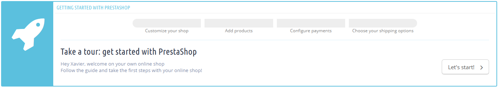
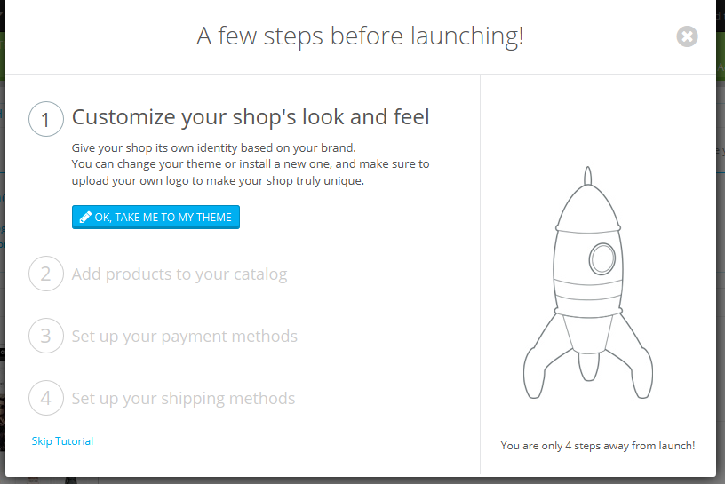
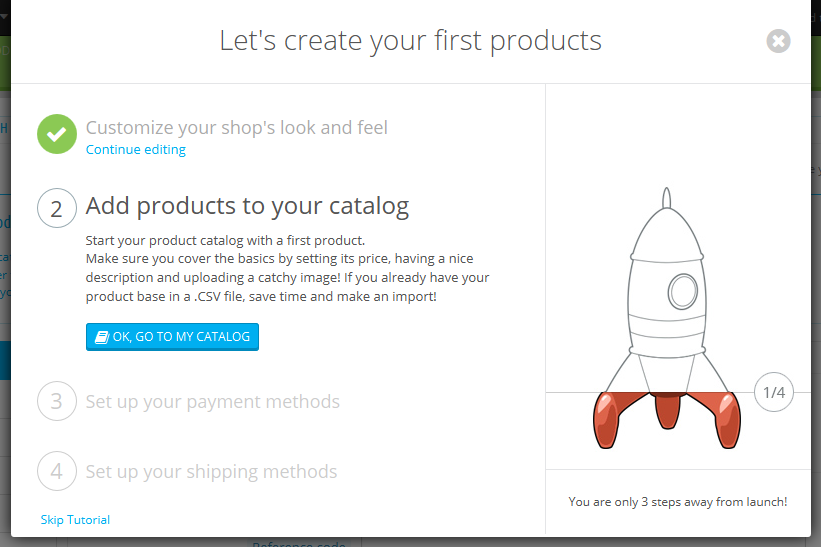
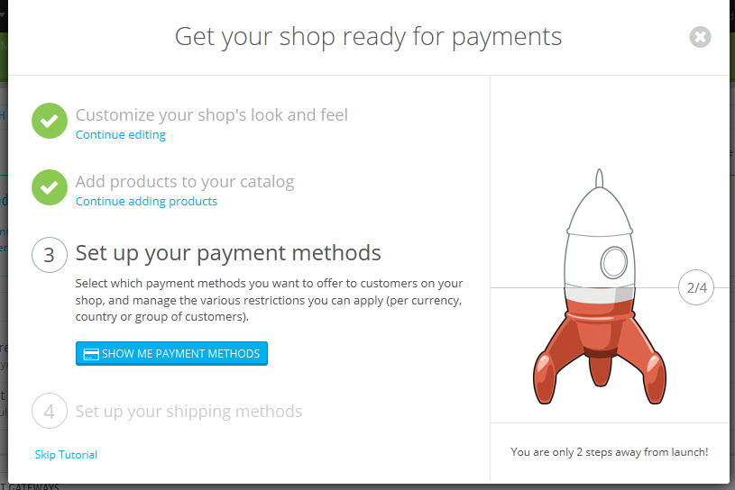
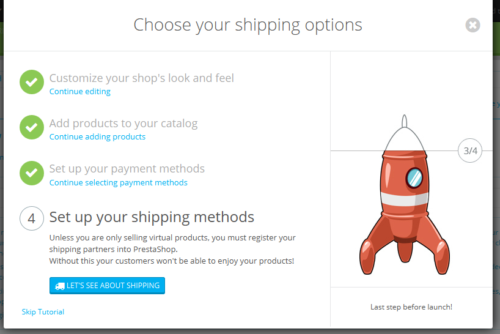
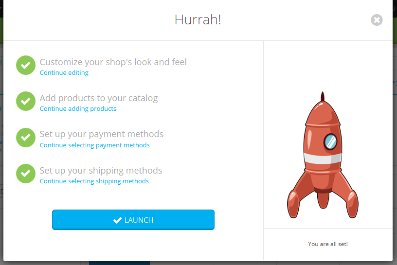
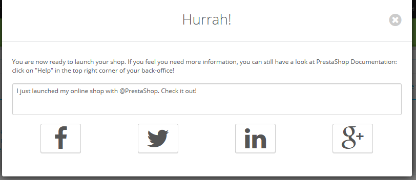

# Getting on board of PrestaShop

Since version 1.6.0.11 of PrestaShop, any new installation has the OnBoarding module activated by default. That module has been built from the ground up to help new users quickly understand the way the back office works, taking them from basic customization to the shop's launch, with steps covering adding a product to the catalog, configuring the shop's payment methods, and choose the default shipping options. All this is done using a playful interface.

If you already know your way around the PrestaShop administration panel, you should probably disable that module:

1. Go to the Modules page.
2. Look for the "OnBoarding" module.
3. Disable it.

## How the module works 

The module's interface cannot be missed: it is the first thing you'll see at the top of each and every page of the back office, before the page's own content.

At first sight, you understand how the module works: in a handful of easy steps, it will take beginners by the hand and help them setting up their shop's options.

Clicking the "Let's start!" button launches the whole process – which can be interrupted at any time, and finished later on. That process is shared between in a window which appears on top of the back office interface, which will give you instructions to follow, and the main interface itself, where you are expected to follow those instructions.

## Step 1: customizing your shop 

The first step helps you customize your shop, in order to make it your own. This is done by installing a new theme and uploading your brand's logo.

In the background, the module has already switched the current page to the Themes preference page. Click on "OK, take me to my theme" to hide the module's window and work on your theme: you can either switch from the default theme to one that is already available, or you can get a new one from PrestaShop's marketplace, Addons: [http://addons.prestashop.com/](http://addons.prestashop.com/)

Once you have installed and activated your new theme, you should spend some time on the Themes preference page in order to check all the available settings, and to make sure that they are set the way you want them to be.

When you are done with customizing your shop, click on the module's "I'm done, take me to the next step" button.

## Step 2: Adding products to your catalog 

The second step takes you to the heart of your shop: the products you sell.

Click on the "OK, go to my catalog" button to make the module's window disappear. The back office page is now the product creation form. Follow through the available fields and various tabs on the left, and do not hesitate to click on the Help button in order to learn more about all the possibilities the PrestaShop offers.

Create several products, even fake ones, in order to get a good feel of how the interface works. Then, once you are confident with your knowledge, create your real products.

When you are done with creating products, click on the module's "I'm done, take me to the next step" button.

## Step 3: Setting up your payment methods 

The third step is an essential one: if you do not set your payment methods, you will NOT receive payment for your products sold!

Click on the "Show me payment methods" button to make the module's window disappear. The back office page is now the Payment settings page. It presents you with several payment methods.

The ones available by default do not require an account, but mean that shipping will be delayed until you have verified payment: bank wire and payment by check both require you to manual check the payment and validate the order.

PrestaShop recommends several payment methods on this screen, which are in effect modules that you can install. The ones presented are secure, well-known and supported by PrestaShop. They also depend on where your shop is installed: an American seller will not get the same methods as a Polish one. Choose the one with which you already have an account, or with which you wish to work with, and configure the module with your account information. You can have as many payment methods as needed.

Further below that screen, you can set payment restrictions based on currency, customer group and country. Choose wisely, as these restrictions can prevent customers from using a given payment method, or even from buying from your shop altogether!

When you are done with setting up your payment methods, click on the module's "I'm done, take me to the next step" button.

## Step 4: Set up your shipping methods 

The fourth step is also an essential one: if you do not set your shipping options, you have no way to make customers pay for shipping. If you are only selling digital products (PDF, etc.), then it makes sense not to have a shipping partner, but if you do sell real products, you have to indicate who your shipping partner is.

Click on the "Let's see about shipping" button to make the module's window disappear. The back office page is now the Carriers settings page. It presents you with two options: adding a carrier yourself, or using a carrier module.

If you are only selling digital products, click on "Skip tutorial".

Adding a new carrier is done through a handy wizard of its own, which will help you set everything up: name, transit time, shipping locations and costs, size/weight limits, etc.

You might prefer to use a faster way and install a carrier module. A few are listed by default on the main page, but you find more on the "Modules" page. Install the one with which you have a contract, and configure the module with your contract information.

When you are done with setting up your shipping methods, click on the module's "I'm done, take me to the next step" button.

## All done! 

You're (mostly) done!

You have gone through all the essential steps in configuring your shop. There are many other steps, but those are necessary for selling on the Internet.

Clicking the "Launch" button will end the module's instructions, and will give you the animation of the rocket rising in the sky!

Before you put your shop out of maintenance mode and make it available to everyone on the Internet, you might want to wait a bit and check all the other preference pages in the back office, making sure that they are all set the way you want them to. If so, do not click on "Launch" and click on the cross button in order to close the module's window.

Once you have it all set, go to the Maintenance preference page and enable your shop. Done! Good luck with your online endeavors! Start them by promoting your shop: share your launch on social networks using the final window of the module.

Once you are done, the module does not appear anymore in your back office.
