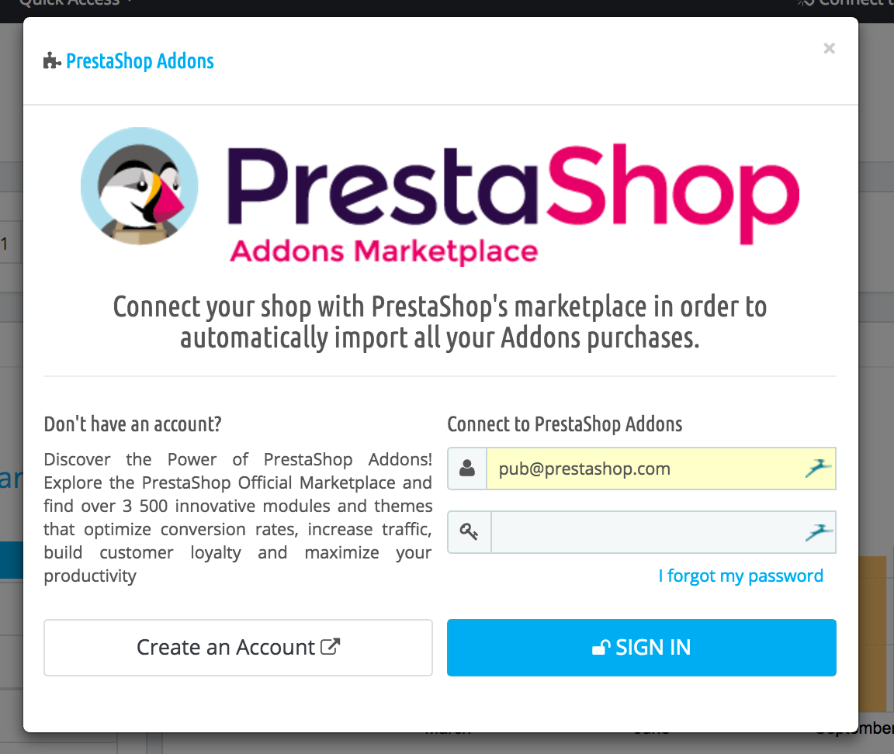
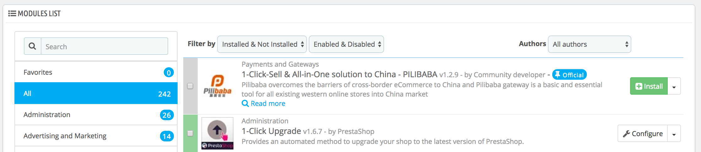
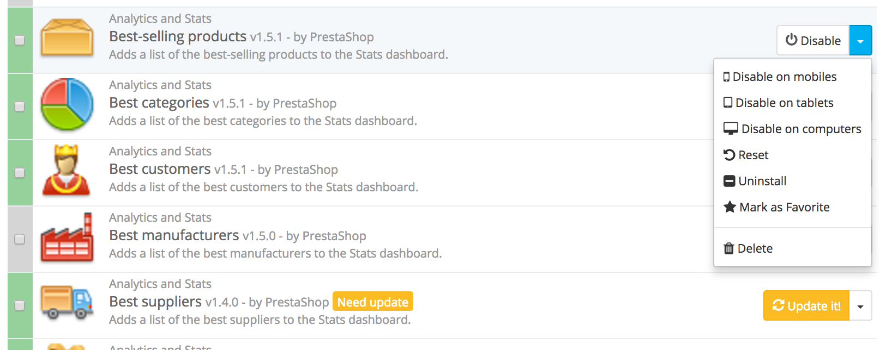

# Your Modules

The "Modules" page under the "Modules" menu gives you access to the list of modules. On this page you can install, uninstall, configure and update each module. All the native modules are explained in depth in their own chapter, "Making the Native Modules Work". This chapter simply explains how the Modules page works.

## Module notifications 

Below the page title, you will at times get notifications from installed modules. Most of the time, the notification help you complete the configuration of modules that are installed but are not yet ready to be used: updating their settings should make the notification disappear... and your module work properly.

.png>)

When one of your module has an update available on the Addons site, PrestaShop will let you know about it, and an "Update all" button will appear at the top of the page. Click on this button to update them all.

.png>)

## Addons connection 

PrestaShop Addons users are first-class citizens when it comes to managing modules! Indeed, once you installation of PrestaShop is tied to your Addons account, the modules you get on Addons will automatically be installed and updated!

PrestaShop Addons is the central marketplace where you can get new modules and themes for your store. Creating an account is free, just click on the "Sign up" button, which will take you here: [https://addons.prestashop.com/en/login#createnow](https://addons.prestashop.com/en/login#createnow)

.png>)

If you already have an Addons account, click on the "Log in" button to open the login window.

Enter your credentials, click on "Sign in": your installation of PrestaShop is now tied to your Addons account, and will start comparing your local modules with the ones that you got from Addons, making sure to keep each available and up to date!

## The modules list 

This list enables you to quickly find the module you want to install or edit the settings of.

The first section is where you can search for a specific module, or filter down modules until you find the one you are looking for.

* **Search field**. Modules are displayed while you type their name, which makes it even more intuitive and fast.
* **Sort selectors**. The list automatically reloads when you make a selection, and displays modules according to all the current settings.\

  * **Installed & Not Installed**. Most of the time, you will want to perform an action on an installed module, or install a new one. This filter is the most commonly used.
  * **Enabled & Disabled**. Installed module are the only ones that can be configured, hence the importance of this selector.
  * **Authors**. You can filter the modules by author. By default, only "PrestaShop" is available, but as add more modules, this selector will prove very useful.

On the left is a list of all the module categories, with the number of modules for each in brackets. Click on a category in order to display the modules for this category.\
&#x20;One of the categories is named "Favorites" and is empty by default. This enables you to gather the modules you most often use, and to access them quickly. You can set your favorite modules using the "Mark as Favorite" action.

Modules can have one of 4 statuses:

* Non-installed.
* Installed but disabled
* Installed and enabled.
* Installed and enabled, but with warnings.

Some module have a "Popular" badge. This modules are actually from the Addons website. They are not free: the "Install" button is replaced by a shopping cart button, with the price of the module. Clicking that button open the module's page on the Addons website, where you can buy the module.

Difference between disabling and uninstalling

When you do not have a use for a module anymore, you can either disable or uninstall it. The results of both actions are seemingly the same: the module is not available anymore, its options do not appear in your back office and any element it added to your front-end have disappeared.

The difference is that disabling a module keeps its configuration safe for later re-enabling, while uninstalling it removes all of its configuration and database data.

Therefore, you should only uninstall a module if you do not care about its data or if you are certain that you would not need it. If you are really sure you do not want that module on your shop, you can even click on its "Delete" link.

## Performing Actions on Modules 

Here are the available actions, depending on the module's status:

* Uninstalled modules:
  * **Install**. This will trigger the installation of the module on your installation of PrestaShop. The module will be automatically enabled. It might add new options to your back office.
  * **Mark as favorite**. This will add the module to your Favorites list.
* Installed modules:
  * **Configure**. Some modules have a configuration page. In that case, they offer a "Configure" link to access a new interface where the user will be able to adjust all its settings.
  * **Disable**. When installed, a module is enabled by default. You can disable it, which will remove its options from your back office, but will keep its settings for a later re-enabling.
    * **Disable/display on mobile**. This will disable the front office view of the module only for mobile devices (smartphones, etc.).
    * **Disable/display on tablets**. This will disable the front office view of the module only for tables.
    * **Disable/display on computers**. This will disable the front office view of the module only for desktop computers.
  * **Reset**. This will restore the module's settings to their defaults.
  * **Uninstall**. This will disable the module and delete its data.
  * **Mark as favorite**. This will add the module to your Favorites list.
  * **Delete**. This will remove the module from the modules list, and delete its files and folders from your server.

Top ranking modules from Addons can be promoted to your module list, depending on your country settings. They appear among regular modules, but their action buttons are not labeled "Install" but instead "30 €", for instance. Clicking on the button takes you to the module's Addons page, from which you can log in, buy and download the module. From there on, you can install it on your shop.

## Connecting to Addons 

In the basic configuration, the modules' page will only let you update the default modules, the ones that were included in PrestaShop. If you have bought modules on Addons, the PrestaShop marketplace, and you want those to update automatically too, you have to connect your PrestaShop to Addons.

Click on the "Addons" link at the top of the screen: this will open a model window with a log in form. Simply fill in the form with your Addons connection details, and PrestaShop will now know (and update) the modules you have bought.

If the modules you have bought on Addons are not updating, do check that you are connected through this form!
