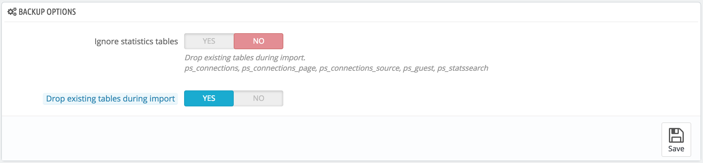

# DB Backup

A backup is the action of saving the content of your database into files that you store in a safe place. The point is that you can revert to them in case your database fails on you.

You must perform regular backups of your shop, so that in case of a crash, you can reboot your shop quickly and in the best conditions. The database contains all the information in your shop, many of which are indispensable for PrestaShop to work correctly – including your products, categories and other data you added since the installation, but not your images for instance.

The more often you perform backup, the safer you are. Once a week is a minimal frequency.

To create database backups of your shop, you have several solutions. You can use tools such as phpMyAdmin (reserved for advanced users), or use the one integrated into PrestaShop: the "DB backup" page.

The page starts with two big notices. You should read both completely in order to have a better idea of what the page does:

* The "Disclaimer" section gives you a series of reminders about backups, which you should read every time you make a backup. The section ends with the "I have read the disclaimer, please create a new backup" button, which you have to click in order to create a backup. Once created, the backup appears in a new "Download section" at the top of the page (click the button in order to download the backup file to your computer), and in the list below the notices.
* The "How to restore" section gives you tips on how to get your data back into PrestaShop in case of failure. You should commit this to memory, or at least save this information somewhere in case a database crash makes it impossible for you to access the PrestaShop administration – and thus the DB backup page – again.

The table below the notices lists all the backups that have already been made, indicating the date of creation, age, file name and size.\
&#x20;At the right of each row are the available actions:

* **View**. Enables you to download this backup.
* **Delete**. Enables you to delete this backup. Be careful, there is no turning back.

.png>)

After each backup process, you should download the generated backup file by clicking on its "View" icon, or simply by using the link in the notification box at the top. Put your backup file in a safe place, for you might need it at any given time. Furthermore, you can find these backups directly on your server, in the `/backup` folder, under your custom-named `/admin` folder.

Your database is saved using the standard SQL format and its `.sql` file extension, and compressed using the BZip2 algorithm (simply put, a variant of the popular Zip format. Read more: [http://en.wikipedia.org/wiki/Bzip2](http://en.wikipedia.org/wiki/Bzip2)) and its `.bz2` file extension. That gives a file archive with the `.sql.bz2` file extension

## Backup Options 

At the bottom of the screen, two options are available:

* **Ignore statistics tables**. PrestaShop stores your site's statistics in a handful of database tables, and these can grow big quite quickly. While it can be sound to keep your stats in a safe place, they also make for huge files to download, while you are probably more interested in a backup of your products, categories, customers, orders, etc.\
  &#x20;By default, PrestaShop backups all tables, but if you are short on disk space on your web server, change this option to "Yes".
* **Drop existing tables during import**. When importing a backup file, the system can either overwrite the existing live tables with the content of the ones that were backed up, or delete all existing in order to replace them with the content of the backup. The first case can result in doubles, which is why this option is enabled by default.\
  \
  
