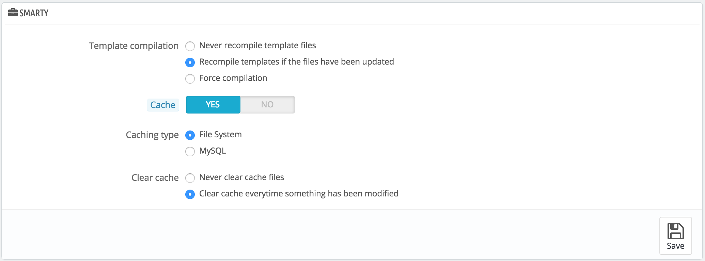
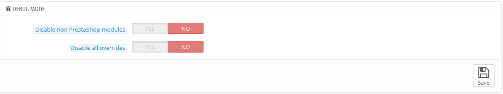
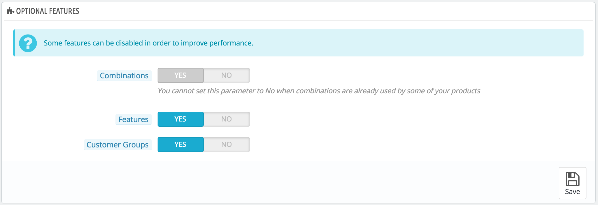
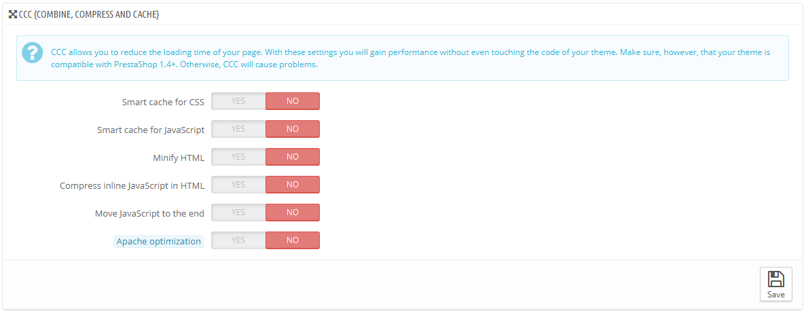
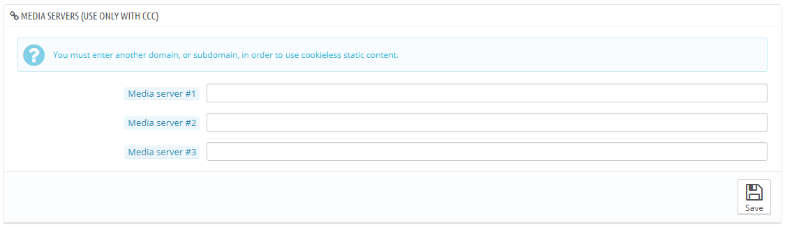
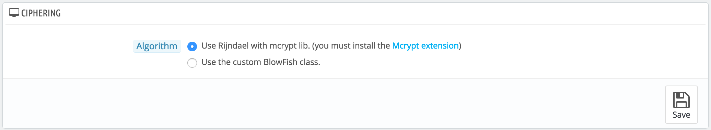
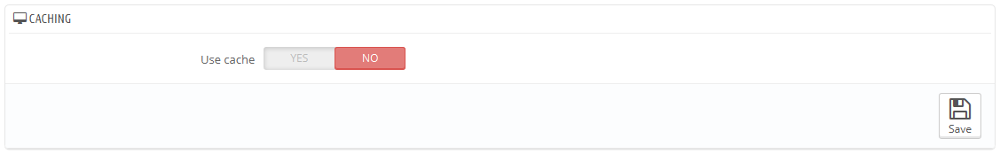

# Performance Parameters

This page combines many tools and tips that might help you improve your shop's performance server-wise – not sales-wise, although a server that performs well is able to serve more customers, and therefore make more sales.

## Smarty <a href="#performanceparameters-smarty" id="performanceparameters-smarty"></a>

Smarty is the name of the template language used by PrestaShop's themes. You can learn more about it at [http://www.smarty.net/](http://www.smarty.net/).



There are two options:

* **Template cache**. For better front-end performance, PrestaShop caches your HTML pages.
  * **Never recompile template files**. The normal behavior: HTML pages are compiled and cached, then displayed as-is, even if the theme has changed in the meantime.
  * **Recompile templates if the files have been updated**. PrestaShop is able to see when a theme file has changed.
  * **Force compilation**. Only enable this if you are making edits theme, and need to see your changes every time you reload your page.
* **Cache**. This option makes it possible for you to disable all file caches, and not just the one pertaining to template files. Only disable this if you debugging a theme or a module for PrestaShop. Otherwise, you should leave it enabled.\
  The "Clear Smarty cache" makes it possible to delete the cache in a single click instead of having to go delete files on your FTP server.
* **Caching type**. By default, Smarty uses a file-based caching mechanism. You can choose to have it use MySQL as the storage resource for Smarty's output caching.
* **Clear cache**. Depending on how often your store changes, you might want to either never clear the cache files, or clear them every time your store is modified (either products or design).

## Debug mode <a href="#performanceparameters-debugmode" id="performanceparameters-debugmode"></a>

**New in 1.6.**

When in debug mode, you can choose to lessen the impact of certain features on PrestaShop, in order to best pinpoint where an error comes from:



* **Disable non PrestaShop modules**. PrestaShop's own module are heavily tested and should present no issue whatsoever. If you enable this setting, you will be able to tell if the problem comes from PrestaShop's own code (core or module), or from a third-party module.
* **Disable all overrides**. Many features in PrestaShop can be overridden. If you enable this settings, all overriding code will be disabled, and you will be able to tell if the problem comes from PrestaShop's own code, or from a third-party override.

## Optional features <a href="#performanceparameters-optionalfeatures" id="performanceparameters-optionalfeatures"></a>

Some PrestaShop features can be disabled if you do not use them, as they can slow down your shop.

If your catalog currently has products which make use of these features, then you will not be able to disable them. You will have to delete some data before you can turn them off.

You can disable the following features:



* **Combinations**. Product combinations enable you to have a whole product line out of a single product: varying size, colors, capacity, etc.
* **Features**. Product features enable you to indicate the product's specific information: weight, material, country of origin, etc.
* **Customer groups**. Customer groups enable you to group customers in order to give them certain privileges and restrictions: discount, module restrictions, etc.

## Combine, Compress and Cache (CCC) <a href="#performanceparameters-combine-compressandcache-ccc" id="performanceparameters-combine-compressandcache-ccc"></a>

CCC is a set of tools aimed at minimizing server load and theme loading time.

It does what it says: it combines textual files of the same type into one bigger file, which makes for fewer files to download; it then compresses the file using the common Zip algorithm, which makes for faster downloads; finally, it caches the compressed file, so that the server does not have to do this process every time a page is loaded, which relieves the burden on the server's processor.

Your theme must completely compatible with at least PrestaShop 1.4, otherwise CCC will not work as expected. This is why most options are disabled by default.



* **Smart cache for CSS**. CSS files are text-based, and can be safely combined and compressed.
* **Smart cache for JavaScript**. JavaScript files are also text-based, but their combination can sometimes prove problematic. Make sure to test everything before leaving that setting enabled.
* **Minify HTML**. The HTML code generated by Smarty can be minified, meaning that PrestaShop will remove all whitespace in order to save a few bytes. This is mostly safe.
* **Compress inline JavaScript in HTML**. Some themes have JavaScript code directly within. You can either leave it alone, or have them compressed. Again with JavaScript compression, make sure to test everything before leaving that setting enabled.
* **Move JavaScript to the end**. Placing your theme's JavaScript code at the bottom of the HTML file is the recommended way to speed up 'above the fold' page rendering.
* **Apache optimization**. This setting will change your web server's configuration file in order to make it more efficient for CCC.

## Media servers <a href="#performanceparameters-mediaservers" id="performanceparameters-mediaservers"></a>

This section enables you to redirect part of your traffic (image and video files, for instance) to other servers under your control, through other domains or sub-domains – most often, the files are hosted on a CDN (Content Delivery Network). By default, PrestaShop supports up to 3 media servers.



Putting your store's domain name in those fields is not the proper way to get fantastic performance. That being said, it is easy to set up a media server, and the benefits are real and almost immediate. Here is how:

1. Open an account at a new host, preferably one who is specialist of distributed content. The most popular are Akamai ([http://www.akamai.com/](http://www.akamai.com/)), Amazon (with its AWS services, among which is CloudFront: [http://aws.amazon.com/](http://aws.amazon.com/)) or CloudFlare ([http://www.cloudflare.com/](http://www.cloudflare.com/)). You should also ask your own host, maybe it has a CDN service you can subscribe to.
2. Copy your media files to that host's server. This means that the CDN server must contain an exact copy of the following folders from you store's main server: `/img`, `/themes` and `/modules`.\
   Reminder: you must make it so that these folders are always synchronized: even if you add new products or change your theme, the CDN server must contain the latest version of all these files.
3. Once the CDN server is in place, add the web address (as given by your CDN host) in the first field, "Media server #1". If that host allows for more web addresses, add them.

In case you would rather that your files are still visually downloaded from your domain name rather that from an unknown domain name, follow this process:

1. Create a subdomain for your store's domain name, for instance `http://cdn1.example.com` (the way to do that depend on your host, ask him about it).
2.  Put a `.htaccess` file at the root of the subdomain. That file should contain a single line:

    ```
    Redirect Permanent / http://cdn-adress.com
    ```

    \
    Replace the `http://cdn-adress`.com with the one from your CDN server. This way, you are creating an automatic redirection from your subdomain to your CDN server.
3. Once the subdomain is in place, add it in the first field, "Media server #1". If that host allows for more web addresses, create as many subdomains to your store's main domain name.

Even if you do not have a CDN server, you can use the media server feature to have the customer's browser download more files at a time, thus making the whole page loading process faster:

1. Configure your web server to have virtual subdomains, such as `images1.example.com`, `images2.example.com`, and `images3.example.com`, pointing to PrestaShop's main folder.
2. In your back office's Performance page, set each "Media server" field to these virtual subdomains.

Once this is in place, PrestaShop will load your images from either of these subdomains. In effect, images will come from the some folder (the main one), but the browser will open several more connection threads to your web server than it would by default, thus making the whole page load faster.

## Ciphering <a href="#performanceparameters-ciphering" id="performanceparameters-ciphering"></a>

Ciphering means encrypting data so as to render it unreadable to unwanted eyes. Your costumers' account details, as well as your own, are protected by cyphering.



Here you can choose the algorithm you prefer:

* **Use Rijndael with mcrypt lib**. Default choice. Fast and secure, but requires you to have the Mcrypt extension installed with PHP.
* **Keep the custom BlowFish class**. Better security, but performance takes a toll, as it takes more time to validate the authentication, for each page load. Your customers might appreciate the added security, but might not like the time spent waiting for the page to load – although the time difference is really unnoticeable to most.

Therefore, choose wisely. If you change this configuration, all cookies will be reset.

## Caching <a href="#performanceparameters-caching" id="performanceparameters-caching"></a>

Your server's cache stores static versions of your dynamic web page, in order to serve these to your customers and thus reduce server load and compiling time.

Most of the time, you should first check with your web host about this setting, as it requires special settings on the server.

This section enables you to choose to enable caching, and then choose the caching method:



* **File system**. The static files are simply stored as any other file, on your server. This displays a field set to "1" by default. This is the file-system directory depth. Only change this value when you know what you are doing.
* **Memcached**. A distributed caching system. Very effective, above all with multiple servers, but you need to make sure that your servers/hosts support it – most probably, if your PHP configuration features the Memcached PECL extension, you are good to go (you can download it here: [http://pecl.php.net/package/memcache](http://pecl.php.net/package/memcache)). You can add Memcached servers by clicking on the "Add server" link.
* **APC**. Alternative PHP Cache is free, open and robust, but only works with one server – which is the usual case when you start your online business. Again, check for the availability of the APC PECL extension on your server: [http://pecl.php.net/package/APC](http://pecl.php.net/package/APC).
* **Xcache**. Xcache is a new cache system, which is specific to the Lighttpd server – hence, it will not work with the popular Apache server. Read more about it at [http://xcache.lighttpd.net/](http://xcache.lighttpd.net/).
