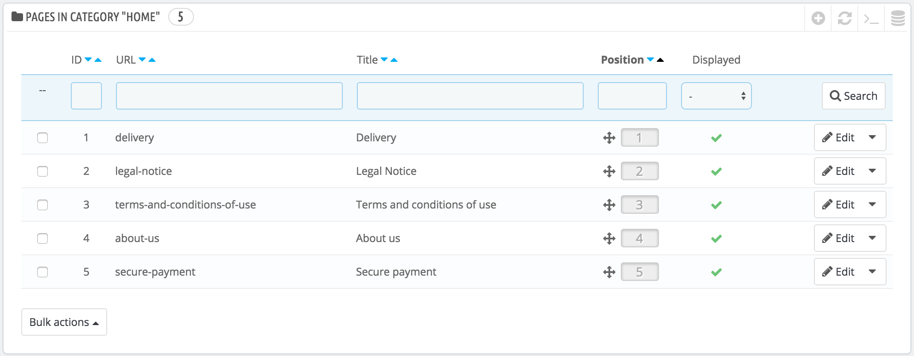
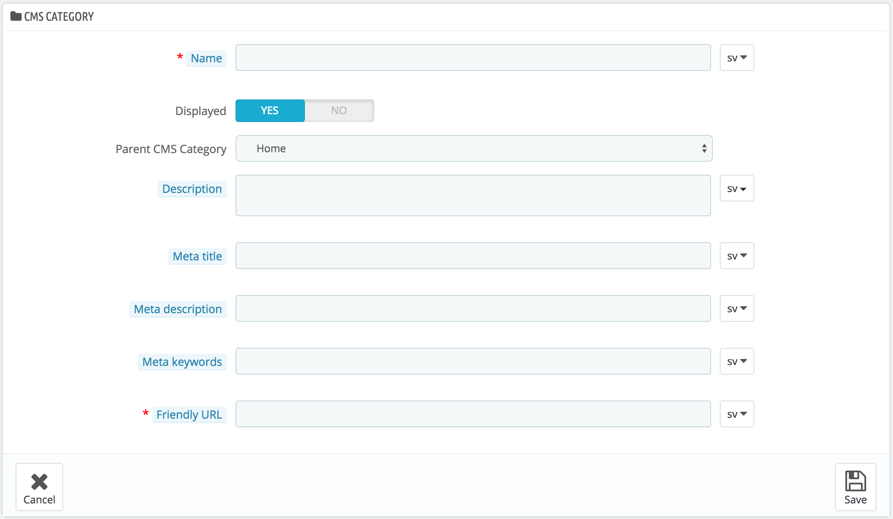
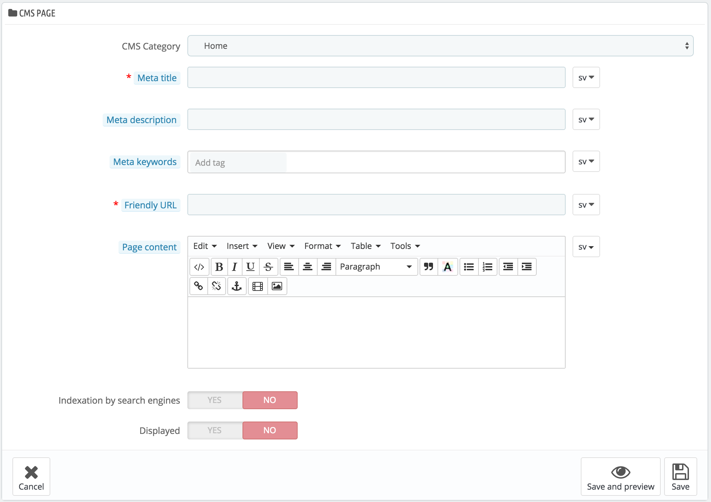

# CMS - Managing Static Content

PrestaShop enables you create content pages as easily as you would create product pages, using its CMS tool. The pages will appear to customers in the "Information" block on your homepage and in the site menu. You can add CMS pages in the top menu using the "Top horizontal menu" module (which you can configure from the "Modules" page).

The "CMS" page presents you all the content pages that were previously created on your shop, for the currently selected category (by default, the home page is the only category).

Do not forget to create one version of each page for each of your supported languages! As usual, click on the language selector for each field in order to change language.

## Creating a New CMS Category 

Click the "Add new" button to create a CMS category – actually, a sub-category of the root category, "Home". You can create as many categories as needed.

The form is quite basic:

* **Name**. Make sure to use a short and straightforward word.
* **Displayed**. Whether the category and its pages are available to the public, or hidden.
* **Parent CMS category**. The category under which this category is placed. By default, "Home". You can have an unlimited number of levels of sub-categories.
* **Description**. Do fill this field in all languages, as some theme can display that information to customers.
* **Meta title**. The name of the category, as displayed in the browser.
* **Meta description**. Used to describe the content of this category for search engines.
* **Meta keywords**. Used by search engines to understand what type of information the category is composed of.
* **Friendly URL**. Makes it easier for search engines to index your content, and for visitors to understand what they will find in the category. This field is automatically filled as you enter the category name, but you can still edit it manually.

When you save the category, PrestaShop takes you back to the tables, this time using the newly created category as its base. Therefore, you will not see any sub-category or sub-pages in here unless you create some.\
In order to go back to the root category, click on "Home" in the "Current category" section at the top. You can then edit each pages from the root category and move them into your newly created category if you feel like it.

In order to create sub-categories, simply change the "Parent CMS Category" option from "Home" to the wanted parent category for the category you are creating.

## Creating a New CMS Page 

Click the "Add New" button to reach the content creation form:

* **CMS Category**. The default category is the home-page of your shop. If you want to have this page in another category, you must first have created.
* **Meta title**. The name of the page, as displayed in the browser.
* **Meta description**. Used to describe the content of this page for search engines.
* **Meta Keywords**. Used by search engines to understand what types of information the page is composed of.
* **Friendly URL**. Makes it easier for search engines to index your content, and for visitors to understand what they will find in the category. This field is automatically filled as you enter the category name, but you can still edit it manually.
* **Page content**. This is the main content of your page. In this WYSIWYG editor, you can put as much text as necessary, even images or videos using the "Insert Image" or "Insert Embedded Media".
* **Indexation by search engine**. Indicates whether search engines should register this page or not.
* **Displayed**. You can choose to have you page public only once you are done proofreading it, and keep it as a draft for the moment. A draft is invisible to the public.

Once all the fields are filled out, click on "Save." If activated, you can then view the result directly on your online shop.
