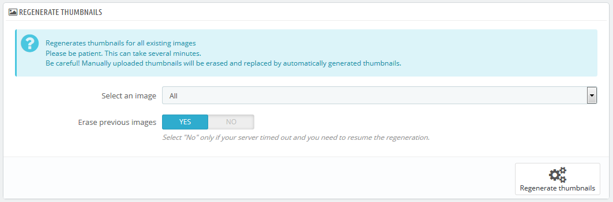

# Images Preferences

The "Images" preference page enables you to configure the various image sizes that your customers will see on your shop.

When you upload an image on PrestaShop, PrestaShop automatically generates various sizes of this image, including thumbnails and a mobile version (depending on what this image will apply to). Therefore, you only have to upload one "master" version of your image, big enough to be resized into all the images sizes.

If you want to make sure your image is correctly resized, you should upload an image that fits the size ratio of the various image sizes. If your uploaded image does not have the same width-to-height ratio than the settings in place, you are taking the risk to see whitespace on the resized image.

.png>)

You can enable image size for specific types of content, directly in the image sizes list.

In the "Products" page under the "Preferences" menu, you can choose to have a zoom appear when the cursor hovers over a product's image.

## Add a New Images Size 

You can easily add a new image size, and even set to which type of content it applies.

.png>)

Click the "Add new" button, then:

1. Type the size's name, width and height.
2. Choose to which type of content it applies.
3. Validate.

## Images preferences 

.png>)

*   **Image format**. You have the choice between two of the major file formats: JPEG and PNG. Both are well established among browsers. JPEG has a good compression ratio, but can result in visible artifacts. PNG's compression algorithm is not as good as JPEG's, but there are comparatively fewer visible artifacts; nonetheless, older browsers might not recognize this format.\
    Choosing between one and the other is often a matter of taste. That being said, JPEG remains the recommended choice. If you would rather prevent information loss because of a format change, choose the second option, "Use PNG only if the base image is in PNG format".

    PNG format is not compatible with the "Watermark" module.
* **JPEG compression**. Do not choose anything below 80 or at worst 75, for fear of visible compression artifacts.
* **PNG compression**. Do not choose anything over 6 or at worst 7, for fear of visible compression artifacts.
* **Generate images based on one side of the source image**. This feature allows you to position the product image in its pre-established space:
  * Choose "height" in order to fill the frame height (the width is then recalculated to maintain the same height/width ratio as in the file of origin).
  * Choose "width" so that the image fills the width of the frame (the height is then recalculated to maintain the same proportion).
  * Choose "auto" so that the width and height are calculated to maximize the space it can occupy in the frame.
* **Maximum file size of product customization pictures**. Your customers can upload pictures for customized products. By default, PrestaShop sets this value to the PHP maximum setting – this can mean several megabytes: for instance, 8,388,608 bytes means 8 Mb. You can expand this value if necessary, but make sure that your PHP installation is able to take file uploads of this size.
* **Product picture width**. By default, customers can upload image with a maximum width of 64 pixels.
* **Product picture height**. By default, customers can upload image with a maximum height of 64 pixels.
* **Generate high resolution images**. The most recent screens with high pixel density (Retina and similar technologies) require high resolution images. You can enable this feature to make sure your images will display correctly on this kind of screens. It will generate a new file for each of your images, with a resolution twice higher. This will double your number of image files, so use it wisely if you have limited storage space.

## Regenerate Images 

You may be dissatisfied with your shop's current thumbnails size. This section makes it possible for you to regenerate them all – or only those for a specific type of content:

1. Change the image size settings in the table at the top of the "Images" preference page.
2. Select which content's images should be regenerated.
3. Indicate whether the previous thumbnails should be kept or not.
4. Click "Regenerate thumbnails".

Manually-uploaded thumbnails will be erased and replaced by automatically-generated thumbnails.
