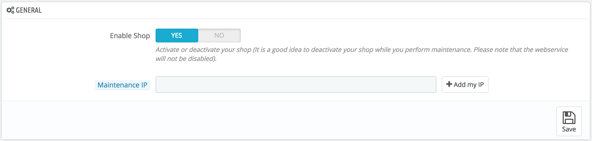

# Maintenance Settings

This very simple preference page will be invaluable when you want to make changes to your shop without your customers noticing. For instance, when you are adding several new products at once, or when you want to change the theme and make several tests before making it available to the world.

This page only has two options:

*   **Enable Shop**. You can use this option to disable your shop temporarily, for instance when you need to perform maintenance on your shop.

    The webservice will still be active, so your data will still be available to those with a key. If you want to also disable the webservice, go to the "Webservice" preference page, in the "Advanced parameters" menu.
* **Maintenance IP**. The maintenance IP allows people to access the shop even if it is disabled. This means that you can prevent everyone on the Internet from accessing your shop, but still allow access to the computers used by your team-members and yourself. To discover the IP address of a machine, go to [http://www.whatismyip.com/](http://www.whatismyip.com/) from that machine. Click "Add my IP" if you only want to add the IP of your current computer.\
  &#x20;If you want to add more IP addresses, separate them with commas ",".
