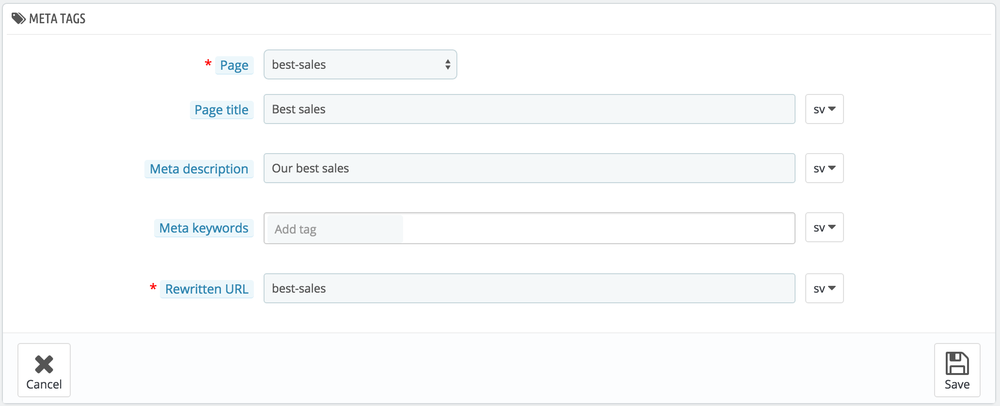
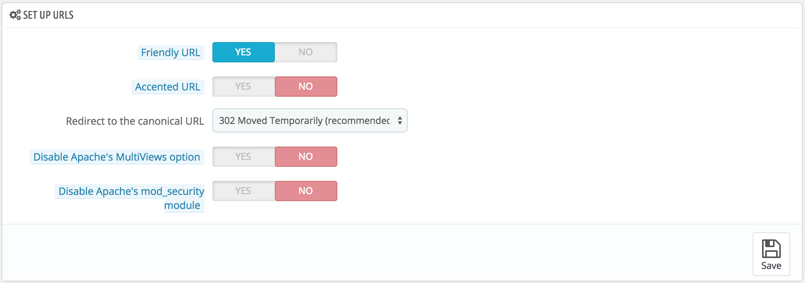

# SEO & URLs Preferences

The tools on this page help you improve the presence of your PrestaShop site on web searches, and therefore reach more potential customers.

SEO means "search engine optimization". It represents a set of techniques and best practices aimed at improving the visibility of a website on search engines. You can read more about this at Wikipedia: [http://en.wikipedia.org/wiki/Search\_engine\_optimization](http://en.wikipedia.org/wiki/Search\_engine\_optimization).

URL is short for "uniform resource locator", or simply put, the online address of a web page. You can read more about what a URL is at Wikipedia: [http://en.wikipedia.org/wiki/URL](http://en.wikipedia.org/wiki/URL)

By default, PrestaShop's deep URLs (that is, specific pages rather than online the domain name) are rather uninformative to both the customer and search engines: an URL such as [http://www.myprestashop.com/product.php?id\_product=27](http://www.myprestashop.com/product.php?id\_product=27) does not help visitors know what product is on that page. Friendly URLs are the way to achieve that, and get for instance [http://www.myprestashop.com/2-music-players/27-ipod-nano-green](http://www.myprestashop.com/2-music-players/27-ipod-nano-green).

As you can see in the second example above, both categories and products can have a friendly URL: in the example above, `id_category=2` becomes `2-music-players`, and `id_product=27` becomes `27-ipod-nano-green`. While the ID number cannot be removed by default, the words can be either generated from the category/product name, or written by hand. This is done directly in the configuration page for the product or the category (in the Catalog menu): the "Friendly URL" field can be found directly in the main configuration page of a category, and under the "SEO" tab of the configuration page of a product.

There are other individual pages in your PrestaShop install that would certainly benefit from friendly URLs: CMS pages, user account pages, pages with automatically generated content... The "SEO & URLs" page presents you with a list of these pages, and enables you to edit their friendly URLs as well as their meta tags (title, description, keyword).

Friendly URLs only work with a server setup that supports URL rewriting (through the Apache Web Server `mod_rewrite` feature, for instance). Make sure to check that your server does (ask your hosting provider!), as it can make your shop completely unavailable to customers if you enable friendly URLs and the server does not support it!

Homepage SEO settings

In order to change the homepage meta tags, you simply need to open the "SEO & URLs" page, open the "index" page's settings, and there you can freely edit some important SEO information.

A few tips:

* The default homepage title is the name of the store, and therefore the index' title field is empty. If you put content in the field, the homepage's full title will be "\<your content> – \<the name of the store>".\
  The name of the store itself is set during the installation of PrestaShop, and can be changed from the "Store Contacts" preference page, using the "Shop name" option of the "Contact details" section.
* Keep your description short: a paragraph of text is enough.
* To add a tag, click in the "Add tag" field and validate by pressing return. You can remove tags by clicking the cross.
* You do not have to add a rewritten URL if there is not already one.

Note that if your store has already been indexed by Google or any other search engine, it might take a while for your changes to appear in the search results. Please be patient.

At the bottom of the "SEO & URLs" page are three sections with additional options: Set up URLs, Set shop URL and Robots file generation. See below for an explanation of these.

## Adding a New Friendly URL 

Friendly URLs are to be set in the configuration page of each product, category, CMS page... This creation page is only useful for some automatic pages, and most of the time you won't have to worry about these.

Make sure to fill the fields for all the available languages on your shop: not only is it immensely useful to local users, but some search engines can even make use of this local information.

Click the "Add New" button to reach the friendly URL creation form. It has a handful of fields:

* **Page**. The drop-down list gives you all the pages that can benefit from a friendly URL.
* **Page title**. The title that will appear in search engines when a request is made.
* **Meta description**. A presentation of the page in just a few words, intended to capture a customer's interest. It will appear in search results.
* **Meta Keywords**. Keywords that you must define in order to have your site referenced by search engines. You can enter several of them: type the words, press the Return key, and see how the tag gets encapsulated in a yellow block, with a tiny cross icon to delete it.
* **Rewritten URL**. This is where you set the friendly URL. Make it short and descriptive, use only letters and numbers, and replace spaces (" ") by hyphens ("-").

## Set up URLs 

The main options for friendly URLs:

*   **Friendly URL**. Change this option **if you know that your server** can support URL rewriting. If not, leave it at "No".

    You may see a message such as "_URL rewriting (mod\_rewrite) is not active on your server or it is not possible to check your server configuration. If you want to use Friendly URLs you must activate this mod_". In this case, PrestaShop cannot detect your server settings, but that does not mean the feature will not work. You must test it yourself.
* **Accented URL**. PrestaShop is now able to produce URL with special characters, for products with non ASCII names. You can disable that option here.
* **Redirect to Canonical URL**. A given PrestaShop page can have many URLs, most often when there are parameters to consider: for instance, `http://example.com/product.php?id=5&option1` and `http://example.com/product.php?id=5&option2` point to the very same product, only one difference. Since you want your product to have a single URL and not many duplicate ones, you should enable Canonical URLs.\
  Canonical URLs are a way to eliminate self-created duplicate content – which can dramatically bring your search engine rank down, as this is considered spam. To avoid search engines thinking you are spamming their index, PrestaShop uses standard `rel="canonical"` link tag to indicate which is the one base URL for a given content.\
  &#x20;While it is highly recommended to enable this option, it also depends on your theme actually implementing correctly the `<link>` header tag. Ask the theme designer for more information.\
  There are three options:
  * **No redirection**. You might get duplicate URLs.
  * **301 Move Permanently**. Returns the HTTP 301 status code, pointing to the main URL and notifying search engines that this is the only URL to take into account.
  * **302 Moved Temporarily**. Returns the HTTP 302 status code, pointing to the main URL and notifying search engines that the main URL might change later.
* **Disable Apache's MultiViews option**. Apache is the most popular web server, and is most likely the one your web host uses for your site (although you should check this for yourself). Multiviews is a content negotiation system: when enabled, the web server tries to serve the user a page in what it thinks is the best matching language version, under the same URL. Unfortunately, this might bring trouble to PrestaShop's friendly URLs feature. If this is the case, you can try to disable multiviews with this option.
* **Disable Apache's mod\_security module**. `mod_security` is a module of the Apache web server, which acts as a firewall, protecting your server from intrusions. It can however block some key features, or even produce errors in some configuration. In such case, disable that firewall here.

In previous version of PrestaShop, you had to manually generate a new `.htaccess` file after having enabled friendly URLs. This is no longer the case since version 1.5: the `.htaccess` file is now silently managed by PrestaShop, and you do not have to worry about it.

## Set shop URL 

In this section, you can view and edit some of the default server settings:

* **Shop domain**. Your store's main domain name or IP address.
* **SSL domain**. Your store's secure domain name (`https://`) or IP address.
* **Base URI**. The folder where you installed PrestaShop. If it is at the root of the domain, use "`/`".

Most of the time, you should not touch these fields without knowing exactly what you are doing. One mistake could break your shop.

## Schema of URLs 

**New in 1.6**.

You can change the way friendly URLs are generated, by changing the route to a resource on your shop.

For instance, the default route to display a product's page is `{category:/}{id}-{rewrite}{-:ean13}.html`, which results in `/summer-dresses/7-printed-chiffon-dress.html`\
You could change that route to `{manufacturer:/}{id}-{rewrite:/}` to obtain `/fashion-manufacturer//7-printed-chiffon-dress/`

8 fields are available by default, and each is accompanied with a list of available keywords. Some keywords are mandatory, and are indicated with a `*`.

Once you have updated your fields, do not forget to save your changes, then on the "Save" button in the "Set up URLs" section in order to regenerate your `.htaccess` file, which is necessary for your friendly URLs.

## Robots file generation 

A `robots.txt` file enables you to block specific automated bots and web spiders which crawl the Web in order to find more web pages to add to their company's servers. Some bots you want to have full access to your website, such as Google's or Yahoo!'s, and some others you would rather not, such as spam bots, content thiefs, e-mail collectors, etc. Note that the worst of bots do not respect this file's directives, as it is purely advisory.

PrestaShop's `robots.txt` generation tool simply creates a file with exclusion directives for files and directories that are not meant to be public, and should not be indexed. These directives apply to all bots, good or bad: the generated file uses the "User-agent: \*" string.

Clicking on the "Generate robots.txt" button replaces any existing `robots.txt` file with a new one. Therefore, if you want to add your own rules, do it after PrestaShop has generated its version of the file.

