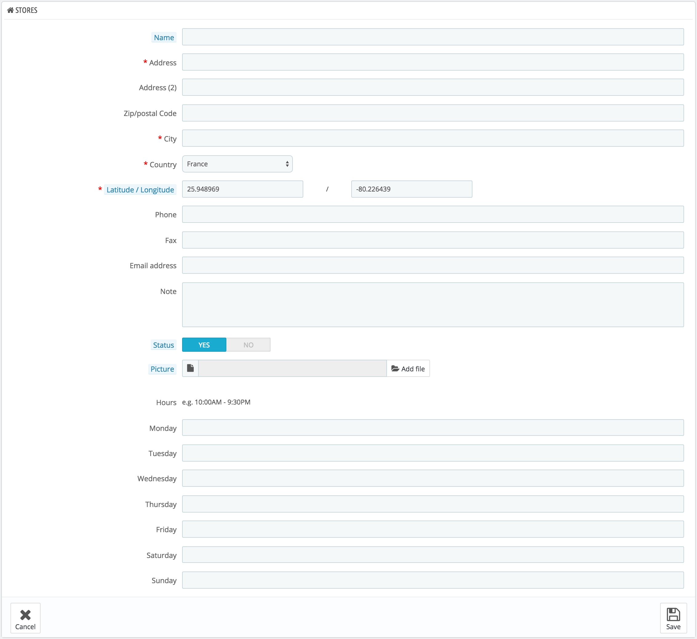
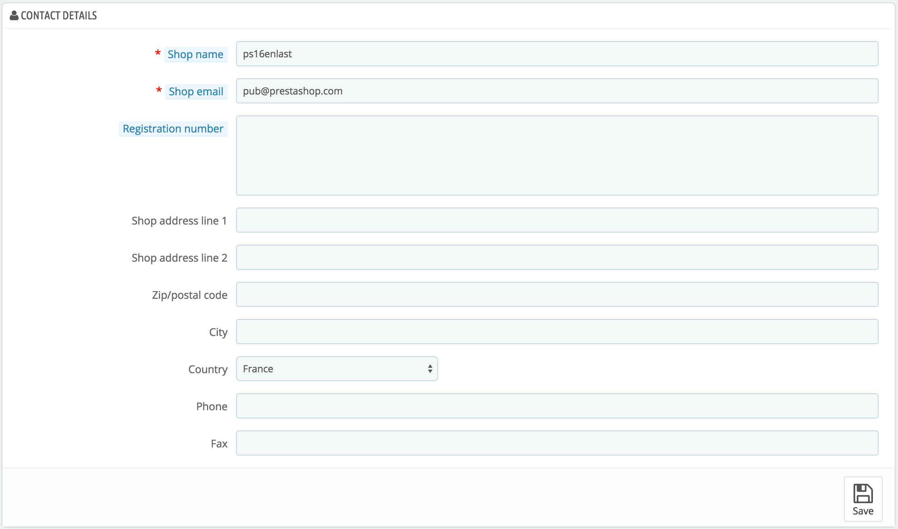

# Store Contacts Preferences

PrestaShop provides a complete physical store locating tool for your customers, with detailed contact information.

Customers can reach the Store Locator page from the front office.

Obviously, this feature is only useful if you do have physical stores, where customers can come buy products.

You cannot disable this feature, but you can make it inaccessible to customers:

* Delete all the stores listed in the "Store Contacts" administration page. The Stores block will not appear anymore on the front-page.
* Go the "Modules" page from the "Modules" menu. Find the "Store Locator" module and disable it.
* Disable the link in the footer: in the "Stores Contacts" administration page, choose "No" for the "Display in the footer" option.

If you do have stores in your database but you do not want the Stores block to be displayed in the front-page, either temporarily or permanently:

1. Go to the "Positions" page in the "Modules" menu.
2. Find the "Right column blocks" section, and delete the "Store locator block" from the list, either by click its trashcan icon, or by checking its checkbox and clicking on the "Unhook the selection" button at the top of the page.
3. Reload the front-page: the Store Locator block should not be here anymore. If it is still here, it might be because of the cache: go to the "Performance" page of the "Advanced parameters" menu, disable the cache and force the theme compilation temporarily. Once all this is done, reload the front-page.

You can put the block back in the right column from the "Positions" page:

1. Click on the "Transplant a module" button at the top right of the page.
2. Choose the "Store locator block" module in the list.
3. Choose the "displayRightColumn (Right column blocks)" hook.
4. Save the page. Reload the front-page: the Stores block should be back in the right column.

## Store list 

You can choose how these stores are displayed in the front office. The customer can access them through the "Our stores" link (depending on the theme)

.png>)

All your stores are listed in a handy list, giving every store's information as well as an indicator telling whether the store is currently active or not – you might for instance want to gather the information for a new store in advance, in order to have its page ready for the launch.

### Adding a new physical store 

As usual, click "Add New" to reach the store creation form.

Fill as many of the fields as possible, as they will be displayed to your customers within the map.

One very important field is the "Latitude/Longitude" one, as this is what PrestaShop uses to indicate the location of your store. You can use Steve Morse's online tool to get the lat/long coordinates of a given address: [http://stevemorse.org/jcal/latlon.php](http://stevemorse.org/jcal/latlon.php).

Make sure to add a picture of the store front, as this is how your customers will be able to find it once in the street.

Finally, the business hours are an essential part of any physical store, and you should be as precise as possible about them.

## Parameters 

* **Display in the footer**. By default, PrestaShop displays a link to the store locator, titled "Our stores", in your shop's footer. In the default theme, it appears in the "Information" block, below the special product listing pages (best sellers, new products, specials, etc.). You can choose not to have that link appear here.
* **Display in the sitemap page**. You can choose to add the "Our stores" link in your shop's sitemap page, which lists all the pages on your site (not to be confused with your Google Sitemap file, which is for SEO purpose).
* **Show a simplified store locator**. The store locator presents itself as an interactive map with a search field. You can choose to make that interface much simpler by only displaying a list of stores.
* **Default Latitude** and **Default longitude**. The default starting position of your map. Very useful when you have many stores and you would rather primarily point customers to a specific area.

## Contact details 

This section enables you to give the main details of your company, rather than those of a specific shop. You should fill all the fields with information on your headquarters, as this is certainly the address customers will use to contact you, or even visit you.

These fields should be carefully filled:

* **Shop name**. The name of your store. Keep it short, as it will be used in all your correspondence and page titles.
* **Shop email**. The official contact address for your business. Use the general contact e-mail address that the customers should see when they receive an e-mail from your shop.
* **Registration**. Indicate your company's legal registration numbers, which depends on your country's legal system (Duns number in the USA, SIRET number in France, CNPJ number in Brazil, etc.). This shows that you are a fully registered business, thus giving a more reassuring opinion of your shop to your potential customers.
* **Shop address line 1** / **Address line 2** / **Postal code/Zip code** / **City** / **State** / **Country**. Use the official contact address of your business. The "State" option only appears when the selected country has states set in your database (through the "States" page in the "Localization" menu)
* **Phone**. The official contact phone number for your business. If you'd rather customers not call you, do not put anything in there.
* **Fax**. The official contact fax number for your business.

Do not use a colon (":") in your store's name, as it might prevent some features from working (for instance, e-mail sending might fail).

You can replace the colon with a dash if you need to have two sections in the title. For instance, use "MyStore – The best place for items to buy" instead of "MyStore: The best place for items to buy".
