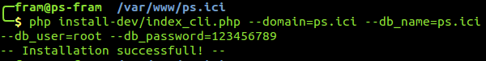

# PrestaShop installeren met behulp van het command line script

PrestaShop heeft sinds versie 1.5.4 een command line installatieprogramma.

## Wat het is <a href="#prestashopinstallerenmetbehulpvanhetcommandlinescript-wathetis" id="prestashopinstallerenmetbehulpvanhetcommandlinescript-wathetis"></a>

Deze speciale installer maakt het mogelijk om PrestaShop te installeren zonder dat er een webbrowser nodig is. Pak simpelweg de inhoud van het zip-bestand uit op uw webserver en u kunt PrestaShop installeren met behulp van us command-line interface (CLI). Elke CLI-programma kan gebruikt worden om commando's uit te voeren op de server: Bash, Windows PowerShell, OS X Terminal, PuTTY, etc.

Het nut van een CLI-installer naast de gewone installatie in de browser, is dat deze meer opties biedt voor de geavanceerde gebruiker. Deze gebruikers hebben over het algemeen behoefte aan command-line interfaces, omdat deze graag meer controle willen over een programma of besturingssysteem.

## Hoe te gebruiken <a href="#prestashopinstallerenmetbehulpvanhetcommandlinescript-hoetegebruiken" id="prestashopinstallerenmetbehulpvanhetcommandlinescript-hoetegebruiken"></a>

De CLI-installer is vrij simpel te gebruiken: vanuit uit terminal gaat u naar de `/install` (of `/install-dev)` map en start u het script met dit commando:

```
$ php index_cli.php
```

Dit zal enkele opties tonen.


Alle opties van de reguliere installatie worden getoond, samen met hun standaardwaarden. Bijna alle waarden mogen zo gelaten worden, omdat u ze later nog aan kunt passen vanuit de PrestaShop back office, nadat de installatie is voltooid. Let er wel op dat de parameters `email` en `password` worden gebruikt voor het account van de administrator.

Om de installatie te starten dient u slechts één parameter op te geven. Voor een bruikbare installatie moet u meer opgeven:

* **domain**. De locatie waar u uw winkel wilt gebruiken.
* **db\_server**. Het serveradres van de database.
* **db\_name**. De naam van de database die u wilt gebruiken.
* **db\_user**. De gebruikersnaam van de database-gebruiker.
* **db\_password**. Het bijbehorende wachtwoord.

Bijvoorbeeld:

```
$ php install_cli.php --domain=example.com --db_server=sql.example.com --db_name=prestashop --db_user=root --db_password=123456789
```



Als u ook de `send_email` parameter instelt, dan ontvangt u na het voltooien van de installatie een e-mail met daarin een rapport.

## Parameterlijst <a href="#prestashopinstallerenmetbehulpvanhetcommandlinescript-parameterlijst" id="prestashopinstallerenmetbehulpvanhetcommandlinescript-parameterlijst"></a>

Hier is de lijst met parameters voor `index_cli.php` (versie 1.6):

| Naam           | Standaardwarde                                  | Beschrijving                                                        |
| -------------- | ----------------------------------------------- | ------------------------------------------------------------------- |
| --step         | process                                         |                                                                     |
| --language     | en                                              | iso-code van de taal                                                |
| --timezone     | localhost                                       |                                                                     |
| --domain       | localhost                                       |                                                                     |
| --db\_server   | localhost                                       |                                                                     |
| --db\_user     | root                                            |                                                                     |
| --db\_password | (blank)                                         |                                                                     |
| --db\_name     | prestashop                                      |                                                                     |
| --db\_clear    | 1 (true)                                        | Huidige databases droppen                                           |
| --db\_create   | 0 (false)                                       | Database aanmaken als deze nog niet bestaat                         |
| --prefix       | ps\_                                            |                                                                     |
| --engine       | InnoDB                                          | InnoDB/MyISAM                                                       |
| --name         | PrestaShop                                      | Naam van de winkel                                                  |
| --activity     | 0                                               |                                                                     |
| --country      | fr                                              |                                                                     |
| --firstname    | John                                            |                                                                     |
| --lastname     | Doe                                             |                                                                     |
| --password     | 0123456789                                      |                                                                     |
| --email        | [pub@prestashop.com](mailto:pub@prestashop.com) |                                                                     |
| --license      | 0 (false)                                       | PrestaShop's licentie tonen                                         |
| --newsletter   | 1 (true)                                        | Aanmelden voor nieuwsbrief met e-mailadres van de administrator     |
| --send\_email  | 1 (true)                                        | Stuur achteraf een e-mail naar het e-mailadres van de administrator |
