# PrestaShop installeren

**Inhoudsopgave**

/\*\<!\[CDATA\[\*/\
div.rbtoc1597237782673 {padding: 0px;}\
div.rbtoc1597237782673 ul {list-style: disc;margin-left: 0px;}\
div.rbtoc1597237782673 li {margin-left: 0px;padding-left: 0px;}\
\
/\*]]>\*/

* [PrestaShop installeren](prestashop-installeren.md#PrestaShopinstalleren-PrestaShopinstalleren)
  * [Beknopte installatie-instructies](prestashop-installeren.md#PrestaShopinstalleren-Beknopteinstallatie-instructies)
  * [Gedetailleerde instructies](prestashop-installeren.md#PrestaShopinstalleren-Gedetailleerdeinstructies)
    * [Downloaden en uitpakken van het PrestaShop-archiefbestand](prestashop-installeren.md#PrestaShopinstalleren-DownloadenenuitpakkenvanhetPrestaShop-archiefbestand)
    * [PrestaShop uploaden](prestashop-installeren.md#PrestaShopinstalleren-PrestaShopuploaden)
    * [Database aanmaken voor uw winkel](prestashop-installeren.md#PrestaShopinstalleren-DatabaseaanmakenvooruwwinkelDatabaseaanmakenvooruwwinkel)
    * [Auto-installer gebruiken](prestashop-installeren.md#PrestaShopinstalleren-Auto-installergebruiken)
    * [De installatie voltooien](prestashop-installeren.md#PrestaShopinstalleren-Deinstallatievoltooien)

Dit hoofdstuk is geschreven voor diegene die PrestaShop op zijn eigen webserver wil installeren.\
Als u PrestaShop op uw eigen computer wilt installeren, dan kunt u beter dit hoofdstuk raadplegen: [PrestaShop installeren op uw computer](prestashop-installeren-op-uw-computer.md).

Als u de instructies op die pagina al hebt gelezen, sla dan de sectie [Database aanmaken voor uw winkel](prestashop-installeren.md#PrestaShopinstalleren-Databaseaanmakenvooruwwinkel) over.

## PrestaShop installeren 

Het is erg gemakkelijk om PrestaShop te installeren. Zodra alle bestanden zich op uw server bevinden, kunt u uw winkel, in de meeste gevallen, binnen 5 minuten configureren; het installatieproces is erg simpel, omdat het installatieprogramma het meeste werk voor zijn rekening neemt. Minder ervaren gebruikers hebben wellicht 10 tot 20 minuten nodig om het gehele proces af te ronden.

Zorg ervoor dat u aan alle eisen voldoet, voordat u verder gaat. Dit zijn: hostingprovider, domeinnaam, FTP-client en tekstverwerker. Zorg ervoor dat u de instructies uit dit hoofdstuk hebt gelezen: [Benodigdheden](benodigdheden.md).

Sommige webhosts bieden opties op PrestaShop in 1 klik te installeren. Hiermee bespaart u tijd en kunt u sneller aan de slag. Het gebruik van dergelijke installatieprogramma's verkort de installatietijd enorm voor onervaren gebruikers.

* InMotion Hosting: [http://www.inmotionhosting.com/](https://secure1.inmotionhosting.com/cgi-bin/gby/clickthru.cgi?id=prestashop\&campaign=endocumentation\&page=336)
* OVH France: [http://www.ovh.com/fr/web/prestashop/](http://www.ovh.com/fr/web/prestashop/)
* OVH UK: [http://www.ovh.co.uk/items/modules/ecommerce/prestashop.xml](http://www.ovh.co.uk/items/modules/ecommerce/prestashop.xml)

Deze webhosts gebruiken voornamelijk de volgende installatieprogramma's:

* SimpleScripts: [https://www.simplescripts.com/script\_details/install:PrestaShop](https://www.simplescripts.com/script\_details/install:PrestaShop),
* Installatron: [http://installatron.com/apps?locale=en#cmd=browser\&display=prestashop](http://installatron.com/apps?locale=en#cmd=browser\&display=prestashop),
* Softaculous: [http://www.softaculous.com/apps/ecommerce/PrestaShop](http://www.softaculous.com/apps/ecommerce/PrestaShop).

Sommige van deze scripts ondersteunen ook updates die met 1 klik kunnen worden uitgevoerd.

Andere hosts maken gebruik van zelfgemaakte installatiescripts. Vraag bij uw host naar welk installatieprogramma zij gebruiken.

Ook noemenswaardig is het feit dat PrestaShop zelf ook een hostingoplossing biedt: door te registreren op [PrestaShop.com](https://www.prestashop.com) kunt u een 100% gratis PrestaShop Cloud-winkel aanmaken, en dus alle technische obstakels uit de weg ruimen en concentreren op uw winkel, klanten en verkoop. Bezoek [https://www.prestashop.com](https://www.prestashop.com) voor meer informatie.

### Beknopte installatie-instructies 

Hier is de verkortte procedure voor degenen die al vertrouwd zijn met het installeren van PHP/MySQL applicaties op een webserver. Als u moeite heeft deze te volgen, door gebrek aan details, dan vind u in de sectie hierna meer informatie.

1. Download en unzip het PrestaShop-pakket als u dat nog niet hebt gedaan.
2. Creëer een database voor PrestaShop op uw webserver als dat mogelijk is. In het geval dat er geen MySQL-gebruiker is met alle noodzakelijek rechten om de database uit te lezen en aan te passen, maak deze dan aan.
3. Upload de PrestaShop-bestanden en mappen naar de locatie van uw keuze op de webserver. Upload niet de hoofdmap `/prestashop` maar slechts de bestanden en&#x20;
4. Start het installatiescript van PrestaShop door naar de publieke URL te browsen in uw favoriete browser. Dit zou dezelfde URL moeten zijn als waar u de PrestaShop-bestanden hebt geüpload.
5. Volg de instructies op elk scherm van het installatiescript.
6. Zodra de installatie gereed is, verwijder de `/install` en noteer de locatie van de nieuwe `/admin` map, welke automatisch voor u is gegenereert vanwege veiligheidsredenen.

PrestaShop zou nu geïnstalleerd moeten zijn en klaar om geconfigureerd te worden! Ga verder naar hoofdstuk [Eerste stappen met PrestaShop 1.6](../gebruikershandleiding/eerste-stappen-met-prestashop-1.6.md) van de [Gebruikershandleiding](../gebruikershandleiding/).

### Gedetailleerde instructies 

#### Downloaden en uitpakken van het PrestaShop-archiefbestand 

U kunt de meest recente versie downloaden vanaf [https://www.prestashop.com/nl/download](https://www.prestashop.com/nl/download).

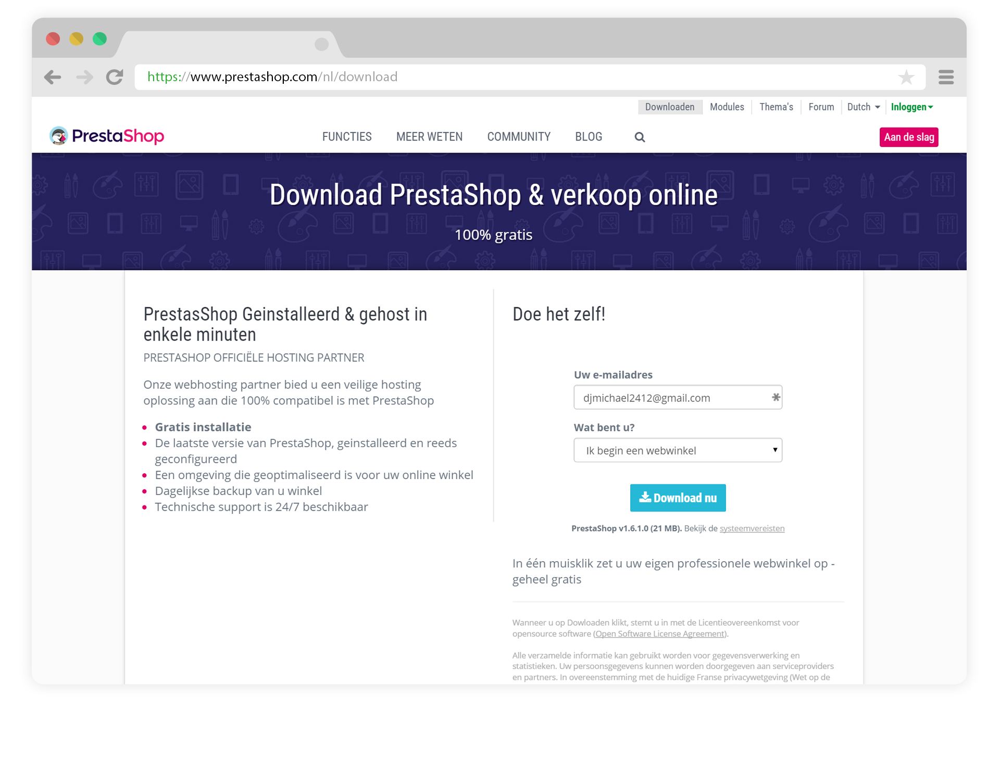

U krijgt op deze pagina slechts één downloadoptie: de meest recente, stabiele versie. Deze versie is geschikt voor productieomgevingen.

Als u een vorige versie van PrestaShop nodig heeft, dan kunt u deze link volgen: [https://www.prestashop.com/nl/ontwikkelaars-versies#previous-version](https://www.prestashop.com/nl/ontwikkelaars-versies#previous-version).

Let op: het wordt sterk afgeraden om een andere versie dan de meest recente te installeren.

Klik op de "Download"-knop en bewaar het zip-bestand op uw computer (bijvoorbeeld uw bureaublad). U ontvangt een bestand genaamd "prestashop\_1.6.1.0.zip" (of iets wat daar op lijkt, afhankelijk van het versienummer).

Het gedownloadde bestand is een zip-archief, dit betekent dat er één enkel gecomprimeerd bestand is met daarin alle bestanden van PrestaShop. Om verder te kunnen gaan, **moet u dit bestand uitpakken.**

Wanneer uw besturingssysteem geen ondersteuning bied voor het uitpakken van zip-bestanden, dan kunt u een daarvoor geschikt programma downloaden, zoals:

* Windows:
  * 7-zip: [http://www.7-zip.org/](http://www.7-zip.org/)
  * WinZip: [http://www.winzip.com/win/en/index.htm](http://www.winzip.com/win/en/index.htm)
  * WinRAR: [http://www.rarlab.com/](http://www.rarlab.com/)
* Mac OS X:
  * iZip: [http://www.izip.com/](http://www.izip.com/)
  * WinZip Mac: [http://www.winzip.com/mac/](http://www.winzip.com/mac/)
  * Zipeg: [http://www.zipeg.com/](http://www.zipeg.com/)

Met een zip-programma pakt u de inhoud van het archief uit naar een bekende locatie op uw harde schijf (zoals bijvoorbeeld het bureaublad). **Upload dit zip-bestand niet rechtstreeks naar uw webserver.**

Dit zip-archief heeft twee items in de hoofdmap:

* De map "prestashop". Deze bevat alle PrestaShop bestanden die u binnenkort gaat uploaden naar uw webserver.
* Het bestand "Install\_PrestaShop.html". Deze opent de huidige pagina in uw browser.

Het bestand "Install\_PrestaShop.html" mag niet naar uw server geüpload worden.

#### PrestaShop uploaden 

U zult nu hostingruimte tot uw beschikking moeten hebben (zo niet, raadpleeg [Benodigdheden](benodigdheden.md)), en een map op uw harde schijf met het uitgepakte PrestaShop-archief.

Deze stap gaat over het uploaden van de PrestaShop-bestanden naar uw hostingruimte. Dit wordt gedaan door uw computer verbinding te laten maken met de server, met hulp van een "FTP-client", welke u heeft geïnstalleerd bij het hoofdstuk [Benodigdheden](benodigdheden.md). We zullen in deze sectie gebruikmaken van het gratis programma FileZilla ([http://filezilla-project.org/](http://filezilla-project.org/)).

Maak verbinding met uw hostingruimte door middel van uw FTP-client, door de gegevens, die u van uw hostingprovider hebt ontvangen (zo niet, neem contact op met uw provider), in te voeren. Zodra u verbinding heeft, is het tijd om de bestanden up te loaden.

In FileZilla (of elk ander FTP-programma), blader naar uw lokale map, totdat u degene heeft gevonden met de PrestaShop-bestanden. Laat deze map open staan in het "Local Site"-gedeelte aan de linkerkant van het programma.

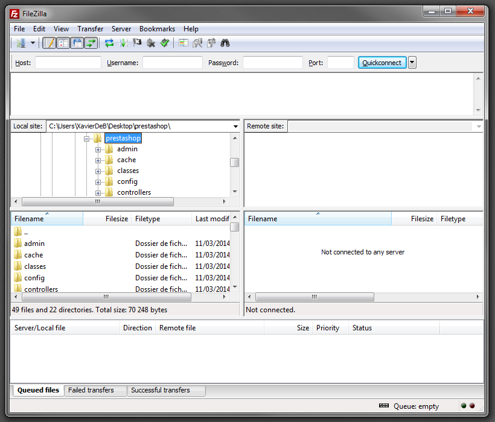

In het "Remote site"-gedeelte (rechts), blader naar de locatie waar u wilt dat PrestaShop vrij beschikbaar wordt gemaakt (hoofdmap van het domain, submap, subdomein...). Dit kan van tijd tot tijd veranderen, afhankelijk van uw eisen en wensen:

* Uw host:
  * Sommige hosts kunnen u vragen om de bestanden in een specifieke map te bewaren, zoals `/htdocs`, `/public_html`, `/web`, `/www`, `/`[`yourdomainname.com`](http://yourdomainname.com), etc.
  * Andere hosts kunnen er weer voor zorgen dat u meteen inlogt op de juiste locatie.\
    \

* Uw behoeften:
  * Als u wilt dat uw winkel zich op het hoofddomein bevindt (bijv. [http://www.example.com](http://www.example.com)), dan upload u de PrestaShop-map in de hoofdmap van de uploadruimte (welke afhankelijk is van de host).
  * Als u wilt dat uw winkel zich in een submap op het hoofddomein bevindt (bijv. [http://www.example.com/shop](http://www.example.com/shop)), dan moet u eerst een submap aanmaken met FileZila (rechtermuisknop en kies "Create directory"), uploado daarna PrestaShop in die map.
  * Als u wilt dat uw winkel zich in een subdomein bevindt (bijv. [http://shop.example.com](http://shop.example.com)), dan moet u eerst een sudomein aanmaken. De manier waarop is afhankelijk van uw host: soms kunt u simpelweg een nieuwe map aanmaken met uw FTP-client, maar het kan ook zijn dat u het subdomein eerst aan moet maken met behulp van het administratiepaneel van uw host. Lees daarvoor eerst de documentatie die u hebt gekregen van uw hostingprovider. Zodra het subdomein is ingesteld, kunt u PrestaShop uploaden naar de juiste map.\
    \

Aan de linkerkant van FileZilla, zult u nu een lokale map hebben waar u de PrestaShop-bestanden uit het zip-archief heeft bewaard. En aan de rechterkant, de doelmap. Als u dit nog niet hebt gedaan, uploaden is erg gemakkelijk: selecteer alle bestanden en mappen vanuit uw lokale map (gebruiker Ctrl-A), en sleep deze naar de map aan de rechterkant, of gebruik de rechtermuisknop en kies "Upload" vanuit het menu dat verschijnt.

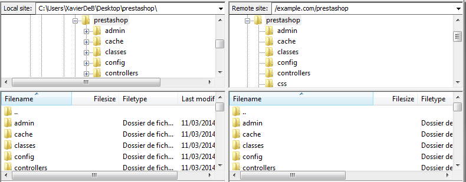

Uploaden kan enkele minuten duren, want PrestaShop bestaat uit meer dan 7500 bestanden en bijna 1000 mappen. Hierna moeten alle bestanden van PrestaShop online beschikbaar zijn. Mooi!

#### Database aanmaken voor uw winkel 

Voordat u kunt beginnen met het installeren van PrestaShop, moet u er eerst voor zorgen dat er een database beschikbaar is voor de data van PrestaShop. Als u dat nog niet gedaan hebt, moet u er nog één aanmaken.

Het aanmaken van een database kan met elke databasebeheer-tool. We maken in dit voorbeeld gebruik van de gratis phpMyAdmin tool ([http://www.phpmyadmin.net](http://www.phpmyadmin.net)), welke vaak meegeleverd wordt bij de meeste webhosts.

Sommige hosts geven de voorkeur aan een grafisch configuratiepaneel, zoals cPanel, Plesk of een eigengemaakte. Zorg ervoor dat u het MySQL-gedeelte van de documentatie van uw host hebt gelezen en maak een database aan volgens hun specificaties.

Login op phpMyAdmin met uw gegevens, welke bekend zijn bij uw host. Het zou nu beschikbaar moeten zijn volgens een standaard URL, gelinkt aan uw domeinnaam of domeinnaam van uw hostingprovider.

In de linkerkolom kunt u uw huidige databases op de MySQL-server zien. Sommige hiervan kunt u beter niet aanraken, want deze zijn noodzakelijk voor phpMyAdmin of de hostingprovider. Enkele hiervan zijn: `phpmyadmin`, `mysql`, `information_schema`, `performance_schema`. Lees de handleiding van uw hostingprovider als u er zeker van wilt zijn of deze gebruikt kunnen worden als standaarddatabase.

In elk geval kunt u een nieuwe database aanmaken door naar het "Database"-tabblad te gaan en het centrale formulier genaamd "Create new database" te gebruiken. Voer simpelweg een unieke naam in en klik op "Create". De naam van de database die u zojuist heeft toegevoegd zou in de linkerkolom moeten verschijnen. U kunt deze nu gebruiken om de data van PrestaShop in op te slaan.

#### Auto-installer gebruiken 

Nu komt het grote moment waar alles samenkomt: het installeren van PrestaShop.

Het installatieproces is vrij eenvoudig, omdat deze gestroomlijnd wordt door PrestaShop's auto-installer. Het moet gemakkelijk zijn om in enkele minuten deze installer te doorlopen. Lees wel zorgvuldig elke stap om ervoor te zorgen dat u geen belangrijke informatie mist.

Om de installer te starten gaat u naar de locatie van PrestaShop op uw server: het script zal automatisch detecteren dat PrestaShop nog niet is geïnstalleerd en zal u direct naar de auto-installer leiden.\
U kunt ook meteen het adres van de `/install` map gebruiken: [`http://www.example.com/prestashop_map/install`](http://www.example.com/prestashop\_map/install).&#x20;

Als u PrestaShop lokaal installeert, dan kan deze installatie worden gedaan op uw lokale server, welke beschikbaar zou moeten zijn op [`http://127.0.0.1/`](http://127.0.0.1/).

Vanaf hier hoeft u slechts te lezen, klikken en een paar formulieren in te vullen.

Er zijn 6 stappen, naarmate u vordert zullen er meer stappen donkergrijs worden. De stap met de blauwe naam is de stap waar u momenteel mee bezig bent.

**Stap 1: Welkomstpagina**

Deze pagina bevat een snelle introductie voor het installatieproces. U kunt hier de taal kiezen welke gebruikt gaat worden bij de installatie.

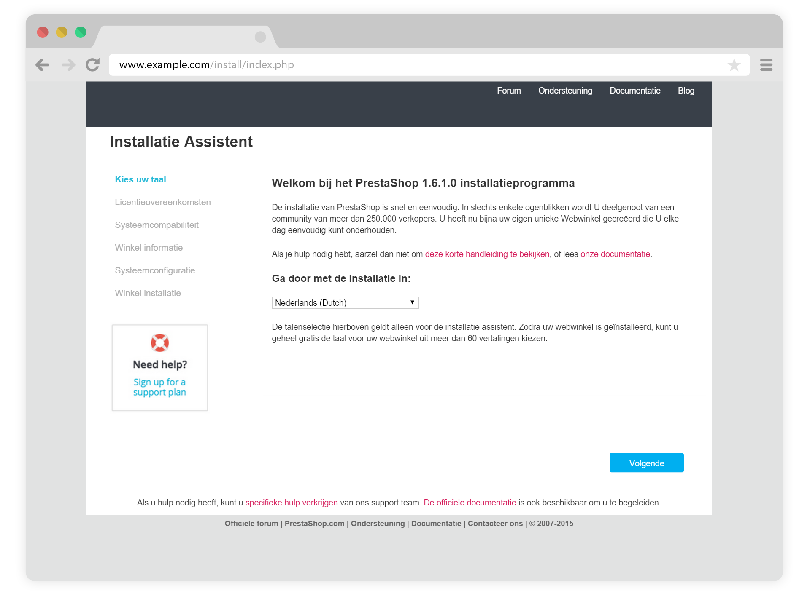

U krijgt ook een link te zien naar de documentatiesite ([http://doc.prestashop.com](http://doc.prestashop.com)) en het telefoonnummer van PrestaShop. U kunt meer te weten komen over onze ondersteuning door naar deze link te gaan: [http://support.prestashop.com/nl/](http://support.prestashop.com/nl/).

Kies de taal die u wilt gebruiken en daarna "Volgende". Dit zal ook de standaardtaal voor uw PrestaShop-winkel installen - andere talen kunt u later toevoegen.

**Stap 2: Licenties van PrestaShop**

Deze tweede pagina toont de noodzakelijke licenties: PrestaShop is gratis en wordt gedistribueerd onder een aantal open-source licenties. U kunt geen gebruikmaken van deze software als u niet akkoord gaat met de voorwaarden van de licenties en deze stap vereist dat u expliciet aangeeft dat u ze accepteert.

Lees de licenties van PrestaShop:

* _Open Software License 3.0_ for PrestaShop itself, welke u kunt lezen op [http://www.opensource.org/licenses/OSL-3.0](http://www.opensource.org/licenses/OSL-3.0).&#x20;
* _Academic Free License 3.0_ for the modules and themes, welke u kunt lezen op [http://opensource.org/licenses/AFL-3.0](http://opensource.org/licenses/AFL-3.0).

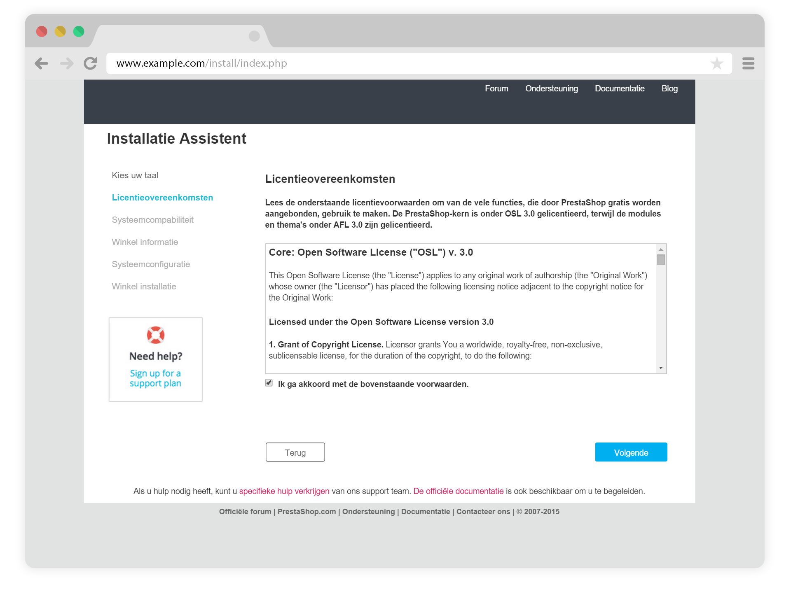

U moet met beide licenties akkoord gaan als u PrestaShop wilt installeren.

Om bij de volgende stap  te komen moet u eerst het selectievakje "Ik ga akkoord met de bovenstaande voorwaarden." aanvinken, waarna de "Volgende" knop wordt vrijgegeven. Als u de licenties niet accepteert, kunt u PrestaShop niet installeren. De "Volgende" knop zal dan ook niet klikbaar zijn.

**Stap 3 & 4: Systeemcompatibiliteit & winkelinformatie**

De derde pagina voert een snelle controle uit over uw systeem. In dit meeste gevallen ziet u dit scherm niet, want als er niets kan worden gevonden dat niet klopt, wordt deze stap overgeslagen. Wanneer dat het geval is, kunt u deze stap als nog bekijken door in de linkerbalk te klikken op "Systeemcompatibiliteit".

Als er iets mis gaat geeft de installer aan wat er verbeterd moet worden.

**Systeemcompatibiliteit**

Deze pagina controleert of uw systeemconfiguratie juist is. Er wordt gecontroleerd op PHP-instellingen, toegangsrechten van bestanden en mappen, plugins van derden, etc...

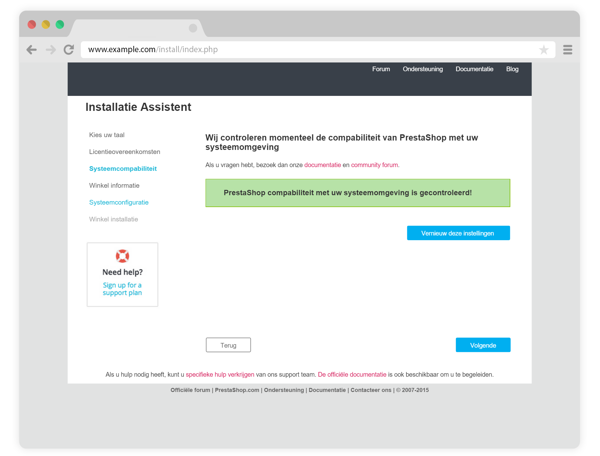

Als er iets misgaat en de installer hier stopt, dan krijgt u enkele technische details te zien over de configuratie of toegangsrechten die u mogelijk moet aanpassen.

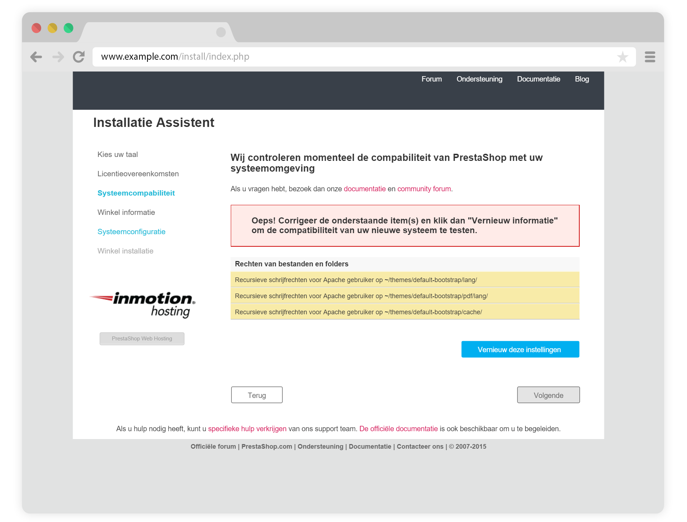

Hier is een lijst met checks die uitgevoerd worden tijdens de systeemcontrole:

| Check                                                    | Hoe/waar los ik het op?                                                                                      |
| -------------------------------------------------------- | ------------------------------------------------------------------------------------------------------------ |
| Is PHP 5.4 of nieuwer geïnstalleerd?                     | Webserver                                                                                                    |
| Kan PrestaShop bestanden uploaden?                       | php.ini-bestand (`file_uploads`)                                                                             |
| Kan PrestaShop nieuwe bestanden en mappen aanmaken?      | File browser / FTP client / command line                                                                     |
| Is de GD Library geïnstalleerd?                          | php.ini bestand (`extension=`[`php_gd2.so`](http://php\_gd2.so))                                             |
| Wordt MySQL ondersteund en draait deze?                  | php.ini bestand (`extension=`[`php_pdo_mysql.so`](http://php\_pdo\_mysql.so))                                |
| Recursieve schrijfrechten op \~/config/                  | File browser / FTP client / command line                                                                     |
| Recursieve schrijfrechten op \~/cache/                   | File browser / FTP client / command line                                                                     |
| Recursieve schrijfrechten op \~/log/                     | File browser / FTP client / command line                                                                     |
| Recursieve schrijfrechten op \~/img/                     | File browser / FTP client / command line                                                                     |
| Recursieve schrijfrechten op \~/mails/                   | File browser / FTP client / command line                                                                     |
| Recursieve schrijfrechten op \~/modules/                 | File browser / FTP client / command line                                                                     |
| Recursieve schrijfrechten op \~/override/                | File browser / FTP client / command line                                                                     |
| Recursieve schrijfrechten op \~/themes/default/lang/     | File browser / FTP client / command line                                                                     |
| Recursieve schrijfrechten op \~/themes/default/pdf/lang/ | File browser / FTP client / command line                                                                     |
| Recursieve schrijfrechten op \~/themes/default/cache/    | File browser / FTP client / command line                                                                     |
| Recursieve schrijfrechten op \~/translations/            | File browser / FTP client / command line                                                                     |
| Recursieve schrijfrechten op \~/upload/                  | File browser / FTP client / command line                                                                     |
| Recursieve schrijfrechten op \~/download/                | File browser / FTP client / command line                                                                     |
| Recursieve schrijfrechten op \~/sitemap.xml              | File browser / FTP client / command line                                                                     |
| Kan PrestaShop externe URLs openen?                      | [php.in](http://php.in) bestand (`allow_url_fopen`)                                                          |
| Staat de "register global" optie van PHP uit?            | php.ini bestand (`register_globals`)                                                                         |
| Is GZIP-compressie ingeschakeld?                         | .htaccess bestand                                                                                            |
| Is de Mcrypt extensie beschikbaar?                       | php.ini bestand (see [http://php.net/manual/en/mcrypt.setup.php](http://php.net/manual/en/mcrypt.setup.php)) |
| Staat de PHP's "magic quotes" optie van PHP uit?         | php.ini bestand (`magic_quotes_gpc`)                                                                         |
| Is de Dom extensie geladen?                              | `--enable-dom` compile time optie                                                                            |
| Is de PDO MySQL extensie geladen?                        | php.ini bestand (`extension=`[`php_pdo_mysql.so`](http://php\_pdo\_mysql.so))                                |

Het veranderen van de PHP-configuratie werkt voor iedereen anders en is ook afhankelijk van het toegangsniveau tot de server en kan daarom alleen gedetailleerd worden beschreven, het bijwerken van bestandspermissies is gemakkelijker.

Toegangsrechten bepalen welke gebruikers en gebruikersgroepen toegang hebben tot welke bestanden. Hierbij kunnen hun mogelijkheden tot bekijken of bewerk van bestanden en mappen worden bepaald. De installer moet enkele veranderingen aanbrengen aan de bestanden die u hebt geüpload, en als deze veranderingen niet kunnen worden toegepast vanwege onvoldoende schrijfrechten, dan kan het installatieproces niet worden voltooid.

Als de installater ontdekt dat sommige bestanden of mappen niet genoeg toegangsrehcten hebben, dan moet u deze rechten zelf aanpassen. Dit vereist dat u toegang hebt to de bestanden op uw server en daarvoor moet u uw FTP-client (zoals FileZilla) of de command line gebruiken.

Login op uw server met uw FTP-client, blader naar de PrestaShop-map en zoek de bestanden die door de installer zijn gemarkeerd. De permissies van deze bestanden moeten worden aangepast.

CHMOD

Het veranderen van de toegangsrechten tot een bestand/map op een Unix/Linux-systeem heet "CHMOD", vernoemd naar het programma met dezelfde naam (zie: [https://en.wikipedia.org/wiki/Chmod](https://en.wikipedia.org/wiki/Chmod) - u kunt op de volgende pagina uitleg vinden over toegangsrechten op bestanden: [http://www.elated.com/articles/understanding-permissions/](http://www.elated.com/articles/understanding-permissions/)).\
Het geven van schrijfrechten aan bestanden en mappen heet "het doen van een CHMOD 755" of "een CHMOD 775", afhankelijk van de host.&#x20;

Sommige hostingproviders kunnen u vragen om CHMOD 777. Dit wordt alleen aangeraden voor een snelle wijziging, waarna de rechten weer moeten worden hersteld.

Als u CHMOD 777 moet gebruiken om PrestaShop te installeren, zorg er dan voor dat u een veiligere instelling kiest (zoals 775 voor mappen en 664 voor bestanden) zodra u klaar bent met installeren. Lees de handleiding van uw hostingprovider zorgvuldig door.

Dankzij FileZilla (en de meeste FTP-clients), hoeft u geen enkel Unix-commando zelf te typen. De meeste FTP-clients maken het mogelijk om gemakkelijk permissies in een grafische omgeving te wijzigen: zodra u een bestand of map hebt gevonden waarvan de toegangsrechten gewijzigd moeten worden, gebruik de rechtermuisknop en kies "File permissions..." in het context-menu dat verschijnt. Het opent een klein venster.

.png>)

Afhankelijk van uw serverconfiguratie (welke niet altijd beschikbaar is), zult u zowel de "Read" en "Execute", en op zijn minst de "Owner" en "Group" rijen aanvinken voor de "Write" kolom. Sommige hosts vereisen dat u de publieke "Write" selectievakje moet aanvinken, maar wees hier erg voorzichtig mee: het is zelden een goed idee om iemand anders op uw server toestemming te geven om uw eigen PrestaShop-installatie te wijzigen.

Sommige mappen hebben daarin nog meer bestanden en mappen waarvan de rechten ook moeten worden gewijzigd. Om dezelfde instellingen op de subbestanden en -mappen toe te passen, vinkt u "Recurse into subdirectories" aan.

Terwijl u de toegangsrechten aanpast in uw FTP-client, moet u regelmatig controleren dat u de juiste wijzigingen hebt toegebracht door opnieuw de installer te laten controleren: klik zo vaak als nodig op "Vernieuw deze instellingen".\
Zodra alles op groen staat, kunt u op "Volgende" klikken. Als u niet alles perfect krijgt, zorg er dan in ieder geval voor dat de installer de tekst "PrestaShop compatibiliteit met uw systeemomgeving is gecontoleerd!" weergeeft.

**Systeeminformatie**

Dit is waar u kunt beginnen met de aanpassingen van uw winkel: geeft het een naam en een logo, vertel wat de hoofdactiviteit is, en geef persoonlijke informatie op van de winkeleigenaar (beschermd door privacywetten in de meeste landen)...

Gebruik geen dubbele punt in de naam van uw winkel, want dit kan voor problemen zorgen (het verzenden van e-mails lukt bijvoorbeeld niet meer).

U kunt de dubbele punt vervangen door een - als u twee secties wilt in de titel. Gebruik bijvoorbeeld "MijnWinkel - de beste plaats om producten te kopen" in plaats van "MijnWinkel: de beste plaats om producten te kopen".&#x20;

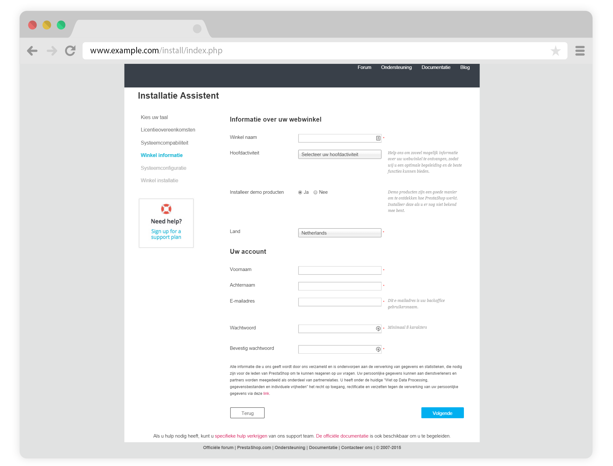

Aangaande het logo, merk op dat het verschijnt op:

* Alle pagina's van uw winkel (afhankelijk van uw thema).
* In uw back office.
* In alle e-mails die verzonden worden aan uw klanten.
* In al uw contractuele documenten (rekeningen, RMA-formulieren, etc.).

Laat om deze (duidelijke) redenen daarom niet het PrestaShop logo staan.

Klik op "Volgende" om verder te gaan.

**Stap 5: Systeemconfiguratie**

Deze pagina bevat een formulier waarmee u PrestaShop verteld waar de databaseserver is en welke database het zou moeten gebruiken, samen met nog enkele details. Al deze informatie zou door uw hostingprovider verstrekt moeten zijn.

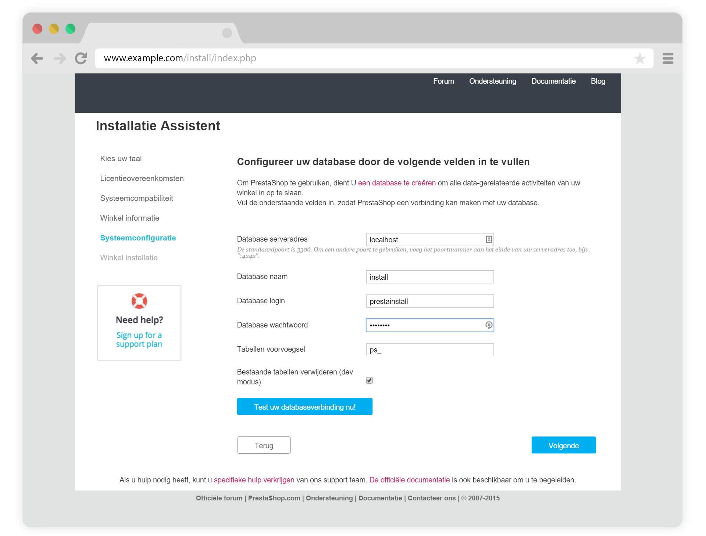

Vul alle velden met de database-informatie die u van uw webhost hebt gekregen:

* **Database serveradres**. De hostname van uw MySQL-server. Het kan gebonden zijn aan uw domeinnaam (bijv. sql.example.com). uw webhost (bijv. mysql2.alwaysdata.com) of simpelweg een IP-adres (bijv. 46.105.78.185).
* **Database naam**. De naam van de database waar PrestaShop de data gaat bewaren. Dit kan een al bestaande database zijn of één die u zojuist hebt aangemaakt m.b.v. phpMyAdmin (of een andere MySQL-tool) in de sectie "[Database aanmaken voor uw winkel](prestashop-installeren.md#PrestaShopinstalleren-Databaseaanmaken)".
* **Database login**. De naam van de MySQL-gebruiker die toegang heeft tot uw database.
* **Database wachtwoord**. Het wachtwoord van de MySQL-gebruiker.
* **Tables voorvoegsel**. De voervoegsel van uw databasetabellen. "ps\_" wordt standaard gebruikt, hierdoor zijn de tabellen er standaar zo uit: "ps\_car" of "ps\_wishlist"; wilt u meer dan één winkel in dezelfde database, dan moet u voor elke winkel een andere prefix gebruiken. Beter nog: gebruik de multistore-optie van PrestaShop, waarmee meerdere winkels beheerd kunnen worden vanuit één back office.&#x20;
* **Bestaande tabellen verwijderen (dev modus)**. Dit is alleen beschikbaar in Dev Modus. Wanneer u PrestaShop opnieuw installeert, kunt u ervoor kiezen om de huidige PrestaShop databasetabellen te verwijderen om met een schone lei te kunnen beginnen.

Klik op de "Test uw databaseverbinding nu!" knop om te controleren of u de juiste informatie hebt ingevoerd.

Klik "Volgende": het installatieprogramma zal beginnen met het installeren van uw winke, het aanmaken van vullen van databasetabellen, etc. Dit kan enkele minuten duren: wees geduldig en sluit uw browser niet af!

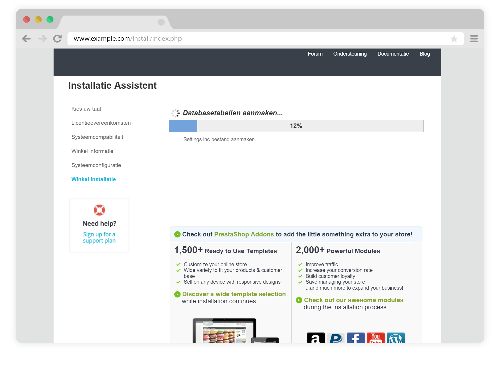

Het installatieprogramma doet het volgende:

* Aanmaken van het bestaand `settings.inc.php` en het vullen met uw instellingen.
* Aanmaken van databasetabellen.
* Aanmaken van de standaardwinkel met de standaardtaal.
* Het invullen van de databasetabellen.
* De winkeldata configureren.
* Standaardmodules installeren.
* Demonstatiedata installeren (producten, categoriën, CMS-pagina's, etc.).
* Het thema installeren.

#### De installatie voltooien 

Zoals u kunt lezen op de laatste pagina van het installatieproces, zijn er een paar laatste acties die u moet uitvoeren, voordat u het installatieprogramma kunt verlaten.

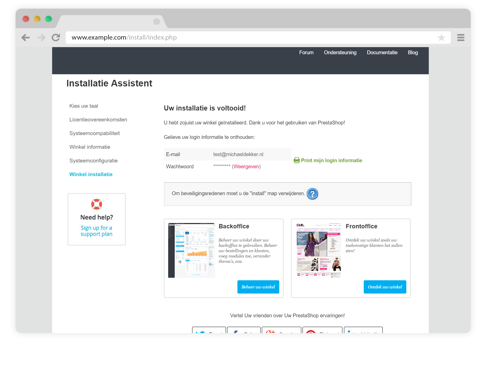

Een gemakkelijke manier om de beveiliging van uw winkel te verhogen is om een aantal bestanden en mappen te verwijderen. Dit kunt u doen met uw FTP-client, direct op de server. De items die verwijderd moeten worden zijn:

* De "/install" map (verplicht).
* De "/docs" map (optioneel), tenzij u de standaard importeertool wilt gebruiken met de standaard importeerbestanden die deze map bevat.
* Het "[README.md](http://readme.md/)" bestand (optioneel).

Klik op de knop "Beheer uw winkel" om naar het administratiepaneel van uw winkel te gaan.

Een andere manier om winkel beter te beveiliging is het hernoemen van de administratiemap naar een unieke naam. PretaShop zelf veranderd deze naar admin + een aantal alfanumerieke karakters. Beter is om een naam als "4admin-1537" of "MySeReT4dm1n" te gebruiken, waardoor het voor buitenstaanders erg lastig wordt om uw administratiepaneel te vinden.\
**Noteer de naam van uw nieuwe "admin" map**, want vanaf nu gebruikt u dit adres om bij uw administratiepaneel te komen.

Als laatste stap, om de laatste delen van uw winkel te beveiligen, gebruikt u uw FTP-client om de toegangsrechten bij te werken naar 664, of 666, wanneer uw host dit nodig acht. Als een module niet goed kan draaien vanwege deze rechten, dan zou u de permissies terug moeten zetten naar 755.

**Gefeliciteerd! U hebt de installatie voltooid.**

Login op de back office door naar uw nieuwe "admin" URL te gaan en vul uw catalogus met producten, vervoerders en verzendkosten, leveranciers en fabrikanten toevoegen, het thema aanpassen en in het algemeen alle instellingen die u helpen de winkel aan te passen aan uw wensen. Bekijk het hoofdstuk [Eerste stappen met PrestaShop 1.6](../gebruikershandleiding/eerste-stappen-met-prestashop-1.6.md) voor meer informatie.&#x20;

Maak regelmatig een backup van uw database en bestanden, ideaal zou zijn wanneer de backups zich op meer dan één computer bevinden. Handig in het geval de hardware kapot gaat of er wordt ingebroken.
