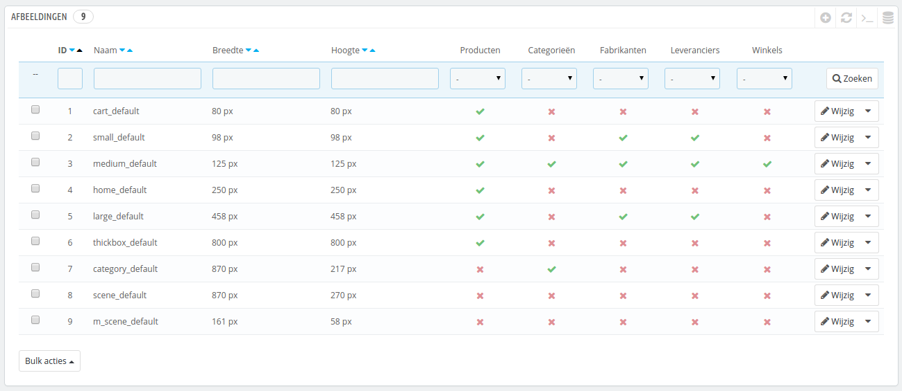
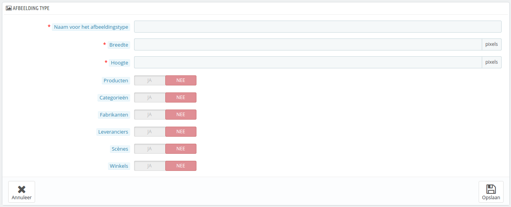
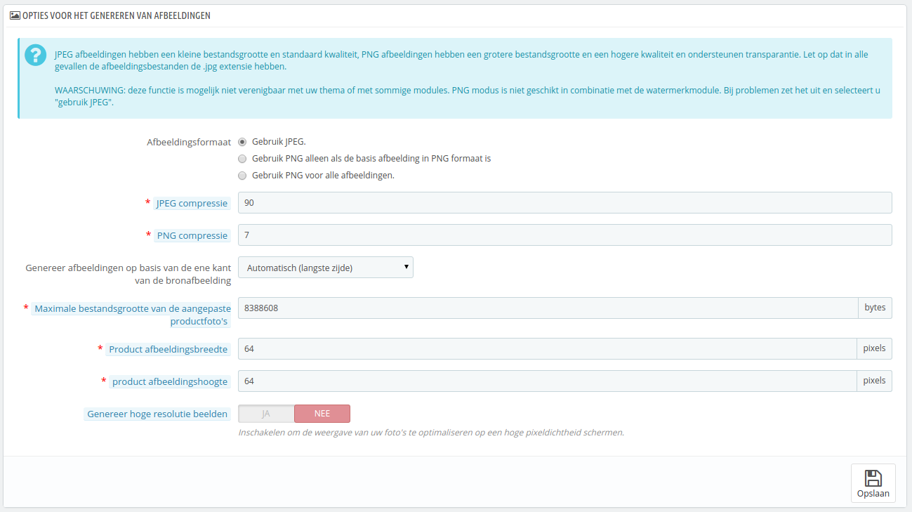
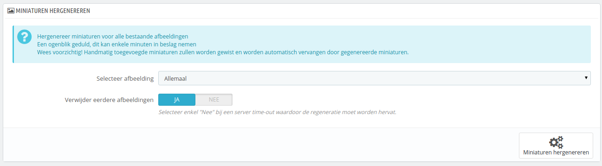

# Afbeeldingen instellen

De configuratiepagina "Afbeeldingen" maakt het mogelijk om de verschillende afbeeldingsformaten in te stellen die gebruikers te zien krijgen in uw winkel.

Zodra u een afbeelding uploadt naar PrestaShop, zal PrestaShop automatisch verschillende formaten aanmaken van de afbeelding, inclusief minitatuurweergaven en een mobiele versie (afhankelijk van het doel van de afbeelding). Daarom hoeft u slechts één "master"-versie te uploaden van uw afbeelding, groot genoeg om om te zetten in de andere formaten.

Als u ervoor wilt zorgen dat uw afbeelding op de juiste wijze wordt verkleind moet u een afbeelding uploaden met dezelfde hoogte/breedte-verhouding. Als uw geüploade afbeelding niet dezelfde verhoudingen heeft dan de instellingen dan ziet u mogelijk een witte ruimte verschijnen in de afbeelding.

U kunt een afbeeldingsformaat instellen voor specifieke contenttypes, direct vanuit de formatenlijst.

Op de configuratiepagina "Producten" onder het menu "Instellingen", kunt u ervoor kiezen om een andere zoom-methode te tonen wanneer een klant de muiscursor over een afbeelding houdt.

## Een nieuw afbeeldingsformaat toevoegen 

U kunt gemakkelijk een nieuw formaat toevoegen en zelfs kiezen voor welk type content het geschikt is.

Klik op de knop "Nieuw afbeeldingstype toevoegen", daarna:

1. Type de naam van het type, hoogte en breedte.
2. Kies voor welk type dit formaat is geschikt.
3. Voltooien.

## Afbeeldingsinstellingen 

*   **Afbeeldingsformaat**. U hebt de keuze uit twee populaire afbeeldingformaten: JPEG en PNG. Beide genieten een brede ondersteuning onder browsers. JPEG kent een goede compressieverhouding, maar kan veel visuele storingen vertonen. Het compressiealgoritme van PNG is niet zo goed als die van JPEG, maar kent minder zichtbare verstoringen; ook kunnen oudere browsers dit formaat niet herkennen (in 2015 niet echt meer mogelijk, red.).\
    De keuze is vaak een kwestie van smaak. JPEG blijft desondanks het aanbevolen formaat. Als u liever hebt dat de PNG-compressie niet verloren gaat zodra een PNG-afbeelding wordt geüpload, dan kunt u kiezen voor de tweede optie: "Gebruik PNG alleen als de basis afbeelding in PNG formaat is".

    Het PNG-formaat is niet compatibel met de module "Watermerk".
* **JPEG compressie**. Maak deze instelling niet later dan 80 of 75, omdat dan de meeste verstoringen zichtbaar worden.
* **PNG compressie**. Kies geen waarde hoger dan 6 of 7, omdat dan de meeste verstoringen zichtbaar worden.
* **Genereer afbeeldingen op basis van de ene kant van de bronafbeeldingen**. Deze feature zorgt ervoor dat u de productafbeelding kunt positioneeren aan de hand van de beschikbare ruimte:
  * Kies "Hoogte" om de hoogte van het frame op te vullen (de breedte wordt daarna berekend om de oorspronkelijke hoogte/breedte-verhouding in tact te laten).
  * Kies "Breedte" zodat de afbeelding de breedte van het frame opvult (de hoogte wordt opnieuw berekend aan de hand van de oorspronkelijke verhouding).
  * Kies "Automatisch (langste zijde)" zodat de breedte en hoogte worden berekend aan de hand van de maximale ruimte die de afbeelding in kan nemen.
* **Maximale bestandsgrootte van de aangepaste productfoto's**. Uw klanten kunnen afbeeldingen uploaden voor aangepaste producten. Standaard stelt PrestaShop deze waarde gelijk aan de maximale PHP-instelling – dit kan enkele megabytes betekenen: 8.388.608 is gelijk aan 8Mb. U kunt deze waarde vergoten maar houdt rekening met de maximale waarde die uw PHP-installatie aankan.
* **Product afbeeldingsbreedte**. Standaard hebben productafbeeldingen een maximale breedte van 64 pixels.
* **Product afbeeldingshoogte**. Standaard hebben productafbeeldingen een maximale hoogte van 64 pixels.
* **Genereer hoge resoluties beelden**. De meest recente schermen met een hoge pixeldichtheid (Retina en vergelijkbare technologiën) vereisen afbeeldingen met een hoge resolutie. U kunt deze functie inschakelen om ervoor te zorgen dat uw afbeeldingen geschikt zijn voor dergelijke schermen. Het genereert een nieuw bestand waarvan de resolutie twee keer zo hoog is. Dit verdubbelt het aantal afbeeldingsbestanden.

## Miniaturen hergenereren 

Misschien bent u niet tevreden met de afbeeldingsgrootte van de huidige miniaturen. Deze sectie maakt het mogelijk om ze allemaal opnieuw te genereren – of die van een bepaald type:

1. Verander de formaten in de tabel erboven.
2. Kies welke afbeeldingen opnieuw gegenereerd moeten worden.
3. Geef aan of eerdere afbeeldingen behouden moeten worden.
4. Klik op de knop "Miniaturen hergenereren".\
   \

Handmatig geüploade miniatuurweergaven worden verwijderd en vervangen door automatisch gegenereerde miniatuurweergaven.
