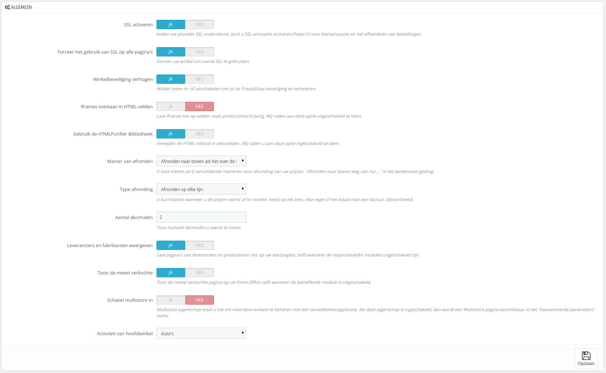

# Algemeen instellen

De pagina "Algemene instellingen" bevat een handvol instellingen die niet geplaatst konden worden in de andere menu's. Ze zijn hoe dan ook belangrijk:

* **SSL activeren**. SSL betekent "Secure Sockets Layer" en omvat ook TSL (voor "Transport Layer Security"). Beide zijn cryptografische internetprotocollen welke webcommunicatie beveiligen. U kunt meer over deze protocollen te weten komen op de volgende Wikipediapagina: [http://en.wikipedia.org/wiki/Secure\_Sockets\_Layer](http://en.wikipedia.org/wiki/Secure\_Sockets\_Layer).\
  Door een SSL-verbinding te bieden kunt u klanten geruststellen over de beveiliging van hun data (authenticatie, creditcardgegevens, etc.) binnen uw winkel, omdat moderne browsers tegenwoordig waarschuwen dat de verbinding is beveiligd. Als uw hostingprovider SSL ondersteunt, zorgt u er dan voor dat u SSL-ondersteuning binnen PrestaShop inschakelt door op de link te klikken. Dit zal een instelling vrijgeven, waar u vervolgens "JA" moet kiezen.
* **Winkelbeveiliging verhogen**. Dit voegt beveiligingstokens toe aan uw winkel om de beveiliging te verhogen. Effectief wordt welke URL gekoppeld aan een sessie van een gebruiker en kan niet hergebruikt worden in andere browsers, dus hiermee voorkomende dat sessieinformatie gestolen kan worden.
* **Iframes toestaan in HTML-velden**. Deze optie maakt het mogelijk om iframes toe te voegen aan tekstvelden, zoals productbeschrijvingen. Iframes zijn HTML-elementen die het mogelijk maken om externe content toe te voegen aan uw eigen pagina's. We raden aan om deze optie uitgeschakeld te houden, tenzij deze optie noodzakelijk is.
* **Gebruik de HTMLPurifier bibliotheek**. Klanten kunnen informatie invoeren in uw winkel in de tekstvelden (bijvoorbeeld productbeschrijvingen of klantinformatie), maar een hacker kan deze velden gebruiken om schadelijke code in te voeren en uw winkel te hacken. Deze optie garandeert dat data dat naar uw winkel wordt verzonden veilig wordt gefilterd. U moet deze optie alleen uitschakelen als u weet waar u mee bezig bent.
*   **Manier van afronden**. Zodra belastingen en kortingen worden toegepast kan een prijs veel decimalen achter de komma bevatten, zoals €42,333333333. De afrondingsmodus wordt door PrestaShop gebruikt, om in de frontoffice prijzen te tonen, maar ook tijdens prijsberekeningen (belastingen, kortingen, etc.). Een wijziging hier kan klein lijken, maar heeft uiteindelijk een grote impact op het totaalbedrag op de factuur, wanneer items bij elkaar worden opgeteld.\
    Er zijn zes modi:

    * **Afronden naar boven als het over de helft is**. Dit is de aanbevolen methode. 42,55555555 wordt 42,56.
    * **Afronden naar beneden als het over de helft is**. 42,55555555 wordt 42,56.
    * **Afronden naar de volgende even waarde**. 42,55555555 wordt 42,56.
    * **Afronden naar de volgende oneven waarde**. 42,55555555 wordt 42,56.
    * **Afronden naar boven naar de dichtstbijzijnde waarde**. 42,55555555 wordt 42,56.
    * **Afronden naar beneden naar de dichtstbijzijnde waarde**. 42,55555555 wordt 42,55.

    Voor versies lager dan 1.6.0.11

    De afrondingsoptie is behoorlijk veranderd sinds 1.6.0.11. Voor deze versie was er slechts één optie:

    **Afrondingsmodus**. Zodra belastingen en kortingen worden toegepast kan een prijs veel decimalen achter de komma bevatten, zoals €42,333333333.  De afrondingsmodus wordt door PrestaShop gebruikt, om in de frontoffice prijzen te tonen, maar ook tijdens prijsberekeningen (belastingen, kortingen, etc.). Er zijn drie modi:

    * **Omhoog**. Naar boven afronden: 42,333333333 wordt 42,34.
    * **Omlaag**. Naar beneden afronden: 42,333333333 wordt 42,33.
    * **Klassiek**. Het rondt de waarde naar boven of naar beneden af, afhankelijk van de waarde: omhoog wanneer boven ,5, naar beneden zodra onder ,5.
* **Type afronding**. Deze optie maakt het mogelijk om de afrondingstype te kiezen, wat een behoorlijk invloed kan hebben op het totaal. Er zijn drie typen mogelijk, in oplopende volgorde:
  * **Afronden op elke item**. Elke itemprijs wordt afgerond vóór de totaalberekening. Als er meer dan één item is, dan wordt elk item afzonderlijk afgerond vóór de berekening.
  * **Afronden op elke lijn**. Elke lijn met items wordt afgerond vóór de totaalberekening. Als er meer dan één item is op een lijn, dan wordt de afronding uitgevoerd op het totaalbedrag op de regel.
  * **Afronden op het totaal**. De afronden wordt gedaan op de totaalberekening, nadat alle waarden zijn opgeteld.
* **Aantal decimalen**. U kunt het aantal decimalen kiezen, voordat de waarden worden afgerond. Als u "3" kiest, dan verandert 42,333333333 in 42,334.
* **Leveranciers en fabrikanten weergeven**. Maakt het mogelijk om leveranciers- en fabrikantenpagina's te tonen op uw frontoffice, zelfs als hun modules zijn uitgeschakeld.
* **Toon de meest verkochte**. Maakt het mogelijk om best-verkochte items weer te geven op uw frontoffice, zelfs wanneer de module "Best-verkochte producten" is uitgeschakeld.
* **Schakel multistore in**. Deze kleine optie heeft een grote impact: het verandert uw PrestaShop-installatie bestaande uit één winkel in een installatie met meerdere winkels. Dit geeft u toegang tot de nieuwe multistore-mogelijkheden onder het menu "Geavanceerde instellingen" en elke administratiepagina krijgt een context gebaseerd op de winkel.\
  U kunt meer te weten komen over multistore-mogelijkheden via hoofdstuk [Meerdere winkels beheren](../meerdere-winkels-beheren/).
* **Activiteit van hoofdwinkel**. U hebt misschien de verkeerde activiteit gekozen bij het installeren van PrestaShop. U kunt ervoor kiezen om deze hier te corrigeren.

