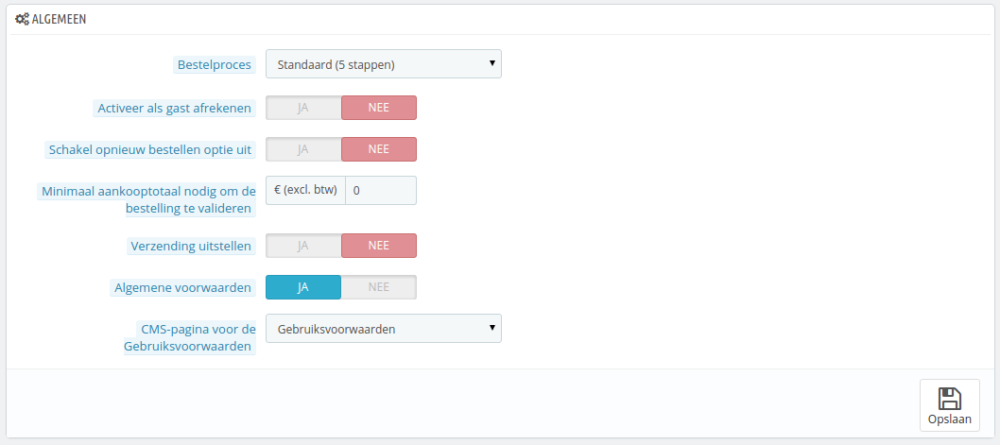
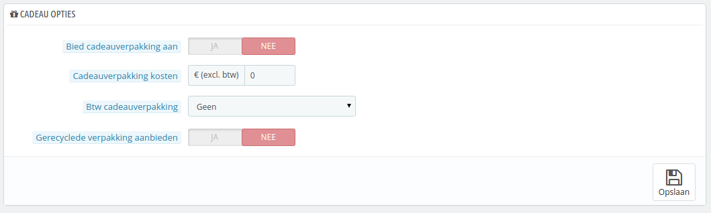

# Bestellingen instellen

De instellingen op de configuratiepagina "Bestellingen" zijn bedoeld voor bestellingen die geplaatst worden door uw klanten, maar ook om andere opties in te stellen zoals cadeauverpakkingen.

## Algemene instellingen 

* **Bestelproces**. Standaard moet de klant 5 stappen doorlopen om af te rekenen, waarbij elke stap een eigen pagina heeft. U kunt ervoor kiezen om alles op één pagina te tonen. De pagina zal langer zijn, maar sommige klanten geven de voorkeur aan deze aanpak
* **Activeer als gast afrekenen**. Sta niet-geregistreerde gebruikers toe om een bestelling te plaatsen, zonder een account aan te maken.
* **Schakel opnieuw bestellen optie uit**. Als deze op "Ja" is gezet, dan kunnen klanten niet opnieuw dezelfde bestelling plaatsen met één klik op de bestelgeschiedenis-pagina (dit is een vereiste in sommige Europese landen – en hier moet de optie dan ook op "Ja" zijn gezet).
* **Minimum aankooptotaal nodig om te bestelling te valideren**. Geeft het minimumbedrag aan dat in de winkelwagen aanwezig moet zijn om een bestelling te kunnen plaatsen. Als het bedrag in dit veld niet bereikt wordt dan kan de klant de bestelling niet voltooien. Als u geen minimum wilt dan zet u dit getal op "0".
* **Verzending uitstellen**. Als u de optie "Sta het bestellen van producten toe die niet op voorraad zijn" (beschikbaar op de configuratiepagina "Producten" onder het menu "Instellingen") inschakelt, dan kunt u artikelen verzenden zodra ze beschikbaar zijn, opgedeeld in zoveel verzendingen als nodig is. Zonder deze optie verdeelt PrestaShop de bestellingen in twee losse bestellingen.
* **Algemene voorwaarden**. Zorg ervoor dat uw klanten uw voorwaarden moeten accepteren, voordat ze een bestelling kunnen plaatsen.
* **CMS-pagina voor de Gebruiksvoorwaarden**. De voorwaarden van uwe winkel worden bewaard in een CMS-pagina. Kies de pagina waar PrestaShop naartoe moet verwijzen.

## Cadeau opties 

* **Bied cadeauverpakking aan**. Laat PrestaShop cadeauverpakkingen aanbieden en de mogelijkheid om een bericht toe te voegen. Het is altijd een handige feature voor klanten die cadeaus willen versturen via uw winkel.
* **Cadeauverpakking kosten**. Stelt de prijs van uw cadeauverpakkingsservice in.
* **Btw cadeauverpakking**. Als het nodig is om btw te verrekenen, dan kunt u dat hier instellen. U kunt extra belastingen toevoegen op de pagina "Belastingen" onder het menu "Lokalisatie".
* **Gerecyclede verpakking aanbieden**. Als u deze service wilt bieden zullen veel klanten dat waarderen.
