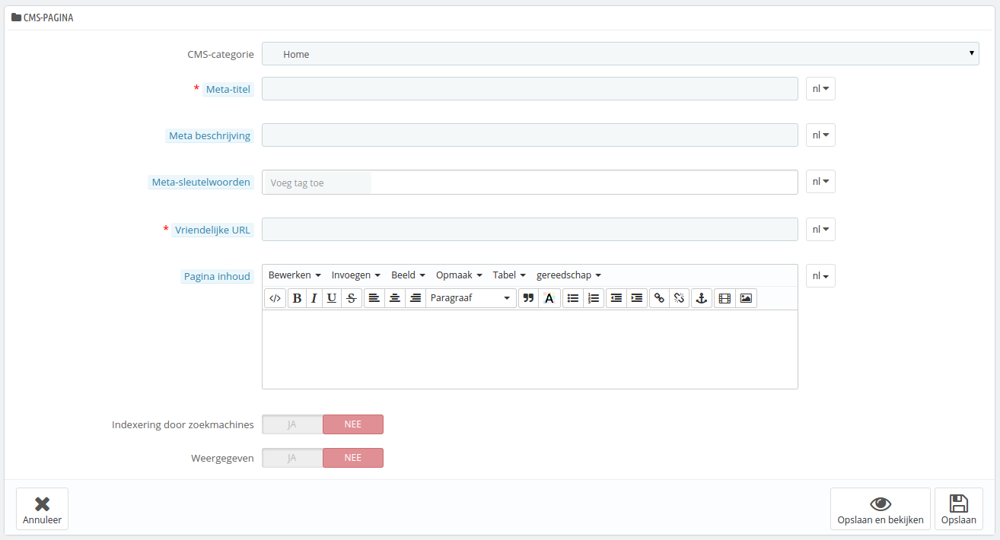

# CMS instellen - statische content beheren

PrestaShop maakt het toevoegen van CMS-pagina's net zo gemakkelijk als het toevoegen van productpagina's, door middel van het CMS-gereedschap. Deze pagina verschijnt voor klanten in het "Informatie"-blok op de homepage en het website-menu. U kunt CMS-pagina's toevoegen aan het topmenu door de module "Horizontaal top menu" te gebruiken (deze kan geconfigureerd worden vanaf de pagina "Module en Services" onder het menu "Modules en Services").

De configuratiepagina "CMS" toont een aantal pagina's die zijn aangemaakt in uw winkel, voor de huidig categorie (standaard is de homepage de enige categorie).

Vergeet niet om voor elke taal in uw winkel een eigen versie aan te maken! Zoals gebruikelijk klikt u op de taalselector naast elk veld om de taal te veranderen.

## Een nieuwe CMS-categorie aanmaken 

Klik op de knop "Voeg een nieuwe CMS categorie toe" om een CMS-categorie aan te maken – in feite een subcategorie van de hoofdcategorie "Home". U kunt zoveel categorieën aanmaken als nodig is.

Het formulier is vrij eenvoudig:

* **Naam**. Zorg ervoor dat u een korte, maar krachtige naam gebruikt.
* **Weergegeven**. Of de categorieën openbaar zijn of verborgen.
* **Hoofd CMS-categorie**. De categorie waar deze categorie onder geplaatst gaat worden. Standaard staat deze optie op "Home". U kunt een ongelimiteerd aantal niveaus van subcategorieën aanmaken.
* **Omschrijving**. Vul dit veld in, in alle talen, omdat sommige thema's deze informatie kunnen tonen aan klanten.
* **Meta-titel**. De naam van de categorie, zoals deze opgepikt wordt door browsers en zoekmachines.
* **Meta beschrijving**. Wordt gebruikt om de inhoud van deze categorie te beschrijven. Wordt getoond in zoekmachines.
* **Meta-sleutelwoorden**. Wordt gebruikt door zoekmachines (behalve Google) om te begrijpen welk type informatie te vinden is op deze pagina.
* **Vriendelijke URL**. Maakt het gemakkelijker voor zoekmachines om uw inhoud te indexeren en voor bezoekers om te begrijpen wat ze in de categorie kunnen vinden. Dit veld wordt automatisch ingevuld als u de categorienaam hebt bepaald, maar u kunt het alsnog handmatig bijwerken.

Wanneer u de categorie bewaard, dan brengt PrestaShop u terug naar de tabellen, maar deze keer wordt de nieuwe categorie getoond als basis. Daarom ziet u nog niet meteen de subcategoriën of subpagina's, tenzij u deze aanmaakt.\
Om terug te gaan naar de hoofdcategorie, klikt u op "Home" in de sectie met de naam "Huidige categorie" aan de bovenkant van de pagina. U kunt daarna pagina's inde hoofdcategorie aanpassen en deze zelfs verplaatsen naar uw nieuwe categorie.

On nieuwe subcategoriën aan te maken, verandert u de optie "Hoofd CMS-categorie" van "Home" naar de gewenste hoofdcategorie.

## Een nieuwe CMS-pagina aanmaken 

Klik op de knop "Voeg een nieuwe CMS pagina toe" om het volgende aanmaakformulier te bereiken:

* **CMS-categorie**. De standaardcategorie is de homepage van uw winkel. Als u wilt dat deze pagina beschikbaar is in een andere categorie, dan moet u deze eerst aanmaken.
* **Meta-titel**. De naam van de pagina, zoals getoond in de browser.
* **Meta beschrijving**. Wordt gebruikt om de inhoud van deze pagina te beschrijven. Wordt getoond in zoekmachines.
* **Meta-sleutelwoorden**. Wordt gebruikt door zoekmachines (behalve Google) om te begrijpen welk type informatie te vinden is op deze pagina.
* **Vriendelijke URL**. Maakt het gemakkelijker voor zoekmachines om uw inhoud te indexeren en voor bezoekers om te begrijpen wat ze op deze pagina kunnen vinden. Dit veld wordt automatisch ingevuld als u de naam hebt bepaald, maar u kunt het alsnog handmatig bijwerken.
* **Pagina inhoud**. Dit is de inhoud van uw pagina. In deze WYSIWYG-bewerker kunt u zoveel tekst toevoegen als nodig is, zelf afbeeldingen of video's door gebruik te maken van de opties "Afbeelding invoegen/bewerken" en "Video invoegen/bewerken".
* **Indexering door zoekmachines**. Geeft aan of zoekmachines deze pagina mogen indexeren of niet.
* **Weergegeven**. U kunt ervoor kiezen om uw pagina openbaar te maken, zodra u klaar bent met proeflezen.

Zodra alle velden zijn ingevuld, klikt u op "Opslaan", als de pagina actief is kunt u het resultaat gelijk bekijken in uw winkel.
