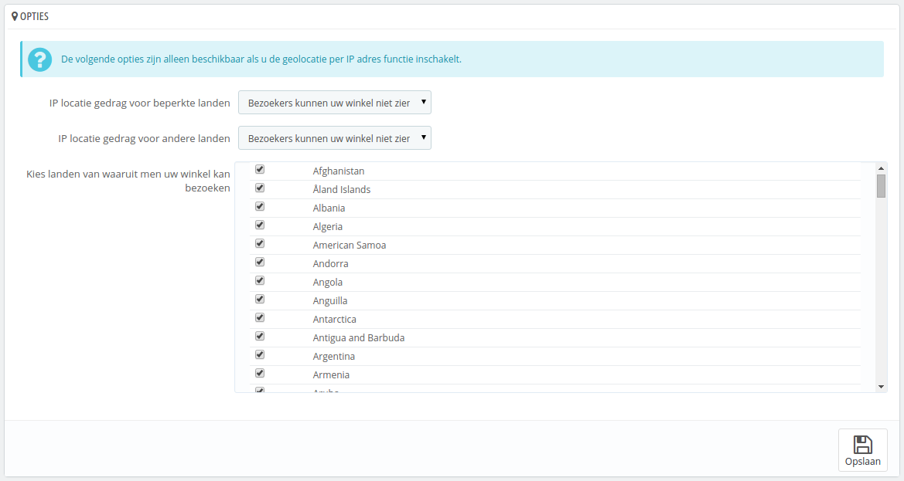

# Geolocatie instellen

Geolocatie is het "identificeren van de geografische locatie op de wereld van een object, zoals een radar, mobiele telefoon of een computer met internet" (lees meer op [http://en.wikipedia.org/wiki/Geolocation](http://en.wikipedia.org/wiki/Geolocation) ). In ons geval wordt geolocatie gebruikt om de locatie van een bezoeker te vinden, door gebruik te maken van zijn of haar ip-adres en andere gegevens. Eén van de use cases van geolocatie is het blokkeren van gebruikers uit specifieke steden of landen.

Zoals de eerste keer dat u de pagina opent wordt aangegeven, moet u eerst een speciaal bestand downloaden: [http://geolite.maxmind.com/download/geoip/database/GeoLiteCity.dat.gz](http://geolite.maxmind.com/download/geoip/database/GeoLiteCity.dat.gz). Dit bestand is de GeoLite City database van MaxMind, een nauwkeurige database van steden en locaties. Download deze door te klikken op de link en pak het daarna uit in de map `/tools/geoip/` van uw PrestaShop-installatie.

Zodra het bestand is geplaatst, kunt u de optie "Geolocatie per IP-adres" inschakelen en u bent klaar.

## Opties 

U kunt kiezen welke landen toegang hebben tot uw winkel (standaard allemaal) en PrestaShop's gedrag aanpassen voor landen met beperkingen. U hebt de keuze uit drie opties:

* Bezoekers kunnen uw winkel niet zien.
* Bezoekers kunnen uw winkel zien, maar geen bestellingen plaatsen.
* Alle functies zijn beschikbaar (alleen voor landen zonder beperkingen).\
  \

U kunt meerdere landen selecteren of deselecteren door de checkboxes aan te vinken. Wanneer u landen selecteert die toegang hebben tot uw winkel, zorg er dan voor dat u landen niet per ongeluk blokkeert, want u kunt potentiële klanten kwijtraken!

## IP adres toegangslijst 

Deze sectie maakt het mogelijk om specifieke ip-adressen toegang te geven, ondanks de landblokkade. Het kan handig zijn in het geval van spammers, bots of aanvallen. Het is al gevuld met een lijst van bekende goede ip-adressen. Voeg er zoveel toe als nodig is, één per regel en klik op "Opslaan".

