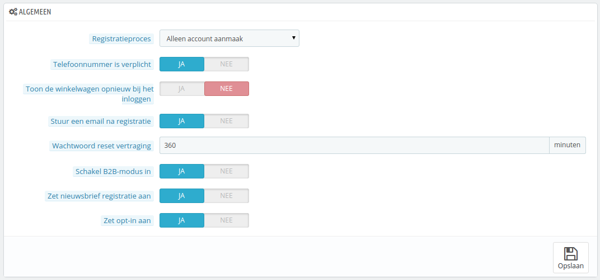

# Klanten instellen

De configuratiepagina "Klanten" biedt opties gerelateerd aan klanten en met name de B2B-modus.

* **Registratieproces**. U kunt bezoekers een nieuw account laten aanmaken zonder verder verplichtingen zoals het toevoegen van een adres.\
  De eerste optie zorgt ervoor dat het aanmaken van een account sneller gaat, maar dit voegt een nieuwe verplicht scherm toe zodra ze een bestellingen willen afronden en dit kan hen afschrikken.\
  Aan de andere kant, zorgt de tweede optie ervoor dat het aanmaken van een account langer duurt, maar klanten hebben in ieder geval een adres dat meteen gebruikt kan worden bij het afrekenen.
* **Telefoonnummer is verplicht**. Op dezelfde manier kunt u de klant verplichten om een telefoonnummer toe te voegen. Met een telefoonnummer kunt u een klant sneller bereiken ("Een beller is sneller!", red.), maar sommige klanten weigeren een telefoonnummer in te voeren. Als u deze optie uitschakelt, dan verschijnt het telefoonveld wel, maar hoeft deze niet verplicht ingevuld te worden.
* **Toon de winkelwagen opnieuw bij het inloggen**. Als de klant een winkelwagen had die nog niet was afgerekend, dan wordt deze opnieuw weergegeven als hij of zij opnieuw inlogt.
* **Stuur een email na registratie**. U kunt PrestaShop een e-mail laten sturen na de registratie met daarin een kort overzicht van de klantgegevens (e-mail, wachtwoord).
* **Wachtwoord reset vertraging**. U kutn ervoor kiezen om de regelmaat waarmee een wachtwoord opnieuw gegenereerd wordt te limiteren. Standaard staat dit limiet op 360 seconden – 6 uur.
* **Schakel B2B-modus in**. De B2B-modus biedt een handvol nieuwe mogelijkheden voor uw winkel. Klanten worden niet langer beschouwd als slechts particulieren, maar ook als bedrijven en hierdoor verschijnen er nieuwe opties:\

  * Het klantprofiel heeft nu nieuwe velden geschikt voor zakelijke informatie (Duns-nummers in de VS, SIRET-nummers in Frankrijk, CNPJ-nummers in Brazilië, KvK-nummers in Nederland, etc.)
  * Prijzen kunnen beperkt worden tot specifieke groepen,
  * Prijzen kunnen per klant beheerd worden voor de gehele catalogus of per categorie,
  * Facturen kunnen handmatig gegenereerd worden,
  * etc.
