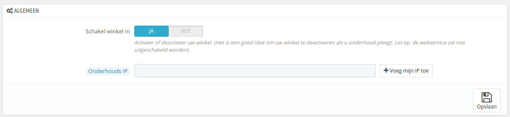

# Onderhoudsinstellingen

Dit is een erg simpele configuratiepagina maar onmisbaar wanneer u wijzigingen wilt aanbrengen aan uw winkel zonder dat klanten dat merken. Bijvoorbeeld wanneer u veel nieuwe producten toevoegt of als u het thema wilt wijzigen, maar nog enkele tests moet uitvoeren.

Deze pagina heeft slechts twee opties:

*   **Schakel winkel in**. U kunt deze optie gebruiken om de winkel tijdelijk uit te schakelen, bijvoorbeeld als u onderhoud moet plegen.

    De webservice is nog steeds actief, dus uw data blijft beschikbaar voor degenen met een sleutel. Als u ook de webservice uit wilt schakelen gaat u naar de pagina "Webservice" onder het menu "Geavanceerde instellingen".
* **Onderhouds IP**. Het onderhouds-IP geeft mensen toegang tot de winkel als deze is uitgeschakeld. Dit betekent dat u kunt voorkomen dat iedereen toegang tot uw winkel heeft, maar dat u uw eigen team alsnog toegang kunt geven. Om het ip-adres van uw computer te vinden gaat u naar [http://www.watismijnip.nl](http://www.watismijnip.nl). Klik op "Voeg mijn IP toe" als  u het ip-adres van uw huidige computer wilt toevoegne. Als u meerdere ip-adressen wilt toevoegen, dan scheidt u deze met komma's ",".
