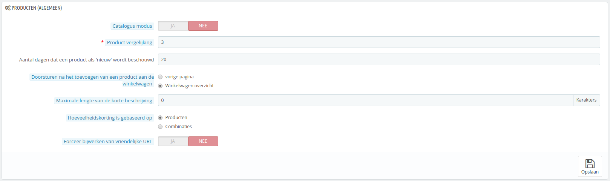
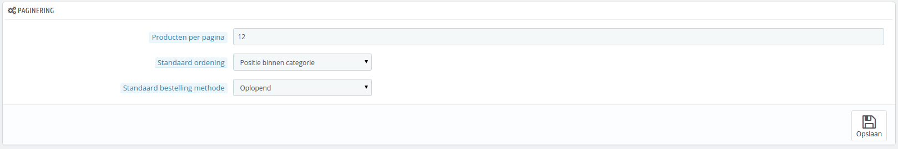
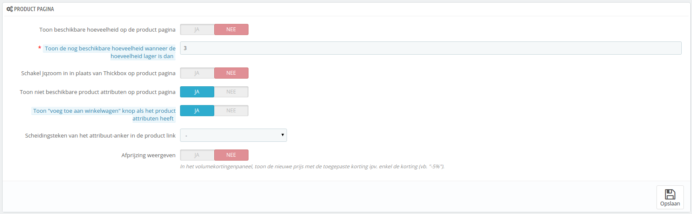
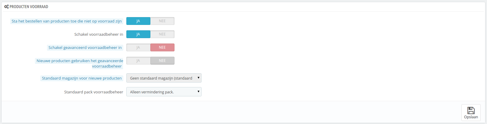

# Producten instellen

This page contains a few preferences pertaining to how your products are to be handled and displayed by PrestaShop.

## General preferences 

* **Catalog mode**. Enabling catalog mode turns your shop into a simple gallery of products, with no way to buy the items whatsoever.
* **Product comparison.** Set the maximum number of products that can be selected for comparison.
* **Number of days for which the product is considered 'new'**. When you add a product in your shop, it is considered new and it is reported back through the "New products" block and the "New products" page. The field allows you to specify how many days the product will remain visible on the block and page. With this feature, you choose how to display and updated your shop's news. The "New products" page is usually most accessed by your regular customers.
* **Redirect after adding product to cart**. You can either redirect the customer to the previous page, or to the cart summary.
* **Max size of short description**. Your product has two descriptions: a "short description" one and a regular one. The short description, which appears in search engines and in the category description for your product, is limited to 400 characters by default, but this option enables you to change that limit. 0 means that there is no limit.
* **Quantity discount based on**. This settings indicates upon what PrestaShop should base quantity discounts: per-product, or per-combination (which can feature multiple products).
* **Force update of friendly URL**. By default, the friendly URL of a product page is generated from the product title, and it stays the same even though the product title changes – because in order to be well referenced, your URLs should be stable. By enabling this option, PrestaShop will update the friendly URL every time you change the product's name or page's title.

## Pagination preferences 

* **Products per page**. Indicate how many products are displayed on the pages of your categories.
* **Default order by**. Indicate the order of products in your shop's categories. 6 choices are available:
  * **Product name**. Displays your products based on the alphabetical order.
  * **Product price**. Displays your products according to their prices.
  * **Product add date**. Displays your products according to the date it was added to your shop.
  * **Product modified date**. When you edit a product, its modification date is changed. This option makes them appear in the order of modification date.
  * **Position inside category**. Displays your products as they are positioned in the categories in your catalog. The position of the products can be modified directly in the catalog of your shop using the position arrows. This way you have your product in the most attractive fashion for your customers.
  * **Manufacturer**. Displays your products in alphabetical order of their manufacturers' names.
  * **Product quantity**. Displays your products based on their available quantity.
  * **Product reference**. Displays your products based on their reference number.
* **Default order method**. The above options can be sorted by ascending or descending order.

## Product page preferences 

* **Display available quantities on the product page**. By enabling this feature, your visitors can see the quantities of each product available in stock. Displaying this information can be used to stimulate sales in the case where the quantity in stock is low. The quantities displayed are the selected attributes and combination.
* **Display remaining quantities when quantity is lower than**. You can choose to display an alert when the remaining available stock for a product gets below a certain level. This option is particularly useful for promoting purchases. The text and placement of the alert depend on the theme; in the default theme, it is "Warning: Last items in stock!", and is placed directly below the "Quantity" field.
* **Enable JqZoom instead of Fancybox on product page**. By default, at the click of the mouse, a bigger version of the product image is displayed as an overlay of the page. Once you activate this feature, visitors will still be able to click on the image in order to get the zoom, but a zoom will also appears whenever the mouse hovers over the product's image.
* **Display unavailable product attributes on product page**. Your products can be composed of many different combinations or attributes: color, size, capacity, etc. Attributes can be edited in the "Attributes" page of the "Catalog" menu. Read the chapter titled "A Look Inside the Catalog" to learn more about attributes, and how to use them.\
  When one or several attributes are not available anymore, you have two possibilities:
  * First possibility: Leave this preference active. Example: The "iPod Shuffle" is no longer available in "Blue" in our shop. By keeping this option enabled, the product's combination will remain visible in the shop. A message will indicate that the product is no longer available in the chosen option, and invite customers to choose another combination. If you enabled the "Allow ordering of out-of-stock products" option (see below), then they will be able to add the unavailable combination to their carts.
  * Second possibility: Disable this preference. If the "Blue" combination of the "iPod Shuffle" product is no longer available, that selection is not displayed the front-office and the customer cannot select it. This feature helps to clearly display the availability of your products.
* **Display the "add to cart" button when product has attributes**. This option prevents customers from adding a product to their cart directly from the category page, if that product has combinations. This forces customers to visit the product's page and pick a combination, instead of only adding the default one to the cart. Note that products with no combination will still have an "Add to cart" button in the category page.
* **Separator of attribute anchor on the product links**. Choose the separator, between "," and "-".
* **Display discounted price**. When using the volume discount board, show the discounted price rather than the discount percentage.

## Products stock preferences 

* **Allow ordering of out-of-stock products**. If a product does not have any available stock anymore, the customer can still order it.
* **Enable stock management**. This option gives you access to basic stock management options and features: you can set the current quantity of product, and have PrestaShop lower it for each order, and "re-stock" for each canceled or returned order.\
  By default you should leave this feature enabled, as disabling it affects the entire inventory management of your shop. Only if you do not have any physical inventory should you disable it – for instance, if you only have virtual products.
* **Enable advanced stock management**. Another little option which has major implications: it adds a new menu called "Stocks", which makes it possible to manage very precisely your stock, on a per-warehouse basis if necessary. You can see all the details about your stock: movement, coverage, re-stocking orders, etc.\
  You can read more about PrestaShop's advanced stock management feature in the "Managing Stock" chapter of this guide.
* **New products use advanced stock management**. If enabled, new products will automatically use the advanced stock management feature. The default warehouse is the one indicated in the next option.
* **Default warehouse on new products**. If new products use the advanced stock management feature, you have to indicate their default warehouse here.
