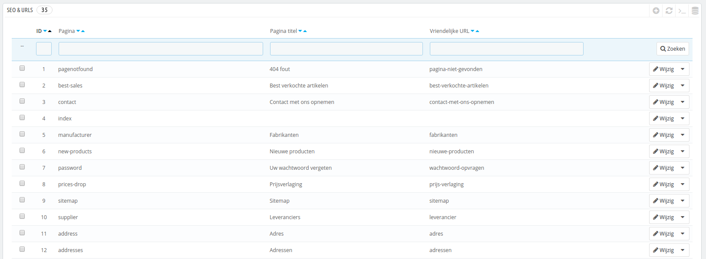
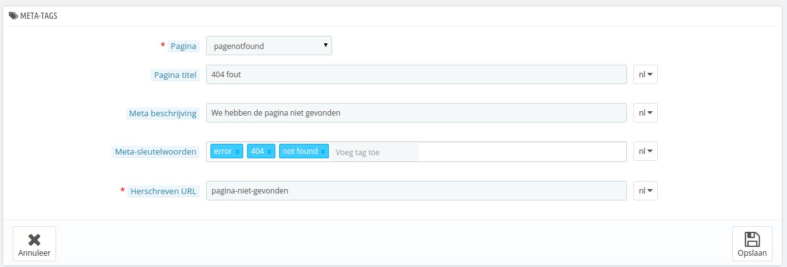
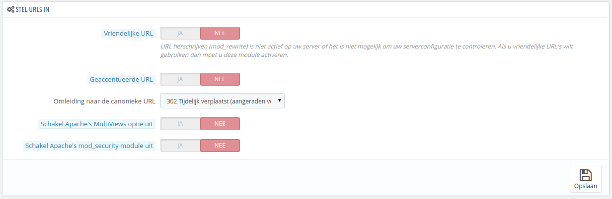
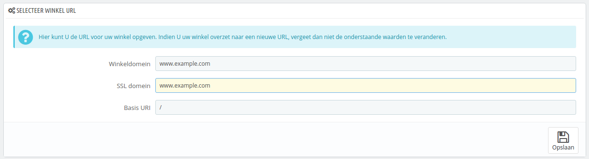
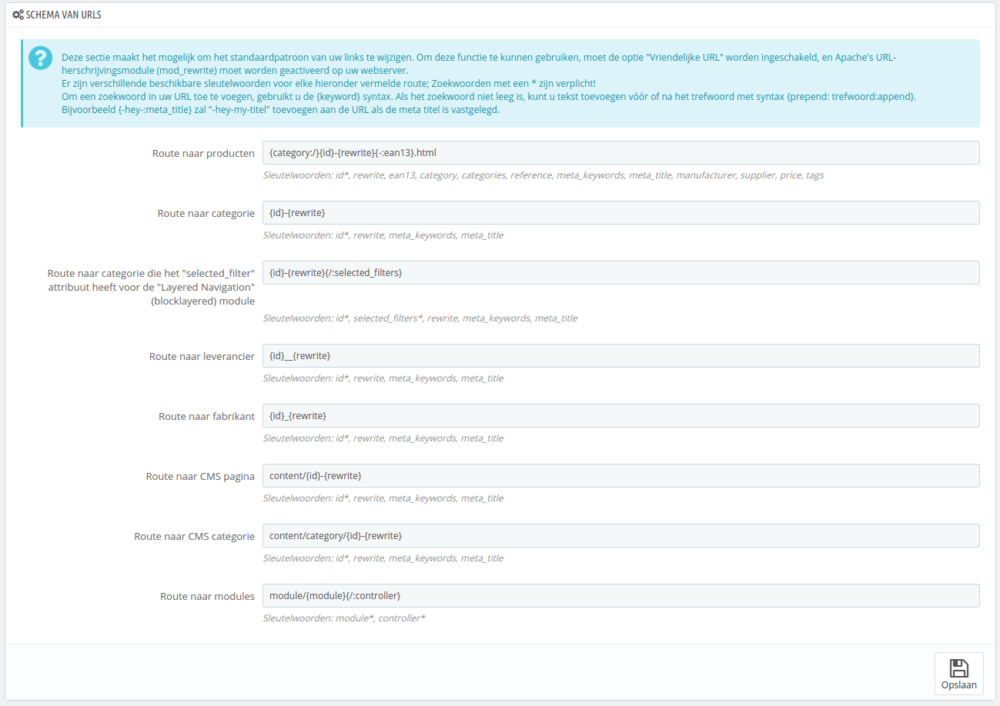
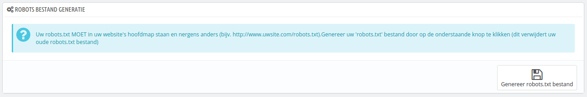

# SEO & URL's instellen

De tools op deze pagina helpen u bij de zichtbaarheid van uw PrestaShop-winkel vergroten op zoekmachines en daarmee kunt u meer klanten aantrekken.

SEO betekent "search engine optimization". Het omvat een aantal technieken en best practices, bedoeld om de zichtbaarheid van een website in zoekmachines te vergroten. U kunt hier meer over lezen op Wikipedia: [http://en.wikipedia.org/wiki/Search\_engine\_optimization](http://en.wikipedia.org/wiki/Search\_engine\_optimization).

URL staat voor "uniform resource locator" oftewel het adres van een webpagina. U kunt meer over een URL lezen op Wikipedia: [http://en.wikipedia.org/wiki/URL](http://en.wikipedia.org/wiki/URL)

Standaard zijn PrestaShop's diepe URL's (dat zijn de indivuele pagina's, niet slechts het domeinnaam) niet erg duidelijk voor zowel de gebruiker als de zoekmachines: met een URL zoals [http://www.myprestashop.com/product.php?id\_product=27](http://www.myprestashop.com/product.php?id\_product=27) kan een gebruiker niet weten om welk product het gaat op die pagina. Vriendelijke URL's zijn de manier om het wel duidelijk te maken en bijvoorbeeld het volgende te tonen: [http://www.myprestashop.com/2-music-players/27-ipod-nano-green](http://www.myprestashop.com/2-music-players/27-ipod-nano-green).

Zoals je kunt zien in het tweede voorbeeld hierboven, kunnen zowel categorieën en producten een vriendelijke URL hebben: in het voorbeeld hierboven is `id_category=2`, `2-music-players` geworden en `id_product` werd `27-ipod-nano-green`. Terwijl het ID-nummer standaard niet verwijderd kan worden, kunnen de woorden gegenereerd worden aan de hand van de categorie-/productnaam of met de hand worden aangepast. Dit wordt gedaan vanuit de configuratiepagina van het product of de categorie (in het menu "Catalogus"): de "Vriendelijke URL" kan gelijk gevonden worden op de hoofdconfiguratiepagina van een categorie en op het tabblad "SEO" van de configuratiepagina van een product.

Er zijn andere individuele pagina's in uw PrestaShop-installatie die voordeel hebben bij Vriendelijke URL's: CMS-pagina, gebruikersaccountpagina's, pagina's met automatisch gegenereerde content... De pagina "SEO en URLs" geeft u een lijst met deze pagina's en maakt het mogelijk om de bijbehorende vriendelijke URL's maar ook hun meta-tags aan te passen (titel, beschrijving, sleutelwoord).

Vriendelijke URL's werken alleen met een serverconfiguratie die URL rewriting ondersteunt (bijvoorbeeld met Apache's `mod_rewrite` feature). Zorg ervoor dat u gecontroleerd hebt dat uw server dit ondersteunt (vraag uw hostingprovider ernaar!), want het kan uw winkel onbereikbaar maken als u de Vriendelijke URL's inschakelt, maar uw server het niet ondersteunt!

Homepage SEO settings

Om de meta-tags van de homepage aan te passen, opent u simpelweg de pagina "SEO & URLs", opent u de instellingen van "index" en daar kunt u de SEO-informatie van de homepage configureren.

Een aantal tips:

* De standaardtitel van de homepage is de naam van de winkel en daarom is het titelveld van "index" leeg. Als u hier iets invult, dan verandert de titel van de homepage in "\<uw tekst> – \<de naam van de winkel>".\
  De naam van de winkel zelf wordt ingesteld tijdens de installatie van PrestaShop en kan veranderd worden op de configuratiepagina "Winkelcontacten", door gebruik te maken van de optie "Winkelnaam" in de sectie "Contactgegevens".
* Houd uw beschrijving kort: een enkele paragraaf is genoeg.
* Om een sleutelwoord toe te voegen, klikt u op het veld "Voeg tag toe" en bevestigt u dit door op "Enter" te drukken. U kunt tags verwijderen met het kruisje.
* U hoeft een herschreven URL niet handmatig toe te voegen als die er nog niet is.

Let er op dat als uw winkel al is geïndexeerd door Google of een andere zoekmachine, het even kan duren voordat wijzigingen zichtbaar zijn. Geduld is hierbij belangrijk.

Aan de onderkant van de pagina "SEO & URLs" zijn drie secties met extra opties: Stel URLs in, Selecteer winkel URL en Robots bestand generatie. Zie hieronder voor meer uitleg over deze secties.

## Een nieuwe vriendelijke URL toevoegen 

Vriendelijke URL's kunnen worden ingesteld op de configuratiepagina van elk product, categorie, CMS-pagina... Dit aanmaakformulier is alleen nuttig voor sommige automatische pagina's en meestal hoeft u zich hier niet druk om te maken.

Zorg ervoor dat u de velden invult voor de beschikbare talen in uw winkel: niet alleen is het onwijs handig voor lokale gebruikers ook sommige zoekmachines maken gebruik van deze informatie.

Klik op de knop "Nieuwe pagina toevoegen" om het aanmaakformulier voor Vriendelijke URL's te bereiken. Het heeft een handvol velden:

* **Pagina**. De dropdown-lijst geeft u alle pagina's die baat hebben bij een vriendelijke URL.
* **Pagina titel**. De titel die verschijnt in zoekmachines.
* **Meta beschrijving**. Een korte beschrijving van de pagina in een aantal woorden, bedoeld om de interesse van een klant te wekken. Het verschijnt in zoekresultaten.
* **Meta-sleutelwoorden**. Sleutelwoorden die u moet opgeven om ervoor te zorgen dat zoekmachines uw webwinkel beter kunnen indexeren. U kunt tags bestaande uit enkele woorden invoeren: type de woorden, druk op "Enter" en zie hoe de woorden worden samengevoegd in een tag, dat met een kruisje weer verwijderd kan worden.
* **Herschreven URL**. Dit is waar u de vriendelijke URL instelt. Houd het kort en krachtig, gebruik alleen letters en cijfers en vervang spaties (" ") door streepjes ("-").

## URL's instellen 

De hoofdopties voor vriendelijke URL's:

*   **Vriendelijke URL**. Wijzig deze optie **als u weet dat uw server** URL rewriting ondersteunt. Als dat niet het geval is laat u deze optie op "Nee" staan.

    U kunt een bericht te zien krijgen zoals "_URL herschrijven (mod\_rewrite) is niet actief op uw server of het is niet mogelijk om uw serverconfiguratie te controleren. Als u vriendelijke URL's wilt gebruiken dan moet u deze module activeren."._ In dit geval kan PrestaShop uw instellingen niet detecteren, maar dat betekent niet dat deze optie niet werkt. U moet het zelf testen. Meestal verschijnt deze melding onterecht als u nginx of een andere webserver gebruikt.
* **Geaccentueerde URL**. PrestaShop kan nu URL's genereren met speciale karakters, voor producten met niet-ASCII-namen. U kunt de optie hier uitschakelen.
* **Omleiding naar de canonieke URL**. Een gegeven PrestaShop-pagina kan meerdere URL's hebben, meestal als er parameters zijn om rekening mee te houden [`http://example.com/product.php?id=5&option1`](http://example.com/product.php?id=5\&option1) en [`http://example.com/product.php?id=5&option2`](http://example.com/product.php?id=5\&option2) wijzen naar hetzelfde product, met slechts één verschil. Omdat u wilt dat een product een enkele URL heeft en niet veel verschillende, zou u deze optie moeten inschakelen.\
  Canonieke URL's zijn een manier om dubbele content te voorkomen – wat uw rangschikking in de zoekmachines ernstig kan beschadigen, omdat dit wordt gezien als spam. Om te voorkomen dat zoekmachines denken dat u de index spamt, gebruikt PrestaShop standaard het `rel="canonical"` attribuut om aan te geven welke de basis-URL is voor de gegeven pagina.
* Hoewel het ten zeerste wordt aangeraden om deze optie in te schakelen, is het ook afhankelijke van uw thema of de `<link>` header tag wel juist doorkomt. Vraag uw designer om meer informatie.\
  Er zijn drie opties:
  * **Geen omleiding**. Mogelijk krijgt u dubbele URL.
  * **301 Permanent verplaatst**. Geeft de HTTP 301 status code, verwijzend naar de hoofd-URL en geeft het signaal aan zoekmachines dat dit de enige URL is om te gebruiken.
  * **302 Tijdelijk Verplaatst**. Geeft de HTTP 302 status code, verwijzend naar de hoofd-URL en geeft het signaal aan zoekmachines dat deze URL later mogelijk kan wijzigen.
* **Schakel Apache's MultiViews optie uit**. Apache is de meest populaire webserver, en de kans is het grootst dat u deze gebruikt om uw website te hosten (hoewel u dit zelf moet controleren). Multiviews zijn een content negotiation system: als dit is ingeschakeld, dan probeert de webserver een pagina te bieden die het beste past bij de taal van de gebruiker, onder dezelfde URL. Dit levert helaas problemen op met PrestasShop Vriendelijke URL-optie. Als dit het geval is, dan kunt u beter multiviews uitschakelen met deze optie.
* **Schakel Apache's mod\_security module uit**. `mod_security` is een module van de Apache webserver, die zich voordoet als een firewall en uw server beschermt tegen indringers. Het kan enkele noodzakelijke functies blokkeren of fouten veroorzaken in sommige configuraties. In zulke gevallen moet u de optie hier uitschakelen.

In vorige versies van PrestaShop moest u zelf handmatig een nieuw `.htaccess` bestand aanmaken, nadat u Vriendelijke URL's had ingeschakeld. Dit is niet langer het geval sinds versie 1.5: de `.htaccess` wordt nu stilletjes beheerd door PrestaShop, en u hoeft zich er niet druk om te maken.

## Selecteer Winkel URL 

In deze sectie kunt u enkele standaard-serverinstellingen bekijken en wijzigen:

* **Winkeldomein**. Het hoofddomein of -IP van uw winkel:
* **SSL domein**. Uw winkel's beveiligde domeinnaam (`https://`) of IP-adres:
* **Basis URI**. De map waar u PrestaShop hebt geïnstalleerd. Als het zich in de root van het domein bevindt, gebruikt u "/".

In de meeste gevallen hoeft u deze velden niet aan te passen. Wees er zeker van dat u weet waar u mee bezig bent. Eén vergissing kan uw winkel stukmaken.

## Schema van URLs 

**Nieuw in 1.6**.

U kunt de manier waarop vriendelijke URL's worden gegenereerd wijzigen, door de route naar een pagina in uw winkel te wijzigen.

Bijvoorbeeld, de standaardroute om een productpagina te tonen is `{category:/}{id}-{rewrite}{-:ean13}.html`, wat resulteert in `/summer-dresses/7-printed-chiffon-dress.html`

U kunt deze route wijzigen in `{manufacturer:/}{id}-{rewrite:/}` om `/fashion-manufacturer//7-printed-chiffon-dress/` te krijgen.

8 velden zijn standaard beschikbaar en elk veld bevat zijn eigen sleutelwoorden. Sommige sleutelwoorden zijn vereist, anderen zijn weer optioneel en aangegeven met een `*`.

Zodra u de velden hebt bijgewerkt, vergeet dan niet de wijzigingen op te slaan en vervolgens op de knop "Opslaan" te klikken in de sectie "Schema van URLs" om uw `.htaccess` opnieuw te generen, iets dat nodig is voor uw vriendelijke URL's.

## Robots bestand generatie 

Een `robots.txt` zorgt ervoor dat bots, die door het web crawlen, specifieke bestanden en mappen op uw server vermijden. Van sommige bots hebt u liever dat ze de gehele website indexeren, zoals Google of Yahoo, maar andere liever weer niet, zoals spambots, content thiefs, e-mail collectors enzovoort. De allerergste bots zullen deze regels niet respecteren en gaan ondanks alles toch door met crawlen. Dit bestand dient daarom slechts als richtlijn.

PrestaShop's `robots.txt` generatie tool maakt simpelweg een bestand met uitgesloten mappen en bestanden die niet publiek horen zijn en niet geïndexeerd mogen worden. Deze richtlijnen gelden voor alle bots: het gegenereerde bestand gebruikt de string "User-agent: \*".

Door te kliken op de knop "Genereer robots.txt bestand" wordt de huidige `robots.txt` vervangen met een nieuwe. Daarom, als u uw eigen regels wilt toepassen, kunt u dit beter doen, nadat PrestaShop het bestand heeft gegenereerd.

