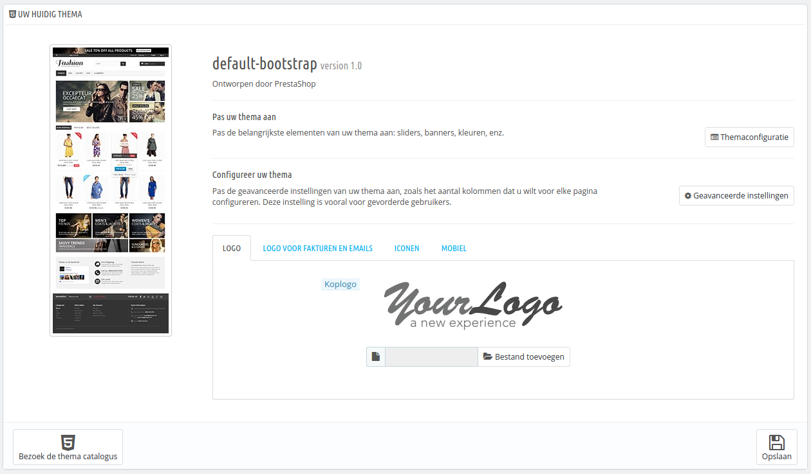
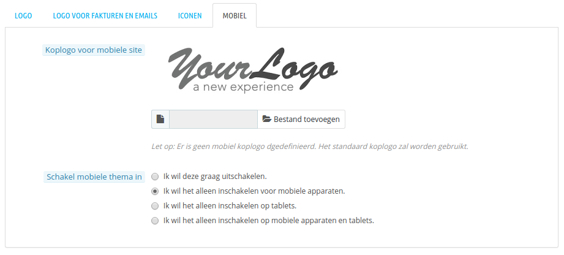
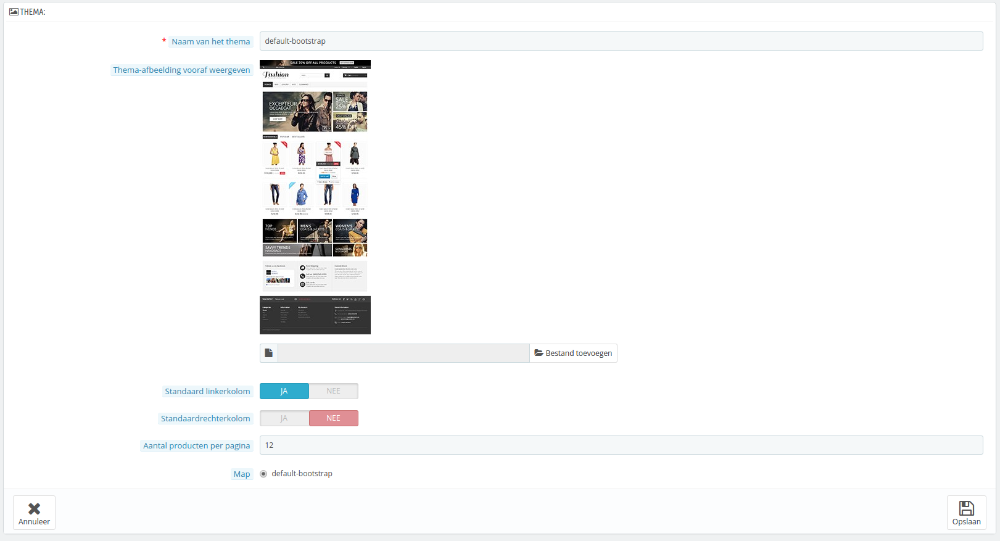
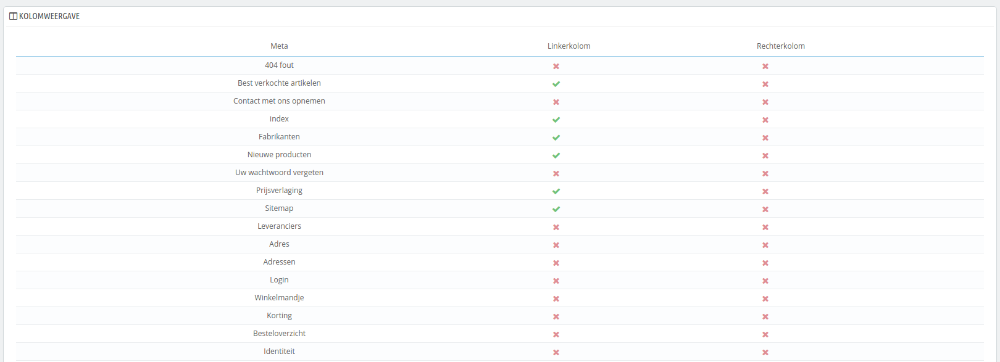
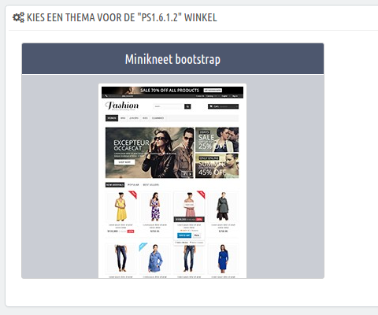
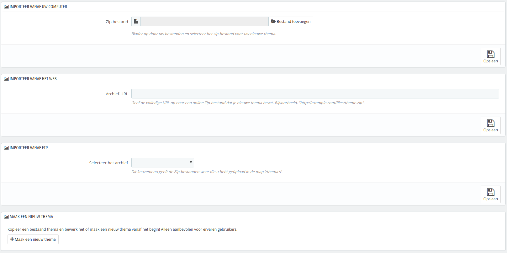
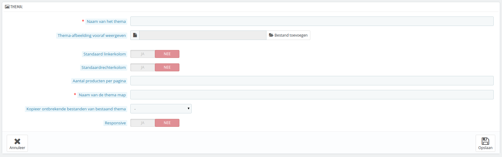
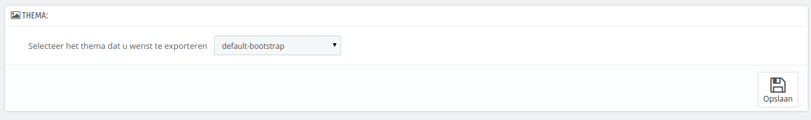
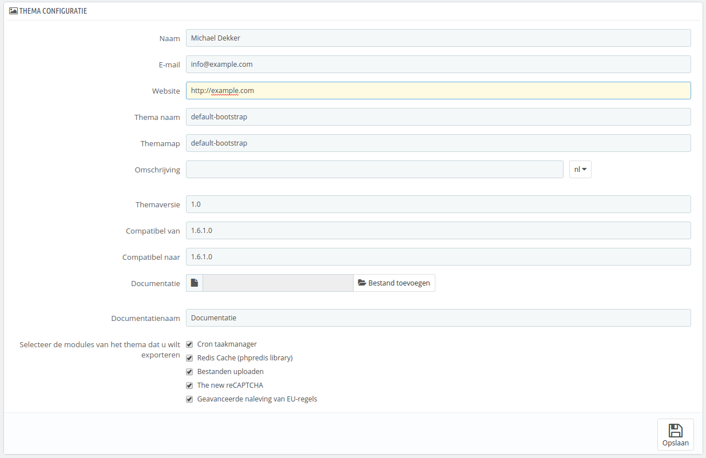
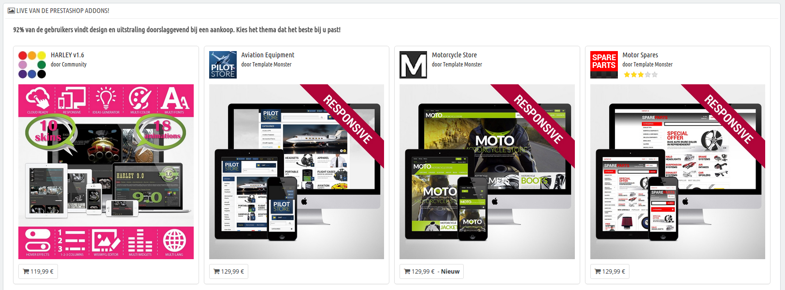

# Thema's instellen

/\*\<!\[CDATA\[\*/\
div.rbtoc1597237798213 {padding: 0px;}\
div.rbtoc1597237798213 ul {list-style: disc;margin-left: 0px;}\
div.rbtoc1597237798213 li {margin-left: 0px;padding-left: 0px;}\
\
/\*]]>\*/

* [Thema's instellen](themas-instellen.md#Thema%27sinstellen-Thema%27sinstellen)
  * [Uw huidige thema](themas-instellen.md#Thema%27sinstellen-Uwhuidigethema)
    * [Themaconfiguratie](themas-instellen.md#Thema%27sinstellen-Themaconfiguratie)
    * [De geavanceerde instellingen van het thema](themas-instellen.md#Thema%27sinstellen-Degeavanceerdeinstellingenvanhetthema)
  * [Een thema selecteren voor de "\[naam\]" winkel](themas-instellen.md#Thema%27sinstellen-Eenthemaselecterenvoorde%22\[naam]%22winkel)
  * [Een thema toevoegen en exporteren](themas-instellen.md#Thema%27sinstellen-Eenthematoevoegenenexporteren)
    * [Een thema importeren: de knop "Voeg thema toe"](themas-instellen.md#Thema%27sinstellen-Eenthemaimporteren:deknop%22Voegthematoe%22)
    * [Een gloednieuw thema aanmaken](themas-instellen.md#Thema%27sinstellen-Eengloednieuwthemaaanmaken)
    * [Een thema exporteren](themas-instellen.md#Thema%27sinstellen-Eenthemaexporteren)
  * [Live van de PrestaShop Addons!](themas-instellen.md#Thema%27sinstellen-LivevandePrestaShopAddons!)

De pagina "Thema's" zorgt ervoor dat u op een efficiënte wijze uw thema's kunt beheren.

## Uw huidige thema 

De eerste sectie van de pagina dient als herinnering, welk thema u momenteel gebruikt, met daarbij de informatie:

* Naam.
* Versie
* Auteur van het thema, website en e-mailadres.
* Miniatuurweergave.

Deze sectie biedt u ook een aantal tools, waarmee u snel het huidige thema kunt aanpassen: headerlogo, e-maillogo, factuurlogo, favicon, winkelicoon. Deze sectie bevat:

* **Uw thema aanpassen**. Een link naar de themaconfiguratie (wanneer de themaconfigurator is geïnstalleerd en ingeschakeld).
* **Uw thema configureren**. Een link naar de geavanceerde instellingen van het thema.
* 4 tabbladen met daarin instellingen voor het uiterlijk van het thema:
  * **Logo**. Het logo dat op alle pagina's van uw winkel verschijnt.
  * **Logo voor facturen en e-mails**. De logo's die verschijnen op uw facturen en in uw e-mails.
  * **Iconen**. De favicon van uw winkel (wordt getoond in de adresbalk van uw browser of naast de titel) en uw winkelicoon (deze wordt gebruikt in de winkelzoeker).
  * **Mobiel**. Het logo dat op alle pagina's van uw winkel verschijnt, als deze met een mobiel apparaat wordt bezocht. U kunt er ook voor kiezen om mobiele thema's helemaal uit te schakelen. In dat geval is deze optie niet meer nodig.

Het standaardthema gebruikt een logo met de tekst "YourLogo". Dit is bedoeld om u te herinneren om uw logo te veranderen!

In multistore-modus kunt u deze instellingen toepassen op al uw winkels of een selectie van winkels, door gebruik te maken van het multistore-menu.

De optie "Schakel mobiele thema in" maakt het mogelijk voor u om het standaard mobiele thema te gebruiken. Met dit thema kan elke PrestaShop-winkelier ervoor zorgen dat zijn of haar site goed is te bekijken op mobiele apparaten: van de homepage tot aan het betaalproces, samen met de productpagina's en de gehele conversietrechter.

Het mobiele thema werkt alleen met het standaardthema van PrestaShop 1.5, omdat deze is toegevoegd aan de map: `/themes/default/mobile`. Het werkt niet als u een ander thema gebruikt, dat geen mobiel thema bevat.

Desondanks kunt u alsnog gebruikmaken van het mobiele thema, al dan niet tijdelijk: kopieer simpelweg de map van het mobiele thema van PrestaShop 1.5 naar de map van het nieuwe thema en het is klaar voor gebruik (werkt niet altijd met PrestaShop 1.6; de compatibiliteit wordt op dit moment onderzocht, red.). Als de map van het nieuwe thema bijvoorbeeld `/themes/magnolia` is, dan kopieert u de map `/themes/default/mobile` (alleen PrestaShop 1.5) naar de map van het nieuwe thema: `/themes/magnolia/mobile`.\
Dit is in het bijzonder handig als het nieuwe thema geen responsive design heeft: op deze manier kunt u ervoor zorgen dat uw winkel er alsnog goed uitziet op mobiele apparaten – ook al is het de standaard PrestaShop-look.

Deze optie dient niet ingeschakeld te worden als u een responsive thema gebruikt, dat zich kan aanpassen aan alle schermbreedtes. Door het mobiele thema in te schakelen toont u een alternatief thema op mobiele apparaten.

### Themaconfiguratie 

De module "Themaconfiguratie" maakt het mogelijk om enkele aspecten van uw thema aan te passen.

Door te klikken op de link vanaf de pagina "Thema's" kunt u de configuratiepagina van de module openen. Deze pagina geeft u directe verwijzingen naar de meest gebruikte frontoffice-modules: u kunt features in- en uitschakelen, zoals het tonen van sociale knoppen of het Facebook-blok (hierbij ervan uitgaande dat de bijbehorende modules zijn geïnstalleerd), en direct toegang verkrijgen tot hun configuratiepagina. U kunt ook de Live Configurator inschakelen en gebruiken vanaf deze pagina, welke het mogelijk maakt om gemakkelijk de hoofdkleuren en -lettertype van uw thema aan te passen.

In een tweede gedeelte, maakt de Themaconfigurator het mogelijk om gemakkelijk afbeeldingen toe te voegen met links op specifieke haken van de voorpagina: home, top, left, right, footer. Elke beschikbare taal heeft haar eigen tabblad met haar eigen beschikbare haken die u op deze pagina kunt bewerken: dit is noodzakelijk, omdat er vaak tekst voorkomt in een afbeelding, waardoor er zoveel mogelijk versies beschikbaar moeten zijn voor de beschikbare talen.

De module wordt in meer detail uitgelegd in hoofdstuk [Vooraf geïnstalleerde modules gebruiken](../vooraf-geinstalleerde-modules-gebruiken/).

### De geavanceerde instellingen van het thema 

Door te klikken op de knop "Geavanceerde instellingen" wordt de hoofdinformatie over het thema getoond (bekijk de sectie [Een gloednieuw thema aanmaken](themas-instellen.md#Thema%27sinstellen-Eengloednieuwthemaaanmaken) hieronder om uitleg te vinden over de verschillende formuliervelden).

Onder de hoofdsectie toont de sectie "Kolomweergave" veel informatie over de manier waarop de linker- en rechterkolom verschijnen, afhankelijk van de pagina:

* Als de optie is aangevinkt, verschijnt de kolom op de desbetreffende pagina (bijvoorbeeld de categoriepagina).
* Als het niet is aangevinkt, dan verschijnt de kolom niet op de pagina.

Let erop dat deze instellingen niet bindend zijn en dat uw thema deze instellingen niet hoeft te respecteren, waardoor het mogelijk is dat een kolom toch niet verschijnt of juist wel!

## Een thema selecteren voor de "\[naam]" winkel 

Deze sectie wordt alleen getoond als u minstens twee thema's hebt geïnstalleerd. Het toont de andere beschikbare thema's voor uw PrestaShop-installatie, naast het thema dat al is geactiveerd.

Deze sectie toont simpelweg de miniaturen van de beschikbare thema's, met hun naam.

Beweeg uw muiscursor over de miniatuurweergave om een menu te tonen met twee opties:

* **Gebruik dit thema**. Dit vervangt uw huidige thema met dit thema.
* **Verwijder dit thema**. Dit verwijdert de themabestanden van uw webserver.

Aan de onderkant rechts, opent de knop "Bekijk alle thema's" een nieuwe pagina naar de PrestaShop Addons-winkel, waar u nog meer thema's kunt vinden.

In multistore-modus kunt u een thema niet gelijk toepassen voor al uw winkels; u moet een enkele winkel selecteren in het multistore-menu en daarna een thema toewijzen.

## Een thema toevoegen en exporteren 

Twee knoppen aan de bovenkant van het scherm maken het mogelijk om een thema te importeren en te installeren (inclusief bijbehorende modules), of om een thema te exporteren en de bijbehorende modules van uw winkel om het te delen met de rest van de wereld.

### Een thema importeren: de knop "Voeg thema toe" 

Dit scherm toont drie methoden om een nieuw thema te installeren:

* vanaf uw computer,
* vanaf een publieke website,
* vanaf uw eigen FTP-server.

De laatste knop leidt u naar het formulier waar u een thema kunt aanmaken, zoals aangegeven in de volgende sectie.

Welke methode u ook gebruikt, het proces blijft hetzelfde: geef de locatie aan van het zip-archief van het thema en klik vervolgens op "Opslaan". Het enige dat verschilt is de bron van het zip-bestand:

* **Importeert vanaf uw computer**. Gebruik de bestandsverkenner om het archief te vinden.
* **Importeer vanaf het web**. Geef de directe publieke URL naar het archief op.
* **Importeert vanaf FTP**. Door gebruik te maken van uw FTP-client, uploadt u het archief naar de volgende map: `/themes/` .

Klik op "Opslaan" om uw keuze te bevestigen. Het thema is nu geïnstalleerd en PrestaShop vraagt of u wenst om modules te installeren di zijn geïmporteerd bij het thema; wat u liever doet met de huidige module-configuraties en hoe u wilt dat er rekening wordt gehouden met de afbeeldingsconfiguratie.

Klik nogmaals op "Opslaan". Een bevestigingspagina toont u alle wijzigingen die zijn toegepast op uw PrestaShop-installatie. Klik op "Bevestigen" om het proces te voltooien.

### Een gloednieuw thema aanmaken 

De beste manier om een nieuw thema aan te maken voor PrestaShop is om de bestanden van het standaardthema te kopiëren en de TPL- en CSS-bestanden aan te passen naar uw wensen. De reden hiervoor is dat een PrestaShop-thema veel bestanden nodig heeft die allemaal aanwezig moeten zijn: door te starten vanaf een bestaand thema in plaats van helemaal opnieuw te beginnen, zorgt u er gemakkelijker voor dat uw thema geen belangrijke onderdelen.

U kunt dit direct op de webserver doen, maar PrestaShop maakt het gemakkelijk om de bestanden te kopiëren vanaf een geïnstalleerd thema en het nieuwe thema te registeren in het systeem (in elk geval een onvermijdelijke stap).

Dit wordt gedaan met de knop "Maak een nieuw thema" bij het formulier dat verschijnt met de knop "Voeg thema toe" aan de bovenkant. Het toont vervolgens een aanmaakformulier.

Vul de velden in:

* **Naam van het thema**. Zorg ervoor dat de naam niet al in gebruik is door een ander thema (controleer dit op de Addons-website).
* **Thema-afbeelding vooraf weergeven**. U zou altijd een preview-afbeelding moeten weergeven, omdat dit een gemakkelijke reminder is van het thema. Als u er nog geen hebt dan kunt u deze optie open houden voor later, wanneer het thema klaar is om te gebruiken.
* **Standaardlinkerkolom** en **Standaardrechterkolom**. Geef aan of uw thema een kolom heeft (of zelfs twee kolommen) en als dat het geval is aan welke kant van het scherm. Dit is volledig informatief bedoeld en kan op elk moment worden gewijzigd.
* **Aantal producten per pagina**. Het standaardaantal producten dat wordt getoond op een pagina. Deze optie kan later nog worden gewijzigd.
* **Naam van de thema map**. Probeer een naam te kiezen die zo dicht mogeljk tegen de originele naam van het thema zit. Als u nog geen themamap hebt aangemaakt, dan maakt PrestaShop er één voor u aan.
* **Kopieer ontbrekende bestanden van bestaand thema**. Dit is de schoonste methode om een nieuw thema aan te maken vanaf een bestaand thema. Kies "default-bootstrap" of elk ander thema die u wilt gebruiken als fundering.
* **Responsive**. Geef aan of uw winkel een responsive design heeft (als u niet weet wat een responsive design is, dan kunt u beter "Nee" kiezen). Dit is informatief bedoeld en kan op elk moment worden gewijzigd.

Klik op "Opslaan" en PrestaShop zal deze informatie voor u bewaren: het thema is klaar om te worden ingeschakeld en de miniatuurweergave verschijnt in het keuzemenu voor thema's.

Het is nu aan u om de themabestanden te wijzigen om het thema uniek te maken! Op uw lokale installatie (niet in uw productieomgeving!), selecteert u het nieuwe thema en kunt u beginnen met werken!\
Zodra u klaar bent met het ontwerpen en coderen ervan, gaat u terug naar deze pagina en verandert u de instellingen: definitieve miniatuurafbeeldingen, standaardkolommen, aantal producten en responsive.

Is uw thema zo goed dat andere winkeliers er geld voor over zouden hebben? U kunt het verkopen op Addons, PrestaShop's officiële thema- en modulemarktplaats: [http://addons.prestashop.com/](http://addons.prestashop.com/).

### Een thema exporteren 

Deze sectie is alleen beschikbaar als er minstens één thema is geïnstalleerd op uw PrestaShop-website. Het geeft u een methode om uw module te exporteren in het juiste formaat (waarvan het belangrijkste het configuratiebestand dat gegenereerd wordt).

Het exporteren van een thema is zeer nuttig als u een reservekopie wilt maken voor de zekerheid of een archief wilt maken voor een vriend of om het beschikbaar te stellen in de Addons-marktplaats ([http://addons.prestashop.com/](http://addons.prestashop.com/)). Niet alleen genereert het een compleet zip-archief van uw thema, maar ook voegt het informatie toe aan XML-bestanden die erg handig zijn wanneer u uw thema uploadt naar Addons en als u het thema importeert in een andere PrestaShop-winkel.

Selecteer een thema en klik op "Opslaan". Een configuratieformulier verschijnt waar u de instellingen van het geëxporteerde thema kunt wijzigen: auteursnaam, modules om te exporteren, themanaam, compatibiliteit, etc.

Zodra alle instellingen juist zijn ingesteld, klikt u op "Opslaan". U ontvangt gelijk een bestand om te downloaden met uw browser. Bewaar het op uw harde schijf en geef het bestand daarna een goede naam om de willekeurig naam die het nu heeft te vervangen. Vanaf hier kunt u dit thema gemakkelijk delen en als het uw eigen creatie is, kunt u het verkopen op PrestaShop Addons: [http://addons.prestashop.com/](http://addons.prestashop.com/).

## Live van de PrestaShop Addons! 

Deze onderste sectie toont u de twaalf meest recente thema's die beschikbaar zijn op PrestaShop Addons. U kunt op elke afbeelding klikken om de Addons-pagina te bekijken van het thema en zo meer informatie te verschijnen, en eventueel kopen.

U kunt ook het zoekformulier gebruiken om het beste thema te vinden voor uw winkel.

