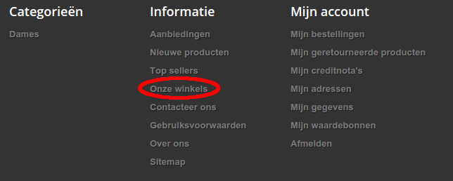
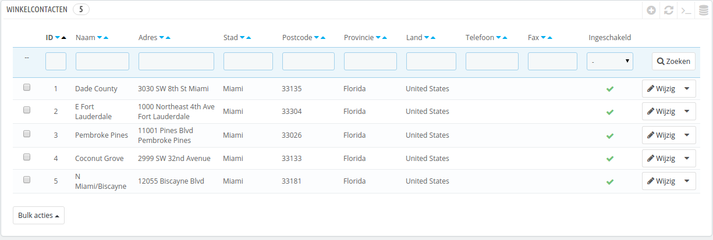
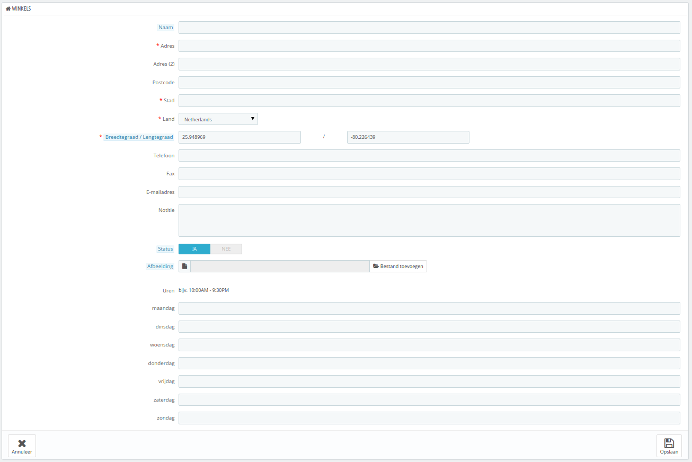
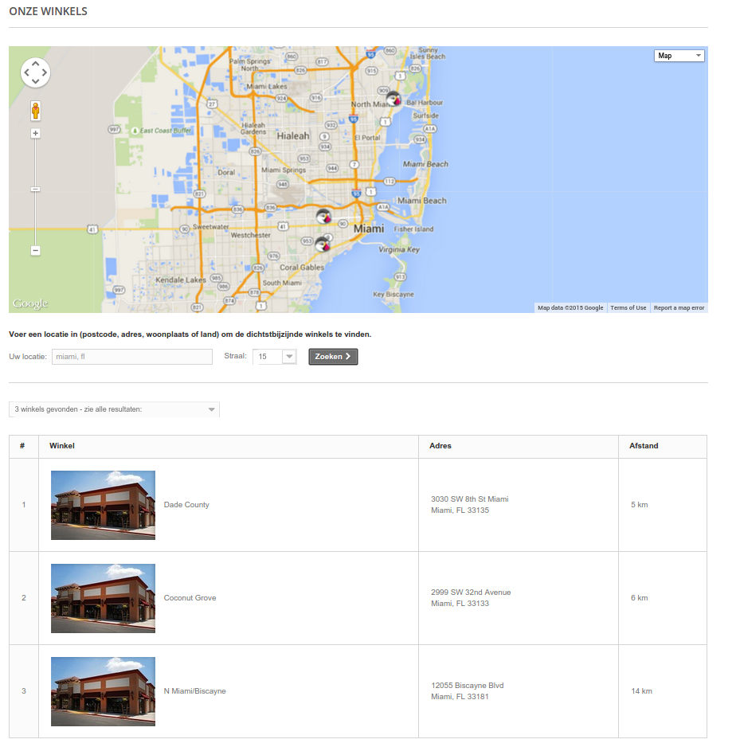
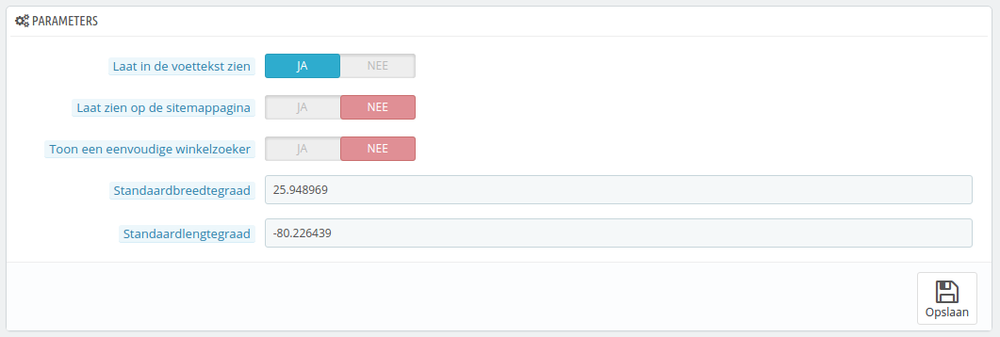

# Winkelcontacten beheren

PrestaShop biedt het juiste gereedschap voor klanten om uw fysieke winkel te vinden, met uitgebreide contactinformatie.

Klanten kunnen de winkelzoeker bereiken via de frontoffice.

Deze functie is alleen nuttig wanneer u fysieke winkels hebt, waar klanten producten kunnen kopen.

U kunt deze feature niet uitschakelen, maar er wel voor zorgen dat klanten deze niet kunnen bereiken:

* Verwijder alle winkels zoals te vinden zijn in de lijst op de configuratiepagina "Winkelcontacten". Het winkelblok wordt niet meer op de voorpagina getoond.
* Ga naar de pagina "Modules en Services " onder het menu "Modules en Services". Zoek naar de module "Winkelblok" en schakel deze vervolgens uit.
* Verwijder de link in de footer: op de pagina "Winkelcontacten" kiest u voor "Nee" bij de optie "Laat in de voettekst zien".

Als u winkels in uw database hebt, maar u wilt niet dat het winkelblok getoond wordt op de database, dan doet u het volgende:

1. Ga naar de pagina "Posities" onder het menu "Modules en Services".
2. Zoek naar de sectie "displayLeftcolumn" en verwijder het item "Winkelblok" uit de lijst, door te klikken op het prullenbak-icoontje of het item te selecteren en de knop "Selectie ontkoppelen" aan de onderkant van de pagina te gebruiken.
3. Herlaad de voorpagina: de module "Winkelblok" zou niet meer zichtbaar moeten zijn. Als deze nog steeds wordt getoond, dan kan dit veroorzaakt worden door de cache. Ga naar de pagina "Prestaties" onder het menu "Geavanceerde instellingen" en leeg de cache. Zodra dit is gedaan herlaadt u de voorpagina.

U kunt het blok weer terugzetten in de linkerkolom op de configuratiepagina "Posities":

1. Klik op de knop "Positioneer een module" aan de rechterbovenkant van de pagina.
2. Kies de module "Winkelblok" uit de lijst.
3. Kies de haak "displayLeftColumn".
4. Bewaar de pagina. Herlaad de voorpagina; het winkelblok zou weer zichtbaar moeten zijn in de linkerkolom.

## Winkellijst 

U kunt kiezen hoe deze winkels worden getoond op de frontoffice. De klant kan de winkels zien door te klikken op de link met de naam "Onzes winkels" (afhankelijk van het thema).

Al uw winkels worden getoond in een handige lijst, waarmee de informatie van elke winkel wordt getoond alsook een indicator die verteld of een winkel momenteel al dan niet actief is – u wilt wellicht de informatie van een nieuwe winkel alvast invoeren voordat u de pagina lanceert.

### Een nieuwe fysieke winkel toevoegen 

Zoals gebruikelijk klikt u op de knop "Nieuwe winkel toevoegen" aan de rechterbovenkant van de pagina om het aanmaakformulier te openen.

Vul zoveel velden in als nodig is, omdat deze worden getoond op een kaart.

Een erg belangrijk veld is het veld met de naam "Breedtegraad / Lengtegraad", omdat deze gebruikt gaat worden door PrestaShop om de locatie van uw winkel op de kaart te tonen. U kunt de online tool van Steve Morse gebruiken om de lat/long coördinaten van een gegeven adres te vinden: [http://stevemorse.org/jcal/latlon.php](http://stevemorse.org/jcal/latlon.php).

Zorg ervoor dat u een afbeelding van de winkel toevoegt, omdat klanten hiermee uw winkel in de straat kunnen herkennen.

Als laatste zijn de openingstijden een belangrijk onderdeel van uw fysieke winkel, deze moeten overeenkomen met de openingstijden van uw fysieke winkel.

## Parameters 

* **Laat in de voettekst zien**. Standaard toont PrestaShop een link naar de winkelzoeker, getiteld "Onze winkels", in de voettekst van uw winkel. In het standaardthema verschijnt deze in het informatieblok, naast de links naar categoriën. U kunt ervoor kiezen om de link daar niet te tonen.
* **Laat zien op de sitemappagina**. U kunt ervoor kiezen om de link "Onze winkels" te tonen in de sitemap. De sitemappagina toont alle links in uw winkel (niet te verwarren met het sitemap-bestand voor Google, deze is voor SEO-doeleinden).
* **Toon een eenvoudige winkelzoeker**. De winkelzoeker wordt weergegeven als een interactieve kaart met een zoekveld. U kunt ervoor kiezen om de interface nog eenvoudiger te maken door alleen een lijst met winkels te tonen.
* **Standaardbreedtegraad en Standaardlengtegraad**. De standaardpositie van uw winkel. Erg nuttig als u veel winkels bij elkaar hebt en de kaart graag wilt centreren op een centraal gebied.

## Winkelcontacten 

Deze sectie maakt het mogelijk om de hoofddetails van uw bedrijf in te voeren, in plaats van een enkele locatie. U moet alle velden invullende met de gegevens van uw hoofdkantoor, want dit is uw correspondentieadres voor klanten.

Deze velden moeten ingevuld worden:

* **Winkel naam**. De naam van uw winkel. Houd deze kort, want het wordt gebruikt in alle correspondentie.
* **Winkel e-mail**. Het officiële contactadres van uw bedrijf. Gebruik het algemene e-mailadres dat klanten te zien krijgen als ze een e-mail ontvangen van uw winkel.
* **Registratienummer**. Geef het registratienummer aan van uw bedrijf (Duns-nummer in de VS, SIRET-nummer in Frankrijk, KvK-nummer in Nederland, ondernemingsnummer in België). Dit geeft aan dat u een geregistreerd bedrijf bent en hiermee meer vertrouwen kunt wekken.
* **Winkel adresregel 1 / Winkel adresregel 2 / Postcode / Stad / Land**. Gebruik het officiële contactadres van uw bedrijf. De optie "Staat" is alleen beschikbaar als het geselecteerde land staten heeft.
* **Telefoon**. Het officiële telefoonnummer van uw bedrijf. Als u liever niet hebt dat klanten bellen, dan laat u dit veld leeg.
* **Fax**. Het officiële faxnummer van uw bedrijf.

Vermijdt de dubbele punt (":") in de naam van uw winkel, want dit zorgt voor fouten bij het versturen van e-mails.

U kunt de dubbele punt vervangen door een streepje als u graag twee secties hebt in de titel. Gebruik bijvoorbeeld "MijnWinkel - De beste plek om elektronica te kopen" in plaats van "MijnWinkel: De beste plek om elektronica te kopen".
