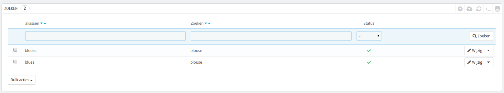
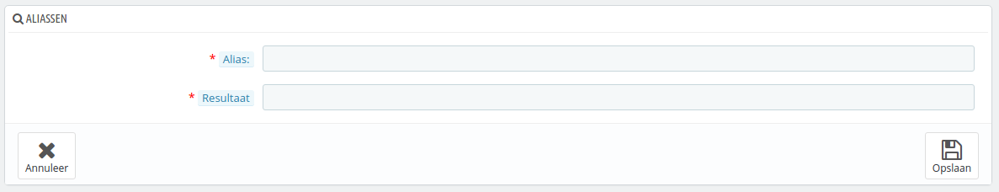
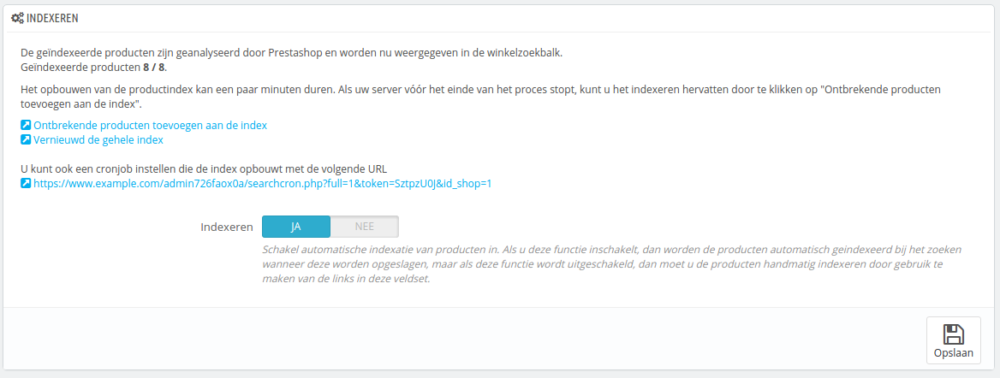
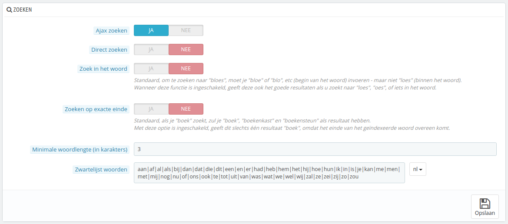
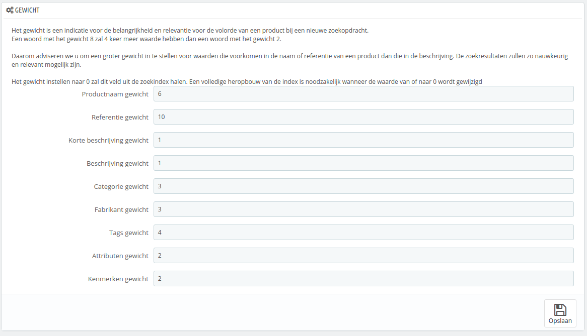

# Zoekinstellingen

De configuratiepagina "Zoeken" maakt het mogelijk om de zoekinstellingen van uw winkel te wijzigen.

## Lijst met aliassen 

Zodra klanten de interne zoekmachine van uw winkel gebruiken kunnen ze spelfouten maken. Als PrestaShop niet de juiste resultaten toont, kan de "alias"-functie gebruikt worden om dit op te lossen. U kunt woorden met spelfouten corrigeren en ze doorverwijzen naar de juiste producten.

Om een nieuwe handige alias toe te voegen moet u eerst de spelfouten vinden:

1. Bezoek het tabblad "Zoekopdrachten" op de pagina "Statistieken" onder het menu "Statistieken". U kunt de woorden zien die door uw klanten zijn ingevoerd. Hierbij zijn de termen zichtbaar met de meeste fouten.
2. Verzamel de belangrijkste termen om toe te voegen aan de lijst met aliassen om ze naar de juiste producten te laten verwijzen.
3. Klik op de knop "Nieuwe alias toevoegen" op de configuratiepagina "Zoeken".

Het aanmaakformulier is erg gemakkelijk: geef de typo aan die u wilt corrigeren en het juiste woord.

Voorbeeld: stel dat uw klanten vaak "player" typen als "palyer" en "plaier". U kunt een alias aanmaken voor beide typo's om deze door te verwijzen naar "player". Uw aliassen kunnen gebruikt worden zodra ze worden bewaard.

We nodigen u ook uit om de rest van deze gids te raadplegen met betrekking tot de meta tags van producten en categorieën om beter te begrijpen hoe u producten kunt weergeven op basis van de zoekwoorden van uw klanten. Bekijk de hoofdstukken [Producten beheren](../de-catalogus-beheren/producten-beheren.md) en [Categorieën beheren](../de-catalogus-beheren/categorieen-beheren.md) voor meer informatie.

## Indexeren 

Deze sectie biedt informatie over het aantal producten dat opgezocht kan worden door middel van de zoekfunctie in uw winkel en vergelijkt het met het aantal producten dat aanwezig is in uw database.\
Als de waarden niet overeenkomen, dan moet u op de knop "Ontbrekende producten toevoegen aan de index" klikken. Alleen nieuwe producten worden geïndexeerd.\
Als u enkele wijzigingen hebt toegebracht aan producten die al zijn toegevoegd aan de index, dan wilt u wellicht de gehele index opnieuw opbouwen. De knop "Vernieuwd de gehele index" heeft wellicht meer tijd nodig, maar is wel effectiever.

PrestaShop toont ook de URL waarmee u een crontaak aan kunt maken om regelmatig de index opnieuw op te bouwen. Als u geen verstand hebt van cron en crontab, dan kunt u terecht bij uw hostingprovider.

Als laatste biedt de optie "Indexeren" u de mogelijkheid om producten automatisch te laten indexeren als ze zijn aangemaakt of gewijzigd, waardoor bovenstaande methoden niet meer nodig zijn.

## Zoekopties 

Deze sectie maakt het mogelijk om het gedrag van de zoekfunctie van uw winkel aan te passen:

* **Ajax zoeken**. Door deze optie in te schakelen wordt er meteen een lijst met 10 resultaten getoond zodra klanten enkele letters hebben ingevoerd.
* **Direct zoeken**. Door dit in te schakelen worden de resultaten direct in de middelste kolom op uw website getoond. Deze instelling staat standaard uit, omdat gebruikers het niet gewend zijn dat er gelijk zoveel informatie op de pagina wijzigt (vergelijkbaar met Google Instant Zoeken).
* **Zoek in het woord**. Deze optie verbetert de zoekmethode door het mogelijk te maken om gedeeltelijke zoekopdrachten toe te staan; zo kan "lou" alsnog het resultaat "blouse" opleveren.
* **Minimale woordlengte (in karakters)**. U kunt de minimale lengte opgeven die een woord mag hebben. Deze functie maakt het mogelijk om korte worden te negeren, zoals lidwoorden.
* **Zwartelijst woorden**. U kunt ervoor zorgen dat termen op een zwarte lijst terechtkomen, waardoor ze niet meer gebruikt worden om mee te zoeken. U kunt ze scheiden met het "|" teken (geen kleine L).

## Gewicht 

PrestaShop maakt het mogelijk om een prioriteit te hangen aan data wanneer een zoekopdracht uitgevoerd wordt in uw winkel.

Zoals aangegeven in de sectie geeft het zoekgewicht van een product de belangrijkheid en relevantie weer voor de rangschikking van een product wanneer klanten zoeken. Een item met een gewicht van 8 zal 4 keer belangrijker zijn dan een item met een gewicht van 2.

Voorbeeld: het standaardgewicht voor de productnaam is 6, taggewicht staat op 4 en zowel beschrijvingsgewicht als korte beschrijvingsgewicht staan op 1. Dit betekent dat een product met "ipod" als naam hoger in de zoekresultaten verschijnt dan een product met slechts "ipod" in de tags.\
Op dezelfde manier heeft een product met slechts "ipod" in de beschrijving de laagste rangschikking in de zoekresultaten.

U hebt veel mogelijkheden om de gewichten te plaatsen: korte beschrijving, categorieën, tags, attributen, etc. U kunt de rangschikking omkeren door de gewichten te wijzigen.&#x20;

Zodra u de wijzigingen hebt bewaard, zijn ze meteen actief.
