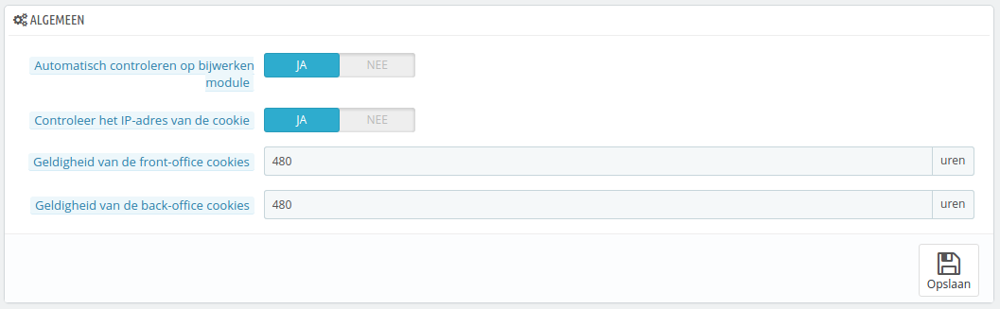
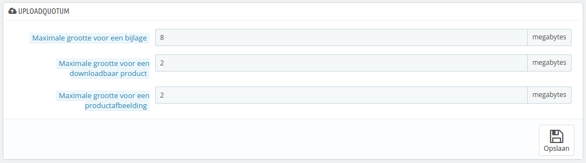
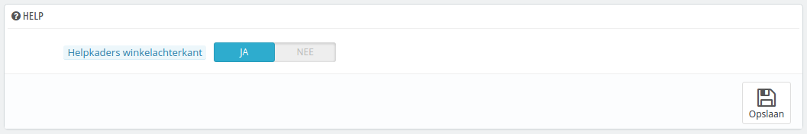
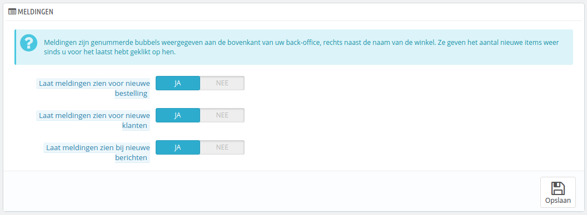

# Administratie instellen

De pagina "Instellingen" onder het menu "Administratie" bevat algemene opties en instellingen voor de werking van PrestaShop zelf. Het bevat vier secties:

## Algemeen 

Deze sectie bevat de algemenere instellingen:

* **Automatisch controleren op bijwerken module**. U kunt PrestaShop laten controleren of er updates zijn voor nieuwe versies van modules die u hebt verkregen via de Addons-website. Als dat het geval is dan toont de pagina "Modules en Services" een knop met de tekst "Bijwerken" naast de modules die bijgewerkt kunnen worden.
* **Controleer het IP-adres van de cookie**. Dit is een toegevoegde beveiligingsmaatregel: u kunt aangeven dat PrestaShop het IP-adres moet controleren bij de cookie die bewaard is in zijn of haar browser.
* **Geldigheid van de front-office cookies**. Standaard is een frontoffice cookie 480 uur geldid (20 dagen). U kunt dit getal verlagen als u denk dat dat nodig is.
* **Geldigheid van de back-office cookies**. Standaard is een backoffice cookie 480 uur geldig (20). U kunt dit getal verlagen als u denk dat dat nodig is.

## Uploadquotum 

Deze pagina helpt u bij het vastleggen welke groottes toe zijn gestaan voor bestanden die door uw eigen team worden geüpload – niet door klanten.

Er zijn drie opties, één daarvan is een algemeen en de andere zijn specifiekere opties:

* **Maximale grootte voor een bijlage**. De standaardwaarde is afgeleid van de serverinstellingen, maar u kunt deze instelling alsnog verlagen als u dat wilt.
* **Maximale grootte voor een downloadbaar product**. Als u virtuele producten verkoopt (services, boekingen en downloadbare producten), dan kunt u met deze instelling de bestandsgrootte, van de bestanden die uw team uploadt, limiteren – en dus de grootte van het product. Zorg ervoor dat deze waarde voldoende is, zodat uw team niet hoeft te wachten totdat u de waarde aanpast.
* **Maximale grootte voor een productafbeelding**. Op dezelfde manier kunt u de bestandsgrootte van een afbeelding limiteren voor uw team. Dit kan als handige reminder dienen voor uw team om bestanden zo klein mogelijk te houden, omdat het vaak geen nut heeft om afbeeldingen groter dan 600x600 te uploaden (ongeveer 200kB). Bekijk de configuratiepagina "Afbeeldingen" voor de exacte instellingen van afmetingen. Als extra voordeel kunt u zowel serverruimte als bandbreedte alsook rekenkracht besparen (omdat PrestaShop van alle afbeeldingen ook miniaturen maakt met andere afmetingen).

## Help 

_Deze optie is verwijderd in PrestaShop 1.6.0.11._

Om u te helpen bij het gebruik van PrestaShop, heeft het ontwikkelaarsteam veel tips toegevoegd aan de interface.

U kunt ze tonen in de backoffice met de volgende optie:

* **Helpkaders winkelachterkant**. Dit toont gele hulpboxen onder obscure velden.\
  \

## Meldingen 

Meldingen zijn genummerde labels die getoond worden aan de bovenkant van elke administratiepagina die u hebt geladen, vlak naast de naam van de winkel. Ze tonen het aantal nieuwe items sinds de laatste keer dat u een item hebt bezocht.

U kunt ervoor kiezen om geen notificaties te ontvangen voor sommige types:

* **Laat meldingen zien voor nieuwe klanten**. Door te klikken op de notificatie klapt er een venster uit met daarin nieuwe klanten die zich hebben geregistreerd. Vanaf deze plek kunt u de klantpagina openen of de pagina "Klanten" openen om een overzicht van de klanten te krijgen.
* **Laat meldingen zien voor nieuwe bestelling**. Door te klikken op de notificatie klapt er een venster uit met daarin nieuwe bestellingen. Vanaf deze plek kunt u de bestellingspagina openen of de pagina "Bestellingen" om een overzicht van bestellingen te krijgen.
* **Laat meldingen zien bij nieuwe berichten**. Door te klikken op de notificatie klapt er een venster uit met daarin de nieuwe berichten. Vanaf deze plek kunt u het bericht openen of de pagina "Klantenservice" om een overzicht van berichten te krijgen.
