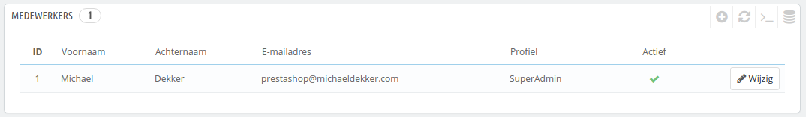
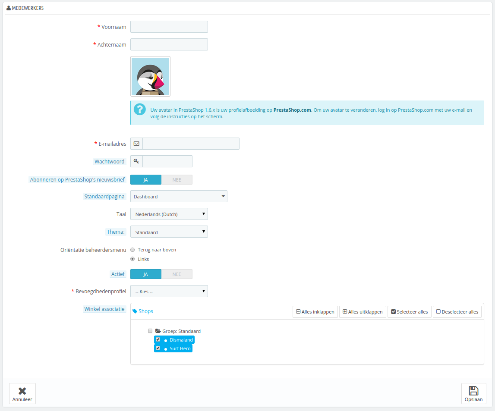
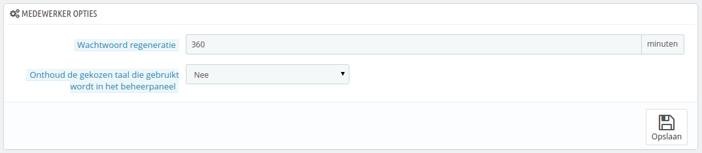

# Medewerkers instellen

De configuratiepagina "Medewerkers" toont alle gebruikersaccounts die toegang hebben tot de backoffice van uw winkel. Standaard vind u hier het account dat was aangemaakt tijdens de installatie, deze krijgt automatisch SuperAdmin-rechten. De SuperAdmin heeft toegang tot alle functies binnen PrestaShop zonder beperkingen.

U moet ervoor zorgen dat u een medewerkersaccount hebt voor elke echte medewerker die betrokken is bij uw online-winkel. Dit betekent dat u een account moet vermijden dat door meerdere mensen gebruikt kan worden, omdat u moet kunnen bijhouden wie waar mee bezig is geweest in uw winkel. Inderdaad, medewerkers kunnen bestellingen wijzigen, betalingen accepteren en klanten terugbetalen en u wilt weten wie dat heeft gedaan. Door een persoonlijk administratieaccount toe te voegen voor elke medewerker kan uw team op een verantwoorde manier uw winkel beheren.

## Een nieuwe medewerker toevoegen 

Door te klikken op de knop "Voeg nieuwe medewerker toe" wordt u naar het aanmaakformulier geleidt.

Het heeft een aantal instellingen:

* **Voornaam** en **Achternaam**. De naam is niet zichtbaar voor klanten, maar het helpt u wel bij het identificeren van medewerkers.
* **Wachtwoord**. Doe uw best om te voorkomen dat dit wachtwoord achterhaald kan worden. U wilt niet dat een gebruikersaccount door onbekenden gebruikt wordt.
* **E-mailadres**. Wanneer dit is toegestaan, ontvangt de medewerker klante-mails en PrestaShop-notificaties op dit e-mailadres. Het wordt ook gebruikt om de gebruiker te herkennen bij het inloggen.
* **Abonneren op PrestaShop's nieuwsbrief**. U kunt u opgeven voor de nieuwsbrief van PrestaShop om tips te ontvangen van het PrestaShop-team.
* **Standaardpagina**. U kunt besluiten welke pagina de gebruiker ziet na het inloggen. Dit kan kan bijvoorbeelde pagina "Statistieken" zijn voor SuperAdmins of "Bestellingen" voor het sales-team.
* **Taal**. De standaardtaal. Het kan voorkomen dat uw taal Nederlands is, maar dat u medewerkers hebt uit een ander land die een andere taal willen gebruiken. Zorg ervoor dat u de noodzakelijke talen beschikbaar stelt via de pagina "Talen" onder het menu "Lokalisatie".
* **Thema**. De backoffice van PrestaShop kan een ander thema gebruiken dan het standaardthema. U kunt hier kiezen welk thema u wilt gebruiken.
* **Oriëntatie beheerdersmenu**. Elke medewerker kan kiezen op welke manier hij of zij het menu wilt tonen: aan de bovenkant van het scherm of aan de linkerkant.
* **Actief**. U kunt tijdelijk of voor altijd een account uitschakelen. Dit maakt het mogelijk om tijdelijk accounts aan te maken, voor bijvoorbeeld een tijdelijke hulpkracht tijdens de kerstperiode.
* **Bevoegdhedenprofiel**. Het is erg belangrijk dat u het juiste profiel toewijst aan elk medewerkersaccount. Een profiel is gebonden aan een set van permissies en toegangsrechten en u moet goed bekend zijn met de permissies, deze worden getoond op de pagina "Profielen" onder het menu "Administratie". Het profiel bepaalt voor welke delen van uw backoffice uw medewerker toegang heeft. Dit is een erg belangrijke instelling.

De avatar van een medewerkersprofiel (de afbeelding rechtsboven inde backoffice) is gebonden aan het gebruikersaccount op het PrestaShop forum. Als u deze afbeelding wilt aanpassen, moet u eerst een account aanmaken op het forum: [http://www.prestashop.com/forums/](http://www.prestashop.com/forums/)

## Medewerker opties 

De sectie aan de onderkant van de pagina "Medewerkers", recht onder de medewerkerlijst, heeft twee beschikbare opties:

* **Wachtwoord regeneratie**. Maakt het mogelijk om de regelmaat in te stellen waarmee de medewerker zijn wachtwoord kan veranderen.
* **Onthoud de gekozen taal die gebruikt wordt in het beheerderpaneel**. Als u hier "Ja" kiest, dan kunnen medewerkers hun eigen standaardtaal kiezen.

