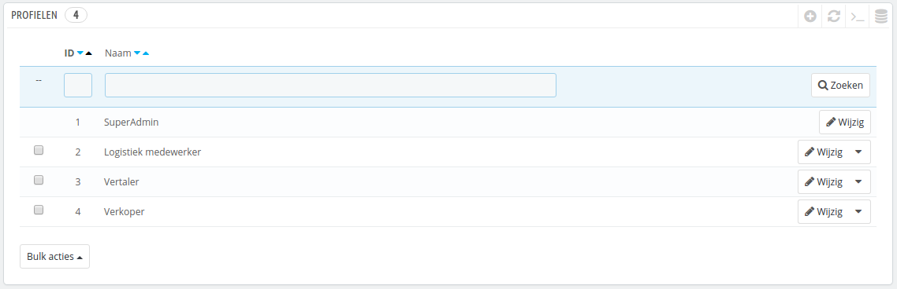
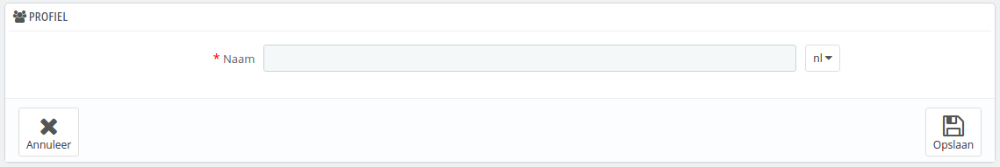

# Medewerkersprofielen instellen

PrestaShop maakt het mogelijk om specifieke taken en rechten aan een medewerker toe te wijzen die u helpt bij het beheren van uw winkel. Als voorbeeld heeft de administrator toegang tot de gehele winkel, zonder beperkingen, terwijl een medewerker slechts toegang kan hebben tot de catalogus en bestellingen.

Standaard zijn er 4 profielen beschikbaar, gereed voor gebruik:

* **SuperAdmin**. De hoogste rang. Het heeft alle rechten en kan alles in de PrestaShop-installatie bereiken.
* **Logistiek medewerker**. Degene die verantwoordelijk is voor orderpicking en verzending. Kan alleen bij de bestellingen, verzendings- en voorraadbeheerpagina's en een klein deel van de catalogus en klantpagina's.
* **Vertaler**. Degene die verantwoordelijk is voor het vertalen van de content van uw winkel. Kan bij producten en categorieën, CMS content en de pagina "Vertalingen".
* **Verkoper**. Uw salespersoon, als deze aanwezig is. Naast de rechten van de vertaler kan deze persoon ook bij klantpagina's, de modules en webservice en sommige statistieken.

U kunt de details van de toegangsrechten zien door elk profiel op de pagina "Permissies" te bekijken.

Het profiel met de naam SuperAdmin kan niet verwijderd worden, slechts een andere naam is mogelijk.

Er moet minstens één medewerker zijn met een SuperAdmin-profiel

## Een nieuw profiel toevoegen 

U kunt zoveel profielen toevoegen als nodig is.

Het toevoegen van een nieuw profiel is aardig vanzelfsprekend: klik op de knop "Nieuw profiel toevoegen", voer een unieke naam in voor het profiel en klik op "Opslaan".

De complexere delen komen zodra u de rechten van het profiel instelt. Dit wordt gedaan op de pagina "Permissies". Zie hoofdstuk [Permissies instellen](permissies-instellen.md).
