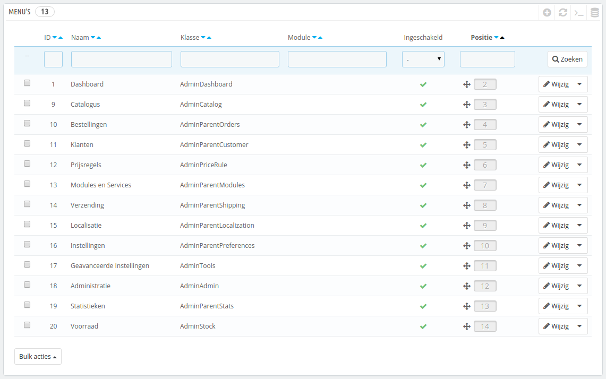
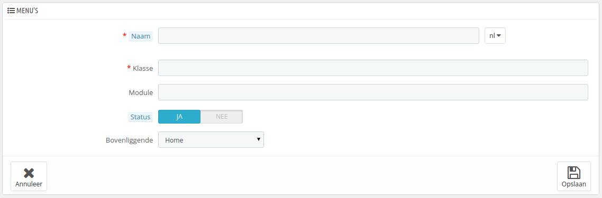

# Menu's instellen

De backoffice van PrestaShop kent geen vaste organisatie: de standaard rangschikking is opgesteld om de meest nuttige pagina's beschikbaar te houden, maar u hebt wellicht een andere mening en hebt liever dat de rangschikking anders zou zijn.

De administratiepagina "Menu's" maakt het mogelijk om het menu aan te passen en zelfs nieuwe pagina's aan te maken.

## Menu's verplaatsen 

Menu's kunnen direct in de lijst worden verplaats. U kunt de rijen verslepen naar de positie die u graag wilt. Zodra u de rij loslaat bewaart PrestaShop automatisch de positie. U kunt de rij verplaatsen als u de muiscursors zich boven de kolom "Posities" bevindt.

U kunt een menu uitschakelen door op het groene vinkje in de kolom "Ingeschakeld" te klikken. Dit zal het menu uitschakelen voor alle backofficegebruikers. Als u een menu wilt verbergen voor een selectie van gebruikers, dan moet u hun profiel aanpassen op de pagina "Permissies".

## Pagina's verplaatsen 

Om de pagina's van een menu te bekijken, klit u op de actie "Details" in het actiemenu. Een nieuwe lijst verschijnt met de pagina's in dat menu, met dezelfde kolommen.

Pagina's kunnen verplaatst worden binnen een menu, direct in de lijst. U kunt de rijen verslepen naar de positie die u graag wilt. Zodra u de rij loslaat bewaart PrestaShop automatisch de positie. U kunt de rij verplaatsen als u de muiscursors zich boven de kolom "Posities" bevindt.

U kunt een pagina ook verplaatsen naar een ander menu. Dit kan direct worden gedaan vanuit de lijst; u moet het bewerkingsformulier openen, waar u de optie "Bovenliggende" vindt. Wijzig deze optie naar een ander menu en bewaar uw instellingen. Zodra u terugkeert naar de pagina "Menu's" zal u zien dat de pagina is verplaatst.

U kunt een menu uitschakelen door op het groene vinkje in de kolom "Ingeschakeld" te klikken. Dit zal het menu uitschakelen voor alle backofficegebruikers. Als u een menu wilt verbergen voor een selectie van gebruikers, dan moet u hun profiel aanpassen op de pagina "Permissies".

## Een nieuwe pagina of menu toevoegen 

Klik op de knop "Nieuw menu toevoegen" om het aanmaakformulier te bereiken.

Dit formulier heeft enkele opties; sommige daarvan kunnen vrij ingewikkeld zijn:

* **Naam**. Geef het een unieke naam, omdat dit wordt gebruikt als interne identifier.
* **Klasse**. De backoffice van Prestashop is gebaseerd op specifieke interne PHP-bestanden, geheten "admin controller", en worden meestal bewaard in de map `/controllers/admin` van uw PrestaShop-installatie. Zodra u een nieuwe pagina aanmaakt, moet u weten welke controller u moet gebruiken en nog belangrijker de naam van de klasse  – dit is de naam van het PHP-bestand.\
  Als u er bijvoorbeeld voor wilt zorgen dat een item de backup-pagina toont van de backoffice, dan moet u eerste de controllernaam vinden (in dit geval, `AdminBackupController`) en de naam invullen in het veld "Klasse".
* **Module**. In sommige gevallen komt de administratiecontroller vanuit een module. In dat geval moet u de identifier van de module opgeven (in de meeste gevallen de mapnaam) en vul dit in, in het veld "Module", in kleine letters. Op deze manier weet PrestaShop dat het niet moet kijken naar een controller in de map `/controllers/admin` maar in de map `/modules/NAAM-VAN-DE-MODULE/`.
* **Status**. U kunt een pagina op elke gewenst moment uitschakelen, maar wees ervan bewust dat alle backofficegebruikers de wijzigingen zien.
* **Bovenliggende**. U kunt elk menu kiezen, maar voor consistentie moet u er één kiezen die relevant is.

Als u een nieuw menu wilt toevoegen in plaats van een verwijzing naar een pagina dan kiest u "Home" als bovenliggende.
