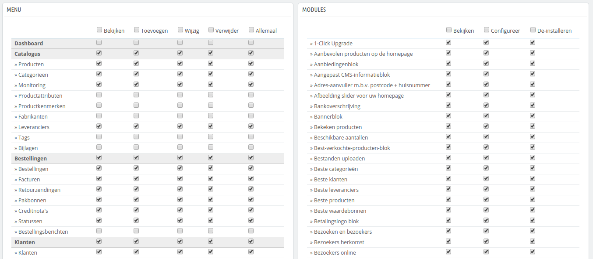

# Permissies instellen

Permissies staan centraal in PrestaShop-profielen. Ze maken het mogelijk om nauwkeurig te zien wat een medewerkersaccount mag doen en niet mag doen in uw winkel.

De administratiepagina "Permissies" wordt opgebouwd uit tabbladen:

* Aan de linkerkant van het scherm ziet u zoveel tabs als profielen er zijn.
* Aan de rechterkant van het scherm toont PrestaShop de permissies van het profiel. Dit tabblad bevat twee tabellen naast elkaar.

Zodra u op een profiel klikt (behalve SuperAdmin), dan verschijnen de twee tabellen om u toegang te geven tot hun criteria:

* Aan de linkerkant zijn menu-gerelateerde permissies: u kunt bepalen wat een profiel kan doen met menu's. Effectief kunt u voorkomen dat een profiel de inhoud van een pagina wijzigt, of zelfs een geheel menu kan verbergen.
* Aan de rechterkant zijn module-gerelateerde permissies: als u wilt dat alleen sommige profielen modules kunnen bekijken, dan wilt u wellicht dat de meest betrouwbare medewerkers modules kunnen bewerken. Sinds versie 1.6.0.11 kunt u ook aangeven of een gebruiker een module kan deïnstalleren.

Voor elk van de menucriteria, heeft u 5 opties:

* **Bekijken**. Een medewerker kan informatie zien.
* **Toevoegen**. Een medewerker kan nieuwe informatie toevoegen.
* **Wijzig**. Een medewerker kan informatie wijzigen.
* **Verwijder**. Een medewerker kan informatie verwijderen.
* **Allemaal**. Schakel alle opties in voor de huidige rij.

De modulecriteria bevatten twee opties:

* **Bekijken**. Medewerkers kunnen de configuratie van de module bekijken.
* **Configureer**. Medewerkers kunnen de module configureren.
* **De-installeren**. _Nieuw in 1.6.0.11._ Medewerkers kunnen de module deïnstalleren.

De permissies van het profiel SuperAdmin kunnen niet worden gewijzigd: dit profiel heeft permissies voor elke optie.

## Permissies instellen voor een nieuw profiel 

In dit voorbeeld gaan we een nieuw profiel aanmaken, "Orderpicker". Maak eerst het profiel aan op de pagina "Profielen", door het veld "Naam" in te vullen. Zodra het is bewaard, verschijnt het in de lijst met profielen.

Hierna moet u permissies toewijzen aan dit nieuwe profiel. Ga naar de pagina "Permissies" en klik op het tabblad voor het nieuwe profiel: de lijst met criteria verschijnt. Standaard heeft een nieuw profiel geen toegang tot de backofficepagina's en je kunt alleen de informatie van sommige modules in de backoffice zien.

U heeft twee manieren om de criteria in te vullen, afhankelijk van de vrijheid die u het profiel wilt geven:

* Klik op één voor een op de checkboxen, totdat genoeg permissies zijn aangevinkt.
* Eerst alle checkboxen aanvinken, daarna permissies verwijderen, totdat de juiste permissies zijn aangevinkt.

U kunt ook meerdere permissies per klik instellen:

* Per kolom: aan de bovenkant van elke kolom is een checkbox die de gehele kolom aan- of uitvinkt.
* Per rij: als u klikt op de checkbox "allemaal" van een gegeven rij dan worden alle checkboxen in de rij aan- of uitgevinkt.

U kunt daarna nog de resterende opties uitvinken, totdat het voldoet aan uw eisen.

Om te voorkomen dat u fouten maakt bij het configureren van permissies bewaart PrestaShop automatisch de instellingen, zodra u iets wijzigt. Dit betekent dat u niet op de knop "Opslaan" hoeft te klikken. Zodra u het profiel de juiste rechten hebt gegeven, kunt u terugkeren naar de administratiepagina "Medewerkers" en nieuwe profielen toevoegen als dat nodig is.
