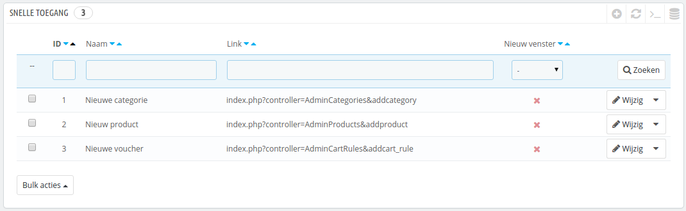
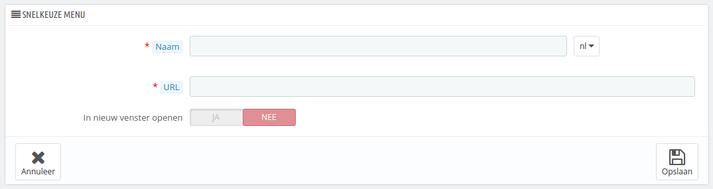

# Snelle toegang instellen

PrestaShop heeft handige snelkoppelingen naar de pagina's die het belangrijkst voor u zijn. Deze kunnen worden bereikt via het menu met de naam "Snelle toegang". Deze verschijnt aan de bovenkant van elke pagina in de backoffice van PrestaShop.

De configuratiepagina "Snelle toegang" maakt het mogelijk om gepersonaliseerde snelkoppelingen toe te voegen. Hiermee kunt u het navigatiemenu verder aanpassen voor u en uw team.&#x20;

De pagina toont de snelkoppelingen die reeds zijn aangemaakt. Standaard zijn dit:

* **Nieuwe categorie**. Deze speciale link brengt u naar het aanmaakformulier voor categorieën.
* **Nieuw product**. Deze speciale link brengt u naar het aanmaakformulier voor producten.
* **Nieuwe voucher**. Deze speciale link brengt u naar het aanmaakformulier voor waardebonnen.

Pagina's die worden geopend in een nieuw tabblad/venster hebben een groen vinkje in de kolom "Nieuw venster".

U kunt zoveel snelkoppelingen toevoegen als u wilt – voeg er niet te veel toe, want dit zorgt ervoor dat het bladeren door het snelkeuzemenu te langzaam gaat.

## Een nieuwe snelkoppeling toevoegen 

Laten we een nieuwe snelkoppeling toevoegen naar de pagina waar u een bestelling aan kunt maken en tegelijk zelfs nieuwe klanten.

Zoals gebruikt klikt u op de knop rechtsboven, deze keer met de tekst "Voeg nieuwe snelle-toegang toe":

* **Naam**. Geef de snelkoppeling een unieke naam. Maak het kort en duidelijk waar het over gaat.
* **URL**. Geef het adres van de pagina op. Hier is hoe u zelfs pagina's met een complete link kunt toevoegen als snelkoppeling:
  1. Terwijl u het venster/tabblad met het aanmaakformulier openlaat, gaat u naar de pagina "Bestellingen" onder het menu "Bestellingen" in een nieuw browservenster/-tabblad.
  2. Kopieer het webadres vanuit de adresbalk. Een voorbeeld: [http://www.myprestashop.com/admin8945/index.php?controller=AdminOrders\&token=f326b0419984706791c03f7e96599147](http://www.myprestashop.com/admin8945/index.php?controller=AdminOrders\&token=f326b0419984706791c03f7e96599147).
  3. Verwijder het gedeelte met `&token=xxx` en laat het bestand + query string over (laat de domeinnaam en de map `/admin8945` achterwege). In ons geval wordt de URL: `index.php?controller=AdminOrders`.
  4. Plak het resultaat in het veld "URL" van het aanmaakformulier.
* **In nieuw venster openen**. Geef op of u wilt dat de link in een nieuw venster of tabblad wordt geopend. Over het algemeen worden links binnen de backoffice in hetzelfde venster weergeven, terwijl externe links geopend worden in een nieuw venster of tabblad.

U kunt links naar andere websites toevoegen, bijvoorbeeld naar uw PayPal-account of uw webmail. Kopieer in dit geval de gehele URL naar het veld "URL", inclusief het voorvoegsel `http://` of `https://`.
