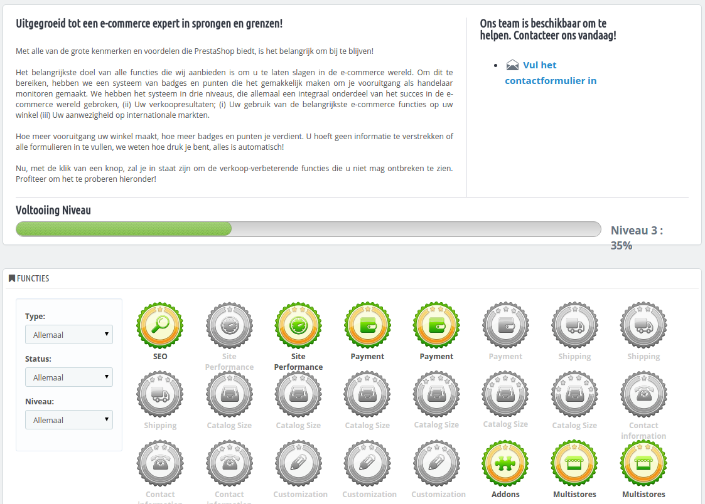

# Verkoopervaring instellen

Deze pagina wordt gegenereerd door de gelijknamige module. Het is ontworpen om PrestaShop-gebruikers hun voortgang te tonen als e-merchants, zodat ze gemakkelijk kunnen zien hoe ze zijn gegroeid over de dagen, maanden en jaren. Het is standaard geïnstalleerd.

Deze moduel voegt een systeem met badges en punten toe, opgesplitst in drie niveaus, welke allemaal belangrijk zijn om succes te boeken in de e-commercewereld.

* **Functies**. Uw gebruik van hoofditems als siteprestaties, catalogusgrootte, medewerkers en SEO-opties.
* **Prestaties**. De voortgang van e-commercedoelen zoals het aantal klanten, bestellingen en omzet.
* **Internationaal**. Houdt uw aanwezigheid bij in internationale markten Zoals Amerika, Oceanië, Azië, Europa en Afrika.

Hoe meer vooruitgang uw winkel boekt, hoe meer badges en punten u verdient. Het is niet nodig om informatie te verzenden of formulieren in te vullen. We weten hoe druk u bent; alles verloopt automatisch. Gebruik deze tool om uw bedrijf te verbeteren, uw voortgang te bekijken en te reflecteren op grote successen die u wellicht hebt geboekt.
