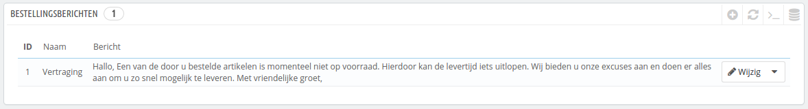
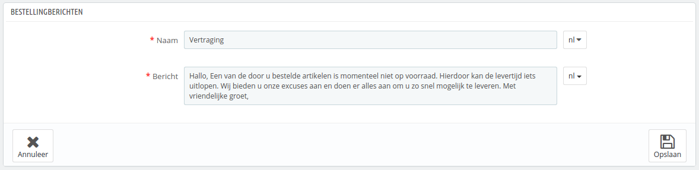
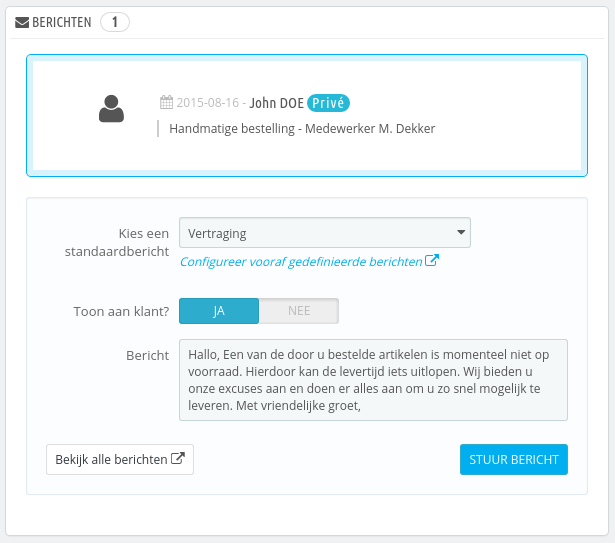

# Bestellingsberichten

Wanneer u een bericht moet verzenden aan uw klant met de interface van PrestaShop (vanaf de bestellingspagina), dan kunt u ervoor kiezen om het bericht op te slaan en te hergebruiken voor klanten met vergelijkbare vragen, opmerkingen of klachten.

Om dit te doen, gaat u naar de "Bestellingsberichten"-pagina, onder het menu "Bestellingen". Er is al één standaardbericht beschikbaar: "Vertraging".&#x20;

## Een nieuw bestellingsbericht aanmaken 

Om andere berichten toe te voegen, klikt u op de knop "Voeg een nieuw bestellingsbericht toe". U kunt ook het standaardbericht wijzigen.

Het formulier bevat slechts dat wat essentieel is:

* **Naam**. Geef uw bericht een naam, zodat u het later gemakkelijk terug kunt vinden.
* **Bericht**. Schrijf de inhoud die u aan uw klanten wilt sturen.

Zodra u klaar bent, klikt u op "Opslaan".

U kunt zoveel berichten aanmaken als u wilt.

## Een bericht sturen aan een klant 

Zodra alle vooraf gedefinieerde berichten zijn ingesteld, kunt u ze gelijk sturen vanaf de bestellingspagina:

1. Selecteer het bericht.
2. Pas deze verder aan, wanneer nodig, om het aan de klant aan te passen.
3. Schakel de optie "Toon aan klant?" in.
4. Klik op "Stuur bericht".

Uw klant zal het bericht ontvangen op het e-mailadres dat bij dit account is geregistreerd. Om vervolgberichten te versturen, gaat u naar de pagina "Klantenservice", onder het menu "Klanten".
