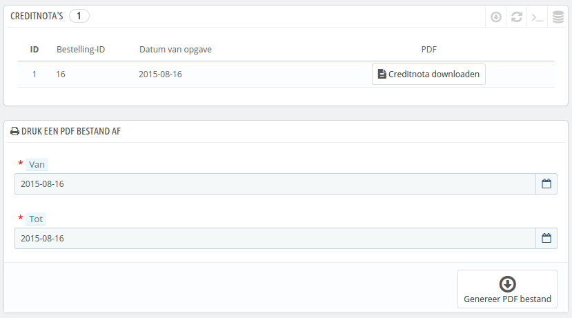
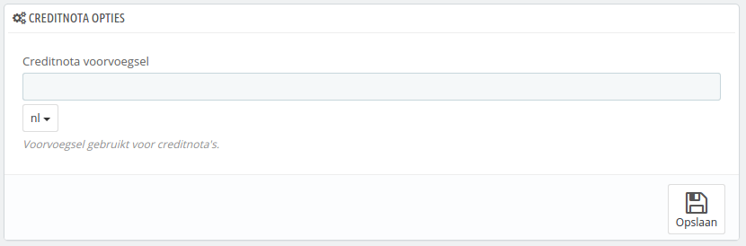
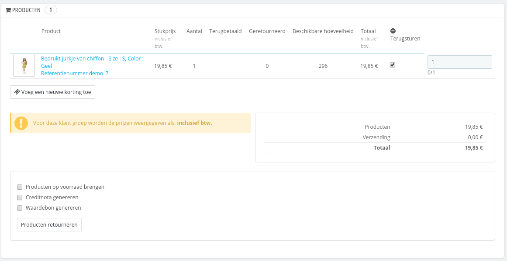
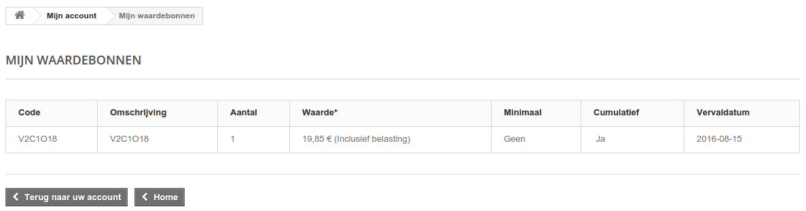

# Creditnota's

Na de overeenkomst tot het retourneren van een product, zou u een pakket moeten ontvangen van de klant. Zodra u dat pakket hebt ontvangen, **moet** u een creditnota aanmaken vanaf de bestellingspagina. Het wordt ook "creditfactuur" of "creditmemo" genoemd.\
Creditnota's worden niet gegenereerd op de "Creditnota's"-pagina, maar slechts in een lijst getoond. Deze pagina wordt ook gebruikt om een PDF te genereren van uw creditnota's.

## Creditnota opties 

Er is slechts één optie op de pagina:

* **Creditnota voorvoegsel**. U wilt wellicht taalafhankelijke voorvoegsels. Natuurlijk kunt u er ook voor kiezen om de voervoegsels helemaal weg te laten.

PrestaShop genereert de creditnotanummers aan de hand van uw instellingen.

Vergeet niet uw instellingen te bewaren.

## Een creditnota aanmaken 

Vanuit uw lijst met bestellingen (de pagina "Bestellingen"), klikt op u de bestelling waarvoor de klant producten terugstuurd – dit  gaat alleen werken als u hebt aangegeven dat de klant producten kan retourneren.

Onder de productentabel, doet u het volgende:

1. Vink de geretourneerde items aan.
2. Vink de checkbox "Producten op voorraad brengen" aan als u de voorraad weer wilt ophogen.
3. Vink de checkbox "Creditnota genereren" aan.
4. Om de klant blij te maken na de fout in zijn of haar bestelling, overweeg om hem of haar een voucher te geven met de checkbox "Waardebon genereren".
5. U kunt ook de verzendkosten voor uw rekening nemen door te klikken op de checkbox naast "Verzendkosten terugbetalen".

Zodra u de opties gekozen hebt, bevestigd u deze door te klikken op "Producten retrourneren".

De creditnota wordt nu aangemaakt en wordt beschikbaar op zowel de bestellingspagina als de pagina "Creditnota's".\
Vanaf daar kunt u op de link klikken op het PDF-bestand te downloaden.\
De klant ziet de nota vanaf zijn of haar eigen klantportal.

Als u een waardebon hebt aangemaakt, dan zien klanten deze weer terug in de sectie "Waardebonnen" van hun klantportal. Als ze erop klikken, zien ze een melding zoals het volgende:

Het bedrag van de geretourneerde item(s) is toegevoegd aan de waardebon. De klant kan de kortingscode gebruiken (aan de linkerkant van de kolom) zodra hij of zij een nieuwe bestelling plaatst.
