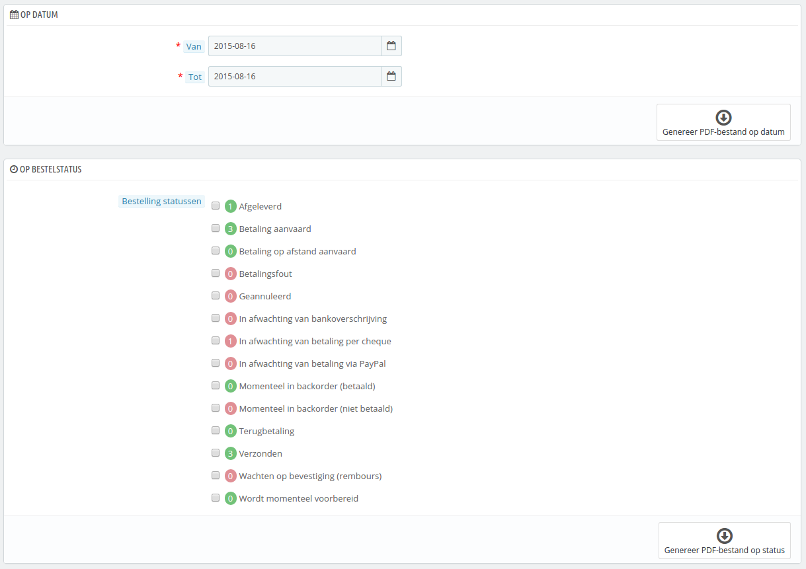
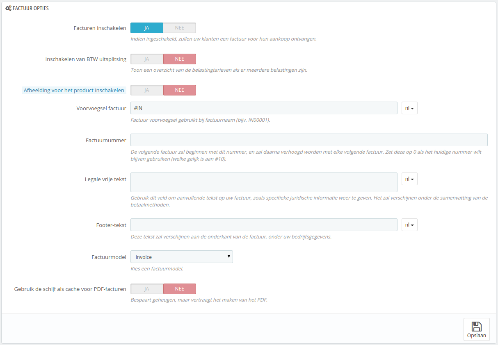

# Facturen

Telkens wanneer een bestelling in uw winkel wordt bevestigd, wordt een factuur verzonden naar de klant. U kunt de facturen van een enkele bestelling downloaden vanaf de bestellingspagina. De pagina "Facturen, onder het menu "Bestellingen" maakt het voor u mogelijk om een selectie te maken uit facturen en deze te downloaden in PDF-formaat, allemaal tegelijkertijd (in hetzelfde PDF-bestanden).

U kunt een PDF-bestand krijgen met daarin verschillende facturen, afhankelijk van twee hoofdcriteria:

* **Op datum**. Erg handig wanneer u alle facturen van een gegeven maand of kwartaal moet afdrukken. Kies de begin- en einddatum, en klik op de knop "Genereer PDF-bestand op datum".
* **Op status**. Een must-have wanneer u precies de bestellingen wilt uitprinten die bijvoorbeeld zijn geannuleerd, terugbetaald of in backorder zijn. PrestaShop geeft exact het aantal weer van de bestellingen met een bepaalde status.

In beide gevallen worden de facturen gecombineerd in een enkel PDF-bestand, elke op een aparte pagina. U kunt geen losse PDF-bestanden krijgen van de facturen van een bepaalde periode of met een bepaalde status via deze pagina.

Als u het uiterlijk van de facturen van uw winkel wilt aanpassen, dan moet u de sjablonen aanpassen.

PDF-bestanden kunnen gevonden worden in de map `/pdf`. Open het bestand `invoice.tpl` en pas het aan, aan uw wensen: het is een HTML-bestand met Smarty-tags.

## Factuuropties 

U kunt kiezen of facturen al dan niet beschikbaar moeten zijn voor uw klanten zodra de bestelling is gedaan. Ook kunt u het voorvoegsel van de factuur aanpassen en het beginnnummer kiezen. Deze features maken uw boekhouding gemakkelijker.

* **Facturen inschakelen**. Wanneer dit is uitgeschakeld zullen uw klanten geen factuur meer ontvangen na hun aankoop. U wordt dan verantwoordelijk voor het afhandelen van facturen wanneer uw klant daar om vraagt.
* **Inschakelen van BTW uitsplitsing**. _Nieuw in 1.6_. Wanneer dit is ingeschakeld dan zullen de verschillende belastingtarieven worden getoond op de factuur, in plaats van één percentage.
* **Afbeelding voor het product inschakelen**. _Nieuw in 1.6.1.0._ Wanneer dit is ingeschakeld, zal de afbeelding van het product naast de productnaam getoond worden op de factuur.
* **Voorvoegsel factuur**. Standaard gebruikt PrestaShop voorvoegsels die zijn aangepast aan de taal: "IN" in het Engels (voor "_invoice_"), "FA" in het frans (voor "_facture_"), "CU" in het Spaans (voor "_cuenta_"), etc. U kunt er ook voor kiezen om taalcodes toe te passen "EN", "FR", "SP", etc. Natuurlijk kunt u er ook voor kiezen om hetzelfde voorvoegsel te gebruiken voor alle talen of helemaal geen voervoegsel toe te passen.\
  PrestaShop genereert de factuurnummers aan de hand van uw instellingen: "FA000001", "FA000002", etc.&#x20;
* **Factuurnummer**. Als uw bedrijf al facturen had, voordat u begonnen bent met PrestaShop, dan kunt u deze optie gebruiken om te beginnen met tellen vanaf een hoger nummer.
* **Legale vrije tekst.** _Nieuw in 1.6.1.0_. Dit veld maakt het mogelijk om extra inhoud toe te voegen aan de factuur, in het geval uw lokale wetgever vereist dat u extra informatie toont. Op de factuur wordt dit getoond onder de samenvatting van de betaalmethoden. Natuurlijk kunt u dit veld gebruiken om elke tekst te tonen die u wilt.
* **Footer-tekst**. U kunt dit gebruiken om een aangepaste tekst te tonen aan de onderkant van uw facturen. De tekst verschijnt onder uw winkelnaam op de factuur.
* **Factuurmodel**. Afhankelijk van uw thema's, kan het voorkomen dat uw factuur beschikbaar is in meerdere stijlen. U kunt ze testen met een testbestelling om te bepalen welke u graag wilt gebruiken. Als u verstand hebt van HTML, dan kunt u ook uw eigen modellen toevoegen of de huidige aanpassen: ze zijn te vinden in de map `/pdf` van uw PrestaShop-installatie.
* **Gebruik de schijf als cache voor PDF-facturen**. U kunt er ook voor kiezen om de gegenereerde facturen te bewaren op de harde schijf van de PrestaShop-server in plaats van de servercache. Het bespaart (werk)geheugengebruik, maar het vertraagd wel het genereren van de PDF zelf. Wees hiervan bewust, voordat u van deze optie gebruikmaakt.

Vergeet niet uw veranderingen op te slaan.

Wanneer uw klanten vragen om facturen, kunt u ze doorverwijzen naar de sectie "Bestelgeschiedenis" van hun gebruikersaccounts. Hier worden alle facturen beschikbaar gesteld aan hen.
