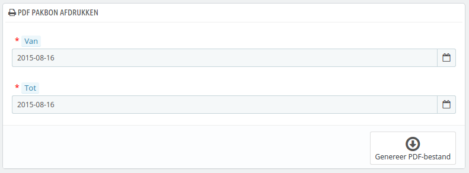

# Pakbonnen

Een pakbon is een leveringsnotificatie. Het kan ook een leveringsnotitie of aantekening genoemd worden.\
Hetis de bedoeling dat deze wordt bijgevoegd in het pakket, samen met de bestelde producten. Het bevat het logo van uw winkel en geeft de inhoud aan. Wanneer het pakket wordt ontvangen, dan kan de klant gemakkelijk de inhoud controleren en achterhalen of er niets ontbreekt.

Het verkrijgen van pakbon gaat op dezelfde manier als bij een factuur. Selecteerde data, samen met de opties die u graag wilt en bevestig deze uiteindelijk om uw documenten aan te maken.

U kunt een PDF-bestand krijgen van verschillende pakbonnen bij elkaar, afhankelijk van de datum. Dit is erg nuttig wanneer u alle pakbonnen van een gegeven dag of kwartaal wilt printen. Selecteer de begin- en einddatum en klik op de knop "Genereer PDF-bestand".

## Pakbonopties 

De drie opties zijn te vergelijken met de de factuuropties:

* **Bezorgingsprefix**. U wilt wellicht taal-afhankelijke voorvoegsels: "DE" in het Engels (voor "_delivery_"), "LI" in het Frans (voor "_livraison_"), "EN" in het Spaans (voor "_entrenga_"), etc. U kunt er ook voor kiezen om de taalcodes te gebruiken: "EN", "FR", "SP", etc. Natuurlijk kunt u ook het voorvoegsel weglaten.
* **Bezorgingsnummer**. Als uw bedrijf al bestelling had, voordat u bent begonnen met het gebruiken van PrestaShop, dan kunt u deze optie gebruiken om de nummering vanaf een ander getal te starten.
* **Voeg productafbeelding toe op de leveringsbon**. Wanneer deze optie is ingeschakeld, dan zal het een productafbeelding tonen, vlak voor de productnaam.

PrestaShop genereert dan de pakbonnen aan de hand van uw instellingen: "#PB000001", "#PB000002", etc.

Vergeet niet uw instellingen op te slaan.
