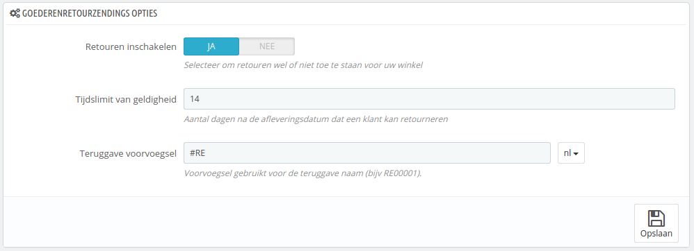
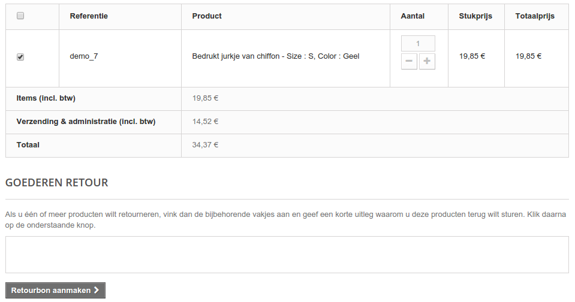
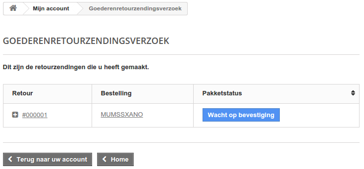
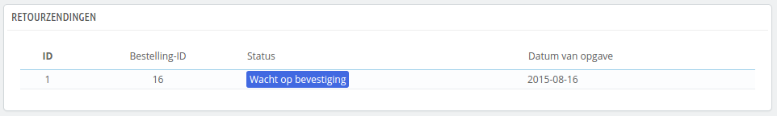
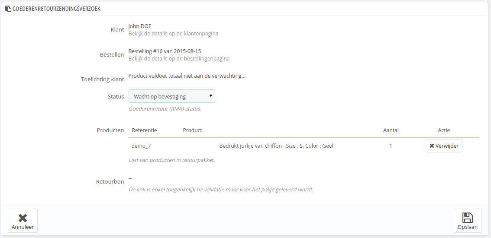
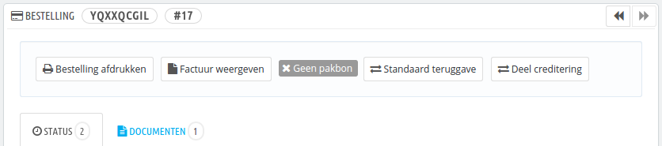

# Retourzendingen

De pagina "Retourzendingen" geeft u een lijst van alle RMA-processen (Return Merchandise Authorization).

Aan de onderkant van de pagina, hebt u de mogelijkheid om retourzendingen in te schakelen (de optie "Retouren inschakelen"). Maak simpelweg de keuze om hier gebruik van te maken, geef het aantal dagen aan dat een klant een retourzending kan aanvragen en bewaar uw instellingen: klanten hebben nu de mogelijkheid om een RMA aan te vragen. U kunt ook het voorvoegsel van een retournummer aanpassen, of ervoor kiezen om deze weg te laten.

## Retourproces: hoe de klant het ziet 

Zodra u de RMA-optie hebt geactiveerd in uw backoffice kan de klant ervoor kiezen om een item te retourneren, mits de bestelling zich nog in de afkoelingsperiode bevindt en de bestelling is gemarkeerd als verzonden of afgeleverd. Hiervoor moet hij of zij het volgende doen:

1. De sectie "Bestelgeschiedenis" van zijn of haar account bezoeken.
2. De bestelling kiezen waarvoor hij een item wilt retourneren.
3. De producten selecteren die hij of zij wilt retourneren door de checkbox naast de na(a)m(en) aan te vinken.
4. (optioneel) Een uitleg toevoegen, om de winkel op de hoogte te brengen van de reden.

Wanneer kan een bestelling geretourneerd worden?

1. Retouren moeten zijn ingeschakeld (de optie "Retouren inschakelen").
2. De bestelling moet zich binnen de afkoelingsperiode bevinden.
3. Deze statussen moet een bestelling hebben gehad om te kunnen retourneren:

*

    * Minimaal twee statussen hebben gehad, waarbij de één de optie 'Zet bestelling op betaling ontvangen.' heeft en de ander 'Zet de bestelling op verzonden.' heeft.\
      Óf
    * Een status waarbij zowel de optie 'Zet bestelling op betaling ontvangen.' als 'Zet de bestelling op verzonden.' is ingeschakeld.

    Statussen kunnen gecontroleerd worden onder 'Bestellingen > Statussen'.

Zodra het formulier is voltooid, klikt de klant op "Retourbon aanmaken" en het verzoek wordt verzonden naar de winkelmanager (u). Het verzoek verschijnt als "Wacht op bevestiging" op de pagina "Goederenretourzendingsverzoek", beschikbaar vanaf de klantportal.

## Retourproces: hoe u het ziet 

Het retourverzoek verschijnt in uw backoffice. Eerst heeft de retour de status "Wacht op bevestiging".

Het retourproces kan uit verschillende stappen bestaan, welke aangegeven worden bij de retourstatus. Er zijn een handvol statussen, waarmee u het RMA-proces kunt volgen:

* Wacht op bevestiging.
* Wacht op pakket.
* Pakket ontvangen.
* Retour geweigerd.
* Retour voltooid.

Het is nu aan u om de RMA te accepteren of te weigeren:

1. Klik op de naam van het verzoek om meer details te zien.
2. Verander de status om verder te gaan met het retourproces of om deze af te breken.
   * Als u het retourproces wilt afbreken (en wilt weigeren), dan kiest u voor de status "Retour geweigerd".
   * Wanneer u akkoord gaat met de retour en de klant wilt terugbetalen, volgt u exact deze stappen:
     1. Kies de volgende stap in het proces: "Wacht op pakket". Hiermee wordt een e-mail naar de klant verzonden om aan te geven dat het pakket kan worden geretourneerd.
     2. Zodra u het pakket hebt ontvangen, verandert u de status in "Pakket ontvangen".
     3. Als laatste stap, zodra het gehele proces is voltooid (de klant heeft een creditnota of terugbetaling ontvangen), dan verandert u de status in "Retour voltooid".
3. Bevestigen.

## Een klant terugbetalen 

Een bestelling kan worden terugbetaald, geheel of gedeeltelijk. Dit wordt gedaan met twee actieknoppen aan de bovenkant van de bestellingspagina in plaats van de retourpagina.

De actieknoppen zijn afhankelijk van de bestelstatus. Zodra bijvoorbeeld de status is gewijzigd in "Afgeleverd", dan wordt verandert de knop "Producten annuleren" in twee nieuwe knoppen: "Producten retourneren" en "Deel creditering".

Het retourneren van producten is standaard niet ingeschakeld. Om dit te activeren gaat u naar de pagina "Retourzendingen", onder het menu "Bestellingen" en activeert u de optie in het gedeelte "Goederenretourzendings opties". De optie wordt meteen van toepassing op alle producten en bestellingen.&#x20;

* **Producten retourneren**. Beschikbaar zodra de bestelling de status "Verzonden" bereikt. PrestaShop moet ingesteld zijn om retourneren te accepteren. Dit kan worden gewijzigd met de optie "Retouren inschakelen" op de pagina "Bestellingen > Retourzendingen".\
  Dit moet alleen worden gebruikt wanneer de klant daadwerkelijk de producten heeft geretourneerd: zodra het teruggestuurde product is ontvangen, kunt u deze meteen markeren als geretourneerd vanuit de bestellingspagina.\
  Klik op de knop "Producten retourneren" en een nieuwe kolom verschijnt in de productlijst, getiteld "Terugsturen". Kies de producten, geeft de hoeveelheid aan en klik op de knop "Producten retourneren" aan de onderkant van dit gedeelte.
* **Deel creditering**. Beschikbaar zodra de bestelling de status "Betaling aanvaard" bereikt. \
  Kan gebruikt worden wanneer u slechts een gedeelte van de bestelling wilt terugbetalen en niet de gehele order, omdat de klant een product heeft geretourneerd of simpelweg als een compensatie voor een beschadigd product die de klant toch wil behouden.\
  Klik op de knop "Deel creditering" en een nieuwe kolom verschijnt in de productlijst, met de naam "Deel creditering". Stel het bedrag en aantal in voor elke product, kies één van de opties aan de onderkant van de lijst (zie hieronder), en klik op de knop "Deel creditering" aan de onderkant van dit gedeelte.

Wanneer u een product markeert als geretourneerd of nog terug te sturen, dan verschijnen de volgende vier opties onder de productlijst:

* **Producten op voorraad brengen**. Wanneer dit is aangevinkt, zal PrestaShop ervan uitgaan dat de producten weer beschikbaar worden voor verkoop. U moet dit niet selecteren wanneer een product is teruggestuurd, omdat het beschadigd is.
* **Creditnota selecteren**. Wanneer dit is aangevinkt, zal er een creditnota worden gegenereerd voor de geselecteerde items. Een creditnota is een bevestiging vanuit uw winkel dat de producten zijn teruggestuurd en dat een terugbetaling is of wordt uitgevoerd. De klant kan het gebruiken om te verwerken met de volgende bestelling.
* **Waardebon genereren.** Wanneer dit is aangevinkt, zal er een waardebon worden aangemaakt voor de geselecteerde items. Een waardebon is een kortingscode die de klant kan invoeren bij het afrekenen\
  U kunt de huidige waardebonnen van een klant bekijken via de klantpagina: vanaf de huidige bestellingspagina, klikt u op de link onder naam van de klant in het gedeelte "Klant"; zodra u op de klantpagina bent, gaat u naar het gedeelte "Waardebonnen". U kunt dan een waardebon aanpassen door te klikken op de knop "Wijzigen".
* **Verzendkosten terugbetalen**. U kunt er ook voor kiezen om de verzendkosten terug te betalen, wat altijd een sympathiek gebaar is tegenover de klant.

Als de klant heeft betaald met een creditcard, dan zou het betaalsysteem de winkelwagen automatisch terug moeten betalen. Als de order is aangemaakt met een cheque of door middel van een bankoverschrijving, dan moet u de terugbetaling zelf regelen en deze handmatig markeren als terugbetaald in de backoffice (op de bestellingspagina).
