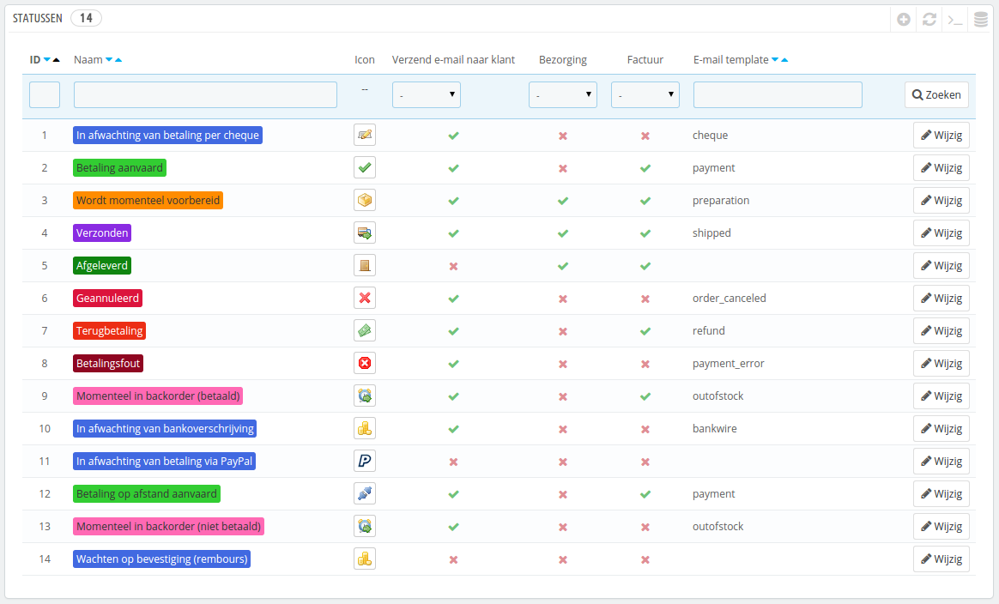
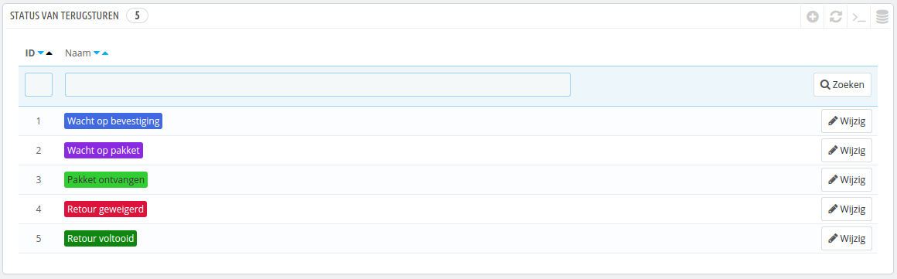
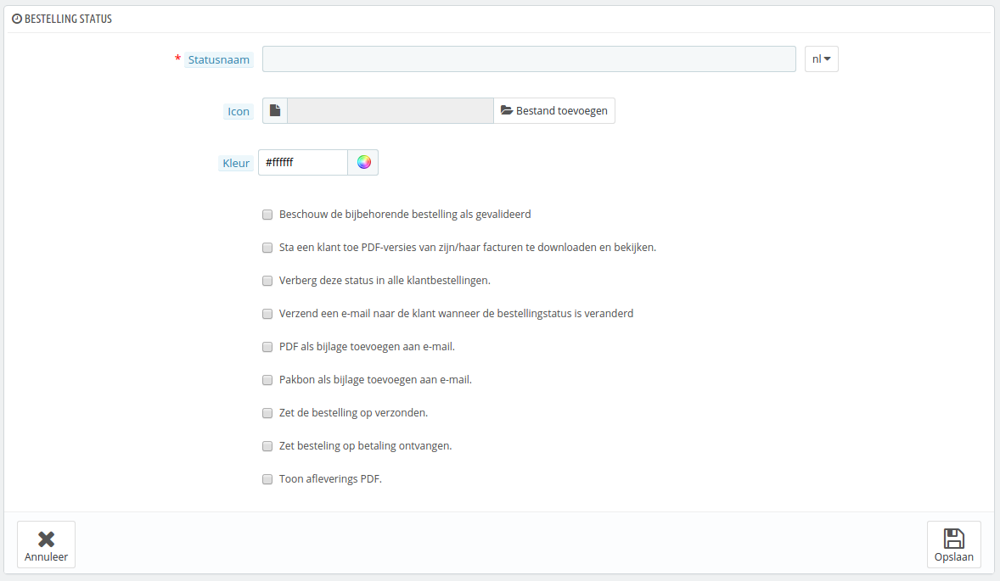
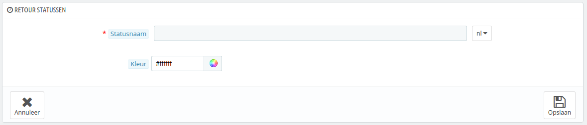

# Statussen

Het hebben van verschillende bestel- en retourstatussen zorgt ervoor dat u gemakkelijk bestellingen en retouren kunt verwerken en houdt u de klant op de hoogte van de voortgang van hun aankoop.

De verschillende statussen zijn zichtbaar en kunnen bewerkt worden op de pagina "Statussen" onder het menu "Bestellingen".

De pagana toont een lijst van de huidig geregistreerde bestelstatussen, samen met:

* Hun opvallende kleur: bestaande statussen hebben kleuren waarmee u snel kunt bepalen of er iets aan de hand is met een bestelling.
* Hun iconen.
* De koppeling met PrestaShop-functies (hieronder slechts enkele voorbeelden):
  * Zou de klant een e-mail moeten ontvangen wanneer de bestelling een bepaalde status bereikt?
  * Is het pakket bij deze status geleverd?
  * Is het bij deze status mogelijk voor de klant om een PDF-versie van de factuur te downloaden?
* De naam van hun e-mailsjabloon: u kunt deze sjablonen aanpassen, taal voor taal, op de pagina "Vertalingen" onder het menu "Localisatie". In de sectie "Vertalingen aanpassen" op die pagina kiest u "E-mail template vertalingen" uit het dropdown-menu, en klikt u op de taalcode van welke u de sjablonen wilt aanpassen.
* Hun actieknoppen: "Wijzigen" en "Verwijderen".

De retourstatuslijst heeft minder informatie, omdat die statussen slechts labels zijn zonder enige impact op de bestelling.

## Een nieuwe bestelstatus aanmaken 

U kunt een nieuwe status aanmaken met de knop "Voeg een nieuwe bestellingsstatus toe" aan de bovenkant. Een nieuw formulier wordt geopend.

Vul het formulier in:

* **Statusnaam**. Hou deze kort en onderscheidend.
* **Icoon**. U kunt elk 16\*16px icoon gebruiken; bijvoorbeeld de mooie en gratis set: [http://www.famfamfam.com/lab/icons/silk/](http://www.famfamfam.com/lab/icons/silk/).
* **Kleur**. U moet ernaar streven om de statuskleur te passen binnen het huidige kleurschema (mits dat mogelijk is). De standaardkleuren zijn:
  * Rood/Oranje: geannuleerde of terugbetaalde bestellingen,
  * Karmozijnrood (rood): betalingsfout,
  * Blauw: bestellingen die wachten op betaling,
  * Lichtgroen: betaalde bestellingen,
  * Donkergroen: afgeleverde bestellingen,
  * Paars: verzonden bestellingen,
  * Roze: bestellingen in backorder.
* Opties:
  * **Beschouw de bijbehorende bestelling als gevalideerd**. Wanneer dit is ingeschakeld, dan markeert dit alle geassocieerde bestellingen als "betaald" en geeft ze dezelfde status.
  * **Sta een klant toe PDF-versies van zijn/haar facturen te downloaden en te bekijken**. Wanneer dit is uitgeschakeld, moet u zelf de factuur verzenden.
  * **Verberg deze status in alle klantbestellingen**. Dit maakt het mogelijk om interne statussen aan te maken, voor u en uw team. Klanten zien dit niet terug in hun overzicht.
  * **Verzend een e-mail naar de klant wanneer de bestellingstatus is veranderd**. Wanneer dit is ingeschakeld verschijnt er een dropdown-menu waarin u de e-mailtemplate kunt kiezen.
  * **Factuur als bijlage toevoegen aan e-mail**. De klant ontvangt de factuur als bijlage, zodra de status wijzigt.
  * **Pakbon als bijlage toevoegen aan e-mail**. De klant ontvangt de pakbon als bijlage, zodra de status wijzigt.
  * **Zet de bestelling op verzonden**. Wees voorzichtig: zodra een bestelling is gemarkeerd als "verzonden", dan kan het niet op de vorige status worden gezet.
  * **Zet de bestelling op betaling ontvangen**. Hetzelfde geldt hier: zodra een bestelling is gemarkeerd als "betaald", dan kan het niet worden teruggezet op de vorige status.
  * **Toon afleverings PDF**. Toont de pakbon.

## Een nieuwe retourstatus aanmaken 

U kunt een nieuwe retourstatus aanmaken met de knop "Voeg een nieuwe retourstatus toe" aan de bovenkant. Een nieuw formulier wordt geopend.

Het heeft slechts twee velden:

* **Statusnaam**. Kies de gewenste naam.
* **Kleur**. Stel de kleur in.

Vergeet niet uw wijzigingen op te slaan.
