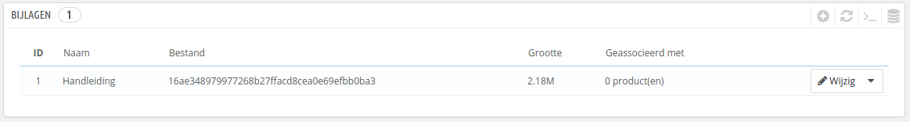
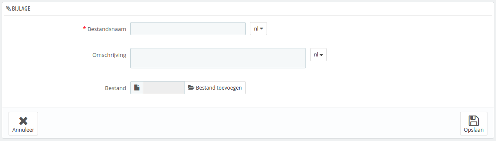

# Bijlagen beheren

PrestaShop zorgt ervoor dat u bestanden beschikbaar kunt stellen aan klanten, voordat ze hun aankoop doen.

Bijvoorbeeld: stel dat u elektronica verkoopt en u wilt graag dat uw klanten een document lezen over de werking van een product. U kunt dit document voor dat doel uploaden.\
U kunt ook gelijk de PDF-handleiding beshikbaar maken op de productpagina.

Elk product kan bijlagen hebben, deze kunnen individueel beheerd worden op het "Bijlagen"-tabblad aan de linkerkant van de productpagina in de backoffice, zoals uitgelegd in het hoofdstuk [Producten beheren](producten-beheren.md). Deze bijlagenpagina geeft u toegang tot alle bijlagen van de winkel: als u een bijlage wilt koppelen aan veel producten tegelijkertijd, dan hoeft u het slechts één keer te uploaden.

U kunt ook losse bijlagen uploaden, voordat u ze koppelt aan producten. Dit kan gedaan worden vanuit de "Bijlagen"-pagina onder het "Catalogus"-menu.

Het proces om een nieuwe bijlage aan uw winkel toe te voegen is als volgt:

1. Klik op "Voeg nieuwe bijlage toe". Een formulier verschijnt.
2. **Bestandsnaam**. Geef uw bijlage een naam, in alle beschikbare talen.
3. **Omschrijving**. Geef het een korte beschrijving, ook in zoveel talen als nodig is.
4. Klik op "Bestand toevoegen" om een bestand vanaf uw computer te uploaden.
5. Klik op "Opslaan".

U wordt nu doorgestuurd naar de lijst van bijlagen, waar uw bestand nu verschijnt. Het is nu beschikbaar voor alle producten, via hun "Bijlagen"-tabblad.

Nu verschijnt het "Download"-tabblad in uw winkel en uw klanten kunnen het bestand nu downloaden als dat nodig is.
