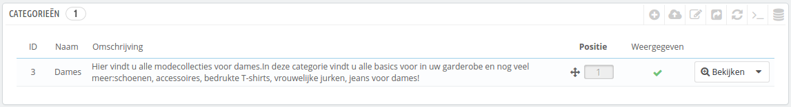
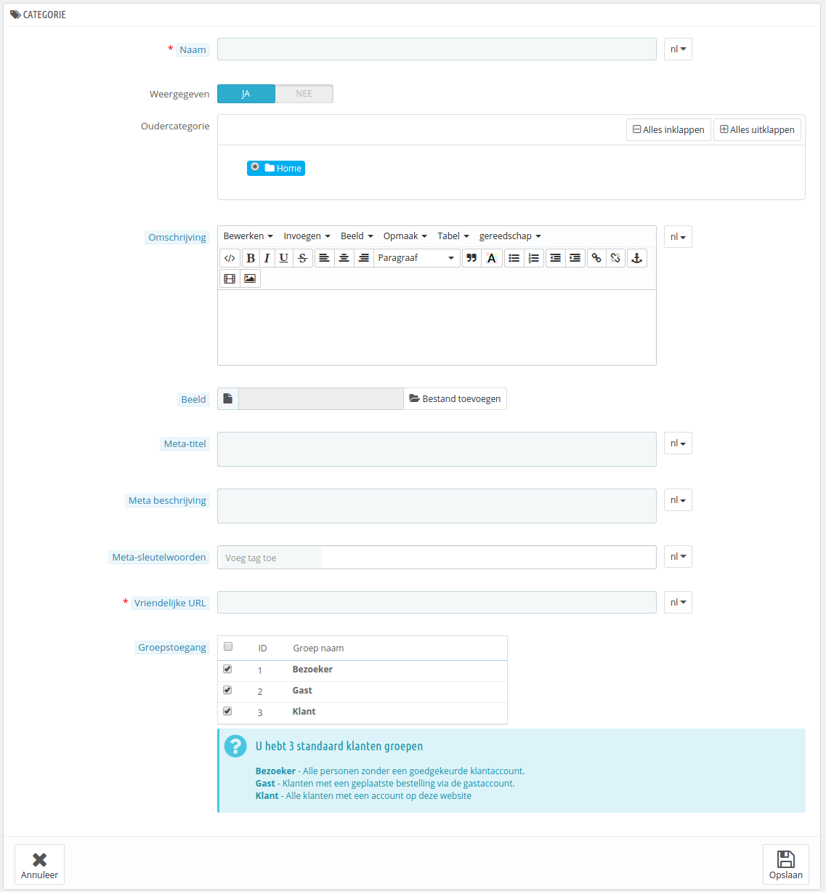

# Categorieën beheren

Categorieën zijn belangrijk, want ze maken het mogelijk om gelijke producten te groepen. Dit helpt klanten om hun weg te vinden door de catalogus, en bij het verkleinen van hun zoektocht wanneer ze op zoek zijn naar een bepaald type van een product. categorieën maken het ook gemakkelijk voor klanten om producten te vergelijken (dankzij PrestaShop's productvergelijking feature).

U zou een categorie aan moeten maken vanaf het moment dat u tenminste twee producten met gelijke attributen hebt in uw winkel. Producten in een categorie moeten vergelijkbaar zijn, zo niet, verwisselbaar. Hou dit idee in uw achterhoofd wanneer u nieuwe producten toevoegd en nieuwe categorieën aanmaakt.

U kunt ervoor kiezen om geen categorie aan te maken en alle producten in een enkele globale categorie te plaatsen, genaamd "Home". Het wordt dan alleen niet mogelijk voor klanten om producten te vergelijken.

U kunt ook besluiten dat u niet geïnteresseerd bent in de productvergelijker en hebt liever dat u uw categorieën vrij kunt opbouwen. In dat geval moet u de productvergelijker uitschakelen: ga naar de configuratiepagina voor producten en plaats een 0 in het veld van de optie "Product vergelijking".

Wanneer u een productcategorie aanmaakt, moet u op slechts één ding focussen: **de producten in deze categorie moeten vergelijkbaar zijn** door middel van hun attributen (niet hun kenmerken). Dit is niet alleen nuttig voor uw klanten, maar het is ook een vereiste voor PrestaShop's productvergelijker.

categorieën worden beheerd op de "Categorie"-pagina van het "Catalogus"-menu. Deze pagina toont een tabel met de huidige bestaande categorieën, met daarop de hoofdinformatie.

Om subcategorieën te tonen klikt u op de oudercategorie of klik u op "Bekijken" in het actiemenu.



Door het icoontje in de "Weergegeven"-kolom te gebruiken, kunt u aangeven welke categorieën u wilt verbergen voor de klant door op het groene vinkje te klikken, waardoor deze verandert in een rood kruis.

Alle categorieën zijn in feite een subcategorie van de "Home"-categorie.\
Om de "Home"-categorie aan te passen (of ellke andere huidig geselecteerde categorie), klikt u op de knop "Bewerken" in de knoppenbalk wanneer de tabel de hoofdcategorieën weergeeft.

Om een nieuwe categorie (of een subcategorie van een bestaande categorie) aan te maken, klikt u op de knop "Nieuwe toevoegen" vanuit elke gewenste categorieëniveau.



Vertaal uw categoriën

Zorg ervoor dat u elk veld vertaalt in de talen die uw winkel ondersteunt. Om dat te doen, klikt u op de taalknop naast het veld en kiest u de taal die u graag wilt bewerken.

Ten eerste moet u enkele algemene informatie invoeren:

* **Naam**. Geef uw categorie een naam. Hou het kort, maar krachtig en denk goed na over uw woorden: uw klanten zullen op deze woorden af gaan wanneer ze uw winkel doorzoeken.
* **Weergegeven**. Geeft aan of deze categorie wordt weergegeven (bijv. of het al dan niet beschikbaar is voor uw klanten). Bijvoorbeeld: u kunt ervoor kiezen om de weergave van producten uit te stellen, omdat u nog niet helemaal klaar bent met bewerken.
* **Oudercategorie**. _Verschijnt niet wanneer u een hoofdcatgorie aanmaakt._ Als u een subcategorie wilt aanmaken anders dan de "Home"-categorie, kiest u de categorie waaronder deze categorie verschijnt.\
  Het formulier is hetzelfde als wanneer u een hoofdcatgorie of subcategorie aanmaakt. Het enige verschil is dat wanneer u klikt op "Nieuwe toevoegen" vanuit een ondergeschikt categorieëniveau, dan begrijpt PrestaShop dat u een subcategorie wilt aanmaken en past de "Oudercategorie"-optie daarop aan.
* **Omschrijving**. U zou dit veld moeten invullen, want niet alleen is het nuttig voor uw werknemers, sommige thema's maken gebruik van dit veld om het aan uw klanten te tonen.
* **Afbeelding**. Klik op "Bestand toevoegen" om een afbeelding vanaf uw computer te uploaden welke de categorie vertegenwoordigd.
* **Meta-titel**. De titel die verschijnt in zoekmachines wanneer er door een klant wordt gezocht.
* **Meta beschrijving**. De samenvatting van uw categorie in slechts een paar regels. Deze is bedoeld om de interesse van een klant te wekken en verschijnt in zoekresultaten.
* **Meta-sleutelwoorden**. Sleutelwoorden die u moet invoeren om ervoor te zorgen dat er naar uw site verwezenw wordt vanuit zoekmachines. U kunt enkele toevoegen, gescheiden door komma's of zinnen, maar die moeten worden omringd door aanhalingstekens. Google hecht tegenwoordig geen waarde meer aan sleutelwoorden en deze hebben geen invloed meer in de rangschikking op Google.
* **Vriendelijke URL**. Maakt het mogelijk om het adres van uw categorie te herschrijven.\
  Bijvoorbeeld, in plaats van een adres als [http://www.example.com/category.php?id\_category=3](http://www.example.com/category.php?id\_category=3) heeft u het adres [http://www.example.com/123-naam-van-de-categorie](http://www.example.com/123-naam-van-de-categorie).\
  In dit voorbeeld is het enige wat u hoeft te doen is aanvinken en de URL wordt automatisch gegenereert op basis van de categorieënaam.
* **Groepstoegang**. Toegang tot de categorie beperken en de bijbehorende producten tot specifieke klanten. Om deze categorie te kunnen zien, moeten uw klanten bij een bepaalde klantengroep horen. Bekijk de pagina "Groepen" onder het menu "Klanten" voor meer informatie.
*   **Hoofdcategorie**. _Verschijnt alleen wanneer u een hoofdcategorie aanmaakt_. U wilt wellicht deze categorie gebruiken als de nieuwe hoofdcategorie, in plaats van "Home". Als dat het geval is, vink deze optie aan.

    De hoofdcategorie is erg nuttig in multistore-modus. Stel u voor dat u drie winkels hebt met verschillende of gedeeltelijk afwijkende producten en categorieën: u wilt misschien een andere hoofdcategorie gebruiken voor elke winkel.

    De hoofdcategorie vervangt dus de "Home"-categorie van elke winkel, dus als u niet dezelfde producten wilt in de homepage-categorie van elke winkel, heeft u verschillende hoofdcategorieën nodig.\
    Op deze manier is het gemakkelijker om categorieën toe te wijzen aan elke winkel en kunt u verschillende producten hebben in de "home"-categorie.

Zodra u klaar bent met het configureren van uw categorie, bewaart u het, en bent u klaar om het te vullen met producten.

Een nieuwe categorie zal niet automatisch verschijnen het menu van uw winkel. Om het te kunnen weergeven, zou u het moeten bewerken met de module "Horizontaal top menu" (wanneer u het standaardthema gebruikt), of elke andere aangepaste module die u gebruikt om het menu te beheren.

## Navigeren door en het bewerken van categorieën <a href="#categorieenbeheren-navigerendoorenhetbewerkenvancategorieen" id="categorieenbeheren-navigerendoorenhetbewerkenvancategorieen"></a>

De "Bewerken"-knop in de knoppenbalk zorgt ervoor dat u de oudercategorie van de huidige weergegeven subcategorieën kunt bewerken. Dit betekent dat wanneer u het hoofd van de sub-categorieën bekijkt, u de "Home"-categorie aanpast zodra u op "Bewerken" klikt.

U kunt op elke cateogie in de tabel klikken: dit opent de desbetreffende categorie, en toont al zijn subcategorieën. Dit verandert de context van de interface: door de klikken op de knop "Bewerken" verandert u de huidige oudercategorie en door te klikken op de knop "Voeg nieuwe toe" open u het aanmaakformulier welke de optie "Oudercategorie" op de huidige oudercategorie zet.

## categorieën importeren en exporteren <a href="#categorieenbeheren-categorieenimporterenenexporteren" id="categorieenbeheren-categorieenimporterenenexporteren"></a>

Naast de knoppen "Voeg nieuwe toe" en "Bewerken", toont de knoppenbalk van de lijst nog drie andere knoppen:

* **Exporteren.** Maakt het mogelijk om een lijst van alle categorieën te donwloaden in CSV-formaat.
*   **Importeren.** Opent de pagina "Geavanceerde instellingen > CSV import", met het verwachtte datatype gezet op "categorieën". Ga naar het hoofdstuk [Geavanceerde instellingen](../geavanceerde-instellingen/) om meer te leren over het importeren van CSV-bestanden.\
    Uw CSV-bestand moet het volgende formaat hebben:

    ```
    "ID";"Naam";"Omschrijving";"Positie";"Weergegeven";
    "3";"Dames";"Hier vindt u alle modecollecties voor dames.In deze categorie vindt u alle basics voor in uw garderobe en nog veel meer:schoenen, accessoires, bedrukte T-shirts, vrouwelijke jurken, jeans voor dames!";"0";"1";
    ```

    De identifier van de categorie is het ID, niet de naam van de categorie.
* **Ververs lijst**. Herlaad de lijst met categorieën met de wijzigingen die u hebt aangebracht.

Meer importeeropties zijn beschikbaar op de "CSV import"-pagina van het menu "Geavanceerde instellingen".

## Producten aan een categorie toevoegen <a href="#categorieenbeheren-productenaaneencategorietoevoegen" id="categorieenbeheren-productenaaneencategorietoevoegen"></a>

Om een product aan een categorie toe te voegen, moet u de configuratiepagina van het product openen en naar het tabblad "Associaties" gaan. Dit is waar u de categorieën kunt instellen waartoe het product behoort.

De "Home"-categorie is een speciale categorie, waar u producten kunt promoten vanuit elke ander categorie door ze te tonen in het blok "Populair". Standaard worden er 8 producten op de homepage getoond.

Het blok "Populair" is afhankelijk van de module "Aanbevolen producten op de homepage". Als u meer (of minder) producten op de homepage wilt, configureert u deze module (vanaf de pagina "Modules en Services" uit het "Modules en Services"-menu).

Noot: u hoeft een product niet te verwijderen vanaf de oorspronkelijke categorie om het op de homepage te plaatsen. Een product kan zoveel categorieën hebben als nodig is.
