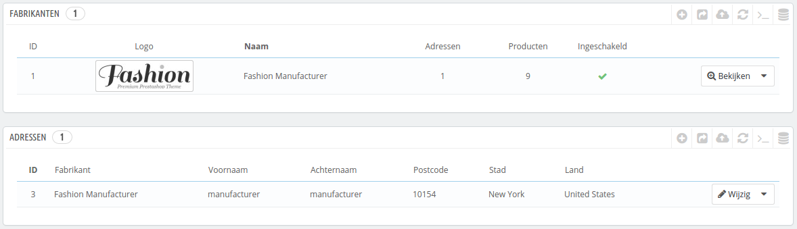
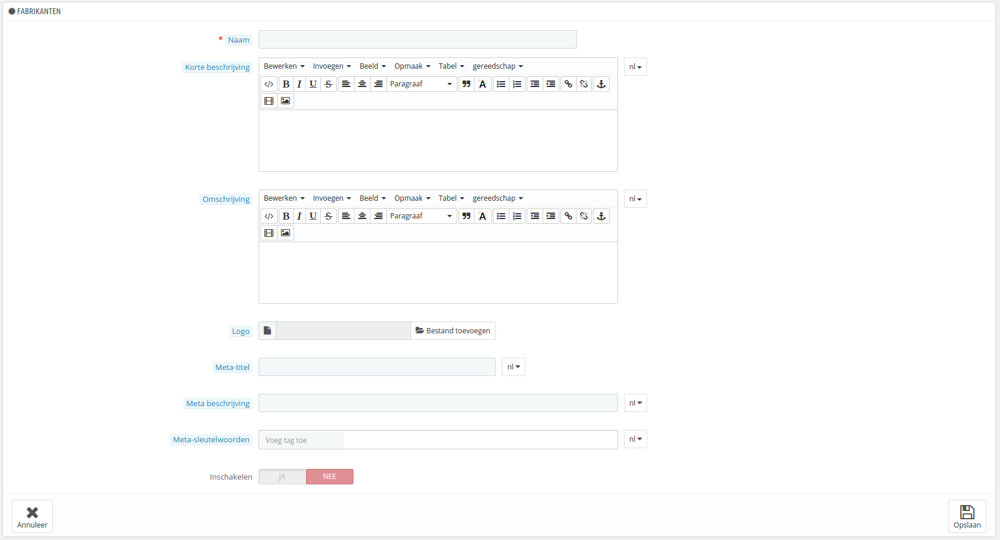
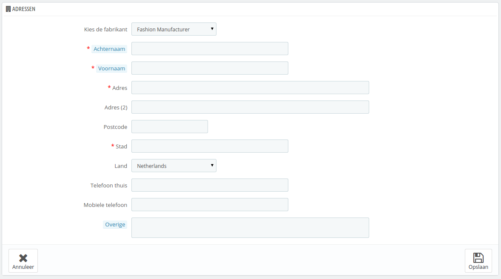

# Fabrikanten beheren

Tenzij u uw producten zelf maakt, moet u altijd de fabrikant van uw product registreren in PrestaShop.

In PrestaShop is de fabrikant het merk achter een product. Als u uw eigen producten verkoopt, moet u uw eigen bedrijf instellen als fabrikant: dit helpt klanten bij het vinden waarnaar ze op zoek zijn en dit kan u 'punten' opleveren bij zoekmachines.

Op de voorkant van uw winkel worden fabrikanten alfabetisch gesorteerd. U kunt deze volgorde niet aanpassen.

Nieuwe fabrikanten worden automatisch uitgeschakeld. U moet ze inschakelen voordat ze online verschijnen – zelfs wanneer ze nog geen producten hebben.

Door informatie over de fabrikanten in te voeren krijgen uw bezoekers razendsnel toegang tot alle producten van een fabrikant. Dit maakt het navigeren op uw site gemakkelijker. Ook maakt dit uw site beter zichtbaar voor zoekmachines.

## Een fabrikant aanmaken 

Klik op "Nieuwe fabrikant toevoegen" en een formulier om een nieuwe fabrikant aan te maken verschijnt.

Vul alle velden in:

* **Naam**. De naam van de fabrikant. Door dit in te voeren verkort u de zoektocht van de klant.
* **Korte beschrijving**. Dit is de beschrijving die getoond wordt in zoekmachines. Gelimiteerd op 100 karakters.
* **Omschrijving**. Voeg een uitgebreidere beschrijving toe van uw fabrikant, hun activiteiten en producten.\
  U kunt hun specialiteiten beschrijven en de kwaliteit van hun producten. De beschrijving van de fabrikant wordt getoond in uw winkel naast die van andere fabrikanten.
* **Logo**. Het hebben van een fabrikantlogo is erg belangrijk: het geeft uw klanten bijna net zoveel vertrouwen in uw winkel als de fabrikant/het merk zelf.
* De SEO-velden (Titel, Meta beschrijving en Meta-sleutelwoorden) bieden dezelfde functionaliteit zoals bij de categoriën.
  * **Meta-titel**. De titel die verschijnt in zoekmachines wanneer een klant naar uw winkel zoekt.
  * **Meta beschrijving**. Een presentatie van uw site in slechts een paar regels, bedoeld om de interesse van de klant te wekken. Dit verschijnt in de zoekresultaten.
  * **Meta-sleutelwoorden**. Sleutelwoorden die u moet definiëren om gerefereerd te worden door zoekmachines. U kunt enkele losse woorden invoeren, gescheiden door komma's, maar ook hele zinnen: deze moeten omringd zijn door aanhalingstekens. Google hecht tegenwoordig geen waarde meer aan sleutelwoorden.
* **Inschakelen**. U kunt een fabrikant uitschakelen, ook tijdelijk. Dit verwijdert het slechts van de fabrikantlijst op de frontend van uw winkel.

Sla uw veranderingen op om teruggebracht te worden naar de fabrikantenlijst. Vanaf hier kunt u:

* Klikken op de naam of logo van een fabrikant en een lijst bekijken met alle producten die aan deze fabrikant zijn gelinkt. Als er geen producten zijn, dan kunt u per product deze toewijzen aan de fabrikant, vanaf de pagina "Producten" onder het menu "Catalogus", door gebruik te maken van de tab "Associaties" aan de linkerkant.\
  Hetzelfde resultaat kan bereikt worden door te klikken op "Bekijken" aan de rechterkant van de huidige pagina.
* De fabrikant uitschakelen door te klikken op de blauwe "JA". Zodra deze is uitgeschakeld, verschijnt er een rode "NEE": klik hier op om de fabrikant weer in te schakelen.
* Bewerk/verwijder de fabrikant door te klikken op de knoppen aan de rechtkant van de rij.

## Adres van een fabrikant toevoegen 

Aan de onderkant van de "Fabrikanten"-pagina is een sectie genaamd "Adressen" te vinden. Elke fabrikant kan zijn eigen adres hebben binnen PrestaShop. Dit heeft als hoofdreden dat u een notitie kunt maken voor uzelf: op deze manier heeft u altijd het contactadres van de fabrikant beschikbaar binnen PrestaShop.

Klik op de knop "Nieuw adres van fabrikant toevoegen" om het formulier te openen.

Zorg ervoor dat u de juiste fabrikant kiest en vul zo veel mogelijk velden in.
