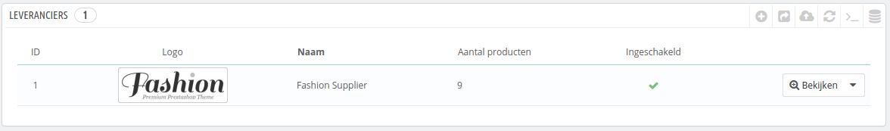
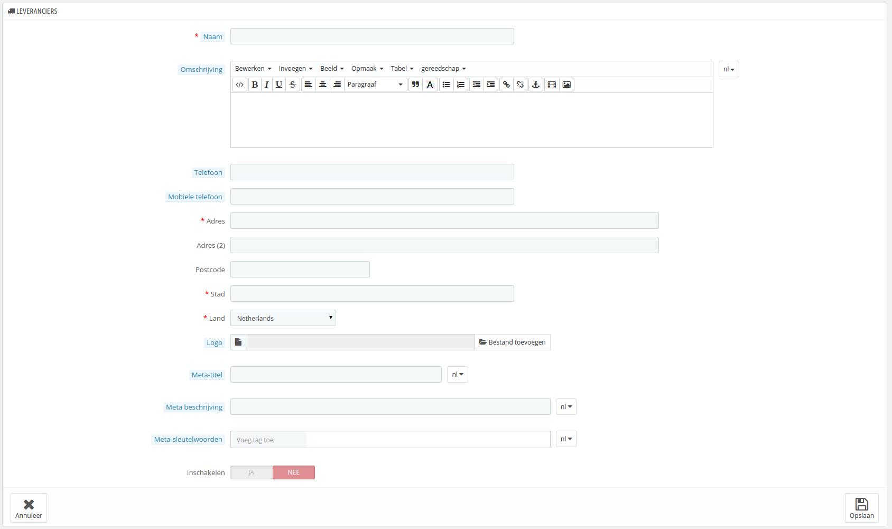

# Leveranciers beheren

Het registereren van leveranciers is optioneel als u al een fabrikant hebt die u gelijk kan voorzien van hun producten. Het hangt af van uw benodigdheden, maar als uw productleverancier niet dezelfde is als uw productfabrikatn, dan moet u ervoor zorgen dat u beide registreert in uw systeem en gekoppeld aan hun bijbehorende producten.

Een leverancier is in PrestaShop het bedrijf dat u producten levert.

Zelfs als u uw eigen producten verkoopt, moet u op zijn minst één bedrijf instellen als leverancier.

Net als bij fabrikanten hebben de bezoekers van uw site snel toegang tot de producten van de leverancier. Dit maakt het navigeren rond uw site gemakkelijker voor hen. Het invullen van deze velden maakt uw website beter zichtbaar in zoekmachines.

Klik op "Nieuwe leverancier toevoegen" en het volgende formulier verschijnt:

Vul alle velden in:

* **Naam**. Geef de naam van de leverancier om het zoeken voor klanten gemakkelijker te maken.
* **Omschrijving**. Voeg een uitgebreidere beschrijving van de leverancier, hun activiteiten en producten toe. \
  U kunt hun specialiteiten en kwaliteit van hun producten benadrukken. De omschrijving van de leverancier wordt getoond in uw winkel.
* **De adresvelden** (Telefoon, adres, postcode, stad, provincie/staat en land).\

  * **Logo**. Het hebben van een leverancierslogo is erg belangrijk: het geeft uw klanten bijna net zoveel vertrouwen in uw winkel als de leverancier zelf.
  * De SEO-velden (Titel, Meta beschrijving en Meta-sleutelwoorden) bieden dezelfde functionaliteit zoals bij de categoriën.
    * **Meta-titel**. De titel die verschijnt in zoekmachines wanneer een klant naar uw winkel zoekt.
    * **Meta beschrijving**. Een presentatie van uw site in slechts een paar regels, bedoeld om de interesse van de klant te wekken. Dit verschijnt in de zoekresultaten.
    * **Meta-sleutelwoorden**. Sleutelwoorden die u moet definiëren om gerefereerd te worden door zoekmachines. U kunt enkele losse woorden invoeren, gescheiden door komma's, maar ook hele zinnen: deze moeten omringd zijn door aanhalingstekens. Google hecht tegenwoordig geen waarde meer aan sleutelwoorden.
  * **Inschakelen**. U kunt een leverancier uitschakelen, ook tijdelijk. Dit verwijdert het slechts van de leverancierlijst op de frontend van uw winkel.

Sla uw veranderingen op om teruggebracht te worden naar de leverancierslijst. Vanaf hier kunt u:

* Klikken op de naam of logo van een leverancier en een lijst bekijken met alle producten die aan deze leverancier zijn gelinkt. Als er geen producten zijn, dan kunt u per product deze toewijzen aan de leverancier, vanaf de pagina "Producten" onder het menu "Catalogus", door gebruik te maken van de tab "Associaties" aan de linkerkant.\
  Hetzelfde resultaat kan bereikt worden door te klikken op "Bekijken" aan de rechterkant van de huidige pagina.
* De leverancier uitschakelen door te klikken op de blauwe "JA". Zodra deze is uitgeschakeld, verschijnt er een rode "NEE": klik hier op om de leverancier weer in te schakelen.
* Bewerk/verwijder de leverancier door te klikken op de knoppen aan de rechtkant van de rij.
