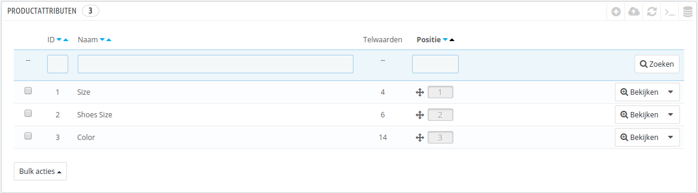
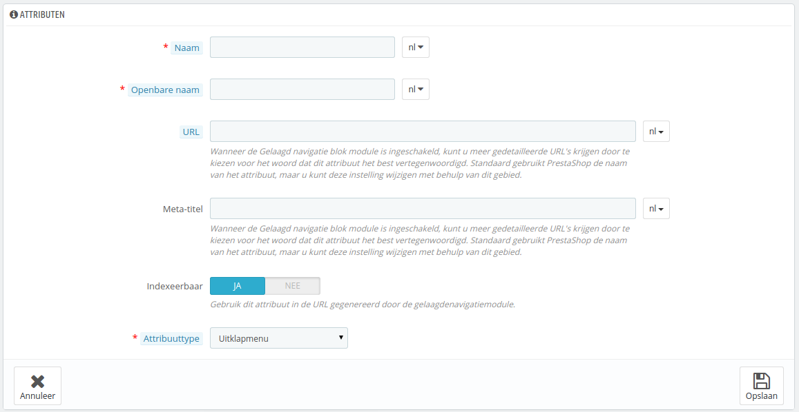
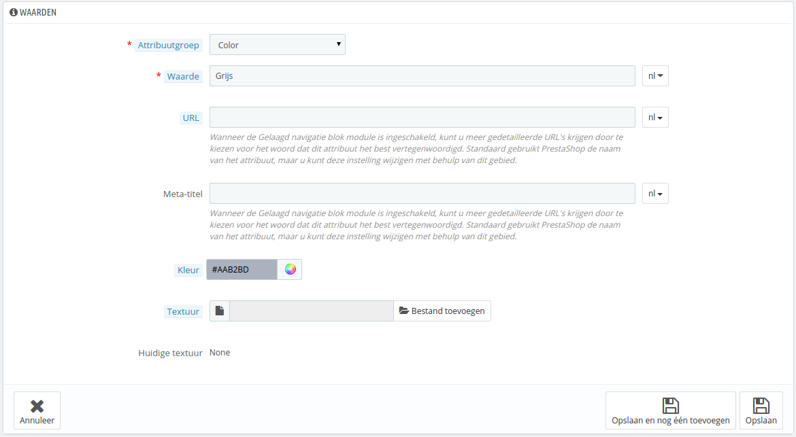

# Productattributen beheren

Attributen vormen de basis van productvariaties (of "combinaties" in PrestaShop's interface): u kunt alleen variaties van een product aanmaken als tenminste één van de attributen wijzigt.\
U moet attributen zien als de eigenschappen van producten die kunnen verschillen tussen variaties, terwijl de productnaam hetzelfde blijft, dingen als: kleur, capaciteit, afmetingen, gewicht, etc. U kunt van alles kiezen dat zou kunnen verschillen tussen versies van hetzelfde product, behalve de prijs.

Het verschil tussen een attribuut en een kenmerk hangt af van het product zelf. Sommige producten kunnen dezelfde eigenschap delen, één daarvan is een attribuut bedoeld om productvariaties te bouwen en een ander wordt toegevoegd omdat het een onveranderlijke eigenschap is.

Voorbeeld: een klant an een iPod kopen waarvan de variatie is gebaseerd op attributen (kleur, diskruimte), maar niet op kenmerken (gewicht, afmetingen).

Zo kan een andere winkel variaties op t-shirts verkopen gebaseerd op attributen (kleur, afmetingen, geslacht), maar niet op kenmerken (gewicht).

Attributen worden geconfigureerd per product, vanuit de pagina "Producten" onder het "Catalogus"-menu, maar ze moeten eerst worden vastgelegd in uw winkel met de tool op de pagina "Productattributen", te vinden onder "Catalogus".

Deze pagina toont een lijst met al uw huidige attributen. U kunt ze bewerken of verwijderen door middel van de actieknoppen aan de rechterkant van de tabel, of hun waarden bekijken door te klikken op "Bekijken". Dit opent een nieuwe tabel.

U kunt ook de volgorde van de attributen op de frontoffice veranderen door te klikken op de pijl-iconen of door elke rij te slepen wanneer de muis over de "Positie" kolom wordt gehouden.

## Nieuwe attributen aanmaken 

Om een attribuut toe te voegen, of in andere woorden, om een groep variaties toe te voegen (kleur, capaciteit, materiaal, etc.), klikt u op "Voeg een nieuw attribuut toe". Een nieuwe pagina verschijnt.

Vul het formulier in:

* **Naam**. De exacte beschrijving van de attribuut. Dit moet kort maar krachtig zijn, zodat het niet verward kan worden met een ander attribuut.
* **Openbare naam**. De naam van de attribuut, zoals getoond wordt aan klanten op de productpagina. Omdat sommige attributen dezelfde naam kunnen hebben voor afwijkende versies, zorgt dit veld ervoor dat u nog steeds attributen uit elkaar kunt houden.
* **Attribuuttype**. Hiermee kunt u kiezen of de productpagina de waarde van de attribuut moet tonen als een dropdown-lijst, een keuzerondje of een kleurkiezer.

Als u de module "Gelaagd navigatie blok" inschakelt verschijnen er drie extra opties. Deze zijn niet direct gerelateerd aan de module: ze biede een directe URL voor elke productvariatie. Op deze manier kan een klant de correcte link sturen naar een vriend, maar dit zorgt er ook voor dat uw ranking in zoekmachines wordt verbeterd.

* **URL**. Het woord om te gebruiken in de URL. Standaard gaat PrestaShop voor de openbare naam van de attribuut.
* **Meta-titel**. Het woord om te gebruiken in de paginatitel. Standaard gebruikt PrestaShop de openbare naam van de attribuut.
* **Indexeerbaar**. Of zoekmachines dit attribuut mogen indexeren of niet.

De klant kan de URL opzoeken door te klikken op de attribuut vanaf de productpagina: de URL veranderd om een laatste detail toe te voegen, bijvoorbeeld `#/kleur-metaal` of `#/diskruimte-16gb/kleur-groen`.

De gelaagde navigatiegenerator maakt ook gebruik van deze waarden, vanwaar de omschrijvende tekst: "Gebruik dit attribuut in de URL gegenereerd door de gelaagdenavigatiemodule".

Bewaar uw nieuwe attribuut om terug te keren naar de attribuutlijst. U moet nu ook waarden toevoegen aan uw attribuut.

## Nieuwe waarde aanmaken 

Klik op "Voeg een nieuwe waarde toe". Een nieuwe pagina verschijnt.

Vul het formulier in:

* **Attribuuttype**. Kies één van de beschikbare attributen uit de lijst.
* **Waarde**. Geef een waarde aan de attribuut: "Rood", "16Gb", "1.21 gigawatt".

De volgende velden worden alleen getoond als de attribuut een kleur is:

* **Kleur**. U kunt de waarde als HTML-kleurcode opgeven (\*bijv. "#79ff52" of "lightblue"), of gebruik de kleurkiezer.
* **Textuur**. Als uw product geen effen kleur heeft, maar met een textuur (denk aan tijgerstrepen), dan kunt u een kleine afbeelding uploaden van de textuur. Deze wordt getoond op de productpagina. Dit vervangt de HTML-kleurcode van het veld erboven. Klik op "Opslaan om de textuur te bewaren.\
  U kunt deze optie ook gebruiken om de klant een combinatie van kleuren te laten kiezen. Hoe dit op de frontend wordt getoond is afhankelijk van het thema dat u gebruikt.
* **Hudige textuur**. Zodra u een textuur hebt geüpload, wordt deze hier getoond als reminder.

U kunt nog meer waarden toevoegen voor hetzelfde attribuut door uw veranderingen te bewaren met de knop "Opslaan en blijven".

Als u de module "Gelaagd navigatie blok" inschakelt verschijnen er twee extra opties. Deze zijn niet direct gerelateerd aan de module: ze biede een directe URL voor elke productvariatie. Op deze manier kan een klant de correcte link sturen naar een vriend, maar dit zorgt er ook voor dat uw ranking in zoekmachines wordt verbeterd.

* **URL**. Het woord om te gebruiken in de URL. Standaard gaat PrestaShop voor de openbare naam van de attribuut.
* **Meta-titel**. Het woord om te gebruiken in de paginatitel. Standaard gebruikt PrestaShop de openbare naam van de attribuut.

De klant kan de URL opzoeken door te klikken op de attribuut vanaf de productpagina: de URL veranderd om een laatste detail toe te voegen, bijvoorbeeld `#/kleur-metaal` of `#/diskruimte-16gb/kleur-groen`.

Zodra uw attributen zijn ingesteld, kunt u beginnen met productvariaties (of "combinaties") aan te maken in elk "Combinaties"-tabblad van de producten, vanaf de pagina "Producten" onder het menu "Catalogus".
