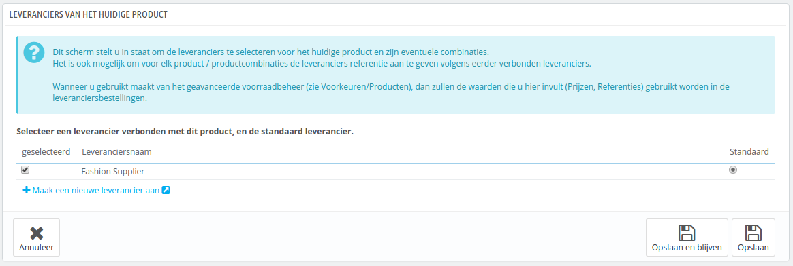

# Producten beheren

## Producten beheren 

U kunt de producten in uw winkel beheren met de pagina "Producten" onder het menuitem "Catalogus".

Onderdelen in dit hoofdstuk:

* [Producten beheren](producten-beheren.md#Productenbeheren-Productenbeheren)
  * [De productlijst](producten-beheren.md#Productenbeheren-Deproductlijst)
  * [De globale knoppen op de pagina "Voeg nieuwe toe"](producten-beheren.md#Productenbeheren-Deglobaleknoppenopdepagina%22Voegnieuwetoe%22)
  * [Productinformatie invoeren](producten-beheren.md#Productenbeheren-Productinformatieinvoeren)
  * [De prijs van een product instellen](producten-beheren.md#Productenbeheren-Deprijsvaneenproductinstellen)
  * [Uw search engine positie optimaliseren (SEO)](producten-beheren.md#Productenbeheren-Uwsearchenginepositieoptimaliseren\(SEO\))
  * [Productassociaties beheren](producten-beheren.md#Productenbeheren-Productassociatiesbeheren)
  * [Verzendkosten: Afmetingen, gewicht, vervoerder](producten-beheren.md#Productenbeheren-Verzendkosten:Afmetingen,gewicht,vervoerder)
  * [Productcombinaties toevoegen](producten-beheren.md#Productenbeheren-Productcombinatiestoevoegen)
  * [Productaantallen beheren](producten-beheren.md#Productenbeheren-Productaantallenbeheren)
  * [De productafbeeldingen configureren](producten-beheren.md#Productenbeheren-Deproductafbeeldingenconfigureren)
  * [Productkenmerken configureren](producten-beheren.md#Productenbeheren-Productkenmerkenconfigureren)
  * [Aanpassingen beheren](producten-beheren.md#Productenbeheren-Aanpassingenbeheren)
  * [Bijlagen beheren](producten-beheren.md#Productenbeheren-Bijlagenbeheren)
  * [De leverancier van een product instellen](producten-beheren.md#Productenbeheren-Deleveranciervaneenproductinstellen)
  * [Magazijnen beheren (geavanceerd)](producten-beheren.md#Productenbeheren-Magazijnenbeheren\(geavanceerd\))
* [Een pakket maken van producten](producten-beheren.md#Productenbeheren-Eenpakketmakenvanproducten)
* [Een virtueel product aanmaken](producten-beheren.md#Productenbeheren-Eenvirtueelproductaanmaken)

### De productlijst 

Door te klikken op de optie "Producten" onder het menuitem "Catalogus" wordt u naar de lijst van uw huidige producten gebracht, weergegeven met hun hoofddetails: ID, afbeelding, referentie, categorie, etc.

Naast de productlijst toont deze pagina vier verschillende statistieken van uw winkel:

* Percentage van de producten die op voorraad zijn,
* Percentage van de gemiddelde brutomarge,
* Percentage van de omzet in de afgelopen 30 dagen,
* Aantal uitgeschakelde producten.

De "Filter op categorie" optie stelt u in staat om alleen producten met betrekking tot uw huidige zoekopdracht weer te geven, evenals het herpositioneren van de producten binnen een categorie.

Product position

U kunt de niet de hele lijst van producten opnieuw indelen. De producten worden weergegeven zoals in uw winkel (door oplopend ID-nummer), en de klant kan de volgorde kiezen met behulp van de beschikbare sorteeralgoritmes: laagste prijs als eerste, hoogste prijs eerst, productnaam van A tot Z, productnaam van Z tot A, op voorraad eerst, laagste referentie eerste, hoogste referentie eerst. U kunt de producten rangschikken per categorie door te klikken op de "Filter op categorie" checkbox. Dit opent een kleine lijst van alle categorieën en subcategorieën. Een categorie selecteren filtert automatisch de lijst van producten, om alleen producten uit de geselecteerde categorie weer te geven.

De topbalk van de productlijst heeft zes knoppen:

* **Voeg nieuwe toe**. Maak een nieuw product aan.
* **Exporteren.** Download een CSV-bestand van alle producten in uw catalogus.
* **Importeren.** Stuurt u naar de pagina waar u CSV-bestanden kunt importeren.
* **Ververs lijst.** Herlaad de lijst met producten om de laatste wijzigingen te kunnen tonen.
* **Toon SQL-query.** Geeft de SQL-query om dezelfde zoekopdracht of filter toe te passen in uw SQL-beheertool.
* **Exporteer naar SQL Manager.** Opent PrestaShop's SQL-beheertool (te vinden onder "Geavanceerde instellingen"), vanaf waar u uw database kunt doorzoeken door middel van SQL statements ("`SELECT ... FROM ... WHERE ...`").\
  Als uw productlijst al was gefilterd (bijvoorbeeld op naam), dan wordt dit filter meegeneomen in de geleverde SQL statement (bijvoorbeeld: "``WHERE 1  AND b.`name` LIKE '%blouse%'``").

U kunt nieuwe producten toevoegen door te klikken op "Voeg nieuwe toe". Een formulier verschijnt, met daarin enkele tabs aan de linkerkant en twee knoppen aan de bovenkant: "Aanbevolen Modules en Services" en "Help".

### De globale knoppen op de pagina "Voeg nieuwe toe" 

Standaard heeft de pagina twee knoppen die u op de meeste pagina's terug kunt vinden: "Aanbevolen Modules en Services" en "Help".

Aan de onderkant van de meeste pagina's zijn drie knoppen:

* **Opslaan.** Dit bewaart de veranderingen die u hebt aangebracht op de huidige producten en brengt u terug naar de productlijst.
* **Opslaan en blijven.** Dit bewaart de veranderingen die u hebt aangebracht op de huidige producten en zorgt ervoor dat u op het huidige tabblad blijft. Dit is bijzonder nuttig, wanneer u tussen tabbladen wilt wisselen zonder uw veranderingen op het huidige tabblad te vliezen of om te zien dat uw veranderingen meteen worden toegepast.
* **Annuleren.** Het brengt u simpelweg terug naar de productlijst, zonder dat uw wijzigingen worden opgeslagen.

Zodra u het product een nieuwe naam geeft en klik op "Opslaan en blijven", dan verschijnen er meer knoppen bovenaan de productpagina:

* **Voorbeeld**. Toont de frontoffice-pagina van uw product. Dit is erg handig, want het werkt ook als uw product is uitgeschakeld ("Informatie-tabblad").
*   **Kopiëren**. Creëert een exacte kopie van het huidige product. Dit is zeer handig wanneer u liever de huidige data gebruikt als sjabloon voor een ander product and niet elke keer weer opnieuw de data wilt invoeren. Twee producten kunnen bijvoorbeeld erg verschillend zijn, maar kunnen dezelfde associaties, vervoerders of leveranciersinstellingen hebben.

    Niet teveel dupliceren!

    Als u verschillende versies van hetzelfde product wilt aanmaken, vanwege een verschil in kleur, capaciteit, groottte, etc., dan kunt u beter productcombinaties voor het huidige product aanmaken, in plaats van het X keer te dupliceren. Bekijk de "Combinaties"-tab aan de linkerzijde, wat wordt uitgelegd in sectie [Productcombinaties toevoegen](producten-beheren.md#Productenbeheren-Productcombinatiestoevoegen) van dit hoofdstuk.
* **Product verkopen**. Stuurt u naar de pagina "Productdetails" van het statistieken dashboard (menu "Statistieken"). Deze geeft een grafische weergave van zowel het aantal bezoekers op deze pagina als de verkoop.
* **Dit product verwijderen**. Verwijdert alle data van het huidige product, inclusief afbeeldingen, combinaties, kenmerken, etc.
* **Aanbevolen Modules en Servies.** Opent een popupvenster met daarin populaire modules van PrestaShop Addons marktplaats.

### Productinformatie invoeren 

Het eerste tabblad bevat de basisinformatie van het product.

De eerste optie is essentieel: het geeft aan of een product een pakket (een combinatie van minstens twee bestaande producten), een virtueel product (download, service, etc.), of simpelweg een klassiek product is dat per post wordt verzonden. Voor nu bekijken we het klassieke product, en behandelen we pakketten en virtuele producten in aparte gedeelten van dit hoofdstuk.

Er zijn veel meer productgerelateerde opties op de "Product"-pagina van het "Instellingen"-menu:

* Aantal dagen dat een product als 'nieuw' wordt beschouwd.
* Standaard productvolgorde.
* Geavanceerd voorraadbeheer inschakelen.
* etc.

U kunt deze globale instellingen eerst bekijken voordat u verder gaat.

U begint met de vier tekstvelden:

*   **Naam**. Het eerste veld om in te vullen is de productnaam, welke in de zoekmachineresultaten verschijnt. Naast dit veld vindt u de taalcode, welke het mogelijk maakt om de taal te kiezen waarvoor u de productnaam wilt wijzigen.

    U **moet** op zijn minst de productnaam invoeren voor de standaardtaal, voordat u het product kunt bewaren. U kunt het niet bewaren, totdat het een naam heeft – voor veel tabbladen moet het product eerst bewaard worden voordat deze toegankelijk zijn.

    Zorg ervoor dat u de velden vertaald in elke taal die voorkomt in uw winkel. Om dat te doen gebruikt u de taalcode naast het veld en selecteert u de taal die u graag wilt wijzigen.\

* **Referentiecode**. Dit is uw eigen interne referentie. Het kan een getal zijn of de referentie vanuit de bewaarlocatie, de leverancier of iets anders wat dit getal uniek maakt.
* **EAN-13- of JAN-streepjescode**. Dit zijn de getalen van de streepjescode van het product, deze worden wereldwijd gebruikt om het product te identificeren. U kunt zowel een EAN-13- als JAN-nummer gebruiken.
  * Een EAN-13 is het 13-cijferige internationale artikelnummer van het product. Lees meer op Wikipedia: [https://nl.wikipedia.org/wiki/Europese\_artikelnummering](https://nl.wikipedia.org/wiki/Europese\_artikelnummering).
  * Een JAN-code wordt gebruikt in Japan, maar is te combineren met het internationale EAN. Lees meer op de (Engelse) Wikipedia:  [http://en.wikipedia.org/wiki/Japanese\_Article\_Number](http://en.wikipedia.org/wiki/Japanese\_Article\_Number).
* **UPC**. **** Een streepjescode dat uit 12 cijfers bestaat. Deze wordt meer gebruikt in Noord-Amerika, Verenigd Koninkrijk, Australië, en Nieuw-Zeeland. Lees meer op Wikipedia: [https://nl.wikipedia.org/wiki/Universal\_Product\_Code](https://nl.wikipedia.org/wiki/Universal\_Product\_Code).

Hierna komen vier opties:

* **Ingeschakeld**. Als u niet wilt dat dit product meteen beschikbaar of zichtbaar is voor uw klanten, zet deze optie op "Nee".
* **Zichtbaarheid**. U kunt ervoor kiezen om het product beschikbaar te maken via diverse kanalen:
  * **Overal**. Klanten kunnen bij het product komen via de catalogus, door te zoeken of direct via de URL.
  * **Alleen catalogus**. Klanten kunnen bij het product komen via de catalogus of direct via de URL.
  * **Alleen zoeken**. Klanten kunnen bij het product komen via de zoekfunctie of direct via de URL.
  * **Nergens**. Klanten kunnen alleen bij het product komen via de URL. Ze zullen het niet kunnen vinden via de zoekfunctie of catalogus. Dit is handig voor het toevoegen van privéproducten met een beperk publiek, zelfs tijdelijk (u kunt deze instellingen te allen tijde wijzigen).
* **Opties**. Een aantal specifieke opties.
  * **Beschikbaar om te bestellen**. Als u dit vakje uitvinkt, dan kunnen klanten dit product niet toevoegen aan hun winkelmandje. Dit is ongeveer hetzelfde als Catalogusmodus, maar dan voor een enkel product.
  * **Toon prijs**. Als bovenstaande optie "Beschikbaar om te bestellen" niet is aangevinkt, kunt u ervoor kiezen om toch de productprijs te tonen (ondanks dat klanten het niet kunnen kopen), of ervoor kiezen om het niet te tonen.
  * **Alleen online (wordt niet verkocht in uw fysieke winkel)**. Als u ook een 'stenen' winkel hebt, dan is deze optie ervoor wanneer u uw product alleen online wilt aanbieden – het voorkomt dat klanten online een product bekijken en vervolgens naar uw winkel komen en zo proberen verzendkosten te vermijden.
* **Staat**. Niet alle winkels verkopen nieuwe producten. Deze optie helpt u de staat van het product te tonen:
  * **Nieuw**. Het product is gloednieuw, gesealed in de originele verpakking.
  * **Gebruikt**. Het product is tenminste één keer verkocht, en waarschijnlijk door iemand anders gebruikt (tweedehands). Het zou in de originele verpakking beschikbaar moeten zijn, welke opnieuw is gedicht met tape.
  * **Gereviseerd**. Het product is geretourneerd om verschillende redenen ("krassen, scheuren of andere vormen van cosmetische schade, maar niet de prestaties van het product beïnvloeden"). Lees meer op (de Engelse) Wikipedia over gereviseerde elektronica:  [https://en.wikipedia.org/wiki/Refurbishment\_(electronics)](https://en.wikipedia.org/wiki/Refurbishment\_\(electronics\)).

Nu dat deze details zijn opgehelderd, kunt u beginnen met het toevoegen van een beschrijving van uw product.\
Het beshrijven van een product is essentieel, zowel voor de klant (hoe meer informatie, hoe beter) en zoekmachines (het zorgt ervoor dat uw winkel bij meer zoekopdrachten verschijnt).

Aan de onderkant van het scherm zijn twee beschrijvingsvelden, elk met hun eigen doel:

* Het veld **"Korte beschrijving"** zorgt ervoor dat u een korte beschrijving kunt typen die in zoekmachines verschijnt en verschijnt op de blokweergave van een product (bijvoorbeeld op categoriepagina's). Het veld is standaard gelimiteerd tot 400 karakters: als u dat limiet overschrijdt, dan toont PrestaShop een waarschuwing (in het rood) onder het veld. U kunt het limiet aanpassen in de configuratiepagina "Producten", waar u de optie "Maximale lengte van de korte beschrijving" vindt.
* Het veld **"Omschrijving"** zorgt ervoor dat u een volledige beschrijving kunt invoeren van uw product, welke op de productpagina verschijnt. De tekstverwerker biedt veel verschillende opties om deze pagina aantrekkelijker te maken (lettertype, lettergrootte, kleur, etc.).\
  Ondanks dat het veld geen karakterlimiet kent, is té veel content wel degelijk mogelijk: probeer in ieder geval de belangrijkste informatie te tonen in een opvallende manier, en uw productpagina zou goed genoeg moeten zijn.

Onder het veld "Omschrijving" kunt u een kleine tool vinden waarmee u één van de afbeeldingen, die u hebt toegevoegd aan het product (via het tabblad "Afbeeldingen"), ook toevoegen aan dit veld, door middel van afbeeldingstags. Klik op "Klik hier" om dit paneel uit te klappen.

Selecteer de afbeelding die u wilt, kies de positie aan de hand van de tekst en grootte en PrestaShop genereert een afbeeldingstag die u daarna in de omschrijving kunt gebruiken (bij voorkeur tussen twee paragrafen of helemaal aan het begin van een paragraaf).

In het veld **"Tags"**, kunt u enkele termen en sleutelwoorden toevoegen die uw klanten helpen bij het vinden van de juiste producten.

Ze worden weergegeven in de winkel in het "Tags"-blok (wanneer beschikbaar). Als u niet wilt dat het blok wordt weergegeven, dan schakelt u simpelweg de module "Tags blok" uit (op de modulepagina).

Verschil met PrestaShop 1.4

PrestaShop 1.4 maakt het mogelijk om de fabrikant van het product rechts in dit tabblad aan te passen. Vanaf versie 1.5 is deze instelling te vinden in het tabblad "Associaties". Hetzelfde geldt voor het veld "Standaardcategorie", de geassocieerde categoriën en het "Accessoires"-veld.

Versie 1.4 liet u ook de grootte en gewicht invoeren van het uiteindelijke pakket op dit tabblad. Vanaf versie 1.5 zijn deze instellingen te vinden in het tabblad "Verzending".

Het veld "Locatie" van versie 1.4 kan gevonden worden in het optionele tabblad "Magazijnen". Deze is alleen beschikbaar wanneer u geavanceerd voorraadbeheer hebt ingeschakeld ("Instellingen"-menu, "Producten" en dan de sectie "Producten voorraad").&#x20;

Zodra u al deze informatie hebt ingevoerd, sla uw werk op en u zult teruggebracht worden naar uw productlijst. Als u de gegevens bewaart door te klikken op "Opslaan en blijven", dan kunt u verder blijven werken aan de presentatie van uw product.

### De prijs van een product instellen 

Het volgende wordt allemaal gedaan in het tabblad "Prijzen", te vinden aan de linkerkant. De prijzensectie kan in het begin ingewikkeld overkomen, met velden die elkaar beïnvloeden en andere belastingen om rekening mee te houden – gelukkig is het vrij simpel.

Stel de prijs in die wordt getoond in uw winkel door de volgende instructies te volgen:

* **Netto inkoopprijs**. Zorgt ervoor dat u gelijk op de hoogte bent van uw inkoopprijs of fabrieksprijs en kunt het meteen vergelijken met uw verkoopprijs om de winst te berekenen.
* **Netto verkoopprijs**. De prijs van uw producten voor belastingen.
* **Btw-regel**. De belastingregel die van toepassing is op het product. Kies tussen de verschillende regels die u hebt ingesteld.\
  Als u een nieuwe belastingregel aan moet maken, klikt u op "Nieuwe belasting aanmaken". Een belasting aanmaken wordt gedaan op de pagina "Belastingen" onder het menu "Lokalisatie"; het wordt volledig uitgelegd in hoofdstuk [Belastingen](../lokalisatie-instellingen/belastingen.md).
* **Ecobelasting (incl. btw)**. De waarde van de ecobelasting voor dit product. Deze waarde is al inbegrepen in de verkoopprijs. U moet de waarde opgeven bij de belastinginstantie van het land waarnaar u het product verscheept.\
  _Dit veld wordt standaard niet getoond._ Als u een ecobelasting moet toevoegen, dan moet u de functie eerst inschakelen. Ga naar de pagina "Belastingen" onder het menu "Lokalisatie", daarna de sectie "Btw-opties" (onderkant van de pagina) en kies "Ja" bij de optie "Gebruik ecobelasting".
* **Verkoopprijs met btw**. Toont de prijs van het product inclusief belasting. U kunt de waarde aanpassen en het zal automatisch het veld "Netto verkoopprijs" aanpassen aan de hand van de waarde die u invoert.
* **Eenheidsprijs**. Maakt het mogelijk voor u om te voldoen aan lokale wetgeving door de eenheidsprijs weer te geven.\
  Bijvoorbeeld, als u een 6-pack cola verkoopt, dan moet u dit veld invullen met de prijs per blik en "blik" aangeven in het tekstveld. De beschrijving zal in het veld eronder automatisch worden aangepast.
* **"In de aanbieding" pictogram op de productpagina weergeven en tekst bij het productoverzicht plaatsen**. Vink deze box aan om aan te geven dat uw product in de aanbieiding is, zowel op de productpagina als in de tekst bij productlijsten. Een "Aanbieding"-icoon verschijnt boven het product.
* **Bruto verkoopprijs**. Deze prijs, inclusief de kortingen, wordt bijgewerkt als u typt.

U kunt het veld "Verkoopsprijs met btw" invullen en kiezen welke belastingregel van toepassing is en het veld zal automatisch de netto verkoopprijs tonen. Het omgekeerde is ook mogelijk.

Op dit punt bent u klaar met de essentiële informatie invoeren voor een basisproductpagina. U kunt dit opslaan en het product meteen beschikbaar stellen voor verkoop in uw winkel!\
Maar blijf lezen, want er zijn nog veel meer opties om in te stellen voor uw producten en om deze aantrekkelijker te maken voor klanten.

#### Specifieke prijzen 

U kunt de totaalprijs van een product aanpassen, afhankelijk van het aantal producten dat een klant koopt, de klantengroep, het land, etc. Dit wordt gedaan in de sectie "Specifieke prijzen" op het tabblad "Prijzen". Klik op de knop "Nieuwe specifieke prijs toevoegen" om het aanmaakformulier te tonen.

Dit is een gemakkelijke manier om een korting toe te passen op dit producten (en alle combinaties).

Klik op de knop "Nieuwe specifieke prijs toevoegen" en een formulier verschijnt.

* **Voor** en **klant**. Dit maakt het mogelijk om de specifieke klant of klantengroep op te geven voor wie de prijs geldt. Ook kan dit gedaan worden voor valuta en landen.
* **Combinatie**. U kunt ervoor kiezen om de specifieke prijs toe te passen op alle productcombinaties of slechts één daarvan. Als u wilt dat er meerdere combinaties zijn met de specifieke prijs, dan moet u een specifieke prijs aanmaken voor elke combinatie.
* **Beschikbaar van/tot**. Hier kunt u een periode opgeven waartussen de korting geldig is. Door te klikken op de selector wordt er een kalender getoond, waardoor u gemakkelijker een datum in kunt voeren.
* **Start vanaf \[] eenheid**. Bevat de waarde vanaf wanneer de korting wordt toegepast. Standaard is dit "1"; de prijs geldt hierdoor voor elke hoeveelheid.
* **Product prijs (excl. btw)**. Dit is waar u de prijs op kunt geven, onafhankelijk van berekeningen en reguliere prijzen. Laat dit veld op "0" om de standaardprijs te gebruiken.\
  **Behoud basisprijs**. Vink deze box aan om het veld "Product prijs" te herstellen en te voorkomen dat u deze kunt bewerken.
* **Pas een korting toe van**. De korting die wordt toegepast zodra de klant de hoeveelheid heeft bereikt. Gebruik de selector om het type korting in te stellen (een bedrag in de huidige valuta of een percentage van de basisprijs).

Zodra u de waarden hebt gekozen en op "Opslaan en blijven" klikt verschijnt de configuratie van uw kortingsinstellingen. De korting is meteen zichtbaar in de winkel.\
Als u een waarde wilt verwijderen klikt u op het bijbehorende prullenbakicoontje in de tabel.

Als u uitgebreidere kortingen wilt instellen, dan kunt u beter prijsregels toepassen. Lees hiervoor hoofdstuk [Winkelwagenregels](../prijsregels-en-waardebonnen-aanmaken/winkelwagenregels.md).

#### Prijsprioriteit beheren 

Soms kan een klant passen in meerdere specifieke prijsregels, zelfs als u zeer gedetailleerde kortingen hebt ingesteld, met aangepaste groepen en winkels (in een multistore-context). PrestaShop heeft daarom een aantal prioriteiten om toch nog een enkele prijsregel te kunnen toepassen voor dergelijke klanten. U wilt wellicht dat de gebruikersgroep belangrijker is dan de valuta.

U kunt de standaardinstellingen veranderen in de sectie "Prioriteitsmanagement".

De standaardvolgorde is:

1. Winkel (wanneer multistore).
2. Valuta.
3. Land.
4. Groep.

Een checkbox aan de onderkant maakt het mogelijk om de instellingen toe te passen op alle producten. Als de checkbox niet wordt aangevinkt, dan worden uw veranderingen alleen toegepast op het huidige product.

### Uw search engine positie optimaliseren (SEO) 

Om uw producten beter weer te geven in zoekmachine's alsook de zichtbaarheid van uw winkel te verbeteren raden we aan dat u de SEO-velden zorgvuldig invult: meta-titel, meta-beschrijvingen, sleutelwoorden en vriendelijke URL's.

"SEO" staat voor "Search Engine Optimization". Lees hier meer over op Wikipedia: [http://en.wikipedia.org/wiki/Search\_engine\_optimization](http://en.wikipedia.org/wiki/Search\_engine\_optimization)

U kunt de gratis white paper van PrestaShop downloaden om meer te weten te komen over SEO: [http://www.prestashop.com/en/white-paper-seo](http://www.prestashop.com/en/white-paper-seo)

Om toegang te krijgen tot de SEO-informatie van een product, opent u het tabblad "SEO".

De velden op deze pagina maken het mogelijk om direct uw catalogus te optimaliseren voor een betere zichtbaarheid in zoekmachine's.

* **Meta-title**. Dit is het belangrijkste veld, omdat dit de titel is die verschijnt in zoekmachine's. Gebruik de juiste details: u moet de gebruiker van de zoekmachine overtuigen om uw website te bezoeken. Zorg ervoor dat de titel geschikt is voor dit product.
  * Goed: "Levi's 501® Original Jeans - Tidal Blue - Original Fit".
  * Slecht: "Item #02769869B bestseller".
* **Meta beschrijving**. Een samenvatting van het product in slechts een paar regels (ideaal is: minder dan 155 karakters), bedoeld om de aandacht van de klant te trekken. Dit verschijnt in de resultaten van sommige zoekmachine's, afhankelijk van de zoekopdracht. Sommige zoekmachine's kiezen ervoor om relevante woorden vanaf de pagina te tonen. Zorg ervoor dat ook deze beschrijving goed bij het product past.
* **Vriendelijke URL**. Dit is een ander extreem belangrijk veld. Det dit veld wordt de URL herschreven naar een adres naar keuze. Bijvoorbeeld, in plaats van een adres als dit: [http://www.myprestashop.prestashop.com/index.php?id\_product=8\&controller=product](http://www.myprestashop.prestashop.com/index.php?id\_product=8\&controller=product), krijgt u een adres als dit: [http://www.myprestashop.prestashop.com/8-name-of-the-product.html](http://www.myprestashop.prestashop.com/8-name-of-the-product.html).\
  Alles wat u nodig hebt zijn enkele woorden voor in het veld "Vriendelijke URL", gescheiden door streepjes.\
  De knop "Genereren" vult dit veld automatisch in. U kunt de URL daarna nog aanpassen, als u dat wilt.

Vriendelijke URL's werken alleen als het herschrijven van URL's is ingeschakeld. U kunt dit doen op de pagina "SEO & URL's", in de sectie "Stel URL's in".

U kunt meer informatie vinden over deze pagina in hoofdstuk [SEO & URL's instellen](../algemene-instellingen/seo-and-urls-instellen.md).

### Productassociaties beheren 

Het aanmaken van associaties voor uw product, betekent dat u het product koppelt aan andere inhoud in uw database:

* Productcategorieën.
* Andere producten (accessoires).
* Fabrikanten.

#### Productcategorieën 

De sectie "Geassocieerde categorieën" maakt het mogelijk om de categorieën te kiezen waar het product zou moeten verschijnen. U kunt er meer dan één selecteren, maar bedenk dat het beter is voor de klant als de categorie verder alleen equivalente en vergelijkbare producten bevat. Daarom moet u zoveel mogelijk voorkomen dat oudercategorieën en kindcategorieën worden geselecteerd.\
Bijvoorbeeld, de categorie "Telefoon" kan subcategorieën van merken bevatten (Apple, Samsung, Nokia, etc.), maar ook eigenschappen (smartphone, flip-phone, etc.). Het is aan u om te bepalen welke categorieën het beste zijn voor uw klanten.\
Als u nog een categorie wilt toevoegen, dan bewaart u de huidige staat van uw producten, voordat u op de knop "Maak een nieuwe categorie aan". Het aanmaken van categorieën wordt uitgelegd in hoofdstuk [Categorieën beheren](categorieen-beheren.md).

De selector "Standaard categorie" is handig als een product aan meerdere categorieën is gekoppeld. Het is vooral bedoeld om aan te geven welke categorie gebruikt moet worden als een gebruiker uw website bereikt vanaf een zoekmachine, omdat de naam van de categorie verschijnt in de product-URL.

Featured List

De selectiebox "Home" selecteren zorgt ervoor dat u het product kunt tonen op de homepage, afhankelijk van uw thema. Om een product te verwijderen vanuit de lijst "Aanbevolen", kunt u de selectiebox weer uitvinken.

#### Accessories 

Het veld "Accessories" geeft u de optie om relevantie producten te koppelen met dit product, om hen enkele andere producten aan te bevelen als ze de productpagina bezoeken (als het thema dit ondersteunt). Type de eerste letters van een product en selecteer deze. Het product wordt vervolgens onder het veld toegevoegd.

U kunt een product met zoveel mogelijk andere producten koppelen. Klik op het kruisje om de koppeling te verwijderen.\
Een koppeling gaat slechts één kant op: het gekoppelde product toont geen link naar dit product op de productpagina.

De accessoires die zijn bewaard of verwijderd worden niet gelijk opgeslagen! Vergeet niet op de knop "Opslaan" te klikken.

#### Fabrikant 

Een product kan slechts met één fabrikant worden gekoppeld. Kies er één uit het dropdown-menu of maak een nieuwe fabrikant aan, als dat nodig is (maar bewaar uw huidige product, voor dat u op de link "Maak een nieuwe fabrikant aan" klikt).

### Verzendkosten: Afmetingen, gewicht, vervoerder 

Verzendkosten moeten niet verwaarloosd worden: ze hebben een significante impact op de totale kosten van een bestelling en u moet deze heel duidelijk aan uw klanten laten zien – klanten hebben een hekel aan nare verassingen.

De tab "Verzending" aan de linkerkant maakt het mogelijk om de gegevens van de verpakking van een product in te voeren:

*   **Breedte, diepte en hoogte van een verpakking**. U moet ernaar streven om elk veld in te vullen, want kennis over de exacte afmetingen en gewicht van een pakket is niet alleen voor u handig, PrestaShop kan aan de hand van deze gegevens automatisch de vervoerder en methode bepalen. De klant ziet gelijk welke mogelijkheden er zijn.

    Deze waarden gebruiken de standaardeenheden, zoals ingesteld op de pagina "Lokalisatie" onder het menu "Lokalisatie".

    Deze waarden hoeven geen natuurlijke getallen te zijn. Als uw producten minder dan 1kg wegen, dan kun u een (.) gebruiken (als komma):

    * 123 lbs
    * 1.23 kg
    * 0.23 lbs (gelijk aan 3.68 oz)
    * etc.
* **Bijkomende verzendkosten**. Dit kan nuttig zijn voor specifieke producten die moeilijker zijn om in te pakken of heel erg zwaar zijn.
* **Vervoerders**. U kunt kiezen met welke vervoerders dit product mee mag. Als er geen vervoerder wordt geselecteerd, dan gaat PrestaShop er vanuit dat alle vervoerders gebruikt kunnen worden.

### Productcombinaties toevoegen 

Het zal vaak voorkomen dat u verschillende versies van hetzelfde product wilt verkopen: ze delen dezelfde naam, maar er kan verschil zitten in de kleur, capaciteit, schermafmetingen en andere attributen. Meestal komen deze attributen samen: u kunt bijvoorbeeld de rode versie hebben van een product dat 1Gb of 2 Gb schijfruimte kan hebben. Dit is waarom PrestaShop deze versies "combinaties" noemt: uw productvoorraad kan bestaan uit verschillende variaties van een product.

U kunt geen combinaties aanmaken als u nog geen attributen hebt ingesteld in PrestaShop.\
U moet ook geen combinatie aanmaken voor kenmerken, waar een klant niet specifiek voor kan kiezen.

Het aanmaken van attributen wordt gedaan op de pagina "Attributen" onder het menu "Catalogus" en wordt in detail uitgelegd in hoofdstuk [Productattributen beheren](productattributen-beheren.md).

Hoe uw producten worden gecombineerd in combinaties is aan uw. PrestaShop biedt u twee methoden om dit te bereiken.

#### Handmatige methode 

Deze methode helpt u bij het één voor één aanmaken van combinaties. Daarom is dit beter te gebruiken bij producten met weinig combinaties of producten met combinaties die niet betrouwbaar aangemaakt kunnen worden met de automatisch methode (zie de volgende sectie).

Het toevoegen van een nieuwe variatie aan uw product vergt slechts een paar stappen. Klik op de knop "Nieuwe combinatie" aan de onderkant van de pagina. Een formulier verschijnt:

* **Attribuut-waardenpaar**.
  1. Vanuit het dropdown-menu kiest u een groep met attributen, zoals "Kleur". De inhoud van de dropdownlijst "Waarde" wordt automatisch bijgewerkt.
  2. Kies de attribuutwaarde die u graag wilt toevoegen, bijvoorbeeld "Blauw".
  3. Klik op de knop "Toevoegen" en het verschijn in het selectiemenu.\
     U kunt zoveel attribuut-waardenparen toevoegen als nodig is voor een combinatie.\
     U kunt slechts een paar per attribuut toevoegen aan een combinatie: het is onmogelijk om zowel "Kleur: Blauw" als "Kleur: Rood" te hebben in uw paren; als dit wel nodig, moet u nieuwe attributen verzinnen zoals "Primaire kleur" en "Secundaire kleur".\
     U kunt een attribuut-waardenpaar verwijderen door deze te selecteren en te klikken op de knop "Verwijder".
* **Referentie, EAN13 en UPC**. Als het nodig is dan kunt u de referentiecode van de combinatie opgeven, EAN-13 en/of UPC in elk vel, alsof u een nieuw product toevoegt aan PrestaShop. Deze getallen kunnen worden gebruikt worden door uw magazijn of vervoerder, ze zijn vaak belangrijk voor uw bedrijf.
* **Inkoopprijs**. Dit veld is handig om de inkoopprijs vast te leggen.
* **Invloed op prijs/gewicht/stukprijs**. Als de combinatie invloed heeft op prijs/gewicht/stukprijs, dan kunt u dat hier opgeven. U kunt aangeven of een waarde verlaagd of verhoogd moet worden.
* **Ecobelasting**. De ecobelasting voor deze combinatie (als ecobelasting is ingeschakeld in uw winkel).
* **Minimaal aantal**. U hebt wellicht liever dat deze combinatie in bulk wordt verkocht. Gebruik dit veld om het minimale aantal op te geven.
* **Beschikbaarheidsdatum**. Als dit product niet op voorraad is, dan kunt u aangeven wanneer het product weer beschikbaar is.
* **Beeld**. De afbeeldingen die zijn gelinkt aan het oorspronkelijke product.
* **Standaard**. Vink deze box aan als u wilt dat de combinatie die u aanmaakt de hoofdcombinatie wordt voor het product.

Als u alle gegevens van de combinaties hebt ingevoerd, bewaart u uw productveranderingen met de knop "Opslaan en blijven". Uw combinatie verschijnt in de attributenlijst aan de onderkant van het scherm.

Verschil met PrestaShop 1.4

In PrestaShop 1.4, was er een formulier "Kleurkiezer" aan de onderkant van de lijst met combinaties, waar u kon kiezen om een kleurkiezer te tonen op de productpagina.

Sinds PrestaShop 1.5, is deze optie verplaatst en verbeterd. Wanneer u een nieuwe attribuut aanmaakt (de pagina "Productattributen" onder het menu "Catalogus"), kunt u de dropdownlijst "Attribuuttype" gebruiken om te bepalen of de voorpagina een dropdown-lijst, een radioknop of een kleurkiezer moet tonen.

#### Automatische methode 

Als u te veel verschillende productversies of variaties hebt, dan kunt u de "Producten Combinatie Generator" gebruiken. Deze tool laat u automatisch alle combinaties en mogelijkheden genereren.

Door te klikken op de link "Producten Combinatie Generator" wordt u naar het formulier gebracht.

Een waarschuwingsvenster kan verschijnen, met de tekst "U zult alle aangebrachte wijzigingen verliezen. Weet u zeker dat u verder wilt gaan?" Dit betekent dat er al een aantal combinaties waren gegenereerd. Als u hiermee akkoord gaat, dan verwijdert dit de combinaties die u niet hebt bewaard. Wees voorzichtig, en sla uw werk altijd op voordat u de generator gebruikt!

Aan de linkerkant van de pagina zijn uw attributen en hun waarden. Selecteer de combinaties door op de waardenamen te klikken (als u meer dan één waarde wilt selecteren, dan houdt u de CTRL-toets ingedrukt terwijl u klikt), klik daarna op "Toevoegen".\
U wilt bijvoorbeeld de waarden "Blauw", "S, M, L" selecteren.\
Om de huidige attribuutselectie te verwijderen, klikt u op "Verwijder".

Zodra de varianten zijn geselecteerd, kunt u de invloed op de productprijs en -gewicht voor elke selectie instellen. U hoeft dit niet te doen: ze kunnen allemaal dezelfde prijs en gewicht hebben.\
Vul het aantal van elk product in, in het veld "Standaardaantal" aan de onderkant. **Wees voorzichtig, deze waarde moet voor elke combinatie gelijkt zijn.**\
****U wilt wellicht een standaardreferentie voor deze combinatie toevoegen voor administratieve doeleinden.\
Klik op de knop "Genereer deze combinaties", en PrestaShop stuurt u terug naar het tabblad "Combinaties", met alle gegenereerde combinaties. Als het nodig is, kunt u ze nu één voor één bewerken.

Zoals u kunt zien helpt de generator u tijd besparen als u veel attributen moet verzamelen. Het maakt automatisch **alle mogelijke combinaties** aan welke daarna op de publieke productpagina verschijnen, op tabblad "Combinaties". \
Als u de gegenereerde combinaties niet wilt bewaren of als ze niet allemaal gelijk zijn, dan kunt u ze verwijderen of aanpassen vanuit de combinatielijst.&#x20;

Once the varieties have been selected, you can edit the impact on product price and on product weight for each selection. You do not have to: they might simply be the same price and weight.\
Insert the quantity of each product in the "Default quantity" field at the bottom. **Be careful, it needs to be the same for every combination.** For instance, 200 products in each combination = 2 colors \* 1 size \* 200 = 400 items in all.

### Productaantallen beheren 

Productaantallen worden in een enkel tabblad beheerd. De werking is vrij eenvoudig: de pagina toont een tabel met alle combinaties voor het huidige product (als er geen combinaties zijn, wordt er een enkele rij getoond). Het is aan u om de voorraad van de combinaties in te stellen. PrestaShop gebruikt deze om te bepalen wanneer een product niet meer op voorraad is.

#### Opties voor voorraadbeheer 

Het tabblad aantallen ondersteunt het geavanceerde voorraadbeheersysteem, als dit is ingeschakeld. Dit betekent als de huidige productcombinaties verspreid zijn over enkele locaties, PrestaShop de exacte locatie van elke combinatie kan achterhalen, zelfs in een magazijn.

Standaard moet u de aantallen handmatig bijhouden, voor elke combinatie, vanaf deze pagina. Met de mogelijkheid voor geavanceerd voorraadbeheer ingeschakeld, kunt u erop vertrouwen dat PrestaShop's geavanceerde voorraadbeheer deze getallen voor u uitrekent.

Om geavanceerd voorraadbeheer voor het huidige product te gebruiken, vinkt u de box "Ik wil geavanceerde voorraadbeheer gebruiken voor dit product" aan. Zodra dit is gedaan, wordt er een optie beschikbaar: "De beschikbare hoeveelheden voor het huidige product en zijn combinaties zijn gebaseerd op de voorraad in uw magazijn". Klik erop en u kunt niet langer meer de aantallen vanaf deze pagina instellen: het product is nu afhankelijk van uw voorraadbeheersysteem.

#### Wanneer niet op voorraad 

De optie "Wanneer niet op voorraad" laat u kiezen welk gedrag PrestaShop moet tonen als een product niet langer op voorraad is: bestellingen weigeren (het product niet meer beschikbaar voor verkoop) of bestellingen toestaan (als u pre-sales toestaat). De derde en standaardoptie laten dit afhangen van wat u instelt op de configuratiepagina "Producten", onder het menu "Instellingen", in de sectie "Producten voorraad" en dan de optie "Sta het bestellen van producten toe die niet op voorraad zijn".

#### Beschikbaarheidsinstellingen 

Aan de onderkant van de pagina, kunt u het exacte gedrag van PrestaShop instellen afhankelijk van de beschikbaarheid van het huidige product.

De opties zijn:

* **Weergegeven tekst wanneer voorradig**. Maakt het mogelijk om een bericht aan uw bezoekers te tonen als uw product op voorraad is. Het vertelt de klanten dat de winkel de producten meteen kan verzenden.
* **Weergegeven tekst wanneer het toegestaan is om iets in nabestelling te bestellen**. Maakt het mogelijk om een bericht aan uw bezoekers te tonen als een product niet meer op voorraad is, maar ze het nog wel kunnen bestellen. Het vertelt de klanten dat de winkel de producten verzend, zodra ze voorradig zijn.

U kunt ook de algemene instelling aanpassen dat wordt toegepast op alle producten: de standaardinstelling is om bestellingen te weigeren, maar dit kan worden aangepast op de pagina "Producten", onder het menu "Instellingen", in de sectie "Producten voorraad" en dan de optie "Sta het bestellen van producten toe die niet op voorraad zijn".

### De productafbeeldingen configureren 

Het tabblad "Afbeeldingen" is voor het toevoegen van foto's op uw productpagina. U moet alle afbeeldingen voor het product uploaden, inclusief de combinaties (kleur, maat, vorm, etc.).

Om één of meer afbeeldingen aan uw product toe te voegen:

1. Klik op de knop "Bestanden toevoegen..." en selecteer minstens één bestand vanaf uw computer. U kunt zoveel afbeeldingen selecteren als nodig is door de CTRL-toets ingedrukt te houden, terwijl u bestanden selecteert of u kunt uw selectie één voor één toevoegen. PrestaShop toont de gekozen afbeeldingen in een lijst, met hun afmetingen en een knop om een aantal te verwijderen.\
   De maximale standaardafmetingen voor een afbeeldingsbestand wordt ingesteld aan de hand van de PHP-instellingen van uw server. Deze instelling kan worden verlaagd op de configuratiepagina "Afbeeldingen", in de sectie "Afbeeldigen".
2. Geef de afbeelding een onderschrift. Deze wordt getoond als de afbeelding niet kan worden geladen – dit kan ook goed zijn voor uw SEO.
3. Klik op de uploadknop om te uploaden.
4. De geüploade afbeeldingen verschijnen nu in een tabel onder de knop. Als u meer dan één afbeelding hebt, dan kunt u kiezen welke afbeelding gebruikt wordt als de standaardafbeelding, door de checkbox in de kolom "Dekking" aan te vinden.\
   U kunt op een miniatuur klikken om de volledige afbeelding weer te geven.

Zodra u al uw productafbeeldingen hebt geüpload, kunt u de afbeeldingsvolgorde aanpassen door de rijen in de tabel te verslepen met het icoontje dat uit pijlen bestaat.

### Productkenmerken configureren 

Het tabblad "Kenmerken" is waar u  de productkenmerken kun specificeren (bijv. gewicht, materiaal, land van oorsprong, etc.).

Als u kenmerken en waarden aanmaakt, dan kunt u deze aan producten koppelen. Dit betekent dat u niet alle kenmerkvelden hoeft in te voeren, maar alleen de noodzakelijke. Dit kunt u later uitbreiden.

PrestaShop's vergelijkingsmethode is volledig afhankelijk van productkenmerken: dit is waarmee producten worden vergeleken.

Omdat productvergelijking werkt per categorie, moet u ervoor zorgen dat alle producten in een categorie dezelfde kenmerken delen, waarvan de waarden van de kenmerken verschillen.

Wees ervan bewust dat **in tegenstelling tot combinaties, deze waarden niet veranderen en gelden voor het standaardproduct** (dit betekent: alle combinaties delen dezelfde kenmerken).

#### Een kenmerk aanmaken 

Voordat u een kenmerk kunt toevoegen aan een product, moet u deze eerst algemeen beschikbaar maken in uw winkel. U kunt eerst naar de pagina "Kenmerken", onder het menu "Catalogus" gaan of klikken op de knop "Nieuwe optie toevoegen". Een waarschuwing zal verschijnen, "U zult alle wijzigingen die niet zijn opgeslagen verliezen, wilt u doorgaan?" – zorg ervoor dat u alles bewaart, voordat u verder gaat.

Kenmerk en het aanmaken van waarden voor kenmerken worden uitgelegd in hoofdstuk [Productkenmerken beheren](productkenmerken-beheren.md).

#### Een waarde en kenmerk toevoegen aan een product 

We gaan er hier vanuit dat u alle kenmerken en de bijbehorende waarden al hebt ingesteld.

Op het huidige tabblad "Kenmerken/Functies" wordt een tabel getoond, met daarin de kenmerken van uw winkel. Niet allemaal zijn ze van toepassing op dit product: PrestaShop beschouwt de kenmerken alleen als relevant als u een waarde hebt ingesteld.

U kunt een waarde handmatig instellen, in het veld helemaal rechts, of u kunt een van de ingestelde waarden gebruiken (zoals ingesteld bij het aanmaken van de kenmerk), als deze er zijn.\
Als er geen waarde beschikbaar is voor de kenmerk, verschijnt "N/N" (kort voor "niet beschikbaar"), gevolgd door de link "Voeg vooraf gedefinieerde waarde als eerste toe".

Als u ervoor kies om een aangepaste waarde te gebruiken, vergeet deze dan niet in te stellen voor elke taal die beschikbaar is in uw winkel. Gebruik de taalselector om de taal te veranderen.

Als er vooraf ingestelde waarden beschikbaar zijn, dan verschijnen ze in een dropdown-lijst. Klik erop en kies de juiste  waarde.

Zodra u alle relevante kenmerken hebt ingesteld, bewaart u uw veranderingen om ze gelijk op de voorpagina te kunnen zien.

Onthoud: als er geen waarde is gekoppeld aan een kenmerk, dan wordt deze niet meegenomen voor dit product en is dus niet zichtbaar in de winkel.

### Aanpassingen beheren 

PrestaShop maakt het mogelijk voor uw klanten om producten aan te passen die ze willen kopen.

Voorbeeld: u bent een juwelier en klanten hebben de mogelijkheid om juwelen te voorzien van tekst of een afbeelding. Uw klanten kunnen tekst invoeren en/of een afbeelding zodra ze een bestelling plaatsen.

De voordelen van deze functie is dat het uw klanten een gepersonaliseerde service biedt, wat ze zonder twijfel zullen waarderen!

Laten we bekijken hoe we deze functie kunnen configureren, op het tabblad "Aanpassingen", waar u kunt aangeven welk type context (bestand en/of tekst) kan worden gepersonaliseerd.

* **Bestandsvelden**. Voegt het aangegeven aantal bestandsvelden toe aan de productpagina. Elke knop accepteert slechts één bestand, dus plaats zoveel velden als u nodig hebt.
* **Tekstvelden**. Plaats het aangegeven aantal tekstvelden toe aan de productpagina. U kunt zoveel tekstvelden toevoegen als nodig is.\
  Voorbeeld: als u uw klant toestaat om een tekst van 5-regels toe voegen, met elk 14 karakters, dan kunt u 5 velden toevoegen en aangeven hoeveel karakters zijn toegestaan in een veld. U kunt het aantal karakters niet limiteren in de string.

Zodra u de getallen hebt bepaald voor de velden klikt u op "Opslaan en blijven". De pagina wordt herladen en toont zoveel velden als nodig is. Vul voor elk veld het openbare label in: dit is een indicatie voor de klant, dus wees erg duidelijk met wat u verwacht.

Voorbeeld: u wilt afbeeldingen toestaan voor een boek. U kunt het volgende gebruiken:

* "Voorkant (20.95 x 27.31 cm, kleur)".
* "Achterkant (20.95 x 27.31 cm, zwart-wit)".
* "Zijkant (20.95 x 1.716 cm, kleur)".

Hetzelfde geldt voor tekst: als klanten woorden kunnen laten graveren in producten, gebruikt u ongeveer het volgende:

* "Eerste regel (24 tekens)".
* "Tweede regel (24 tekens)".
* "Laatste regel, handtekening (16 tekens)".

**Velden verwijderen**. Als u te veel velden hebt toegevoegd, dan verandert u de aantallen van de twee types en klikt u op "Opslaan en blijven". De pagina wordt herladen met het juiste aantal velden, waarvan de eersten gelijk zijn gebleven.

Zodra alle labels zijn voorzien van tekst, vergeet dan niet uw wijzigingen op te slaan.

#### Aan de klant's zijde 

Zodra de aanpasbare eigenschappen van een product zijn ingesteld, dan krijgt de productpagina een nieuw tabblad, naast het tabblad "Meer informatie": "Productaanpassingen".

De klant moet eerst de bestanden en/of tekst kiezen en dit bewaren, voordat ze toegevoegd kunnen worden aan de winkelwagen.

De aangepaste afbeeldingen en teksten verschijnen in de uiteindelijke winkelwagen.

De rest van het afrekenproces verloopt zoals gebruikelijk.

#### Aan de zijde van de winkelier 

Zodra de bestelling is bevestigd door de klant, krijgt de winkelier een melding van de bestelling in de backoffice.

Hij kan daarna de bestelling bekijken, waar de afbeeldingen en teksten zijn aangegeven in de lijst met producten, voor elk product. De winkelier kan daarna de afbeeldingen downloaden (door op de afbeelding te klikken) en/of de tekst kopiëren en plakken.

De rest van het bestelproces verloopt hetzelfde als gebruikelijk.

### Bijlagen beheren 

PrestaShop maakt het mogelijk om sommige bestanden beschikbaar te stellen aan uw klanten, voordat ze hun aankoop doen. Dit wordt gedaan op het tabblad "Bijlagen".

Voorbeeld, laten we veronderstellen dat u elektronica verkoopt en u wilt graag dat uw klanten de handleiding lezen. U kunt daarvoor een document uploaden.\
U kunt ook de PDF-handleiding direct beschikbaar maken om te downloaden, rechtstreeks vanaf de productpagina.

Het toevoegen van een bijlage gaat heel snel:

1. Vul de naam in van de bijlage (het hoeft niet hetzelfde te zijn als de bestandsnaam).
2. Geeft het een beschrijving. Dit helpt u bij het onderscheid maken.
3. Klik op "Bestand toevoegen" om een bestand te selecteren vanaf uw computer dat wordt geüpload.
4. De bijlage verschijnt in de lijst "Beschikbare bijlagen": u moet het nog selecteren en klikken op "Toevoegen" om het in de lijst "Bijlagen van dit product" te krijgen.
5. Bewaar uw product met de knop "Opslaan" of "Opslaan en blijven".

Het tabblad "Bijlagen" verschijnt nu op uw productpagina (als het thema dat ondersteunt) en uw klanten kunnen de bestanden downloaden, die u zojuist hebt geüpload.

Als u een bijlage wilt verwijderen, dan selecteert u deze in de lijst "Bijlagen van dit product" en klikt u op de knop "Verwijder". Het bestand wordt verplaatst naar de lijst "Beschikbare bijlagen", zodat u het later weer terug kunt zetten.

U kunt alle bijlagen in uw winkel bekijken, toevoegen of verwijderen door naar de pagina "Bijlagen" te gaan, onder het menu "Catalogus". Dit maakt het ook mogelijk om bijlagen te hergebruiken voor andere producten, hierdoor hoeft u het slechts één keer te uploaden.

### De leverancier van een product instellen 

De leverancier van een product instellen is niet echt belangrijk voor uw klanten (in ieder geval veel minder belangrijk dan de fabrikant), maar het kan een belangrijk deel van voor uw eigen beheer, zeker als u wilt bijbestellen bij de leverancier: u hoeft slechts te weten bij wie u het product kunt inkopen. De leverancier van het huidige product kan worden gekozen op het tabblad "Leveranciers".

U kunt deze functie niet gebruiken als u nog geen leverancier hebt ingesteld in uw winkel. Leveranciers worden aangemaakt vanaf de pagina "Leveranciers", onder het menu "Catalogus".

Het complete registratieproces voor leveranciers wordt in detail uitgelegd in [Leveranciers beheren](leveranciers-beheren.md).\
U wordt direct naar de aanmaakpagina gestuurd door te klikken op de knop "Maak een nieuwe leverancier aan".

Het huidige product koppelen met één of meer leveranciers is erg gemakkelijk: klik op de box dat bij de leverancier hoort en sla uw veranderingen op.

Als het product is gekoppeld met meer dan één leverancier, dan kunt u kiezen welke de standaardleverancier moet worden met de radioknop aan de rechterkant.

De radioknoppen om de standaardleverancier in te stellen zijn standaard niet beschikbaar. Om ze te zien, moet u eerst op de knop "Opslaan en blijven" klikken.

#### Productreferentie(s) 

De leverancierspagina bevat ook een tabel waarmee u de precieze referenties en eenheidsprijzen/valuta voor elke productcombinatie kunt instellen. Als het product meer dan één leverancier heeft, dan toont de tabel eerst de combinatie die gekoppeld is aan de eerste leverancier, de andere zijn standaard gesloten. Klik op de naam van een leverancier om de referentietabel te openen en de rest te sluiten.

### Magazijnen beheren (geavanceerd) 

Zodra u geavanceerd voorraadbeheer hebt ingeschakeld (op de pagina "Producten" onder het menu "Instellingen"), dan is dit tabblad beschikbaar voor alle producten en hiermee kunt u aangeven in welke magazijnen het huidige product is opgeslagen.

U kunt deze functie niet gebruiken als u nog geen magazijn hebt ingesteld in uw winkel. Magazijnen worden aangemaakt vanaf de pagina "Magazijnen", onder het menu "Voorraad".

Het complete registratieproces voor magazijnen wordt in detail uitgelegd in hoofdstuk [Voorraadbeheer-interface](../geavanceerd-voorraadbeheer/voorraadbeheer-interface.md).\
U kunt ook bij het aanmaakformulier komen door te klikken op de knop "Maak een nieuw magazijn aan".

Het tabblad "Magazijnen" toont een tabel dat het mogelijk maakt om de precieze locatie van elke productcombinatie in te stellen in elk magazijn. Als u meer dan één magazijn hebt ingesteld, dan toont de tabel standaard het eerste magazijn. De rest is zichtbaar door te scrollen.

Voor elk magazijn kunt u instellen welke combinaties van het huidige product zijn opgeslagen en een tekstveld maakt het mogelijk om een notitie toe te voegen over de locatie. U kunt van alles invoeren in dat veld om het product zo snel mogelijk te vinden.

## Een pakket maken van producten 

U kunt ervoor kiezen om een pakket te maken van producten: bijvoorbeeld een computer-pakket, bestaande uit de computer, monitor en een printer. PrestaShop maakt het gemakkelijk om een pakket-product aan te maken en andere producten vanuit uw catalogus toe te voegen aan dit pakket.

Pakketten maken het mogelijk om bestellingen gemakkelijker voor te bereiden. Ook kunnen klanten genieten van de voordelen; wellicht zijn hierdoor lagere prijzen mogelijk.

U kunt momenteel geen combinaties en virtuele producten toevoegen aan een pakket.\
Als u een pakket nodig hebt met combinaties, dan moet u eerst een enkel product aanmaken voor elke combinatie. Dit is een bekende beperking dat gerepareerd gaat worden in toekomstige versies van PrestaShop.

U kunt een bestaand pakket niet toevoegen aan een nieuw pakket, of de inhoud van een huidig pakket toevoegen aan een nieuw pakket.

Het proces om een pakket aan te maken is gelijk aan dat van een regulier product:

1. Ga naar de pagina "Producten", onder het menu "Catalogus".
2. Klik op de knop "Voeg nieuw product toe"
3. Op het tabblad "Informatie" verandert u het producttype naar "Pakket van bestaande producten".

Een nieuwe tab verschijnt aan de linkerkant "Pakket". Dit tabblad heeft slechts twee tekstvelden en een knop:

* Het eerste veld wordt gebruikt om te zoeken naar producten die al zijn ingevoerd in uw winkel.
* Het tweede veld wordt gebruikt om de hoeveelheid van het gekozen product in te voeren.
* De knop voegt het product toe aan het pakket.

U kunt zoveel producten toevoegen aan een pakket als u wilt.

U kunt een product verwijderen vanuit het pakket door te klikken op het prullenbakicoon.

Zodra u klaar bent met het tabblad "Pakket" kunt u de inhoud van alle andere tabs aanpassen, zoals u zou doen bij een normaal product.

## Een virtueel product aanmaken 

Uw winkel kan virtuele producten bevatten – dat zijn producten die niet worden verzonden, maar gedownload: tickets, e-books, PDF-bestanden, services, etc.\
PrestaShop maakt het gemakkelijk om een virtueel product toe te voegen.

Het proces om dit uit te voeren is gelijk aan dat van een simpel product:

* Ga naar de pagina "Producten" onder het menu "Catalogus".
* Klik op de knop "Voeg nieuw product toe".
* Op het tabblad "Informatie" verandert u het producttype in "Virtueel Product".

De tabs aan de linkerkant wijzigen:

* De tab "Virtueel Product" verschijnt, waar u naar wordt verwezen zodra u het producttype aanpast. tab appears, to which you will be redirected as soon as you change the product type.
* De tab "Verzending" verdwijnt.

Het nieuwe tabblad heeft slechts één optie: het vraagt of het virtuele product dat u aanmaakt een bestand heeft dat gedownload moet worden.

* Als dat niet zo is, dan laat u de huidige instellingen zoals ze zijn: u verkoopt en service en er hoeft niets gedownload te worden.
* Als dat wel zo is, klik u op "Ja".

Als u op "Ja" klitk, dan opent PrestaShop een nieuw formulier binnen het tabblad vanaf waar u het bestand kunt uploaden dat u wilt verkopen:

* **Bestandsnaam**. De naam van het bestand. Dit veld wordt automatisch gevuld nadat het bestand is geüpload. Het wordt niet aangeraden om dit veld te veranderen in een andere waarde.
*   **Bestand**. Klik op de knop "Bestand toevoegen" om een bestand te zoeken. Als u een bestand hebt gekozen, dan wordt deze geüpload.

    De maximale bestandsgrootte is afhankelijk van de instellingen van uw server en kan vanuit PrestaShop niet groter worden gemaakt.

    Als u toegang hebt tot het `php.ini` bestand van uw server, dan zijn dit de waarden die u moet wijzigen:

    * `upload_max_filesize = 20M`
    * `post_max_size = 20M`

    Als u geen toegang hebt tot het `php.ini` bestand, dan neemt u contact op met uw hostingprovider.

    U moet uw bestanden comprimeren in zip-formaat, om te voorkomen dat de browser `.exe` of `.jpeg` formaten verkeerd interpreteert. Browsers downloaden automatisch zip-bestanden voor de klant, zonder moeilijke vragen te stellen.

    Als u een hoge-resolutie afbeelding verkoop, dan wordt er met dit veld alsnog een miniatuur aangemaakt.
* **Aantal toegestane downloads**. U kunt het aantal bestanden instellen dat kan worden gedownload als de klant het heeft gekocht. U kunt ervoor kiezen dit te limiteren tot 1 of 5, maar als u dit wilt laten op onbeperkt, dan kiest u 0.
* **Vervaldatum**. Virtuele bestanden kunnen promotioneel zijn of hun waarde verliezen na een bepaalde datum. Als dat zo is dan kunt u een datum instellen, vanaf wanneer het bestand niet meer gedownload kan worden. Laat dit veld leeg als er geen vervaldatum is.
* **Aantal dagen**. U kunt instellen, na hoeveel dagen de link beschikbaar blijft. Als er geen limiet is, dan zet u dit veld op 0.

Zodra u klaar bent met het tabblad "Virtuele Producten", dan kunt u alle andere tabbladen bewerken, op dezelfde manier zoals dat zou gaan bij gewone producten.
