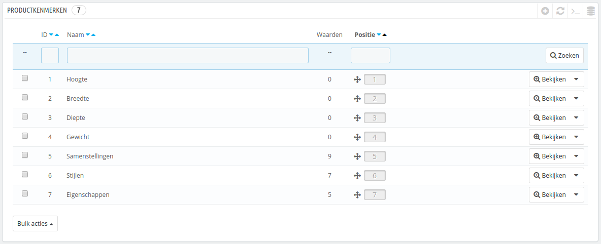
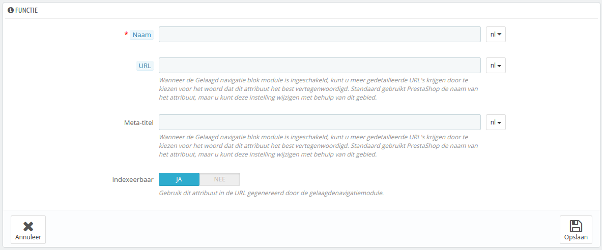
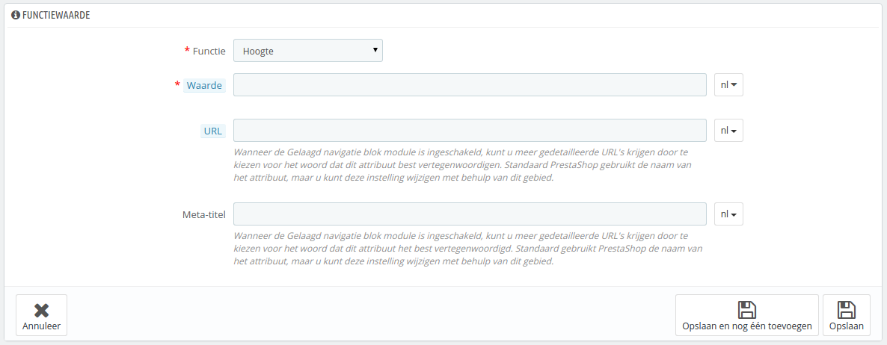

# Productkenmerken beheren

Kenmerken zijn de intrinsieke eigenschappen van een product: ze zijn hetzelfde voor alle mogelijke productvariaties (of "combinaties").\
Kenmerken zijn bijna identiek aan attributen met het enige verschil dat u geen productvariaties aan kunt maken met productkenmerken.

Het verschil tussen een attribuut en een kenmerk hangt af van het product zelf. Sommige producten kunnen dezelfde eigenschap delen, één daarvan is een attribuut bedoeld om productvariaties te bouwen en een ander wordt toegevoegd omdat het een onveranderlijke eigenschap is.

Voorbeeld: een klant an een iPod kopen waarvan de variatie is gebaseerd op attributen (kleur, diskruimte), maar niet op kenmerken (gewicht, afmetingen).

Zo kan een andere winkel variaties op t-shirts verkopen gebaseerd op attributen (kleur, afmetingen, geslacht), maar niet op kenmerken (gewicht).

Attributen worden geconfigureerd per product, vanuit de pagina "Producten" onder het "Catalogus"-menu, maar ze moeten eerst worden vastgelegd in uw winkel op de pagina "Productkenmerken", te vinden onder "Catalogus".

U kunt de volgorde van de kenmerken aanpassen met de pijl-iconen.

De "Acties"-kolom geeft een "Bewerken"-actie, een "Verwijderen"-actie en een "Bekijken"-actie welke u kunt gebruiken om de beschikbare waarden van dit kenmerk weer te geven.\
Vanaf daar kunt u waarden sorteren, bewerken of verwijderen als u dat wilt.

## Een kenmerk toevoegen 

Klik op "Voeg een nieuw kenmerk toe". Een erg simpel formulier verschijnt. Dit is waar u de kenmerk een naam geeft: bijvoorbeeld de type headphones die bij een MP3-speler horen.

Geef deze nieuwe kenmerk een naam en bewaar de nieuwe kenmerk om terug te gaan naar de attributenlijst.

Als u de module "Gelaagd navigatie blok" inschakelt verschijnen er drie extra opties. Deze zijn niet direct gerelateerd aan de module: ze biede een directe URL voor elke productvariatie. Op deze manier kan een klant de correcte link sturen naar een vriend, maar dit zorgt er ook voor dat uw ranking in zoekmachines wordt verbeterd.

* **URL**. Het woord om te gebruiken in de URL. Standaard gaat PrestaShop voor de openbare naam van het kenmerk.
* **Meta-titel**. Het woord om te gebruiken in de paginatitel. Standaard gebruikt PrestaShop de openbare naam van het kenmerk.
* **Indexeerbaar**. Of zoekmachines dit kenmerk mogen indexeren of niet.

De klant kan de URL opzoeken door te klikken op het kenmerk vanaf de productpagina: de URL veranderd om een laatste detail toe te voegen, bijvoorbeeld `#/kleur-metaal` of `#/diskruimte-16gb/kleur-groen`.

De gelaagde navigatiegenerator maakt ook gebruik van deze waarden, vanwaar de omschrijvende tekst: "Gebruik dit kenmerk in de URL gegenereerd door de gelaagdenavigatiemodule".

## Een nieuwe waarde aan het kenmerk toevoegen 

Klik op "Voeg nieuwe kenmerk waarde toe". Een nieuw formulier verschijnt.

Vul het formulier in:

* **Functie**. Kies één van de beschikbare kenmerken vanuit de lijst.
* **Waarde**. Geef de attribuut een waarde: "5 lbs", "27 cm", etc.

...en bewaar de waarde van uw kenmerk. U kunt meer waardes toevoegen voor hetzelfde kenmerk door uw veranderingen te bewaren met de knop "Opslaan en nog één toevoegen".

Als u de module "Gelaagd navigatie blok" inschakelt verschijnen er twee extra opties. Deze zijn niet direct gerelateerd aan de module: ze biede een directe URL voor elke productvariatie. Op deze manier kan een klant de correcte link sturen naar een vriend, maar dit zorgt er ook voor dat uw ranking in zoekmachines wordt verbeterd.

* **URL**. Het woord om te gebruiken in de URL. Standaard gaat PrestaShop voor de openbare naam van het kenmerk.
* **Meta-titel**. Het woord om te gebruiken in de paginatitel. Standaard gebruikt PrestaShop de openbare naam van het kenmerk.

De klant kan de URL opzoeken door te klikken op het kenmerk vanaf de productpagina: de URL veranderd om een laatste detail toe te voegen, bijvoorbeeld `#/kleur-metaal` of `#/diskruimte-16gb/kleur-groen`.
