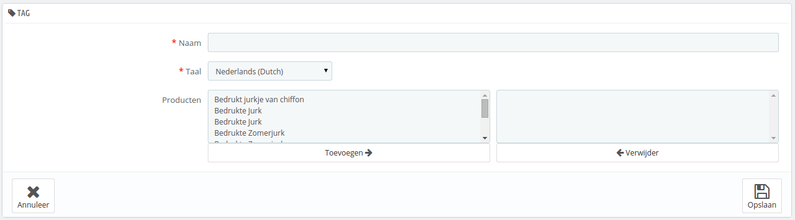

# Tags beheren

De tagging-mogelijkheid zorgt ervoor dat u uw producten kunt koppelen aan sleutelwoorden. Uw klanten kunnen de sleutelwoorden gebruiken om gemakkelijk en snel de producten te vinden waar ze naar op zoek zijn.

Voorbeeld: stel dat een klant op zoek is naar een MP3-speler in uw winkel Om het product te vinden die de klant zoekt, moet er een tag zijn om "MP3-speler" te linken aan "iPod Nano".

Producttags zijn niet hetzelfde als sleutelwoorden op een pagina: ze hebben geen directe invloed op de rangschikking binnen zoekmachines.

Om te werken aan uw ranking opent u het "SEO"-tabblad van elke productpagina in uw backoffice.

U hebt twee manieren om deze feature in te stellen.

## Eerste manier: Bij het aanmaken van een product 

U kunt verschillende tags koppelen aan uw product vanaf het moment dat u het aanmaakt in PrestaShop, direct in het "Tags"-veld op het "Informatie"-tabblad. Bekijk de hoofdstukken [Producten beheren](producten-beheren.md) en [Categoriën beheren](categorieen-beheren.md) voor meer informatie.

## Tweede manier: Tags beheren 

De "Tags"-pagina onder het "Catalogus"-menu zorgt ervoor dat u nieuwe tags kunt aanmaken en de huidige kunt beheren. Zodra u tags hebt gekoppeld aan uw producten krijgt u een belangrijke lijst aaan tags. De "Tags"-pagina helpt u bij het beheren hiervan.

Om een nieuwe aan te maken klikt u op "Nieuwe tag toevoegen" en een formulier, waarin u een nieuwe tag kunt toevoegen, verschijnt.

Deze interface maakt het mogelijk om tags toe te voegen aan uw producten.

* **Naam**. Geef uw tag een naam. Het zou kort en krachtig moeten zijn, zodat u klanten kunt helpen bij het vinden van de juiste producten.
* **Taal**. Geeft aan in elke taal de tag moet verschijnen in uw winkel. PrestaShop is slim genoeg om Spaanse sleutelwoorden te tonen aan klanten die de Franse versie van de site gebruiken, bijvoorbeeld.
* **Producten**. Verplaats de producten waar u de tag aan wilt toevoegen naar de rechterkolom. Houd CTRL ingedrukt om meerdere producten tegelijk te selecteren.

Zodra u de pagina opslaat, wordt de tag gekoppeld aan alle producten aan de rechterkant.

Om een tag toe te voegen voor een andere taal herhaalt u de stap, maar deze keer verandert u de taal.

Nadat de tag bewaard is, wordt u doorgeleid naar de lijst van tags, waar u ze kunt bewerken of verwijderen. Ook kunt u ze in bulk verwijderen door de knop aan de onderkant van de lijst te gebruiken.\
Naast de bewerken- en verwijderen-knop geeft een getal aan hoeveel van uw producten de tag gebruiken.

Vanaf nu, wanneer uw klanten in uw winkel zoeken, zijn de zoekresultaten ook afhankelijk van de tags die u aan de producten hebt gekoppeld.
