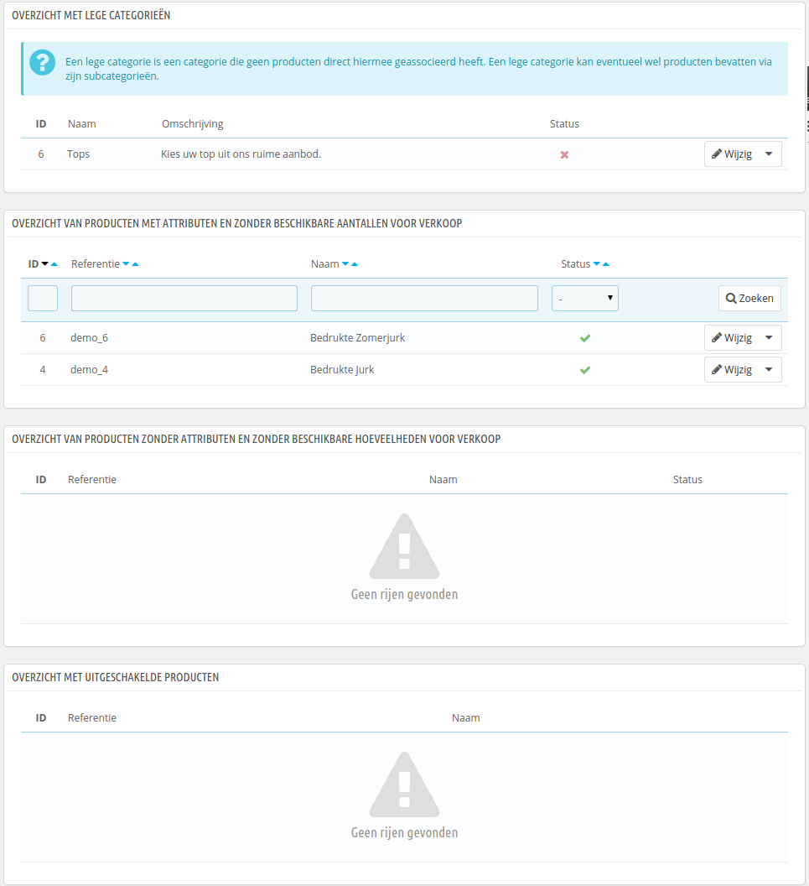

# Uw catalogus monitoren

De pagina "Monitoring" geeft de secties weer van uw winkel waar u de meeste aandacht aan moet schenken, om zo goed mogelijk u catalogus te beheren, en ervoor te zorgen dat niets uit de hand loopt.

Er worden vier secties getoond:

* **Overzicht met lege categoriën**. Geeft u de categoriën die geen producten hebben. U moet deze verwijderen of vullen met ten minste één product. Dit voorkomt dat bezoekers een lege categorie tegenkomen.
* **Overzicht van producten met attributen en zonder beschikbare aantallen voor verkoop**. Geeft aan welke producten niet langer te koop zijn. Als u geen goede hebt om deze uit de verkoop te halen, zet u ze weer terug online.
* **Overzicht van producten zonder attributen en zonder beschikbare hoeveelheden voor verkoop**. Zelfde als bovenstaande. Het toont producten die niet langer te koop zijn. Zoek naar de reden of zet ze weer online.
* **Overzicht met uitgeschakelde producten**. Geeft de producten die zijn uitgeschakeld in de winkel en die niet zichtbaar zijn voor klanten. Probeer ze of in te schakelen (nadat ze weer op voorraad zijn gebracht) of verwijder ze van uw catalogus.

Deze pagina moet regelmatig worden bezocht om het beheer van uw catalogus te verbeteren.
