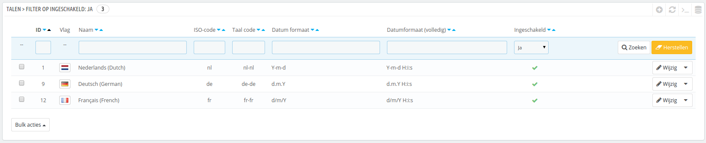

# Eerste stappen met PrestaShop 1.6

**Inhoudsopgave**

/\*\<!\[CDATA\[\*/\
div.rbtoc1597237784912 {padding: 0px;}\
div.rbtoc1597237784912 ul {list-style: disc;margin-left: 0px;}\
div.rbtoc1597237784912 li {margin-left: 0px;padding-left: 0px;}\
\
/\*]]>\*/

* [Eerste stappen met PrestaShop 1.6](eerste-stappen-met-prestashop-1.6.md#EerstestappenmetPrestaShop1.6-EerstestappenmetPrestaShop1.6)
  * [Uw winkel uitschakelen](eerste-stappen-met-prestashop-1.6.md#EerstestappenmetPrestaShop1.6-Uwwinkeluitschakelen)
  * [Demonstratiedata verwijderen](eerste-stappen-met-prestashop-1.6.md#EerstestappenmetPrestaShop1.6-Demonstratiedataverwijderen)
  * [De informatie van uw winkel configureren](eerste-stappen-met-prestashop-1.6.md#EerstestappenmetPrestaShop1.6-Deinformatievanuwwinkelconfigureren)
    * [De basisinstellingen van de winkel](eerste-stappen-met-prestashop-1.6.md#EerstestappenmetPrestaShop1.6-Debasisinstellingenvandewinkel)
    * [Winkeltalen](eerste-stappen-met-prestashop-1.6.md#EerstestappenmetPrestaShop1.6-Winkeltalen)
    * [Medewerkersinformatie](eerste-stappen-met-prestashop-1.6.md#EerstestappenmetPrestaShop1.6-Medewerkersinformatie)
  * [Uw betaalmethoden configureren](eerste-stappen-met-prestashop-1.6.md#EerstestappenmetPrestaShop1.6-Uwbetaalmethodenconfigureren)
  * [Vervoerders en verzending configureren](eerste-stappen-met-prestashop-1.6.md#EerstestappenmetPrestaShop1.6-Vervoerdersenverzendingconfigureren)
  * [Kies uw thema](eerste-stappen-met-prestashop-1.6.md#EerstestappenmetPrestaShop1.6-Kiesuwthema)
  * [Kies uw modules](eerste-stappen-met-prestashop-1.6.md#EerstestappenmetPrestaShop1.6-Kiesuwmodules)
  * [Uw producten en productcategoriën aanmaken](eerste-stappen-met-prestashop-1.6.md#EerstestappenmetPrestaShop1.6-Uwproductenenproductcategoriënaanmaken)
  * [Uw eigen statische content aanmaken](eerste-stappen-met-prestashop-1.6.md#EerstestappenmetPrestaShop1.6-Uweigenstatischecontentaanmaken)
  * [Uw topmenu bouwen](eerste-stappen-met-prestashop-1.6.md#EerstestappenmetPrestaShop1.6-Uwtopmenubouwen)
  * [Uw winkel inschakelen](eerste-stappen-met-prestashop-1.6.md#EerstestappenmetPrestaShop1.6-Uwwinkelinschakelen)

## Eerste stappen met PrestaShop 1.6 

U moet flink wat tijd besteden om ervoor te zorgen dat elk gedeelte van uw toekomstige webwinkel goed is ingesteld, beveiligd en klaar is om te gebruiken.

Ondanks dat PrestaShop het gemakkelijk voor u maakt om het te installeren en uw bedrijf op te bouwen, kan het niet slechts in 5 tellen worden opgezet: u heeft te maken met producten, klanten, vervoerders en bovenal met echt geld dat vanaf uw klanten naar uw bankrekening stroomt. We willen benadrukken dat u er zeker van wilt zijn dat er niets faalt tijdens het proces waarin een bestelling wordt bevestig, het product wordt opgezocht in uw magazijn, wordt verpakt en verscheept naar uw klanten. Laat staan dat er een onverwachts probleem tijdens het proces optreedt.

PrestaShop is een erg complete tool en het aantal mogelijkheden kan in het begin overweldigend zijn. Dit hoofdstuk leidt u door een aantal basisstappen om uw winkel gereed te maken voor de grote opening. Veel kan en moet gebeuren voordat u uw bedrijf kunt lanceren, maar deze stappen zijn de noodzakelijke stappen die binnen elke winkel genomen moeten worden.

### Uw winkel uitschakelen 

We gaan ervan uit dat het nog net geen uur geleden is sinds u PrestaShop hebt geïnstalleerd.

Het uitschakelen van uw winkel betekent dat niemand toegang hebt terwijl u druk bent met het maken van veranderingen, producten creëren, prijzen en belastingen instellen, betaalmodules installeren, een nieuw thema, vervoersders instellen... Dit wordt ook wel "uw winkel in onderhoudsmodus zetten" genoemd.

In uw backoffice gaat u naar "Instellingen > Onderhoud". Deze pagina bevat twee simpele instellingen:

* **Schakel winkel in.** Zet deze schakelaar op "Nee" en uw frontend zal de onderhoudspagina tonen aan uw bezoerkers. Deze pagina geeft aan dat uw winkel binnenkort weer bereikbaar is. ****&#x20;
* **Onderhouds IP.** Dit is waar u uw eigen IP-adres moet invoeren, zodat u nog steeds toegang hebt tot uw winkel en door de winkel kunt navigeren alsof deze nog gewoon beschikbaar is. Dit noodzakelijk om te doen, want elke keer als u onderhoud pleegt aan uw winkel zult u door uw frontend willen bladeren. Klik op de knop "Voeg mijn IP toe". U kunt meerdere IP-adressen toevoegen door ze te scheiden met een komma.

Als u al besloten hebt wat uw thema's en producten zijn, kunt u uw winkel in Catalogusmodus zetten. Dit betekent dat uw klanten door uw winkel kunnen bladeren, maar de prijzen worden niet weergegeven en het is niet mogelijk om producten toe te voegen aan het winkelmandje, totdat u Catalogusmodus hebt uitgeschakeld.

U kunt deze functionaliteit inschakelen door te navigeren naar "Instellingen > Producten". Het is de eerste optie.

### Demonstratiedata verwijderen 

De standaardinstallatie heeft een handvol producten – hoofdzakelijk vrouwenkleding. Het nut van deze producten is u te helpen bij het inrichten van een echte winkel. Nadat u geleerd heeft hoe producten, categoriën, bestellingen en klanten gekoppeld worden, kunt u al deze items verwijderen om met een schone winkel te beginnen.

U moet daarom alle standaarddata verwijderen. Dat zijn:

* producten en hun...
  * categoriën
  * attributen
  * kenmerken
  * fabrikanten
  * leveranciers
  * image mappings (PrestaShop 1.4/1.5)
  * tags
* bestellingen
  * bestellingsberichten
* klanten
  * winkelwagens
* vervoerders
  * prijsranges
  * gewichten
* contact & winkels (verwijderen of aanpassen aan uw winkel)
* CMS-pagina's (verwijderen of aanpassen aan uw winkel)

Dit zou betekenen dat u door alle verschillende schermen moet navigeren in de backoffice en de inhoud één voor één verwijderen, maar gelukkig is er een betere manier:

1. Ga naar "Modules > Modules".
2. Zoek naar "PrestaShop Opschoner" en klik op de knop "Installeren".
3. U wordt meteen naar de configuratiepagina geleid (zo niet, klik op de knop "Configureer").
4. Lees en accepteer de waarschuwing, klik daarna op "Verwijder de catalogus": het verwijdert al uw producten en de bijbehorende attributen, fabrikanten, etc.
5. Lees en accepteerd de waarschuwing, klik daarna op "Verwijder bestellingen en klanten": het verwijdert als uw klanten en de bijbehorende bestellingen, winkelwagens, etc.&#x20;
6. Klik op de knop "Controleer & corrigeer" om de integriteitsbeperkingen van uw database te corrigeren.
7. Klik op de knop "Schoonmaken & Optimaliseren" om de fysieke opslag van datatabellen en de geassocieerde indexdata op te schonen en te verkleinen. Hiermee vergroot u de I/O efficiency wanneer de tabellen worden opgevraagd.

ER IS GEEN WEG TERUG. Klik alleen op deze knoppen als u de database wilt legen de standaardcontent wilt verwijderen.

### De informatie van uw winkel configureren 

Nu dat u een opgeschoonde winkel hebt, kunt u beginnen met aanpassen en dat impliceert dat u alles instelt zoals u dat wilt. Te beginnen met uw persoonlijke informatie en instellingen.

#### De basisinstellingen van de winkel 

U moet aandacht schenken aan de volgende instellingen, de meeste hiervan zijn belangrijk omdat ze op de frontoffice worden getoond, en daarom in het zicht zijn van uw klanten.

Sommige van deze instellingen vereisen dat u een module configureert in plaats van het aanpassen van PrestaShop's instellingen.

Het configureren van een module is gemakkelijk:

1. Ga naar de pagina "Modules" onder het menuitem "Modules".
2. Type de naam van de module (of een gedeelte) in de zoekbox. Het toont de zoekresultaten al tijdens het typen.
3. Wanner de module is gevonden, klik op de knop "Configureer" en volg de instructies.

Voor elke module die hier wordt getoond, kunt u de documentatie lezen voor meer informatie.

| Instelling                                      | Beschrijving                                                                                                                                                                                                                                                                                                                                                                                        | Locatie                                                                                                                                                                                                                                                                                                                                                                                                                                                                                                                                                          |
| ----------------------------------------------- | --------------------------------------------------------------------------------------------------------------------------------------------------------------------------------------------------------------------------------------------------------------------------------------------------------------------------------------------------------------------------------------------------- | ---------------------------------------------------------------------------------------------------------------------------------------------------------------------------------------------------------------------------------------------------------------------------------------------------------------------------------------------------------------------------------------------------------------------------------------------------------------------------------------------------------------------------------------------------------------- |
| Winkel naam                                     | Geeft uw merk weer, vooral goed zichtbaar in zoekmachines (Google, Yahoo!, Bing...).                                                                                                                                                                                                                                                                                                                | "Instellingen", daarna "Winkelcontacten". In het gedeelte "Contactgegevens" vindt u de optie "Winkel naam".                                                                                                                                                                                                                                                                                                                                                                                                                                                      |
| Winkellogo                                      | Deze toont uw merk visueel. Het standaardlogo bevat de tekst "Your Logo" om u erop te duiden dat u zo snel mogelijk het logo moet wijzigen. Het wordt op elke pagina van de winkel getoond, alsook op de facturen en andere geautomatiseerde e-mails.                                                                                                                                               | "Instellingen", daarna "Thema's". In het gedeelte "Uw huidig thema" kunt u de logo's aanpassen.                                                                                                                                                                                                                                                                                                                                                                                                                                                                  |
| Standaard winkelvaluta                          | De valuta die u wilt gebruiken voor de standaardprijs van uw producten.                                                                                                                                                                                                                                                                                                                             | 
"Localisatie", daarna weer "Localisatie". In het gedeelte "Configuratie" is u de optie "Standaardvaluta". Als de valuta niet beschikbaar is, moet u eerst nog een localisatiepakket importeren voor de desbetreffende valuta: gebruik de sectie "Importeren localisatie pakket", op dezelfde pagina, om een pakket te importeren.
                                                                                                                                                                                                                      |
| Informatie over klantenservice                  | Een blok met daarin het telefoonnummer van uw klantenservice en een knop om u een e-mail te zenden. Deze wordt in de rechterkolom van de frontoffice getoond.                                                                                                                                                                                                                                       | "Contactblock" module.                                                                                                                                                                                                                                                                                                                                                                                                                                                                                                                                           |
| 
Bedrijfsinformatie/ Contactinformatie
 | Een blok met daarin uw contactadres, het telefoonnummer van uw klantenservice en een link om u een e-mail te sturen. Deze wordt in de footer van de frontoffice getoond.                                                                                                                                                                                                                            | "Contactinformatieblok" module.                                                                                                                                                                                                                                                                                                                                                                                                                                                                                                                                  |
| Advertentie                                     | Een blik met daarin een afbeelding met een link naar een andere pagina. Deze wordt getoond in de frontoffice, linkerkolom.                                                                                                                                                                                                                                                                          | "Advertentieblok" module.                                                                                                                                                                                                                                                                                                                                                                                                                                                                                                                                        |
| Afbeeldingslider                                | Deze slider toont een aantal afbeeldingen die na elkaar in beeld verschijnen. Het laat een sterke visuele indruk achter op uw winkel en producten. Deze wordt meestal bovenaan in het midden geplaatst op de homepage.                                                                                                                                                                              | "Afbeelding slider voor uw homepage" module.                                                                                                                                                                                                                                                                                                                                                                                                                                                                                                                     |
| CMS-pagina's                                    | De inhoud van statische pagina's, zoals "Over ons", "Levering", "Wettelijke Mededeling", "Gebruiksvoorwaarden" en "Veilige betaling". Sommige hiervan zijn al gevuld met content die u kunt aanpassen aan uw eigen bedrijf; andere zijn leeg en hier kunt u uw eigen tekst plaatsen. Deze worden weergegeven op het "Informatie"-blok in de linkerkolom, en onder de kop "Informatie" in de footer. | "Instellingen" menu, "CMS, daarna kunt u de pagina's aanmaken en wijzigen.                                                                                                                                                                                                                                                                                                                                                                                                                                                                                       |
| Sociale media                                   | 
Een blok met drie links: de Facebookpagina van uw winkel, het Twitteraccount, Pinterest, Instagram, Google+ en de RSS-feed voor het blog van uw bedrijf (of evenementen). Standaard gaan deze drie links naar de website van PrestaShop zelf. Het is belangrijk dat u de links wijzigt naar uw eigen sociale media. Dit blok wordt getoond in de footer naast "Volg ons".
                 | "Blok sociaal" module.                                                                                                                                                                                                                                                                                                                                                                                                                                                                                                                                           |
| Horizontaal top menu                            | De bovenkant van het standaardthema gebruikt een topmenu om de categoriën aan te geven waar de gebruiker naar kan navigeren, maar ook links naar andere locaties – de standaardinstallatie heeft bijvoorbeeld een "Blok" link die u naar het officiële blok van PrestaShop stuurt.                                                                                                                  | "Horizontaal top menu" module.                                                                                                                                                                                                                                                                                                                                                                                                                                                                                                                                   |
| Homepage inhoud                                 | Het standaardthema heeft veel democontent: tekst, afbeeldingen, links, etc. Als u dit dit thema graag wilt gebruiken in plaats van een nieuwe te kopen, dan moet u er eerst voor zorgen dat de standaardcontent is verdwenen.                                                                                                                                                                       | 
"Themaconfiguratie" module: deze module kan een aantal dingen aan uw thema aanpassen. Het zorgt er vooral voor dat u bepaald features in en uit kunt schakelen (sociale media, topbanner, betaallogo's, etc.), en wellicht nog wel belangrijker, het zorgt ervoor dat u gemakkelijk afbeeldingen kunt toevoegen aan uw homepage.

"Aangepast CMS-informatieblok" module: deze module zorgt ervoor dat u de twee laatste blokken aan de onderkant van de homepage kunt beheren, vlak boven de footer: de blokken met "Lorem Ipsum" en "Custom Block".
 |

Dit zijn de meest zichtbare standaardinstellingen op uw frontend – in ieder geval bij het standaardthema.\
De "Locatie" kolom helpt u de plaats te vinden waar u de interface kunt vinden om deze aspecten van uw winkel aan te passen. Deze handleiding heeft nog meer informatie over elk gedeelte van de interface.

#### Winkeltalen 

PrestaShop werkt met veel talen, zowel op de frontoffice als backoffice. Zodra er meer dan één taal is ingeschakeld in uw backoffice, dan wordt elk tekstveld in de backoffice voorzien van een taalselectie, deze geeft de huidige taal aan en u kunt hierop klikken om een andere taal te selecteren.

Standaard is PrestAshop geïnstalleerd met de taal die u gekozen hebt. Om de talen te beheren gaat u naar: "Localisatie > Talen". Het toont een tabel met beschikbare talen.

De huidige talen die zijn ingeschakeld hebben een groen vinkje, terwijl de uitschakelde talen een rood kruisje hebben. Klik op dit icoon om de desbetreffende taal in of uit te schakelen.

U kunt veel talen installeren en inschakelen als u denkt dat uw winkel ze nodig heeft, maar wees er wel van bewust dat u alle content voor de talen moet vertalen: productnamen, beschrijvingen, tags, categorienamen- en beschrijvingen, statische content (CMS-pagina's), moduleinstellingen, etc.

U kunt gemakkelijk veel talen importeren via "Localisatie > Localisatie" en ze inschakelen via de pagina "Localisatie > Talen".

#### Medewerkersinformatie 

Als u medewerkers hebt in uw winkel (familie, vrienden of betaalde medewerkers), u moet er zeker van zijn dat u voor iedereen een eigen account hebt – alleen al om te weten wie welke recente wijziging heeft gedaan. Het andere voordeel is dat u specifieke profielen kunt toewijzen en specifieke toegangsrechten kunt instellen voor de backoffice. U wilt bijvoorbeeld niet dat iedereen toegang heeft tot uw statistieken, uw facturen of betaalinstellingen.

Om een nieuw medewerkersaccount aan te maken gaat u naar het "Administratie"-menu, selecteert u "Medewerkers" en klikt u op de knop "Voeg een nieuwe werknemer toe". Geef deze een naam, zoals "Martin Doe" of "Inpakmedewerker" en sla de informatie op.\
Een account kan gebruikt worden voor zoveel mensen als nodig is, maar we adviseren u om elk persoon een eigen account toe te wijzen.

Nu dat u een account heeft voor deze werknemer moet u dit account specifieke toegangsrechten geven, gevolgd door de taken van de medewerker. Een nieuw profiel kan bijvoorbeeld niet veel doen. Het is aan u om precies de toegang in te stellen voor alle delen van uw webwinkel waar de werknemer toegang tot heeft. Het kan een tijdrovende tak zijn, maar wel een zeer belangrijke.\
Om permissies toe te wijzen aan een medewerkersaccount, moet u de optie "Profiel" gebruiken op de configuratiepagina waarmee u een nieuwe medewerker aanmaakt of wijzigt. Deze optie laat u een profiel kiezen voor het desbetreffende account (SuperAdmin, Vertaler, etc.).

U kunt deze permissies als volgt wijzigen: ga naar het menu "Administratie", selecteer "Permissies" en kies het profiel dat u wilt wijzigen. Een lange lijst aan permissies verschijnt: wijzig deze zoals u wilt. Uw veranderingen worden automatisch opgeslagen.

### Uw betaalmethoden configureren 

Uw winkel is bedoeld om geld mee te verdienen en dit kan realiteit worden als u op zijn minst één betaalmodule gebruikt. Verschillende modules zijn als beschikbaar in de standaardinstallatie, waar u ze kunt installeren en wijzigen (vanaf de "Modules"-pagina, onder het "Modules"-menu in de categorie "Betaalmethoden en gateways". Plaats restricties op deze modules (onder de menuitem "Betaling" onder het "Modules"-menu"). Veel betaalmodules vereisen dat u eerst een account aanmaakt op hun website voor de service die ze bieden.

Bekijk [Modules voor betaalmethoden en gateways](vooraf-geinstalleerde-modules-gebruiken/modules-voor-betaalmethoden-en-gateways.md) voor meer informatie.

U kunt ook andere betaalmodules installeren die gedownload zijn vanaf de Addons marktplaats: [http://addons.prestashop.com/nl/4-payment-modules-prestashophttp://addons.prestashop.com/nl/4-payment-modules-prestashop](http://addons.prestashop.com/nl/4-payment-modules-prestashop)

Cheque en Bankoverschrijving zijn de enige twee betaalmethodes die standaard zijn ingeschakeld. Als u ervoor kiest om deze te behouden, dan **moet** u deze configureren met uw informatie: bankrekening, bankrekeninghouder, bankgegevens (IBAN, BIC, etc.).

Deze betaalmethodes worden geconfigureerd door de "Bankoverschrijving" en "Cheque" modules, welke u kunt vinden onder de categorie "Betaalmethoden en gateways" in de modulelijst.

### Vervoerders en verzending configureren 

Producten die gekocht worden in uw winkel moeten verscheept worden naar klanten – tenzij u slechts virtuele producten verkoopt; in dat geval is het "Verzending"-menu niet nuttig voor u.

Ongeacht of u uw producten per (pakket)post verzendt of een contract heeft met een koerier, u moet deze informatie in PrestaShop instellen.

Bekijk het hoofdstuk [Zendingen beheren](zendingen-beheren/) van deze handleiding om meer te weten te komen over verzending en vervoerders.

**Retouren zijn standaard uitgeschakeld.** Als u wilt dat uw klanten retouren kunnen aanvragen en in ruil daarvoor een voordeelbon of geld terug ontvangen, dan kunt u dat wijzigen met de optie "Retouren inschakelen" in het gedeelte met de naam "Goederenretourzending opties" op de configuratiepagina "Catalogus > Bestellingen".\
Retouren worden verder behandeld in hoofdstuk [Bestellingen beheren](bestellingen-beheren/).

### Kies uw thema 

Uw shop moet zijn eigen thema hebben om opvallend te kunnen zijn en des te beter het herkend wordt en waarmee het zich kan onderscheiden van de talrijke andere webwinkels.

Er zijn veel thema's om uit te kiezen op de PrestaShop Addons-marktplaats: [http://addons.prestashop.com/nl/3-templates-prestashop](http://addons.prestashop.com/nl/3-templates-prestashop).

Zodra uw thema is geïnstalleerd, kunt u het volledig verkennen om straks gemakkelijk de weg te vinden en uw klanten uit de brand helpen. Lees ook de bijbehorende documentatie.

U kunt sommige eigenschappen van het thema aanpassen, zoals het logo. Dit wordt gedaan op de configuratiepagina "Thema's", deze kunt u vinden onder het menu "Instellingen".

### Kies uw modules 

PrestaShop wordt gebundeld met meer dan honder modules. Deze zijn erg verschillend: analytics, frontoffice-functies, betaling, verzending... U moet alle modules volledig verkennen om zeker te weten welke u wel en welke u niet wilt inschakelen.

Bekijk de hoofdstukken [Modules en thema's beheren](modules-en-themas-beheren/) en [Vooraf geïnstalleerde modules gebruiken](vooraf-geinstalleerde-modules-gebruiken/) om meer over de modules te leren.

U kunt ook veel andere soorten modules vinden in de Addons-marktplaats: [http://addons.prestashop.com/nl/2-modules-prestashop](http://addons.prestashop.com/nl/2-modules-prestashop)

Elke keer als u een module activeert en configureert, zorgt u er dan voor dat deze goed werkt binnen uw eigen thema, in het geval de module iets op de frontend van de winkel wijzigt.

### Uw producten en productcategoriën aanmaken 

Dit wordt in detail beschreven in de hoofdstuk [Producten beheren](de-catalogus-beheren/producten-beheren.md) en [Categoriën beheren](de-catalogus-beheren/categorieen-beheren.md).

### Uw eigen statische content aanmaken 

Als u dit nog niet gedaan hebt, zult u de tijd moeten nemen om content te schrijven voor de verschillende statisch pagina's die al beschikbaar zijn in uw PrestaShop-installatie of degene waarvan u denkt dat het noodzakelijk is om aan te passen.

Sommige pagina's bestaan al, maar u moet de content van deze pagina's nog triple-checken, want deze teksten zijn vaak juridisch bindend en kunnen nog meer consequenties hebben.

De standardpagina's zijn "Over ons", "Levering", "Wettelijke Mededeling", "Gebruiksvoorwaarden" en "Veilige betaling". Sommige hebben al content, die u nog moet bijwerken, andere zijn leeg en daar moet u nog uw eigen content in plakken.\
Om deze pagina's te bewerken gaat u naar "Instellingen > CMS", daarna kiest u welke pagina u wilt bewerken of maakt u hier een nieuwe aan.

U kunt zoveel pagina's aanmaken als u zelf wilt.

### Uw topmenu bouwen 

Nu dat u productcategoriën en CMS-pagina's hebt, moet u deze nog in een logische en opvallende manier plaatsen in het topmenu.

Dit wordt gedaan met de module "Horizontaal top menu": ga naar de pagina "Modules", type "menu" in de zoekbalk en u zou de module moeten kunnen vinden. Schakel deze in, als het nog is uitgeschakeld, configureer het: verwijder pagina's of categoriën die u liever verbergt, voeg andere pagina's toe en verplaats de inhoud. Net zolang tot u tevreden bent met de indeling van uw menu.

### Uw winkel inschakelen 

Nu dat alles is ingesteld kunt u eindelijk uw winkel beschikbaar maken voor het publiek.

Navigeer naar "Instellingen / Onderhoud" en wijzig twee opties:

* **Schakel winkel in.** Zet deze schakelaar terug op "Ja".
* **Onderhouds IP.** Verwijder uw eigen IP-adres.

Uw winkel is nu helemaal klaar om de eerste bezoekers te ontvangen... en bestellingen aan te nemen!
