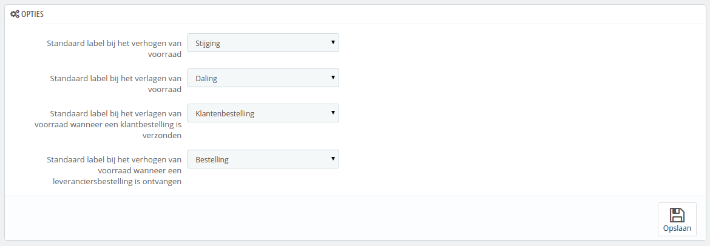

# Voorraadbeheer-interface

/\*\<!\[CDATA\[\*/\
div.rbtoc1597237804595 {padding: 0px;}\
div.rbtoc1597237804595 ul {list-style: disc;margin-left: 0px;}\
div.rbtoc1597237804595 li {margin-left: 0px;padding-left: 0px;}\
\
/\*]]>\*/

* [Voorraadbeheer-interface](voorraadbeheer-interface.md#Voorraadbeheer-interface-Voorraadbeheer-interface)
  * [Voorraadbeheer op de productpagina](voorraadbeheer-interface.md#Voorraadbeheer-interface-Voorraadbeheeropdeproductpagina)
  * [Magazijnbeheer 2](voorraadbeheer-interface.md#Voorraadbeheer-interface-Magazijnbeheer2)
  * [Voorraadbeheer](voorraadbeheer-interface.md#Voorraadbeheer-interface-Voorraadbeheer)
  * [Voorraadverplaatsing](voorraadbeheer-interface.md#Voorraadbeheer-interface-Voorraadverplaatsing)
  * [Huidige voorraad status](voorraadbeheer-interface.md#Voorraadbeheer-interface-Huidigevoorraadstatus)
  * [Vooraaddekking](voorraadbeheer-interface.md#Voorraadbeheer-interface-Vooraaddekking)
  * [Leveranciersbestellingen](voorraadbeheer-interface.md#Voorraadbeheer-interface-Leveranciersbestellingen)
  * [Configuratie](voorraadbeheer-interface.md#Voorraadbeheer-interface-Configuratie)

Voorraadbeheer is belangrijk vanaf het moment dat u begint met het verkopen van producten waarvan de voorraad op kan raken.\
Om te bepalen of u behoefte hebt aan het gebruik van PrestaShop's voorraadbeheer, kunt u het vorige hoofdstuk raadplegen: [Algemene concepten](algemene-concepten.md).

Als u gebruik wilt maken van geavanceerd voorraadbeheer, dan moet u:

* Uw producten koppelen aan magazijnen.
* Uw magazijnen koppelen aan vervoerders.
* Uw magazijnen koppelen aan de juiste winkels.

Voorraadbeheer binnen PrestaShop is zichtbaar op verschillende schermen en kan op één van de twee niveaus worden gebruikt.

Deze niveaus zijn:

* Geen voorraadbeheer: er is geen producthoeveelheid, PrestaShop gaat er vanuit dat de voorraad van een product oneindig is. Gebruik dit als u enkel virtuele producten verkoopt (bestanden, services, etc.).
* Basisvoorraadbeheer: voor elk product dat u verkoopt, kunt u aangeven wat de huidige beschikbare hoeveelheid is (inclusief productcombinaties). Gebruik dit als u niet zoveel producten hebt of een eenvoudige opslaglocatie.
* Geavanceerd voorraadbeheer: voor elk product dat u verkoop (en de bijbehorende combinaties), kunt u aangeven waar de beschikbare hoeveelheid gevonden kan worden in een onbeperkt aantal magazijnen (met verschillende vervoerders en taxatiemethoden). U kunt ook uw voorraadverplaatsing inzien, de huidige voorraadstatus, uw voorraaddekking en u kunt een leveranciersbestelling plaatsen.

Deze schermen zijn:

* Instellingen > Producten > Producten voorraad: dit is waar u de feature inschakelt.
  * **Schakel voorraadbeheer in**. Deze optie geeft u toegang tot de opties en functies die horen bij het basisvoorraadbeheersysteem: u kunt de huidige hoeveelheid van een product instellen en PrestaShop deze laten verlagen bij elke bestelling, en het product weer op voorraad brengen zodra de bestelling wordt geannuleerd of terug is gestuurd. Standaard moet u deze functie ingeschakeld laten, omdat het uitschakelen het gehele voorraadbeheersysteem van uw winkel beïnvloedt. Als u geen fysieke voorraad hebt moet u de functie uitschakelen – bijvoorbeeld als u alleen virtuele producten verkoopt.
  * **Schakel geavanceerd voorraadbeheer in**. Een andere optie met veel mogelijkheden: het voegt een nieuwe menu toe genaamd "Voorrraad". Hiermee wordt het mogelijk om uw voorraad nauwgezet te beheren, zelfs per magazijn als dat nodig is. U kunt alle informatie over uw voorraad bekijken: verplaatsing, dekking, leveranciersbestellingen, etc. U kunt meer te weten komen over deze functie in hoofdstuk [Geavanceerd voorraadbeheer](./).
  * **Nieuwe producten gebruiken het geavanceerde voorraadbeheer**. Als dit is ingeschakeld, dan gebruiken nieuwe producten geavanceerd voorraadbeheer. Het standaardmagazijn in het magazijn dat wordt ingesteld in de volgende optie.
  * **Standaard magazijn voor nieuwe producten**. Als nieuwe producten gebruik maken van geavanceerd voorraadbeheer, dan moet u hier het standaardmagazijn opgeven.
* Pagina "Catalogus > Producten > productpagina": één á twee tabbladen wordt toegevoegd aan de bewerkingspagina van een product.\

  * Hoeveelheden:
    * In de standaardmodus: u kunt handmatig het aantal van elk product instellen.
    * In geavanceerde modus: hoeveelheden worden door het menu "Voorraad" afgehandeld.
  * Magazijnen: in de geavanceerde modus kunt u de locatie van producten aangeven of de combinaties daarvan in een magazijn.
* Voorraad: in de geavanceerde modus kunt u gebruik maken van alle voorraadpagina's (magazijnen toevoegen, voorraadverplaatsing, voorraadstatus, voorraaddekking en leveranciersbestellingen).

De volgende sectie beschrijft deze pagina's één voor één.

## Voorraadbeheer op de productpagina 

### Aantallen beheren 

In PrestaShop 1.4 kon u handmatig de aantallen voor verkoop instellen.

In PrestaShop 1.5 en 1.6 kunt u dit nog steeds handmatig doen, maar zodra geavanceerd voorraadbeheer is ingeschakeld, kunt u ook automatisch de hoeveelheid laten bepalen aan de hand van de status van het fysieke product. Het is mogelijk om geavanceerd voorraadbeheer voor alle producten in te schakelen, maar het is ook mogelijk om het voor slechts enkele producten te gebruiken.

Als de optie "Schakel voorraadbeheer in" is ingeschakeld (de pagina "Instellingen > Producten"), dan krijgen alle producten een nieuw tabblad, met de naam "Aantallen" op de administratiepagina's. Deze simpele en duidelijke interface maakt het mogelijk om de beschikbare hoeveelheden voor verkoop in uw winkel in te stellen voor een specifiek product of een productcombinatie.

Met alleen deze optie ingeschakeld, kunt u de aantallen voor losse producten instellen.

Als u liever hebt dat de producthoeveelheden direct beheerd worden door PrestaShop's geavanceerde voorraadbeheer in plaats van per product in te stellen, dan moet nog een optie inschakelen op de pagina "Producten" onder het menu "Instellingen": "Schakel geavanceerd voorraadbeheer in".

Het tabblad "aantallen" opent een nieuwe sectie. Deze sectie wordt gevolgd door de interface om hoeveelheden te beheren. Deze heeft drie opties:

* **Ik wil het geavanceerde voorraadbeheersysteem inschakelen voor dit product**.
* **De beschikbare hoeveelheden voor het huidige product en zijn combinaties zijn gebaseerd op de voorraad in uw magazijn**.
* **Ik wil de beschikbare hoeveelheden handmatig invoeren.**

Standaard is de derde optie ("Ik wil de beschikbare hoeveelheden handmatig invoeren") ingeschakeld. Zolang u de eerste optie niet hebt aangevinkt ("Ik wil het geavanceerde voorraadbeheersysteem inschakelen voor dit product"), worden hoeveelheden op dezelfde manier behandeld als in versie 1.4 van PrestaShop, wat betekent dat u de hoeveelheden handmatig moet bijhouden en PrestaShop verwijderd hoeveelheden bij elke verkoop.

Als u de beschikbare hoeveelheden liever synchroniseert met de voorraad in uw magazijn (of dat van meerdere magazijnen), dan moet u het voorraadsysteem veranderen:

1. Vink de checkbox "Ik wil het geavanceerde voorraadbeheersysteem inschakelen voor dit product" aan om de methode te wijzigen.
2. Dit maakt de tweede optie, "De beschikbare hoeveelheden voor het huidige product en zijn combinaties zijn gebaseerd op de voorraad in uw magazijn", eindelijk beschikbaar. Selecteer deze om de beschikbare hoeveelheid voor dit product te synchroniseren met de productvoorraad in uw magazijn.

Zodra u de tweede optie hebt geselecteerd, kan de kolom "Aantal" niet meer worden aangepast: hoeveelheden worden nu vanuit het geavanceerde voorraadbeheersysteem beheerd, in plaats van het tabblad "Aantallen".

Productpakketten zijn een speciaal geval. Omdat het nog niet mogelijk is om productcombinaties te voegen aan een pakket, hebben PrestaShop-ontwikkelaars besloten dat als het nodig is, PrestaShop de standaardcombinatie gebruikt om de fysieke voorraad te verlagen.

Een waarschuwing geeft ook het aanbevolen maximale aantal pakketten weer.

De rest van het tabblad wordt uitgelegd in hoofdstuk [De catalogus beheren](../de-catalogus-beheren/).

### Leveranciersbeheer 

U kunt nu meer dan één leverancier instellen voor een product. Voor elke leverancier die gekoppeld is aan een product, kunt u het referentienummer van de leverancier en een standaardinkoopprijs voor dat product opgeven; ook voor de combinatie. Deze informatie wordt gebruikt wanneer er een leveranciersbestelling wordt geplaatst.

### Magazijnbeheer 

Als geavanceerd voorraadbeheer is ingeschakeld, dan verschijnt het tabblad "Magazijnen" op de productpagina, waar u kunt aangeven in welk(e) magazijn(en) de producten en combinaties zijn bewaard. U kunt zelfs de locatie voor de producten en combinaties opgeven.

U moet eerst één magazijn aanmaken (zie hieronder), voordat u een product eraan kunt koppelen en de productlocatie kunt instellen. Deze stap is belangrijk: het is belangrijk om minstens één magazijn beschikbaar te hebben voor producten.&#x20;

## Magazijnbeheer 2 

De functie geavanceerd voorraadbeheer maakt het mogelijk om één of meer magazijnen toe te voegen aan uw winkel. Om er een aan te maken gaat u naar de pagina "Magazijnen" onder het menu "Voorraad".

Zodra u een nieuw magazijn hebt aangemaakt, moet u de volgende velden invullen:

* **Referentie** en **Naam**. De unieke refetentie en naam. Zorg ervoor dat u een duidelijke naam kiest: u moet het magazijn kunnen onderscheiden van de rest.
* **Adres**, **Postcode**, **Stad** en **Land**. Het fysieke adres van het magazijn. Deze informatie wordt gebruikt voor leveranciersbestellingen.
* **Beheerder**. Een persoon die het magazijn beheert, gekozen uit de lijst van mederwerkers. Als het account van de medewerker nog niet bestaat, dan moet u deze eerst aanmaken.
* **Vervoerders**. De vervoerders die toestemming hebben om te verschepen vanaf dit magazijn. Houdt de "Ctrl"-toets ingedrukt terwijl u vervoerders selecteert, om er meerdere tegelijk te kunnen selecteren.
* **Beheertype**. Een methode om de waarde van de voorraad te bepalen, gebaseerd op de regels in uw land. Bekijk hoofdstuk [Geavanceerd voorraadbeheer](./) voor meer informatie.
* **Voorraad waardebepalingsvaluta**. Een waardebepalingsvaluta voor de voorraad van dit magazijn.

Het is niet mogelijk om het beheertype ende waardebepalingsvaluta aan te passen zodra deze zijn ingesteld. Als u de informatie moet wijzigen, dan moet u het magazijn opnieuw aanmaken en de verkeerder verwijderen. U kunt slechts een magazijn verwijderen als het geen producten meer bevat.

Wees voorzichtig met de vervoerders die u toegang geeft, het heeft invloed op het verzendproces.

In de situatie waar u meer dan één winkel beheert, moet u ook elke winkel koppelen aan één of meerdere magazijnen. Dit maakt het mogelijk om gelijk in te stellen vanaf welk magazijn de klantbestellingen van een gegeven winkel kunnen worden verzonden.

Zodra de magazijnen zijn aangemaakt, wordt u teruggebracht naar de lijst met magazijnen. Klik op het icoon "Bekijken" aan de rechterkant van de rij om een overzicht van de informatie te krijgen, inclusief referenties van de producten die zijn opgeslagen, de totale hoeveelheid, een algemene waardebepaling, details van de bewaarde producten en de geschiedenis van de voorraadverplaatsing van dat magazijn.

Elke magazijnpagina bevat ook twee links aan de onderkant:

* **Zie productdetails**. Brengt u naar de pagina "Voorraadstatus" van het magazijn.
* **Zie activiteitdetails van het magazijn**. Brengt u naar de pagina "Voorraadverplaatsing" van het magazijn.

## Voorraadbeheer 

Nu dat u één of meerdere magazijnen hebt aangemaakt, moet u de voorraad van elk instellen. Om dat te doen gaat u naar de pagina "Voorraadbeheer" onder het menu "Voorraad".

Alle beschikbare producten van uw catalogus worden in deze interface getoond. Als u combinaties hebt van een producten, kunt u deze beheren met de actieknop "Details".

Tijdens uw dagelijkse werkzaamheden, kunt u deze interface gebruiken om handmatig:

* **Voorraad toe te voegen**. Deze knop voegt de voorraad toe voor een gegeven product in een specifiek magazijn.
* **Voorraad te verwijderen**. Deze knop verwijderd de voorraad van een gegeven product voor een specifiek magazijn.
* **Voorraad te verplaatsen**. Deze knop verplaatst de voorraad van het ene magazijn naar het andere.

De laatste twee acties verschijnen alleen als er al een voorraad is van het gekozen product in een magazijn.\
De optie "Voorraad verplaatsen" verschijnt alleen als u op zijn minst twee magazijnen hebt geregistreerd.

### Voorraad toevoegen aan een magazijn 

Om meer voorraad toe te voegen aan een product, gebruikt u de actie "Voorraad toevoegen" voor een product of productcombinatie. Een nieuwe pagina wordt geopend, met daarin een formulier waar de belangrijkste informatie wordt getoond om u te helpen met het herkennen van een product (referentie, EAN13, UPC en naam). Deze informatie kan in dit formulier niet worden gewijzigd; daarom is deze informatie grijs.

U moet het volgende instellen:

* **Toe te voegen hoeveelheid**. Dit moet een positief getal zijn. U kunt de voorraad niet verwijderen door middel van een negatief getal.
* **Bruikbaar voor verkoop?**. Of de hoeveelheid beschikbaar is voor verkoop of dat het bewaard moet worden in uw magazijn, totdat u een besluit neemt. In het tweede geval wordt de voorraad "gereserveerd".
* **Magazijn**. Kies het magazijn waar de voorraad wordt verhoogd. In dit formulier kan één magazijn worden gekozen. U moet de voorraad per magazijn verhogen.
* **Eenheidsprijs (btw excl.)**. De eenheidsprijs van het product ten tijde van de toevoeging. Dit is bedoeld voor waardebepalingen.
* **Valuta**. De valuta van de eenheidsprijs. Als de gewenste valuta niet beschikbaar is, dan moet u deze eerst toevoegen op de pagina "Valuta's" onder het menu "Lokalisatie", of een lokalisatiepakket importeren.
* **Label**. Een label voor de voorraadverplaatsing die u genereert. Dit is puur bedoeld voor de eigen administratie.

Als u met uw muiscursor over de velden "Toe te voegen hoeveelheid" en "Eenheidsprijs (btw excl.)" gaat dan toont de interface een reminder van hun vorige waarden.

### Voorraad verwijderen uit een magazijn 

Als u een bepaalde hoeveelheid wilt verwijderen, dan moet u de actie "Voorraad verwijderen" gebruiken. Een nieuwe pagina wordt geopend, met daarin een formulier waar de belangrijkste informatie wordt getoond om u te helpen met het herkennen van een product (referentie, EAN13, UPC en naam). Deze informatie kan in dit formulier niet worden gewijzigd; daarom is deze informatie grijs.

When you want to remove a certain quantity of product stock, you must use the "Remove stock" action (down arrow, available only when there already are products in stock). Een nieuwe pagina wordt geopend, met daarin een formulier waar de belangrijkste informatie wordt getoond om u te helpen met het herkennen van een product (referentie, EAN13, UPC en naam). Deze informatie kan in dit formulier niet worden gewijzigd; daarom is deze informatie grijs.

U moet het volgende instellen:

* **Te verwijderen hoeveelheid**. Dit moet een positief getal zijn. U kunt de voorraad niet verhogen door een negatief getal in te voeren.
* **Bruikbaar voor verkoop?**. Of deze hoeveelheid verwijderd moet worden van de beschikbare hoeveelheid of van de fysieke voorraad (inclusief de gereserveerde producten).
* **Magazijn**. Van welk magazijn de hoeveelheid verwijderd moet worden. Dit formulier laat u productvoorraad verwijderen van slechts één magazijn per keer. Als u de voorraad van meerdere magazijnen moet verwijderen, dan moet u het gehele proces weer doorlopen voor de andere magazijnen.
* **Label**. Een label voor de voorraadverplaatsing die u genereert. Dit is puur bedoeld voor de eigen administratie.

### Voorraad verplaatsen 

Met voorraadverplaatsing kunt u de voorraad van het ene magazijn naar het andere magazijn verplaatsen, of de status wijzigen binnen een magazijn. Klik op de actieknop "Voorraad verplaatsen". Een nieuwe pagina wordt geopend, met daarin een formulier waar de belangrijkste informatie wordt getoond om u te helpen met het herkennen van een product (referentie, EAN13, UPC en naam). Deze informatie kan in dit formulier niet worden gewijzigd; daarom is deze informatie grijs.

U moet het volgende instellen:

* **Hoeveelheid om te verplaatsen**. Dit moet een positief getal zijn.
* **Bronmagazijn**. Het magazijn vanwaar u de voorraad wilt verplaatsen of de status van de voorraad wilt wijzigen.
* **Is dit product beschikbaar voor verkoop in uw bronmagazijn?**. Hier kunt u opgeven of de voorraad die u wilt verplaatsen beschikbaar is voor verkoop.
* **Doelmagazijn**. Het magazijn waartoe u de voorraad wilt verplaatsen. Als u de status van de voorraad wilt wijzigen dan moet u hier hetzelfde magazijn kiezen.
* **Is dit product beschikbaar voor verkoop in uw doelmagazijn?**. Hier kunt u opgeven of de hoeveelheid dat word toegevoegd aan het doelmagazijn beschikbaar is voor verkoop. Dit is ook de optie waar u de status van de voorraad in uw bronmagazijn kunt aanpassen:
  * Als u de status niet wilt wijzigen terwijl u de voorraad verplaatst: dan houdt u de optie gelijk.
  * Als u de status wilt wijzigen, ongeacht of deze in hetzelfde magazijn blijft: dan moet u de optie veranderen.

Voor deze verrichtingen, wordt alles dat gerelateerd is aan waardebepalingen automatisch ingesteld volgens het beheerssysteem. Hetzelfde geldt voor valuta.

## Voorraadverplaatsing 

Deze interface maakt het mogelijk om de geschiedenis van uw voorraadverplaatsing te bekijken. U kunt alle verplaatsingen inzien, of de verplaatsingen die verbonden zijn aan één magazijn. Filters kunnen worden toegepast om uw zoekopdracht te verfijnen.

Als de dropdown-lijst "Ondertekenen" is gezet op een magazijn, dan kunt u een CSV-export maken van de verkregen lijst.

## Huidige voorraad status 

Deze interface maakt het mogelijk om gelijk een overzicht te krijgen van uw voorraad. Dit kan globaal zijn of per magazijn. Het zijn de huidige getallen.

Voor elk product of productcombinatie dat op voorraad is, zijn de volgende indicatoren beschikbaar:

* Eenheidsprijs (exclusief btw).
* Waardebepaling dat afhankelijk is van de fysieke hoeveelheid op voorraad. De som (van alle prijzen) is niet beschikbaar als alle magazijnen worden weergeven. Filter daarvoor op magazijn.
* Fysieke hoeveelheid.
* Bruikbare aantal.
* Echte aantal (fysieke hoeveelheid - klantbestellingen + leveranciersbestellingen).

Afhankelijk van de gekozen methode voor waardebepaling wordt de breakdown van de eenheidsprijzen van de gekoppelde bepalingen beschikbaar gesteld met de actieknop "Details".

Voor een specifiek warenhuis hebt u twee manieren om een CSV-export te maken:

* Exporteer de indicatoren gebonden aan de hoeveelheden.
* Exporteer de indicatoren gebonden aan de waardebepaling (prijzen).

## Vooraaddekking 

Deze interface maakt het mogelijk om een overzicht te krijgen van uw voorraad. De dekking geeft aan hoelang uw producten op voorraad blijven. Deze informatie is erg nuttig, omdat het u helpt bij het voorspellen wanneer u opnieuw een bestelling moet plaatsen. De dekking wordt geschat aan de hand van vorige verplaatsingen.

U kunt de voorraaddekking voor alle magazijnen bekijken of voor een enkel magazijn.\
U kunt ook de tijdsperiode instellen (één week, twee weken, drie weken, een maand, zes maanden of een jaar) van de geregistreerde verplaatsingen die gebruikt worden voor de berekening van de dekking.\
Als laatste kunt u de dekking highlighten als deze onder een gegeven aantal dagen komt. Hierdoor worden relevante producten beter zichtbaar, waardoor u ze sneller herkent.

Om de voorraaddekking van productcombinaties te bekijken moet u op de actieknop "Details" van het product klikken.

Het is mogelijk om meldingen te ontvangen van de voorraaddekking van een product. De e-mailnotificatiemodule (mailalerts) kan rekening houden met de voorraaddekking van een product. Het is daarom mogelijk om een aantal dekkingsdagen in te stellen waaronder u een waarschuwing ontvangt. Bekijk de configuratie van de module voor meer informatie.

## Leveranciersbestellingen 

Eén van de belangrijkste functies van het beheersysteem is de mogelijkheid om bestellingen te plaatsen bij leveranciers om gemakkelijker uw voorraad weer aan te vullen.\
Deze interface maakt het mogelijk om al uw leveranciersbestellingen te beheren, samen met beschikbare besteltemplates.

Het aanmaken van een besteltemplate is hetzelfde als het aanmaken van een gewone bestelling (behalve het veld "Verwachte bezorgdatum"). Daarom wordt hier alleen het aanmaakproces uitgelegd.

### Een nieuwe bestelling aanmaken 

Het aanmaken van een leveranciersbestelling kan worden opgesplitst in twee stappen: een bestelling aanmaken, daarna producten toevoegen.

Dus, de eerste stap is om de informatie van de bestelling in te voeren:

* Kies het unieke referentienummer. Dit is een administratief nummer; dit moet een logisch nummer zijn.
* Kies de leverancier. Als de leverancier die u wilt er niet bij staat, dan moet u deze aanmaken op de pagina "Leveranciers" onder het menu "Catalogus".
* Kies het magazijn waar de bestelling wordt geleverd. U moet minstens één magazijn toevoegen.
* Kies de valuta waarin de bestelling wordt aangemaakt. Als het nodig is kunt u een valuta aanmaken of importeren door gebruik te maken van de pagina "Valuta's" of "Lokalisatie" onder het menu "Lokalisatie".
* Kies de taal van de bestelling. Als het nodig is kunt u een taal aanmaken of importeren door gebruik te maken van de pagina "Talen" of "Lokalisatie" onder het menu "Lokalisatie".
* Als het nodig is, kunt u de algemene korting instellen (als percentage). U kunt dit op "0" laten als u geen korting wilt toepassen op deze bestelling.
* Als het nodig is, kunt u de fysieke hoeveelheid van een product instellen waaronder de producten weer opnieuw op voorraad gebracht moeten worden.
* Kies de verwachte bezorgdatum.

De tweede stap bestaat uit het toevoegen van huidige producten aan de bestelling. Om de tweede stap uit te voeren, kunt u:

* Klikken op de knop "Opslaan en blijven".
* Klikken op de knop "Opslaan". U wordt teruggebracht naar de lijst met leveranciersbestellingen, klik op de actieknop "Wijzigen" voor de bestelling die u zojuist hebt aangemaakt.

Het aanmaakformulier voor een leveranciersbestelling wordt bijgewerkt met een tweede formulier onder de velden die eerder zijn ingevuld. U moet het tweede formulier gebruiken om producten aan uw bestelling toe te voegen en gebruik maken van de ingebouwde zoekmachine. De producten die u toevoegt verschijnen in een nieuwe lijst.

Voor elk product moet u de eenheidsprijs instellen of bijwerken (exclusief belasting), de hoeveelheid om te bestellen en een btw-tarief invoeren en een kortingspercentage.

Zodra de bestelling is aangemaakt verschijnt het in de lijst met de status "Bezig met aanmaken". Door op de rij te klikken kunt u kunt u de informatie inzien en bewerken van de bestelling. U kunt de bestelling niet bewerken, zodra de status is gewijzigd in "Bestelling bevestigd".

U kunt een leveringsbestelling niet verwijderen: alleen annuleren is mogelijk.

U moet het gehele orderproces doorlopen, en altijd de statusverandering aangeven in de interface van PrestaShop. Dit is waar de eerste actieknop actieknop van de lijst voor is bedoeld ("Status wijzigen"): klik op deze knop het formulier te bereiken waar u de status kunt wijzigen. Bekijk de sectie "Ontvangst van de producten bevestigen" om te leren hoe een leveranciersbestelling wordt afgerond.

### Een template aanmaken voor een leveranciersbestelling 

Een template is bedoeld als basis voor nieuwe bestellingen.

Het aanmaken van een template van leveranciersbestellingen is hetzelfde als het aanmaken van een echte bestelling, behalve:

* U hoeft geen verwachte bezorgdatum in te voeren.
* De waarde "Automatisch product laden" staat voor de hoeveelheid die besteld wordt voor geladen producten, niet voor het verschil in voorraad.

In tegenstelling tot een gewone leveranciersbestelling:

* Heeft een template geen status.
* Kan een template wél verwijderd worden.
* Heeft een template geen bestelgeschiedenis.

Zodra u uw template hebt aangemaakt, hoeft u alleen nog de actie "Gebruik deze template om een leveranciersbestelling aan te maken" te gebruiken vanuit de templatelijst (het icoontje met de twee "papiertjes") om een bestelling aan te maken.

### De status van een leveranciersbestelling wijzigen 

Elke bestelling heeft veel beschikbare acties (in de actiekolom van de bestellijst). Eén daarvan maakt het mogelijk om de status te wijzigen: de knop met de tekst "Status wijzigen". Er zijn standaard zes statussen beschikbaar, maar u kunt uw eigen status toevoegen (bekijk daarvoor de sectie "Configuratie" in dit hoofdstuk).

De status van een order geeft een snel overzicht van voorraadverplaatsingen, dankzij de kleurcode. Hieronder is opgesomd wat de statussen betekenen:

1. **Bezig met aanmaken**. Dit is de eerste stap van het aanmaakproces, waarin u de bestelling nog kunt wijzigen.
2. **Bestelling bevestigd**. Deze status bevestigt de bestelling en bevriest de informatie die het bevat (inkoopprijzen, aantallen, etc.). Tijdens deze stap verschijnt er een nieuwe actieknop in de actiekolom, waar u de inkoopfactuur kunt bekijken.
3. **In afwachting van ontvangst**. Zodra de leverancier uw inkoopfactuur heeft ontvangen en bevestigd, kunt u de status veranderen in "In afwachting van ontvangst".
4. **Bestelling gedeeltelijk ontvangen**. Zodra er is geleverd, moet u de bestelling wijzigen naar deze status. Er kunnen meerdere leveringen zijn en een bestelgeschiedenis wordt bijgehouden voor elk product. De voorraad wordt bij elke levering opgehoogd.
5. **Bestelling geheel ontvangen**. Zodra een bestelling helemaal is geleverd of gedeeltelijk vanwege een gedeeltelijke annuleren, dan gebruikt u deze status. De voorraad wordt in dit geval niet beïnvloed, en het is mogelijk om acties uit te voeren op de bestelling.
6. **Bestelling geannuleerd**. Deze status wordt gegeven aan orders die zijn geannuleerd, wat de reden ook is. Voorraad wordt in dit geval niet aangepast en het is niet meer mogelijk om de bestelling te wijzigen.

Met elke statusverandering verandert de selector met statussen, om elke keer de beste status aan te geven. De statussen die niet meer beschikbaar zijn, zijn grijs gemaakt.

### Details van een leveranciersbestelling 

Door te klikken op de knop "Bekijken" vanuit de bestellijst, wordt u naar een overzicht gestuurd van uw bestelling.\
U kunt hier ook de factuur downloaden als PDF-bestand.

De actieknop "Details" toont de afgelopen statusveranderingen.

### De ontvangst van producten bevestigen 

U moet de status van een leveranciersbestelling binnen PrestaShop wijzigen, zodra er iets in de echte wereld verandert. Dit wordt gedaan met de actieknop "Status wijzigen" in de actiekolom vanuit de lijst met bestellingen. Het formulier op dezes pagina selecteert alvast de volgende logische status, maar u bent vrij om één van de andere beschikbare statussen te kiezne.

Als u een leveranciersbestelling voorbereid, dan laat u de status op "Bezig met aanmaken". Zodra u klaar bent, kunt u dit bevestigen met de status "Bestelling bevestigd", daarna print u de factuur en stuurt u deze naar de leverancier. Zodra uw leverancier de ontvangst bevestigd kunt u de status wijzigen in "In afwachting van ontvangst".

Tijdens de statussen "In afwachting van ontvangst" en "Bestelling gedeeltelijk ontvangen" is er een nieuwe actie mogelijk in de actiekolom. Door gebruik te maken van het icoontje met de vrachtwagen, de actie "Update lopende bestelling van producten", kunt u de ontvangst van producten gedurende de dag bevestigen.\
Het formulier dat wordt geopend door op de knop te klikken toont u het aantal items dat was verwacht en maakt het mogelijk om aan te geven hoeveel producten zijn geleverd. Klik op de knop "Update selected items" om de opgegeven hoeveelheid van de producten te markeren als ontvangen. De checkbox aan de linkerkant van de regel moet worden aangevinkt om ervoor te zorgen dat PrestaShop de regel meerekent.

Deze stap kan zo vaak worden herhaald als nodig is, en het is mogelijk om meer producten te markeren als ontvangen dan oorspronkelijk is gepland.

Als u minder ontvang dan verwacht, dan verandert PrestaShop de status automatisch naar "Bestelling gedeeltelijk ontvangen".

Voor elk product is de ontvangstgeschiedenis beschikbaar (actieknop met "+") samen met een indicatie van de ontvangen hoeveelheid, de verwachte hoeveelheid en de resterende hoeveelheid. Als de ontvangen hoeveelheid gelijk is aan de verwachte hoeveelheid dan wordt de rij groen. Als u meer hebt ontvangen dan verwacht, dan wordt deze rij rood.

Als alle producten van de bestelling zijn ontvangen, dan moet u handmatig de status wijzigen in "Bestelling geheel ontvangen". Dit eindigt het bestelproces en een nieuwe actieknop met de naam "Exporteren" verschijnt. Deze kunt u gebruiken om een CSV-bestand te downloaden met alle relevante informatie van de bestelling.

### CSV export 

Door gebruik te maken van de leveranciersbestellingen-interface, kunt u de lijst met bestellingen of de gegevens van deze bestellingen filteren, zodat u een aangepast bestand kunt exporteren, aangepast aan de filters (referentie, leverancier, etc.).\
U kunt er ook voor kiezen om bestellingen die zijn voltooid of geannuleerd niet langer weer te geven.

## Configuratie 

De configuratiepagina maakt het mogelijk om de werking van het geavanceerde voorraadbeheersysteem aan te passen:

* De beschikbare statussen voor een leveranciersbestelling.
* De labels van de voorraadverplaatsingen.
* De standaardstatussen voor sommige verplaatsingen die zijn uitgevoerd.

### Een nieuwe bestelstatus toevoegen 

U kunt aangepaste statussen toevoegen. U kunt een standaardstatus niet verwijderen.

De lijst op de hoofdpagina geeft u een beter perspectief van de beschikbare statussen en de invloed die ze hebben op een bestelling.

Klik op de knop "+" om het aanmaakformulier te bereiken.

Een status heeft een label, een kleur en maakt het mogelijk om aan te geven of:

* De bestelling kan worden gewijzigd. Zolang de bestelling kan worden bewerkt, kan het niet worden verzonden naar de leverancier.
* De inkoopfactuur kan worden gegenereerd.
* De producten worden momenteel ontvangen. Dit betekent dat u nog niet alle bestelde producten binnen hebt.
* Productlevering is nog steeds gaande. Dit betekent dat u nog wacht op de levering.

### Een label voor voorraadverplaatsing toevoegen 

Het is mogelijk om meer labels te koppelen aan voorraadverplaatsingen. Klik op de knop "+" vanuit de sectie "Voorraad: voorraad verplaatsing label" om het aanmaakformulier te bereiken.

U kunt een naam opgeven voor de label een aangeven of de voorraad opgehoogd of verlaagd wordt. De labels kunnen worden gebruikt als u de voorraad handmatig toevoegt/verwijdert/verplaatst.

### De standaardlabels wijzigen 

Het is mogelijk om de standaardlabels voor voorraadverplaatsing in sommige gevallen aan te passen:

* Stijging (handmatig).
* Daling (handmatig).
* Standaard de voorraad verlagen na een klantbestelling.
* Standaard de voorraad ophogen na een leveranciersbestelling.
