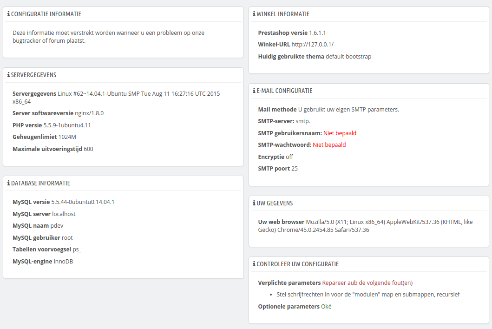

# Configuratie-informatie bekijken

Deze pagina toont een handig overzicht van uw PrestaShop-configuratie: versie, serverinfo, PHP-versie, MySQL-versie. Alle informatieblokken zijn erg nuttig wanneer u een issue wilt aanmaken op de [PrestaShop Forge](http://forge.prestashop.com) voor de ontwikkelaars van PrestaShop of simpelweg uw webmaster of hostingprovider van informatie voorzien.

Er is één laatste sectie, getiteld "Overzicht van aangepaste bestanden". Vlak nadat u PrestaShop hebt geïnstalleerd toont deze sectie "Geen veranderingen zijn gevonden in de bestanden."\
Maar als u een aantal modules hebt geïnstalleerd en een aantal thema's, geavanceerde wijzigingen hebt doorgevoerd om klassen te overriden of bestanden te verwijderen, dan toont dit blok het verschil tussen uw huidige PrestaShop-installatie en een brandschone versie. Dit helpt u om te zien welke bestanden zijn veranderd... en waar u rekening mee kunt houden als u uw winkel handmatig wilt bijwerken, of als u bestanden naar een nieuwe server verplaatst.

Zelfs met een versie installatie kan deze sectie bestanden tonen als "`.gitattributes`", "`.gitignore`", "[`CONTRIBUTING.md`](http://contributing.md/)", "[`CONTRIBUTORS.md`](http://contributors.md/)" of "[`README.md`](http://readme.md/)". Dit zijn bestanden specifiek voor Git en PrestaShop maakt geen gebruik van deze bestanden, dus u kunt ze gerust negeren of verwijderen.\
