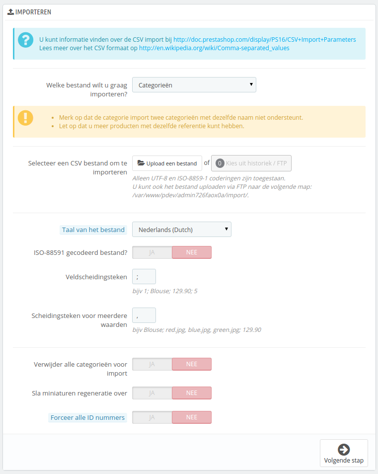
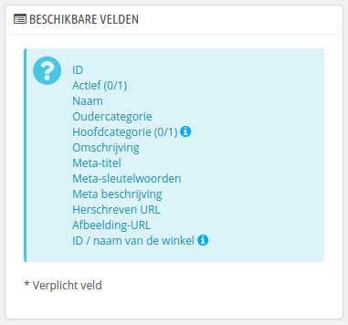
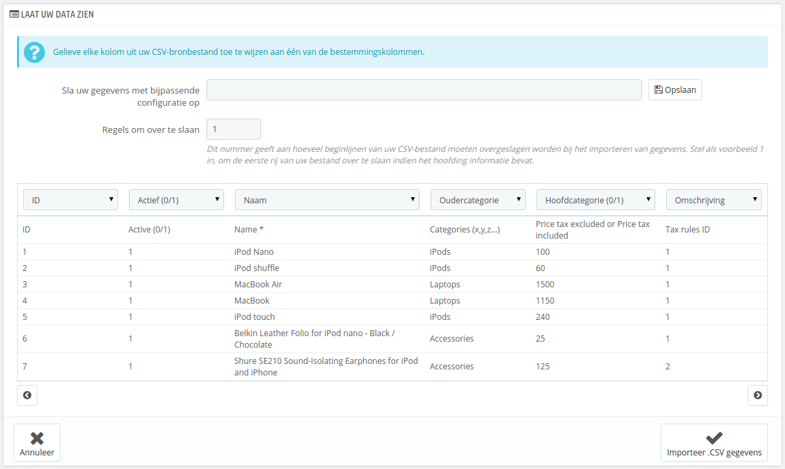
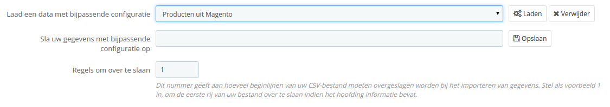

# CSV-bestanden importeren

De pagina "CSV-import" maakt het gemakkelijk voor u om uw productcatalogus te vullen als u veel producten hebt of als u gegevens wilt importeren die u hebt geëxporteerd vanuit een ander e-commercepakket.

CSV is een afkorting van "Comma-separated values". Het is een populair plain-text-formaat wanneer er iets geïmporteerd, geëxporteerd of bewaard moet worden in een open formaat. Bijna alle tools die data verwerken ondersteunen het CSV-formaat, in verschillende gradaties. U kunt meer te weten komen over het CSV-formaat op Wikipedia: [http://en.wikipedia.org/wiki/Comma-separated\_values](http://en.wikipedia.org/wiki/Comma-separated\_values).



Het importeerproces vereist enige voorbereiding en bestaat uit een formulier met de primaire instellingen:

* **Welk bestand wilt u graag importeren?**. Entiteiten zijn de type data die u kunt importeren. Het blok "Beschikbare velden" aan de rechterkant, verandert zodra u een entiteit kiest, zodat u weet welke gegevens uw CSV-bestand zou moeten bevatten.\
  PrestaShop maakt het mogelijk om de volgende type gegevens te importeren:
  * Categorieën,
  * Producten,
  * Combinaties,
  * Klanten,
  * Adressen,
  * Fabrikanten,
  * Leveranciers,
  * Aliassen,
  * Leveranciersbestellingen (als Geavanceerd Voorraadbeheer is ingeschakeld),
  * Details van leveranciersbestellingen (als Geavanceerd Voorraadbeheer is ingeschakeld).
*   **Selecteer een CSV bestand om te importeren**. U kunt meer dan één bestand tegelijkertijd importeren, maar zorg ervoor dat ze dezelfde type gegevens bevatten.

    U kunt voorbeeldbestanden downloaden van elke type data in de sectie "Download voorbeeld CSV-bestanden" aan de rechterkant. Dit helpt u met het vergelijken van uw eigen bestanden met de voorbeelden, zodat u zeker weet dat de bestanden die u gebruikt gereed zijn om te importeren in PrestaShop. Deze bestanden worden bewaard in de map `/docs/csv_import` van uw PrestaShop-installatie.
* **Taal van het bestand**. Gegevens kunnen alleen geïmporteerd worden per taal. Als u gegevens hebt in meerdere talen, dan moet u deze opsplitsen in bestanden met elk hun eigen taal.
* **ISO-8859-1 gecodeerd bestand?**. Standaard hebben de geïmporteerde bestanden de UTF-8 codering. Maar als uw bestanden ISO-8859-1 gebruiken en u ze liever niet converteert, dan kunt u deze checkbox gebruiken.
* **Veldscheidingsteken**. Niet alle CSV-bestanden gebruiken een komma om de gegevens te scheiden: sommige gebruiken tabs, andere punt-komma's, etc. U kunt aangeven wat gebruikt wordt.
* **Scheidingsteken voor meerdere waarden**. Als een attribuut meer dan één waarde ondersteunt, dan moeten deze waarden worden gescheiden met een teken. Nadat u uw bestanden hebt bekeken, kunt u hier aangeven welk teken dat is.
* **Verwijder alle  \_\_\_ voor import**. Deze optie verwijdert de vorige items van hetzelfde type gegevens dat u importeert. Hierdoor begint het importeren met een opgeschoonde staat.
* **Gebruik productreferentie als sleutel**. _Alleen zichtbaar als u producten importeert._ U kunt ervoor kiezen om de ID te laten genereren door PrestaShop of in plaats daarvan de productreferentie te gebruiken als ID. In het laatste geval, zorg ervoor dat het bestand ook daadwerkelijk referenties bevat.
* **Sla miniaturen regeneratie over**. _Alleen zichtbaar als u categorieën en producten importeert._ U kunt ervoor kiezen om de miniaturen opnieuw te laten genereren door PrestaShop aan de hand van de links in uw CSV-bestand (het veld "Afbeelding URL's").
* **Forceer alle ID nummer**. U kunt de geïmporteerde IDs behouden of de importeertool automatisch ID-nummers laten aanmaken.

Zodra u de het type wijzigt, wordt de sectie aan de rechterkant, getiteld "Beschikbare velden" bijgewerkt om de juiste datavelden te tonen. Alhoewel de importeertool helpt bij het koppelen van de velden aan die van PrestaShop, moet u ernaar streven om uw data importeervriendelijker te maken door hetzelfde naamschema aan te houden van de velden die worden getoond. Als dit niet gebeurt, wordt het importeren moeilijker, maar niet onmogelijk.\
Sommige velden hebben een een kleine popup (te herkennen aan het "i"-icoon), welke meer informatie toont als u er met uw muis over beweegt. Ze zijn meestal bedoeld voor PrestaShop's multistore-mogelijkheid of voor Geavanceerd Voorraadbeheer. Zorg ervoor dat u de uitleg goed leest om uw data in een beter formaat te kunnen krijgen.



## Dataformaat <a href="#csv-bestandenimporteren-dataformaat" id="csv-bestandenimporteren-dataformaat"></a>

Geïmporteerde data moet in een tekstbestand worden aangeleverd, door gebruik te maken van een op CSV gebaseerd bestand, dat de bijbehorende extensie `.csv` heeft. We raden aan om een puntkomma te gebruiken als scheidingsteken ";". Als uw tekstuele data (productbeschrijving en dergelijke) ook puntkomma's bevat, dan moet u deze verwijderen of een ander scheidingsteken kiezen.

U kunt een CSV-bestand aanmaken met een tekstbewerker (wij adviseren Notepad++: [http://notepad-plus-plus.org/](http://notepad-plus-plus.org/)), maar u kunt beter een spreadsheet-programma gebruiken en uw werk opslaan in het CSV-formaat. Door gebruik te maken van een spreadsheet-programma kunt u gemakkelijker de gegevens aanpassen, dan een gewone tekstverwerker. U kunt gebruikmaken van de commerciële software Microsoft Excel ([http://office.microsoft.com/en-us/excel/](http://office.microsoft.com/en-us/excel/)) of het gratis LibreOffice ([http://www.openoffice.org/](http://www.openoffice.org/)) Calc.

Hier is een voorbeeld van een import-bestand, met een aantal producten:

```
"Enabled";"Name";"Categories";"Price";"Tax rule ID";"Buying price";"On sale";"Reference";"Weight";"Quantity";"Short desc.";"Long desc";"Images URL"
1;"Test";"1,2,3";130;1;75;0;"PROD-TEST";"0.500";10;"'Tis a short desc.";"This is a long description.";"http://www.myprestashop/images/product1.gif"
0;"Test 02";"1,5";110;1;65;0;"PROD-TEST2";"0.500";10;"'Tis also a short desc.";"This is a long description too.";"http://www.myprestashop/images/product2.gif"
1;"Test 03";"4,5";150;1;85;0;"PROD-TEST3";"0.500";10;"'Tis a short desc. again";"This is also a long description.";"http://www.myprestashop/images/product3.gif"
```

Dit is slechts een voorbeeldbestand, gemaakt voor het voorbeeld hier; het is met opzet niet geoptimaliseerd om te importeren in PrestaShop. Als u een voorbeeldbestand nodig hebt om mee te vergelijken gebruik dan de versies die gedownload kunnen worden op de pagina "CSV-import".

De eerste rij moet de naam bevatten voor de kolom (u kunt deze overslaan tijdens het importeren). Er moet een gelijk aantal kolommen zijn op elke rij.

U moet onthouden dat:

* De prijskolom gebruik maakt van de standaardvaluta in uw winkel.
* Categorieën zijn gekoppeld aan hun huidige IDs (dus die moet u eerst importeren), en (standaard) gescheiden met een komma.
* De URL van de afbeelding moet een absolute link zijn. In andere woorden: het moet de link zijn die gebruikt wordt door een webbrowser om bij de afbeelding te komen. Bijvoorbeeld: [http://www.myprestashop/images/productXXX.gif](http://www.myprestashop/images/productXXX.gif).
* De karaktercodering van het bestand zou UTF-8 moeten zijn. Als dat niet het geval is, gebruikt u ISO-8859-1 en vinkt u de optie "ISO-8859-1 gecodeerd bestand?" aan.
* Datums gebruiken het ISO 8601 formaat, zonder dat daar een tijdzone aan verbonden is (de tijdzone is gelijk aan die van uw winkel): `2013-06-21 15:07:27`.

## Het bestand uploaden <a href="#csv-bestandenimporteren-hetbestanduploaden" id="csv-bestandenimporteren-hetbestanduploaden"></a>

Zodra u alle gegevens in het CSV-formaat hebt, kunt u beginnen met deze te uploaden naar de database van uw winkel met behulp van dit formulier.

Er zijn twee manieren om bestanden te uploaden voor import:

* Door gebruik te maken van uw browser: klik op de knop "Upload een bestand" en bevestig. Herhaal dit zo vaak als nodig is om alle bestanden te uploaden.
* Door gebruik te maken van uw FTP-client: upload de bestanden naar de map `/admin/import` van uw PrestaShop-installatie. Herlaad de importpagina: de knop "Kies uit historiek/FTP" moet nu een getal aangeven. Klik op de knop om de beschikbare bestanden te tonen (inclusief de bestanden die u voorheen hebt geüpload met de browser), klik daarna op de knop "Gebruik" om het bestand te selecteren.

Zodra uw bestanden allemaal getoond worden in de sectie "Selecteer een CSV bestand om te importeren" dan kunt u verder gaan met de rest van het formulier:

1. **Selecteer het type gegevens in uw bestand**, door gebruik te maken van de dropdown-lijst met het label "Welke bestand wilt u graag importeren?". Zodra u het type gegevens hebt geselecteerd verschijnt de lijst met beschikbare velden aan de rechterkant, welke u helpen bij het opstellen van CSV-bestand.
2. **Selecteer de taal van het bestand**. Als de doeltaal nog niet beschikbaar is, moet u deze eerst installeren. Ga naar de pagina "Talen" onder het menu "Lokalisatie".
3. **Selecteer de karaktercodering**. Geef aan dat of het bestand gebruikmaakt van ISO-8859-1 of niet. Als dat niet het geval is dan gaat PrestaShop er vanuit dat het UTF-8 is.
4. **Kies het veldscheidingsteken**. We raden aan dat u de standaardwaarden gebruikt ("Veldscheidingsteken" met een puntkomma "`;`", "Scheidingsteken voor meerdere waarden" met een komma "`,`"). Maar als uw CSV-bestand dit formaat niet aanhoudt, dan raden we aan dat u andere instellingen gebruikt.
5. Als u eerst alle producten wilt verwijderen uit uw catalogus, voordat u importeert, kiest u de bijbehorende optie.
6. Zodra alle opties zijn ingesteld, klit u op "Volgende stap".

Alle geïmporteerde bestanden worden gelijk geüpload naar de map `/import` binnen de map `/admin`. Als het dropdown-menu met CSV-bestanden vol begint te raken, dan kunt u oudere imports verwijderen met uw FTP-client.

Zodra u op de knop "Volgende stap" klikt, wordt de pagina opnieuw geladen met het gereedschap waarmee u kunt importeren. De interface helpt u bij het selecteren van de kolommen die nodig zijn voor PrestaShop.



In deze tabel worden de rijen van uw CSV-bestand getoond, geplaatst onder de bijbehorende kolommen. Het is aan u om ervoor te zorgen dat de kolommen van uw CSV-bestand gelijk zijn aan de juiste kolom, door gebruik te maken van de dropdown-selector boven elke kolom

Bijvoorbeeld, voor het voorbeeldbestand is het volgende nodig:

* **Eerste kolom**. Deze data  zo laten, omdat het veld "ID" overeenkomt met de gegevens.
* **Tweede kolom**. De tweede kolom staat ook goed, want er komen slechts "1"-en voor. Volgens de beschrijving van de kolom zouden de producten actief zijn.
* **Derde kolom**. U krijgt waarschijnlijk al een idee van de werking...

Dit scherm kan niet meer dan 6 kolommen tegelijkertijd tonen, dus maak vooral gebruik van de knoppen ">" en "<" om te navigeren en alle kolommen goed in te stellen.

In ons voorbeeld hebben we de eerste rij gebruikt voor de kolomnamen. Omdat we de eerste rij niet willen importeren kiezen we "1" bij de optie "Regels om over te slaan".

Zodra u helemaal klaar bent met de kolommen instellen klikt u op de knop "Importeer .CSV gegevens" (rechtsonder), en PrestaShop zal beginnen met het importeerproces. Zodra dit proces is voltooid, wordt u weer teruggebracht naar het hoofdscherm, deze zou moeten bevestigen dat alles is geïmporteerd of geeft u een waarschuwing als er problemen optreden. In het tweede geval moet u uw CSV-bestand nogmaals controleren. Krijg u alleen een wit scherm? Dan probeert u hoogstwaarschijnlijk teveel items tegelijkertijd te importeren. Probeer het nogmaals met een kleiner CSV-bestand. Als het nu nog niet lukt, moet u mogelijk contact opnemen met uw hostingprovider of een steviger hostingpakket aanschaffen.

### Configuraties beheren <a href="#csv-bestandenimporteren-configuratiesbeheren" id="csv-bestandenimporteren-configuratiesbeheren"></a>

Het telkens koppelen van kolommen kan een tijdrovende taak worden. Om deze reden kunnen configuraties bewaard worden en later weer hersteld door middel van de dropdown-selector.



Dit gereedschap is een simpel veld aan de bovenkant van de importeertool. U kunt drie basisacties uitvoeren (slechts één als er nog geen configuratie is bewaard):

* **Opslaan**. Geef een goede naam op en klik op "Opslaan". De interface wordt bijgewerkt met de nieuwe informatie.
* **Laden**. Kies een configuratie uit de lijst en klik op "Laden".
* **Verwijder**. Kies een configuratie om te verwijderen uit de lijst en klik op "Verwijder".
