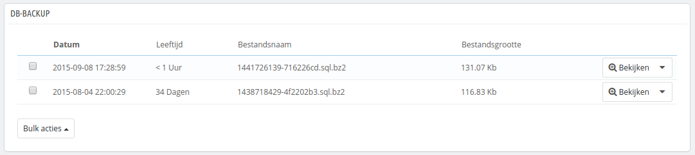
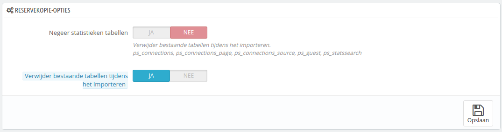

# Database backup

Een backup maken is het bewaren van de inhoud van uw database in bestanden die vervolgens op een veilige plek worden bewaard. U kunt op een later tijdstip altijd terugvallen op deze backups, mocht uw eigen database de geest geven.

U moet regelmatig backups maken van uw winkel, zodat in het geval van een crash, u uw winkel weer snel in een goede staat kunt herstellen. De database bevat alle informatie in uw winkel, veel daarvan is noodzakelijk om PrestaShop goed te laten werken – en dan praten we nog niet eens over producten, categorieën en andere gegevens die u anders weer opnieuw zult moeten invoeren.

Hoe vaker u een backup uitvoert, hoe veiliger de winkel is. Eens per week is het absolute minimum.

Om database backups aan te maken van uw winkel zijn er verschillende mogelijkheden. U kunt tools zoals phpMyAdmin gebruiken (speciaal voor geavanceerde gebruikers) of het gereedschap in PrestaShop gebruiken: de pagina "Db-backup".

De pagina toont twee grote waarschuwingen. U moet beide lezen om een beter begrip te krijgen van wat deze pagina doet:

* De sectie "Disclaimer" geeft u een aantal reminders over backups, welke u moet lezen, elke keer als u een reservekopie maakt. De sectie eindigt met de knop "Ik heb de disclaimer gelezen. Creëer een nieuwe reservekopie". Hier moet u op klikken om een nieuwe reservekopie te maken. Zodra deze is gemaakt, verschijnt de backup in de sectie "Downloaden" aan de bovenkant van de pagina (klik op de knop om het bestand te downloaden) en in de lijst onder de meldingen.
* De sectie "Hoe herstelt men...¨ geeft u tips over hoe de gegevens terug kunt krijgen in PrestaShop in het geval er problemen zijn. U moet deze de reservekopie ergens veilig bewaren, voor het geval u helemaal geen toegang meer hebt tot uw backoffice – en dus de database-backup.

De tabel eronder toont de lijst met reservekopieën die in het verleden zijn gemaakt. De datum, leeftijd, bestandsnaam en grootte worden getoond.\
Aan de rechterkant van elke rij zijn de beschikbare acties:

* **Bekijken**. Maakt het mogelijk om de backup te downloaden.
* **Verwijder**. Maakt het mogelijk om de backup te verwijderen. Wees hier voorzichtig mee, een bestand dat verwijderd is, kan niet worden teruggehaald.

Na elk backupproces, moet u het gegenereerde bestand downloaden door te klikken op de knop "Bekijken" of door gebruik te maken van de sectie boven de meldigen. Bewaar uw backup op een veilige plek, voor het geval u deze later nodig hebt. U kunt hiernaast ook de backups gemakkelijk terugvinden op de server in de map `/backup` binnen uw `/admin` map.

Uw database wordt in het standaard SQL-formaat opgeslagen en met de extensie `.sql`. Deze wordt gecomprimeerd door middel van het BZipo2-algoritme (een variant van het populaire zip-formaat. Lees hier mee: [http://en.wikipedia.org/wiki/Bzip2](http://en.wikipedia.org/wiki/Bzip2)), en hierdoor heeft het bestand ook de extensie `.bz2`. Dit geeft een volledige extensie zoals het volgende: `.sql.bz2`.

## Reservekopie opties 

Aan de onderkant van het scherm zijn twee opties beschikbaar:

* **Negeer statistieken tabellen**. PrestaShop bewaart de informatie van uw website in een aantal databasetabellen, deze zorgen ervoor dat het bestand dat u download erg groot wordt, terwijl u wellicht alleen geïnteresseerd bent in de producten, categorieën, klanten, bestellingen, etc.\
  Standaard maakt PrestaShop een backup van alle tabellen, maar als u schrijfruimte tekort komt, dan kunt u deze optie instellen op "Ja".
* **Verwijder bestaande tabellen tijdens het importeren**. **** Wanneer u een reservekopiebestand importeert dan kan het systeem de huidige tabellen vullen met de inhoud van de backup, of alle tabellen verwijderen om ze vervolgens te vullen met de inhoud van de reservekopie. In het eerste geval kunnen er dubbele items ontstaan en dat is waarom deze optie standaard is ingeschakeld.

